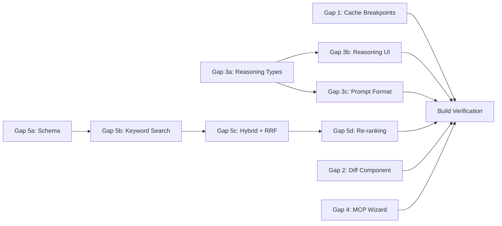

# Best-in-Class Agent Platform: Gaps 1-5

## Context

Deep research against OpenAI, Anthropic, Cursor, and Claude Code identified five technical gaps. This plan addresses each with targeted, production-ready implementations. Ordered by impact: Gap 3 (reasoning routing) and Gap 5 (RAG hybrid) are highest priority. Gaps 1, 2, and 4 are lower effort, higher polish.

---

## Gap 1: Multi-Breakpoint Prompt Caching

**Problem**: We pass a single top-level `cacheControl: { type: "ephemeral" }` via `providerOptions`. This caches the system instructions (stable prefix), but the original user message -- which is also stable across all steps -- gets re-processed with the changing windowed history every step.

**Current code** ([packages/agentc2/src/lib/managed-generate.ts](packages/agentc2/src/lib/managed-generate.ts) lines 270-277):

```typescript
if (modelProvider === "anthropic") {
    generateOptions.providerOptions = {
        anthropic: {
            cacheControl: { type: "ephemeral" }
        }
    };
}
```

**Solution**: Mark the original user message (index 0 in `windowedMessages`) with Anthropic's per-message cache control metadata so that both the instructions AND the user input are cached as a stable prefix.

### Implementation

In [packages/agentc2/src/lib/managed-generate.ts](packages/agentc2/src/lib/managed-generate.ts):

1. Change `ManagedMessage` type to support provider metadata:

```typescript
type ManagedMessage = {
    role: "user" | "assistant";
    content: string;
    providerMetadata?: Record<string, unknown>;
};
```

1. When building `windowedMessages` for Anthropic, mark the first message (original user input) with cache control:

```typescript
// Always include the original user message
const originalMessage: ManagedMessage = { ...messages[0]! };
if (modelProvider === "anthropic") {
    originalMessage.providerMetadata = {
        anthropic: { cacheControl: { type: "ephemeral" } }
    };
}
windowedMessages.push(originalMessage);
```

1. Also mark the tool call summary message (older call summaries) as cacheable when it exists, since its content only grows -- earlier summaries are always a prefix of later summaries:

```typescript
if (toolCallHistory.length > windowSize) {
    const olderCalls = toolCallHistory.slice(0, -windowSize);
    const summaryText = olderCalls.map(buildToolCallSummary).join("\n");
    const summaryMessage: ManagedMessage = {
        role: "user",
        content: `[Previous tool call summaries]\n${summaryText}`
    };
    if (modelProvider === "anthropic") {
        summaryMessage.providerMetadata = {
            anthropic: { cacheControl: { type: "ephemeral" } }
        };
    }
    windowedMessages.push(summaryMessage);
}
```

**Cache architecture after this change:**

```
[Instructions (via options.instructions)]    -- CACHED (stable)
[Original user message with cache_control]   -- CACHED (stable)
[Tool call summaries with cache_control]     -- CACHED (grows but prefix-stable)
[Recent assistant + tool exchanges]          -- NOT cached (changes per step)
```

**Expected improvement**: Additional ~30% cached tokens per step for Anthropic multi-step runs. For a 20-step run with 1K-token user input, saves ~18K input tokens at 90% discount.

**Risk**: The Mastra/AI SDK must pass `providerMetadata` through to the Anthropic API. If the field is silently dropped, caching still works at the top-level (no regression), just without the per-message breakpoints. Test by checking `usage.cache_creation_input_tokens` and `usage.cache_read_input_tokens` in the response.

---

## Gap 3: Reasoning Model Routing

**Problem**: The routing system has three tiers (FAST/PRIMARY/ESCALATION) that select models by cost, not by capability class. There's no way to dynamically route to a reasoning model (o3, o4-mini, Claude with extended thinking) when the input requires deep analytical thinking. Reasoning models also need different prompt formatting.

### Step 1: Extend RoutingConfig and classifyComplexity

In [packages/agentc2/src/agents/resolver.ts](packages/agentc2/src/agents/resolver.ts):

1. Add `reasoningModel` to `RoutingConfig`:

```typescript
export interface RoutingConfig {
    mode: "locked" | "auto";
    fastModel?: { provider: string; name: string };
    escalationModel?: { provider: string; name: string };
    reasoningModel?: { provider: string; name: string }; // NEW
    confidenceThreshold?: number;
    budgetAware?: boolean;
}
```

1. Add `REASONING` to `RoutingTier`:

```typescript
export type RoutingTier = "FAST" | "PRIMARY" | "ESCALATION" | "REASONING";
```

1. Extend `classifyComplexity()` to detect reasoning-worthy inputs:

```typescript
export function classifyComplexity(input: string): {
    score: number;
    level: "simple" | "moderate" | "complex";
    needsReasoning: boolean; // NEW
} {
    // ... existing scoring ...

    // Reasoning detection: problems requiring multi-step logical deduction
    const reasoningPatterns =
        /\b(prove|disprove|derive|deduce|step[- ]by[- ]step|mathematical|theorem|proof|logic|contradict|implication|infer|calculate.*show|verify.*correct|find.*error|what.*wrong|debug.*why|root\s*cause|differential|integral|equation|algorithm\s+complexity)\b/i;
    const needsReasoning = reasoningPatterns.test(input) && score >= 0.4;

    return { score, level, needsReasoning };
}
```

1. Update `resolveRoutingDecision()` to handle the reasoning tier:

```typescript
// After the existing routing logic, before returning:
if (result.needsReasoning && routingConfig.reasoningModel?.name) {
    tier = "REASONING";
    model = routingConfig.reasoningModel;
    reason = `Reasoning-class input detected (score=${score.toFixed(2)})`;
}
```

1. In [packages/agentc2/src/agents/resolver.ts](packages/agentc2/src/agents/resolver.ts), update `resolveModelOverride()` to include a `reasoningOverride` flag in the return value so callers know to adjust prompt format:

```typescript
export async function resolveModelOverride(...): Promise<{
    modelOverride?: { provider: string; name: string };
    routingDecision: RoutingDecision | null;
    isReasoningModel?: boolean;  // NEW
}>
```

### Step 2: Handle reasoning model prompt format in managedGenerate

In [packages/agentc2/src/lib/managed-generate.ts](packages/agentc2/src/lib/managed-generate.ts):

1. Add `isReasoningModel` to `ManagedGenerateOptions`:

```typescript
export interface ManagedGenerateOptions {
    // ... existing options ...
    isReasoningModel?: boolean;
}
```

1. When `isReasoningModel` is true, adjust how instructions are passed. Reasoning models (OpenAI o-series) don't use system prompts the same way -- instructions should be incorporated into the user message:

```typescript
if (isReasoningModel) {
    // For reasoning models, prepend instructions to the first user message
    // instead of using the separate instructions channel
    if (currentStep === 1 && stepInstructions) {
        windowedMessages[0] = {
            ...windowedMessages[0]!,
            content: `${stepInstructions}\n\n---\n\n${windowedMessages[0]!.content}`
        };
    }
    // Don't pass instructions separately
    delete generateOptions.instructions;
}
```

1. When `isReasoningModel` is true, add appropriate provider options:

```typescript
if (isReasoningModel && modelProvider === "openai") {
    generateOptions.providerOptions = {
        ...generateOptions.providerOptions,
        openai: { reasoningEffort: "high" }
    };
} else if (isReasoningModel && modelProvider === "anthropic") {
    generateOptions.providerOptions = {
        ...generateOptions.providerOptions,
        anthropic: {
            ...(generateOptions.providerOptions?.anthropic || {}),
            thinking: { type: "enabled", budgetTokens: 10000 }
        }
    };
}
```

### Step 3: Update the agent configure UI

In [apps/agent/src/app/agents/[agentSlug]/configure/page.tsx](apps/agent/src/app/agents/[agentSlug]/configure/page.tsx):

1. Add state variables for reasoning model (after the existing routing state ~line 199):

```typescript
const [reasoningModelProvider, setReasoningModelProvider] = useState<string>("");
const [reasoningModelName, setReasoningModelName] = useState<string>("");
```

1. Add a "Reasoning Model" section in the routing card (after the Escalation Model section, ~line 2350), with the same Provider + Model dropdown pattern used for fast/escalation models.
2. Label it: "Reasoning Model (optional) -- Used for inputs requiring deep analytical thinking, multi-step proofs, or complex debugging."

### Step 4: Update API routes

In [apps/agent/src/app/api/agents/route.ts](apps/agent/src/app/api/agents/route.ts) and [apps/agent/src/app/api/agents/[id]/route.ts](apps/agent/src/app/api/agents/[id]/route.ts):

Accept `reasoningModel` in `routingConfig` JSON (no schema change needed -- it's stored as Json).

In [apps/agent/src/app/api/agents/[id]/invoke/route.ts](apps/agent/src/app/api/agents/[id]/invoke/route.ts) and [apps/agent/src/app/api/agents/[id]/runs/route.ts](apps/agent/src/app/api/agents/[id]/runs/route.ts):

Pass `isReasoningModel` from `resolveModelOverride()` result through to `managedGenerate()`:

```typescript
const { modelOverride, routingDecision, isReasoningModel } = await resolveModelOverride(id, input, {
    userId,
    organizationId
});
// ...
const managedResult = await managedGenerate(agent, input, {
    // ... existing options ...
    isReasoningModel
});
```

---

## Gap 5: RAG Hybrid Search with RRF

**Problem**: RAG uses vector-only search (cosine similarity via pgvector). If a user searches for "invoice #INV-2024-001" or "John Smith's contract", pure vector search may miss exact matches. The documentation claims hybrid search exists but it's not implemented.

### Step 1: Add full-text search storage

Create a new Prisma model in [packages/database/prisma/schema.prisma](packages/database/prisma/schema.prisma) to store searchable text alongside vector embeddings:

```prisma
model RagChunk {
    id             String   @id
    documentId     String
    organizationId String
    chunkIndex     Int
    text           String   @db.Text
    sourceName     String?
    metadata       Json?
    createdAt      DateTime @default(now())

    @@index([organizationId])
    @@index([documentId])
    @@map("rag_chunk")
}
```

After creating this model, add a raw SQL migration to create the `tsvector` column and GIN index (Prisma doesn't support `tsvector` natively):

```sql
ALTER TABLE rag_chunk ADD COLUMN search_vector tsvector
    GENERATED ALWAYS AS (to_tsvector('english', text)) STORED;
CREATE INDEX rag_chunk_search_idx ON rag_chunk USING GIN (search_vector);
```

### Step 2: Store chunks during ingestion

In [packages/agentc2/src/rag/pipeline.ts](packages/agentc2/src/rag/pipeline.ts), update `ingestDocument()` to write chunks to both the vector store AND the new `RagChunk` table:

```typescript
// After vector.upsert() (existing code), add:
await prisma.ragChunk.createMany({
    data: chunks.map((chunk, index) => ({
        id: `${documentId}_chunk_${index}`,
        documentId,
        organizationId: organizationId || "",
        chunkIndex: index,
        text: chunk.text,
        sourceName: options.sourceName,
        metadata: chunk.metadata
    })),
    skipDuplicates: true
});
```

Also update `deleteDocument()` to clean up `RagChunk` records.

### Step 3: Implement keyword search

In [packages/agentc2/src/rag/pipeline.ts](packages/agentc2/src/rag/pipeline.ts), add a keyword search function:

```typescript
export async function keywordSearch(
    query: string,
    options: {
        organizationId?: string;
        topK?: number;
        documentId?: string;
    } = {}
): Promise<Array<{ text: string; score: number; metadata: Record<string, any>; id: string }>> {
    const { topK = 10, organizationId, documentId } = options;

    const results = await prisma.$queryRaw`
        SELECT id, text, metadata, chunk_index as "chunkIndex", document_id as "documentId",
               ts_rank(search_vector, plainto_tsquery('english', ${query})) as score
        FROM rag_chunk
        WHERE search_vector @@ plainto_tsquery('english', ${query})
          AND (${organizationId}::text IS NULL OR organization_id = ${organizationId})
          AND (${documentId}::text IS NULL OR document_id = ${documentId})
        ORDER BY score DESC
        LIMIT ${topK}
    `;

    return (results as any[]).map((r) => ({
        text: r.text,
        score: r.score,
        metadata: r.metadata || {},
        id: r.id
    }));
}
```

### Step 4: Implement RRF merging and hybrid mode

In [packages/agentc2/src/rag/pipeline.ts](packages/agentc2/src/rag/pipeline.ts):

```typescript
function reciprocalRankFusion(
    vectorResults: Array<{
        id: string;
        text: string;
        score: number;
        metadata: Record<string, any>;
    }>,
    keywordResults: Array<{
        id: string;
        text: string;
        score: number;
        metadata: Record<string, any>;
    }>,
    k: number = 60,
    vectorWeight: number = 0.5
): Array<{ text: string; score: number; metadata: Record<string, any> }> {
    const keywordWeight = 1 - vectorWeight;
    const scores = new Map<
        string,
        { score: number; text: string; metadata: Record<string, any> }
    >();

    vectorResults.forEach((item, rank) => {
        const rrfScore = vectorWeight * (1 / (k + rank + 1));
        scores.set(item.id, { score: rrfScore, text: item.text, metadata: item.metadata });
    });

    keywordResults.forEach((item, rank) => {
        const rrfScore = keywordWeight * (1 / (k + rank + 1));
        const existing = scores.get(item.id);
        if (existing) {
            existing.score += rrfScore;
        } else {
            scores.set(item.id, { score: rrfScore, text: item.text, metadata: item.metadata });
        }
    });

    return Array.from(scores.values()).sort((a, b) => b.score - a.score);
}
```

Update `queryRag()` to accept a `mode` parameter:

```typescript
export async function queryRag(
    query: string,
    options: {
        organizationId?: string;
        topK?: number;
        minScore?: number;
        filter?: Record<string, any>;
        mode?: "vector" | "keyword" | "hybrid"; // NEW, default "vector"
        vectorWeight?: number; // NEW, default 0.5
    } = {}
): Promise<Array<{ text: string; score: number; metadata: Record<string, any> }>>;
```

When `mode === "hybrid"`:

- Run vector search and keyword search in parallel via `Promise.all()`
- Merge with RRF
- Return top-K merged results

When `mode === "keyword"`:

- Run keyword search only
- Return results directly

### Step 5: Add optional LLM re-ranking

For high-value queries, add an optional re-ranking step using the fast compression model:

```typescript
export async function rerankResults(
    query: string,
    candidates: Array<{ text: string; score: number; metadata: Record<string, any> }>,
    topK: number = 5,
    compressionModel?: LanguageModel
): Promise<Array<{ text: string; score: number; metadata: Record<string, any> }>>;
```

This function:

- Takes the top-20 candidates from hybrid search
- Calls the fast model with: "Rank these passages by relevance to the query. Return the indices of the top {topK} most relevant passages."
- Returns re-ordered results
- Falls back to original order if the model call fails

Add `rerank?: boolean` to `queryRag()` options. When true and a compression model is available, apply re-ranking after the initial retrieval.

### Step 6: Update exports and API

Export `keywordSearch`, `reciprocalRankFusion`, `rerankResults` from [packages/agentc2/src/rag/index.ts](packages/agentc2/src/rag/index.ts) and [packages/agentc2/src/index.ts](packages/agentc2/src/index.ts).

Update RAG-related API routes to accept `mode` parameter.

---

## Gap 2: Code Diff Streaming Component

**Problem**: When agents produce code changes (via tool calls), the results appear as raw text. Cursor renders inline diffs with syntax highlighting.

### Implementation

Create [packages/ui/src/components/ai-elements/code-diff-card.tsx](packages/ui/src/components/ai-elements/code-diff-card.tsx):

A React component that:

- Detects if a tool result contains code diff patterns (unified diff format, or before/after blocks)
- Renders a split or unified diff view with syntax highlighting
- Uses the existing Shiki integration from Streamdown for highlighting
- Falls back to `ToolInvocationCard` for non-diff tool results

Integration point: In [apps/agent/src/app/workspace/page.tsx](apps/agent/src/app/workspace/page.tsx) where `ToolInvocationCard` is rendered (lines 1065-1107), add detection logic:

```typescript
if (part.type === "tool-invocation") {
    const result = part.toolInvocation?.result;
    if (isDiffResult(result)) {
        return <CodeDiffCard result={result} toolName={toolName} />;
    }
    return <ToolInvocationCard ... />;
}
```

This is a progressive enhancement -- existing tool calls render identically; only results matching diff patterns get the enhanced rendering.

---

## Gap 4: MCP Self-Service Wizard

**Problem**: Adding custom MCP servers requires using the JSON config editor at `/mcp/config`, which is a power-user feature.

### Implementation

Create a guided form component in [apps/agent/src/components/integrations/AddCustomMcpDialog.tsx](apps/agent/src/components/integrations/AddCustomMcpDialog.tsx):

**Form Fields:**

- Server Name (text input)
- Transport Type (radio: "stdio" | "sse")
- For stdio: Command (text), Args (tag input), Env Vars (key-value editor)
- For SSE: URL (text input)
- Test Connection button (calls `testMcpServer()`)

**On Submit:**

- Builds an MCP JSON config object matching the existing `importMcpConfig()` format
- Calls the existing `/api/mcp/config` endpoint
- Shows impact analysis (which agents will gain new tools)

**Integration**: Add an "Add Custom Server" button on the `/mcp` page alongside the existing "Import Config" button.

This is purely frontend -- the backend (`importMcpConfig`, `testMcpServer`, `analyzeMcpConfigImpact`) already supports everything needed.

---

## Implementation Order



Recommended order:

1. **Gap 1** (cache breakpoints) -- smallest change, immediate cost savings
2. **Gap 3** (reasoning routing) -- three steps, medium complexity
3. **Gap 5** (RAG hybrid) -- four steps, highest complexity, requires migration
4. **Gap 2** (diff component) -- independent frontend work
5. **Gap 4** (MCP wizard) -- independent frontend work

## Files Modified (Summary)

| File                                                            | Changes                                                                                                                       |
| --------------------------------------------------------------- | ----------------------------------------------------------------------------------------------------------------------------- |
| `packages/agentc2/src/lib/managed-generate.ts`                  | Per-message cache breakpoints, reasoning model prompt handling                                                                |
| `packages/agentc2/src/agents/resolver.ts`                       | `reasoningModel` in RoutingConfig, `REASONING` tier, `needsReasoning` flag, updated `resolveModelOverride` return             |
| `packages/agentc2/src/rag/pipeline.ts`                          | `keywordSearch()`, `reciprocalRankFusion()`, `rerankResults()`, hybrid mode in `queryRag()`, dual-write in `ingestDocument()` |
| `packages/database/prisma/schema.prisma`                        | `RagChunk` model                                                                                                              |
| `packages/agentc2/src/index.ts`                                 | Export new RAG functions                                                                                                      |
| `apps/agent/src/app/agents/[agentSlug]/configure/page.tsx`      | Reasoning model form fields                                                                                                   |
| `apps/agent/src/app/api/agents/route.ts`                        | Accept `reasoningModel` in routingConfig                                                                                      |
| `apps/agent/src/app/api/agents/[id]/invoke/route.ts`            | Pass `isReasoningModel` to managedGenerate                                                                                    |
| `apps/agent/src/app/api/agents/[id]/runs/route.ts`              | Pass `isReasoningModel` to managedGenerate                                                                                    |
| `packages/ui/src/components/ai-elements/code-diff-card.tsx`     | **NEW** -- Diff rendering component                                                                                           |
| `apps/agent/src/app/workspace/page.tsx`                         | Integrate CodeDiffCard                                                                                                        |
| `apps/agent/src/components/integrations/AddCustomMcpDialog.tsx` | **NEW** -- MCP wizard form                                                                                                    |
