# Architecture Diagrams: Bulk Agent Import/Export

Visual representations of the system architecture, data flow, and component interactions.

---

## 1. System Architecture Overview

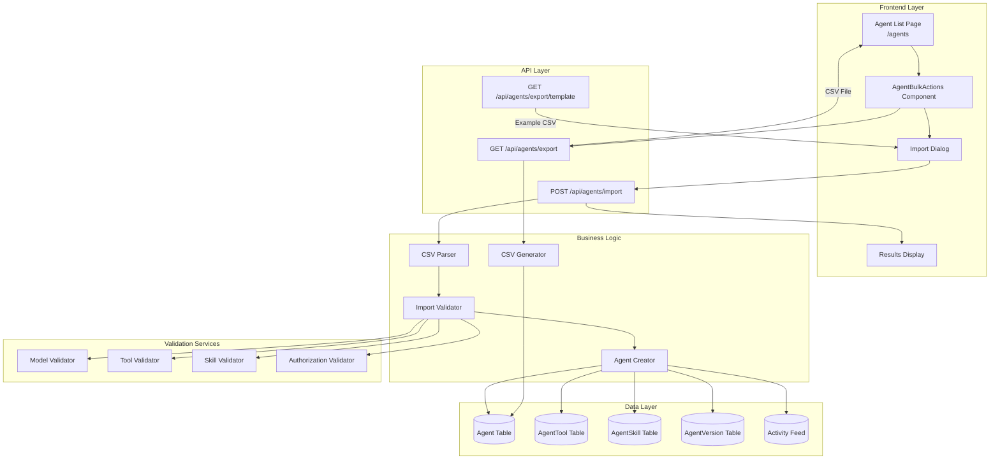
```mermaid
graph TB
    subgraph "Frontend Layer"
        UI[Agent List Page<br/>/agents]
        BulkUI[AgentBulkActions Component]
        Dialog[Import Dialog]
        Results[Results Display]
    end

    subgraph "API Layer"
        ExportAPI[GET /api/agents/export]
        ImportAPI[POST /api/agents/import]
        TemplateAPI[GET /api/agents/export/template]
    end

    subgraph "Business Logic"
        CSVGen[CSV Generator]
        CSVParser[CSV Parser]
        Validator[Import Validator]
        Creator[Agent Creator]
    end

    subgraph "Validation Services"
        ModelVal[Model Validator]
        ToolVal[Tool Validator]
        SkillVal[Skill Validator]
        AuthzVal[Authorization Validator]
    end

    subgraph "Data Layer"
        AgentTable[(Agent Table)]
        ToolTable[(AgentTool Table)]
        SkillTable[(AgentSkill Table)]
        VersionTable[(AgentVersion Table)]
        Activity[(Activity Feed)]
    end

    UI --> BulkUI
    BulkUI --> ExportAPI
    BulkUI --> Dialog
    Dialog --> ImportAPI
    ImportAPI --> Results

    ExportAPI --> CSVGen
    CSVGen --> AgentTable
    ExportAPI --> |CSV File| UI

    ImportAPI --> CSVParser
    CSVParser --> Validator
    Validator --> ModelVal
    Validator --> ToolVal
    Validator --> SkillVal
    Validator --> AuthzVal
    Validator --> Creator
    Creator --> AgentTable
    Creator --> ToolTable
    Creator --> SkillTable
    Creator --> VersionTable
    Creator --> Activity

    TemplateAPI --> |Example CSV| Dialog
```

---

## 2. Export Data Flow

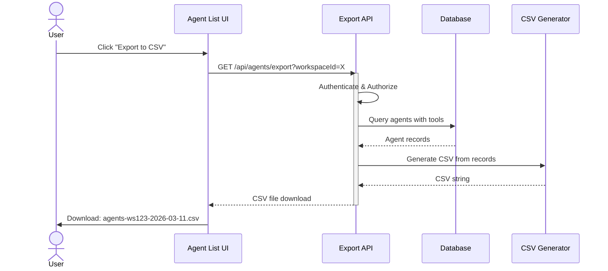
```mermaid
sequenceDiagram
    actor User
    participant UI as Agent List UI
    participant API as Export API
    participant DB as Database
    participant CSVGen as CSV Generator

    User->>UI: Click "Export to CSV"
    UI->>API: GET /api/agents/export?workspaceId=X
    
    activate API
    API->>API: Authenticate & Authorize
    API->>DB: Query agents with tools
    DB-->>API: Agent records
    API->>CSVGen: Generate CSV from records
    CSVGen-->>API: CSV string
    API-->>UI: CSV file download
    deactivate API
    
    UI->>User: Download: agents-ws123-2026-03-11.csv
```

---

## 3. Import Data Flow (Success Case)

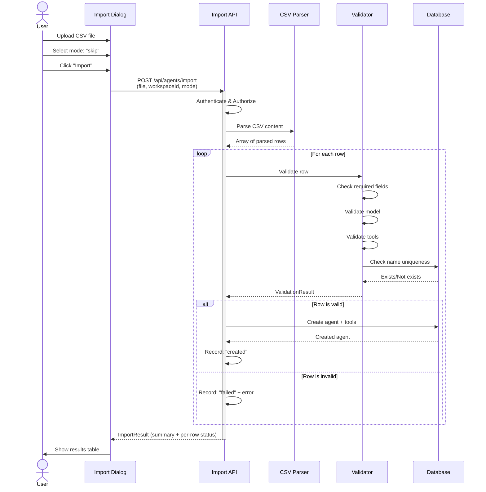
```mermaid
sequenceDiagram
    actor User
    participant UI as Import Dialog
    participant API as Import API
    participant Parser as CSV Parser
    participant Validator as Validator
    participant DB as Database

    User->>UI: Upload CSV file
    User->>UI: Select mode: "skip"
    User->>UI: Click "Import"
    
    UI->>API: POST /api/agents/import<br/>(file, workspaceId, mode)
    
    activate API
    API->>API: Authenticate & Authorize
    API->>Parser: Parse CSV content
    Parser-->>API: Array of parsed rows
    
    loop For each row
        API->>Validator: Validate row
        Validator->>Validator: Check required fields
        Validator->>Validator: Validate model
        Validator->>Validator: Validate tools
        Validator->>DB: Check name uniqueness
        DB-->>Validator: Exists/Not exists
        Validator-->>API: ValidationResult
        
        alt Row is valid
            API->>DB: Create agent + tools
            DB-->>API: Created agent
            API->>API: Record: "created"
        else Row is invalid
            API->>API: Record: "failed" + error
        end
    end
    
    API-->>UI: ImportResult (summary + per-row status)
    deactivate API
    
    UI->>User: Show results table
```

---

## 4. Import Data Flow (Error Case)

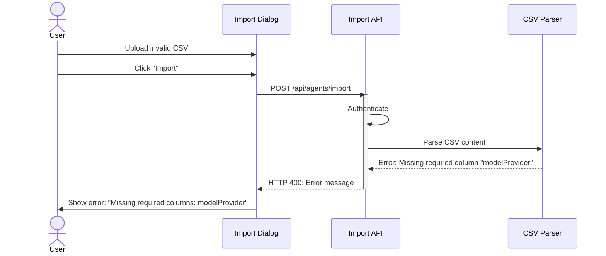
```mermaid
sequenceDiagram
    actor User
    participant UI as Import Dialog
    participant API as Import API
    participant Parser as CSV Parser

    User->>UI: Upload invalid CSV
    User->>UI: Click "Import"
    
    UI->>API: POST /api/agents/import
    
    activate API
    API->>API: Authenticate
    API->>Parser: Parse CSV content
    Parser-->>API: Error: Missing required column "modelProvider"
    API-->>UI: HTTP 400: Error message
    deactivate API
    
    UI->>User: Show error: "Missing required columns: modelProvider"
```

---

## 5. Import Validation Pipeline

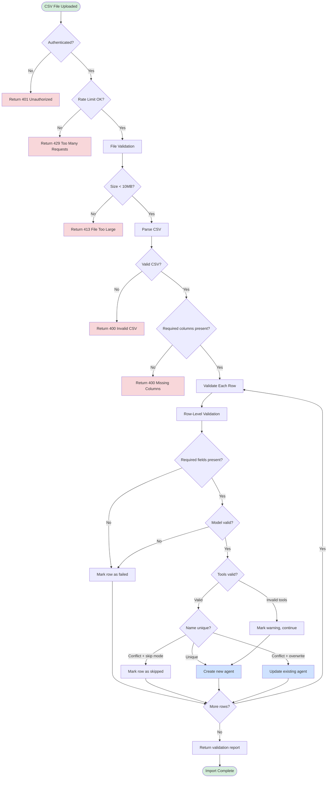
```mermaid
flowchart TD
    Start([CSV File Uploaded]) --> Auth{Authenticated?}
    Auth -->|No| Reject401[Return 401 Unauthorized]
    Auth -->|Yes| RateLimit{Rate Limit OK?}
    
    RateLimit -->|No| Reject429[Return 429 Too Many Requests]
    RateLimit -->|Yes| FileValidation[File Validation]
    
    FileValidation --> FileSize{Size < 10MB?}
    FileSize -->|No| Reject413[Return 413 File Too Large]
    FileSize -->|Yes| ParseCSV[Parse CSV]
    
    ParseCSV --> ParseSuccess{Valid CSV?}
    ParseSuccess -->|No| Reject400[Return 400 Invalid CSV]
    ParseSuccess -->|Yes| ValidateHeaders{Required columns present?}
    
    ValidateHeaders -->|No| Reject400B[Return 400 Missing Columns]
    ValidateHeaders -->|Yes| RowLoop[Validate Each Row]
    
    RowLoop --> RowValidation[Row-Level Validation]
    
    RowValidation --> RequiredFields{Required fields present?}
    RequiredFields -->|No| RowError[Mark row as failed]
    RequiredFields -->|Yes| ModelValidation{Model valid?}
    
    ModelValidation -->|No| RowError
    ModelValidation -->|Yes| ToolValidation{Tools valid?}
    
    ToolValidation -->|Invalid tools| RowWarning[Mark warning, continue]
    ToolValidation -->|Valid| NameCheck{Name unique?}
    
    NameCheck -->|Conflict + skip mode| RowSkip[Mark row as skipped]
    NameCheck -->|Conflict + overwrite| UpdateAgent[Update existing agent]
    NameCheck -->|Unique| CreateAgent[Create new agent]
    
    RowError --> NextRow{More rows?}
    RowSkip --> NextRow
    RowWarning --> CreateAgent
    CreateAgent --> NextRow
    UpdateAgent --> NextRow
    
    NextRow -->|Yes| RowLoop
    NextRow -->|No| ReturnResults[Return validation report]
    
    ReturnResults --> End([Import Complete])
    
    style Start fill:#d4edda
    style End fill:#d4edda
    style Reject401 fill:#f8d7da
    style Reject429 fill:#f8d7da
    style Reject413 fill:#f8d7da
    style Reject400 fill:#f8d7da
    style Reject400B fill:#f8d7da
    style CreateAgent fill:#cfe2ff
    style UpdateAgent fill:#cfe2ff
```

---

## 6. Data Model Relationships

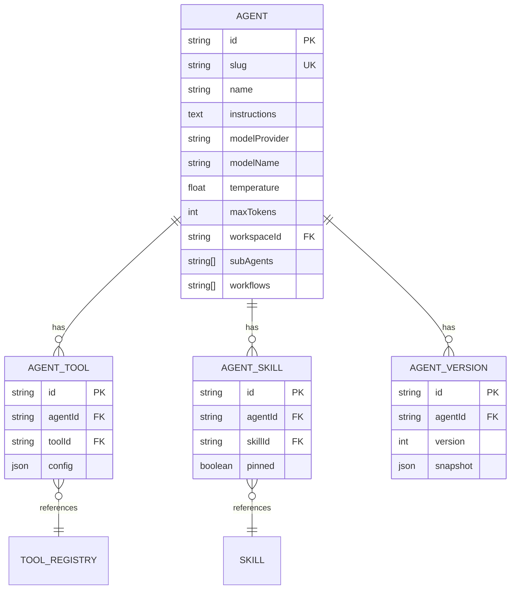
```mermaid
erDiagram
    AGENT ||--o{ AGENT_TOOL : has
    AGENT ||--o{ AGENT_SKILL : has
    AGENT ||--o{ AGENT_VERSION : has
    AGENT_TOOL }o--|| TOOL_REGISTRY : references
    AGENT_SKILL }o--|| SKILL : references
    
    AGENT {
        string id PK
        string slug UK
        string name
        text instructions
        string modelProvider
        string modelName
        float temperature
        int maxTokens
        string workspaceId FK
        string[] subAgents
        string[] workflows
    }
    
    AGENT_TOOL {
        string id PK
        string agentId FK
        string toolId FK
        json config
    }
    
    AGENT_SKILL {
        string id PK
        string agentId FK
        string skillId FK
        boolean pinned
    }
    
    AGENT_VERSION {
        string id PK
        string agentId FK
        int version
        json snapshot
    }
```

---

## 7. Component Architecture

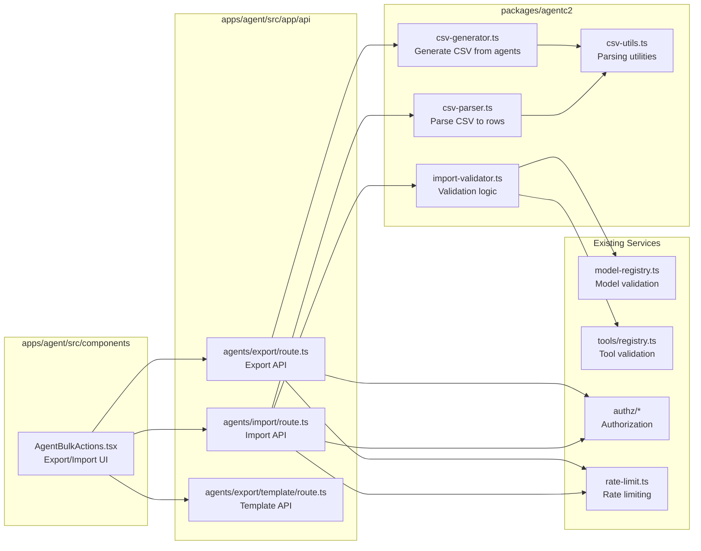
```mermaid
graph LR
    subgraph "packages/agentc2"
        CSVUtils[csv-utils.ts<br/>Parsing utilities]
        CSVGen[csv-generator.ts<br/>Generate CSV from agents]
        CSVParser[csv-parser.ts<br/>Parse CSV to rows]
        Validator[import-validator.ts<br/>Validation logic]
    end

    subgraph "apps/agent/src/app/api"
        ExportRoute[agents/export/route.ts<br/>Export API]
        ImportRoute[agents/import/route.ts<br/>Import API]
        TemplateRoute[agents/export/template/route.ts<br/>Template API]
    end

    subgraph "apps/agent/src/components"
        BulkActions[AgentBulkActions.tsx<br/>Export/Import UI]
    end

    subgraph "Existing Services"
        ModelReg[model-registry.ts<br/>Model validation]
        ToolReg[tools/registry.ts<br/>Tool validation]
        Authz[authz/*<br/>Authorization]
        RateLimit[rate-limit.ts<br/>Rate limiting]
    end

    ExportRoute --> CSVGen
    ImportRoute --> CSVParser
    ImportRoute --> Validator
    
    Validator --> ModelReg
    Validator --> ToolReg
    
    ExportRoute --> Authz
    ImportRoute --> Authz
    ExportRoute --> RateLimit
    ImportRoute --> RateLimit
    
    BulkActions --> ExportRoute
    BulkActions --> ImportRoute
    BulkActions --> TemplateRoute
    
    CSVGen --> CSVUtils
    CSVParser --> CSVUtils
```

---

## 8. Import Conflict Resolution Modes

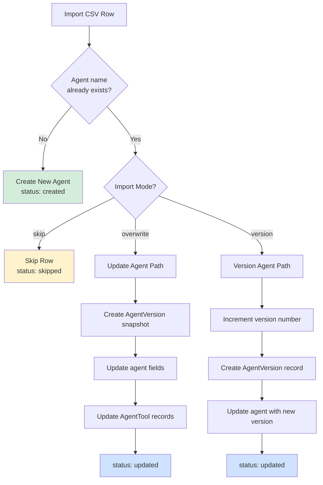
```mermaid
flowchart TD
    ImportRow[Import CSV Row] --> NameExists{Agent name<br/>already exists?}
    
    NameExists -->|No| CreateNew[Create New Agent<br/>status: created]
    
    NameExists -->|Yes| CheckMode{Import Mode?}
    
    CheckMode -->|skip| Skip[Skip Row<br/>status: skipped]
    CheckMode -->|overwrite| OverwritePath[Update Agent Path]
    CheckMode -->|version| VersionPath[Version Agent Path]
    
    OverwritePath --> CreateVersion[Create AgentVersion snapshot]
    CreateVersion --> UpdateAgent[Update agent fields]
    UpdateAgent --> UpdateTools[Update AgentTool records]
    UpdateTools --> OverwriteDone[status: updated]
    
    VersionPath --> IncrementVersion[Increment version number]
    IncrementVersion --> CreateVersionRecord[Create AgentVersion record]
    CreateVersionRecord --> UpdateAgentVersion[Update agent with new version]
    UpdateAgentVersion --> VersionDone[status: updated]
    
    style CreateNew fill:#d4edda
    style Skip fill:#fff3cd
    style OverwriteDone fill:#cfe2ff
    style VersionDone fill:#cfe2ff
```

---

## 9. Authorization Flow

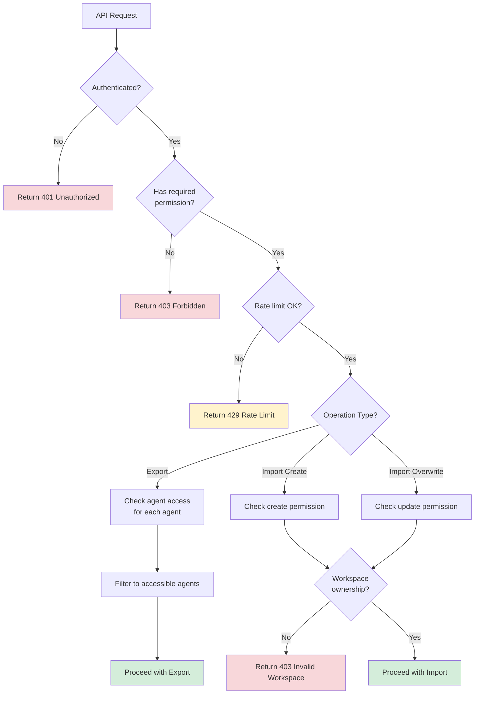
```mermaid
flowchart TD
    Request[API Request] --> AuthCheck{Authenticated?}
    
    AuthCheck -->|No| Return401[Return 401 Unauthorized]
    AuthCheck -->|Yes| RBACCheck{Has required<br/>permission?}
    
    RBACCheck -->|No| Return403[Return 403 Forbidden]
    RBACCheck -->|Yes| RateCheck{Rate limit OK?}
    
    RateCheck -->|No| Return429[Return 429 Rate Limit]
    RateCheck -->|Yes| OperationType{Operation Type?}
    
    OperationType -->|Export| ExportAuthz[Check agent access<br/>for each agent]
    OperationType -->|Import Create| CreateAuthz[Check create permission]
    OperationType -->|Import Overwrite| UpdateAuthz[Check update permission]
    
    ExportAuthz --> FilterAgents[Filter to accessible agents]
    FilterAgents --> Proceed[Proceed with Export]
    
    CreateAuthz --> ValidateWorkspace{Workspace<br/>ownership?}
    ValidateWorkspace -->|No| Return403B[Return 403 Invalid Workspace]
    ValidateWorkspace -->|Yes| Proceed2[Proceed with Import]
    
    UpdateAuthz --> ValidateWorkspace
    
    style Return401 fill:#f8d7da
    style Return403 fill:#f8d7da
    style Return403B fill:#f8d7da
    style Return429 fill:#fff3cd
    style Proceed fill:#d4edda
    style Proceed2 fill:#d4edda
```

---

## 10. Validation Error Classification

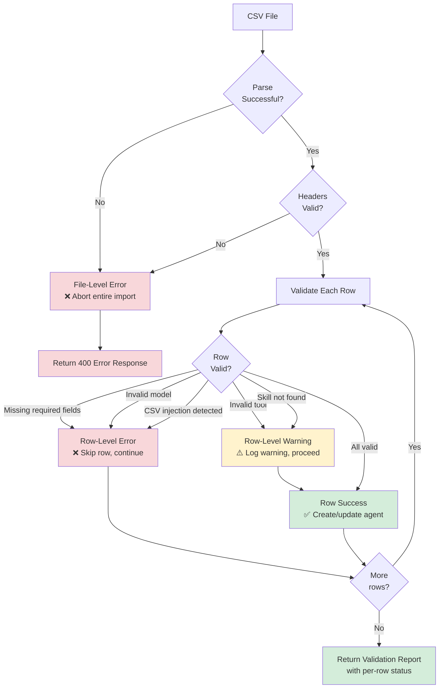
```mermaid
graph TD
    CSVFile[CSV File] --> Parse{Parse<br/>Successful?}
    
    Parse -->|No| FileLevelError[File-Level Error<br/>❌ Abort entire import]
    
    Parse -->|Yes| ValidateHeaders{Headers<br/>Valid?}
    ValidateHeaders -->|No| FileLevelError
    
    ValidateHeaders -->|Yes| ValidateRows[Validate Each Row]
    
    ValidateRows --> RowValidation{Row<br/>Valid?}
    
    RowValidation -->|Missing required fields| RowError[Row-Level Error<br/>❌ Skip row, continue]
    RowValidation -->|Invalid model| RowError
    RowValidation -->|CSV injection detected| RowError
    
    RowValidation -->|Invalid tool| RowWarning[Row-Level Warning<br/>⚠️ Log warning, proceed]
    RowValidation -->|Skill not found| RowWarning
    
    RowValidation -->|All valid| RowSuccess[Row Success<br/>✅ Create/update agent]
    
    RowError --> NextRow{More<br/>rows?}
    RowWarning --> RowSuccess
    RowSuccess --> NextRow
    
    NextRow -->|Yes| ValidateRows
    NextRow -->|No| ReturnReport[Return Validation Report<br/>with per-row status]
    
    FileLevelError --> ReturnError[Return 400 Error Response]
    
    style FileLevelError fill:#f8d7da
    style RowError fill:#f8d7da
    style RowWarning fill:#fff3cd
    style RowSuccess fill:#d4edda
    style ReturnReport fill:#d4edda
    style ReturnError fill:#f8d7da
```

---

## 11. CSV Processing Pipeline

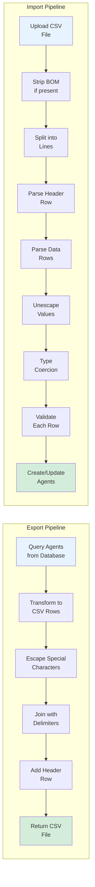
```mermaid
flowchart LR
    subgraph "Export Pipeline"
        E1[Query Agents<br/>from Database] --> E2[Transform to<br/>CSV Rows]
        E2 --> E3[Escape Special<br/>Characters]
        E3 --> E4[Join with<br/>Delimiters]
        E4 --> E5[Add Header<br/>Row]
        E5 --> E6[Return CSV<br/>File]
    end

    subgraph "Import Pipeline"
        I1[Upload CSV<br/>File] --> I2[Strip BOM<br/>if present]
        I2 --> I3[Split into<br/>Lines]
        I3 --> I4[Parse Header<br/>Row]
        I4 --> I5[Parse Data<br/>Rows]
        I5 --> I6[Unescape<br/>Values]
        I6 --> I7[Type<br/>Coercion]
        I7 --> I8[Validate<br/>Each Row]
        I8 --> I9[Create/Update<br/>Agents]
    end

    style E1 fill:#e7f3ff
    style E6 fill:#d4edda
    style I1 fill:#e7f3ff
    style I9 fill:#d4edda
```

---

## 12. Multi-Tenancy Boundary Enforcement

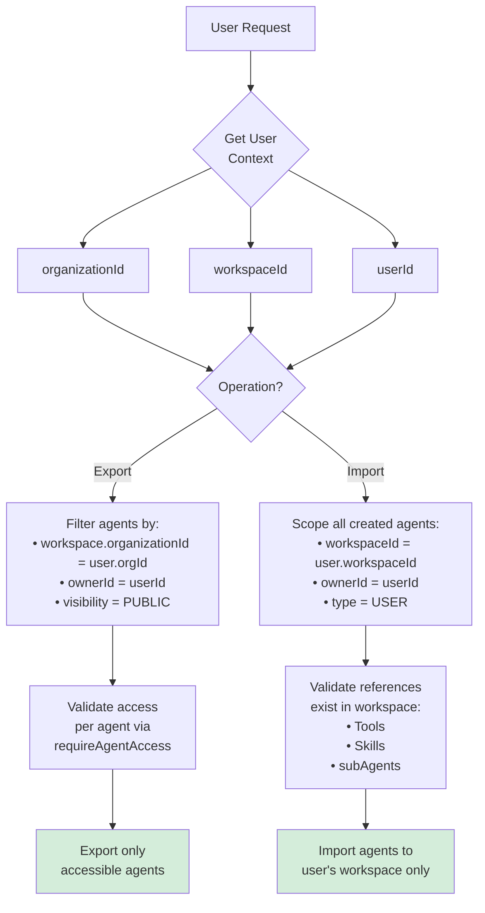
```mermaid
graph TD
    User[User Request] --> GetContext{Get User<br/>Context}
    
    GetContext --> OrgId[organizationId]
    GetContext --> WorkspaceId[workspaceId]
    GetContext --> UserId[userId]
    
    OrgId --> ExportScope{Operation?}
    WorkspaceId --> ExportScope
    UserId --> ExportScope
    
    ExportScope -->|Export| FilterExport[Filter agents by:<br/>• workspace.organizationId = user.orgId<br/>• ownerId = userId<br/>• visibility = PUBLIC]
    
    ExportScope -->|Import| ScopeImport[Scope all created agents:<br/>• workspaceId = user.workspaceId<br/>• ownerId = userId<br/>• type = USER]
    
    FilterExport --> ValidateAccess[Validate access<br/>per agent via<br/>requireAgentAccess]
    
    ValidateAccess --> ExportFiltered[Export only<br/>accessible agents]
    
    ScopeImport --> ValidateReferences[Validate references<br/>exist in workspace:<br/>• Tools<br/>• Skills<br/>• subAgents]
    
    ValidateReferences --> ImportScoped[Import agents to<br/>user's workspace only]
    
    style ExportFiltered fill:#d4edda
    style ImportScoped fill:#d4edda
```

---

## 13. Conflict Resolution Decision Tree

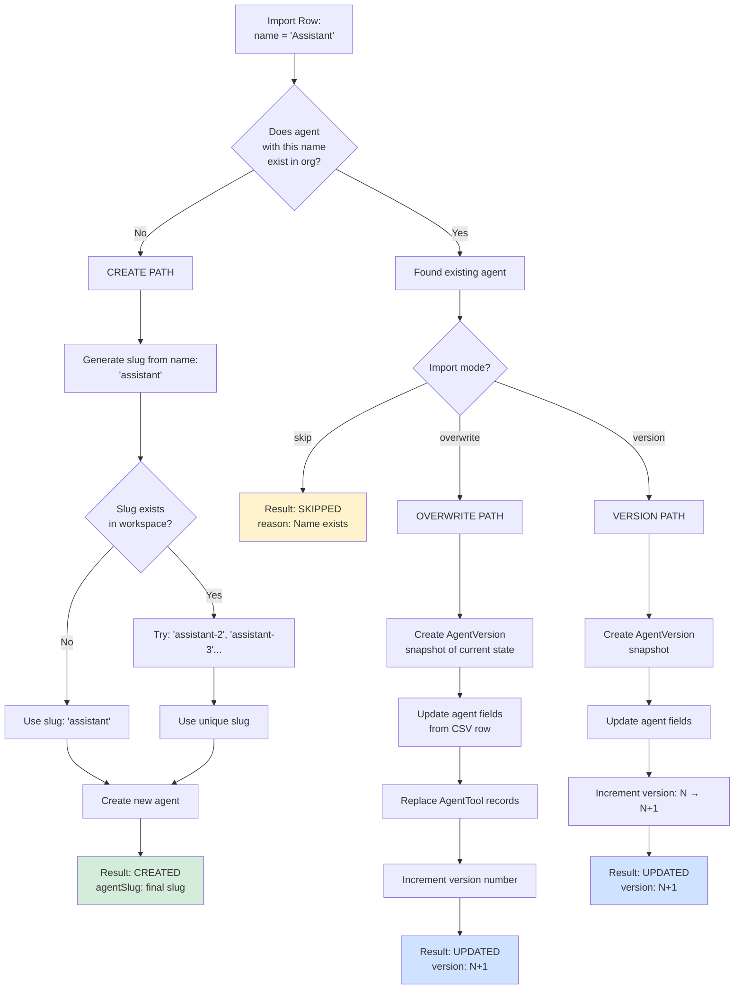
```mermaid
flowchart TD
    ImportRow[Import Row:<br/>name = 'Assistant'] --> CheckName{Does agent<br/>with this name<br/>exist in org?}
    
    CheckName -->|No| CreatePath[CREATE PATH]
    CheckName -->|Yes| ExistingAgent[Found existing agent]
    
    CreatePath --> GenerateSlug[Generate slug from name:<br/>'assistant']
    GenerateSlug --> CheckSlug{Slug exists<br/>in workspace?}
    CheckSlug -->|No| UseSlug[Use slug: 'assistant']
    CheckSlug -->|Yes| AppendSuffix[Try: 'assistant-2', 'assistant-3'...]
    AppendSuffix --> UseSlug2[Use unique slug]
    UseSlug --> CreateAgent[Create new agent]
    UseSlug2 --> CreateAgent
    CreateAgent --> ResultCreated[Result: CREATED<br/>agentSlug: final slug]
    
    ExistingAgent --> CheckMode{Import mode?}
    
    CheckMode -->|skip| ResultSkipped[Result: SKIPPED<br/>reason: Name exists]
    
    CheckMode -->|overwrite| OverwritePath[OVERWRITE PATH]
    OverwritePath --> CreateSnapshot[Create AgentVersion<br/>snapshot of current state]
    CreateSnapshot --> UpdateFields[Update agent fields<br/>from CSV row]
    UpdateFields --> UpdateTools[Replace AgentTool records]
    UpdateTools --> IncrementVer[Increment version number]
    IncrementVer --> ResultUpdated[Result: UPDATED<br/>version: N+1]
    
    CheckMode -->|version| VersionPath[VERSION PATH]
    VersionPath --> CreateSnapshot2[Create AgentVersion<br/>snapshot]
    CreateSnapshot2 --> UpdateFields2[Update agent fields]
    UpdateFields2 --> IncrementVer2[Increment version: N → N+1]
    IncrementVer2 --> ResultVersioned[Result: UPDATED<br/>version: N+1]
    
    style ResultCreated fill:#d4edda
    style ResultSkipped fill:#fff3cd
    style ResultUpdated fill:#cfe2ff
    style ResultVersioned fill:#cfe2ff
```

---

## 14. Tool Validation Flow

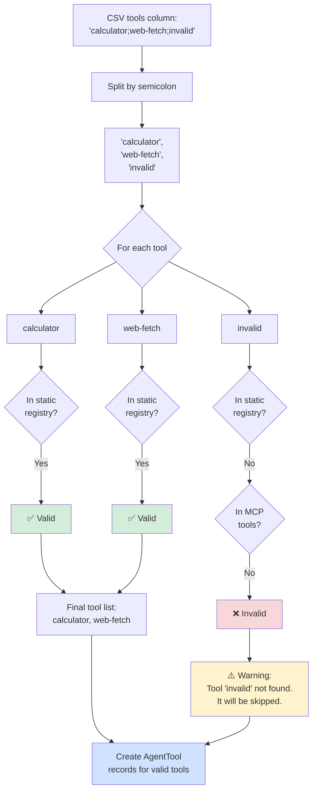
```mermaid
flowchart TD
    ToolList[CSV tools column:<br/>'calculator;web-fetch;invalid'] --> Split[Split by semicolon]
    
    Split --> ToolArray['calculator',<br/>'web-fetch',<br/>'invalid']
    
    ToolArray --> CheckLoop{For each tool}
    
    CheckLoop --> Tool1[calculator]
    CheckLoop --> Tool2[web-fetch]
    CheckLoop --> Tool3[invalid]
    
    Tool1 --> CheckRegistry1{In static<br/>registry?}
    CheckRegistry1 -->|Yes| ValidTool1[✅ Valid]
    
    Tool2 --> CheckRegistry2{In static<br/>registry?}
    CheckRegistry2 -->|Yes| ValidTool2[✅ Valid]
    
    Tool3 --> CheckRegistry3{In static<br/>registry?}
    CheckRegistry3 -->|No| CheckMCP{In MCP<br/>tools?}
    CheckMCP -->|No| InvalidTool[❌ Invalid]
    
    ValidTool1 --> FinalList[Final tool list:<br/>calculator, web-fetch]
    ValidTool2 --> FinalList
    
    InvalidTool --> Warning[⚠️ Warning:<br/>Tool 'invalid' not found.<br/>It will be skipped.]
    
    FinalList --> CreateTools[Create AgentTool<br/>records for valid tools]
    Warning --> CreateTools
    
    style ValidTool1 fill:#d4edda
    style ValidTool2 fill:#d4edda
    style InvalidTool fill:#f8d7da
    style Warning fill:#fff3cd
    style CreateTools fill:#cfe2ff
```

---

## 15. Phase 1 Component Dependency Graph

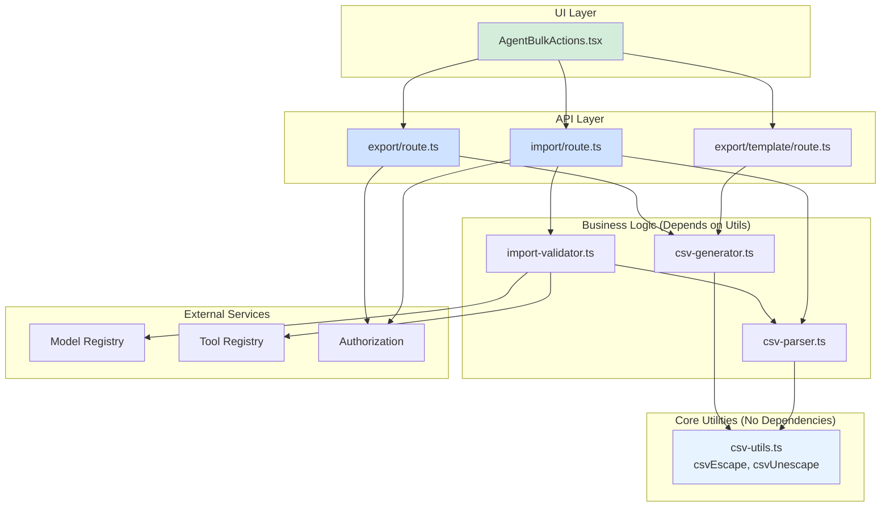
```mermaid
graph TD
    subgraph "Core Utilities (No Dependencies)"
        CSVUtils[csv-utils.ts<br/>csvEscape, csvUnescape]
    end

    subgraph "Business Logic (Depends on Utils)"
        CSVGen[csv-generator.ts] --> CSVUtils
        CSVParser[csv-parser.ts] --> CSVUtils
        Validator[import-validator.ts] --> CSVParser
    end

    subgraph "External Services"
        ModelReg[Model Registry]
        ToolReg[Tool Registry]
        Authz[Authorization]
    end

    subgraph "API Layer"
        ExportAPI[export/route.ts] --> CSVGen
        ExportAPI --> Authz
        
        ImportAPI[import/route.ts] --> CSVParser
        ImportAPI --> Validator
        ImportAPI --> Authz
        
        TemplateAPI[export/template/route.ts] --> CSVGen
    end

    subgraph "UI Layer"
        BulkUI[AgentBulkActions.tsx] --> ExportAPI
        BulkUI --> ImportAPI
        BulkUI --> TemplateAPI
    end

    Validator --> ModelReg
    Validator --> ToolReg
    
    style CSVUtils fill:#e7f3ff
    style ExportAPI fill:#cfe2ff
    style ImportAPI fill:#cfe2ff
    style BulkUI fill:#d4edda
```

---

## 16. Import Performance Profile

```mermaid
gantt
    title Import Performance Timeline (50 agents)
    dateFormat X
    axisFormat %L ms

    section File Processing
    Parse CSV                :0, 50ms
    Validate headers         :50ms

    section Row Validation (Parallel)
    Validate models (cached) :50, 200ms
    Validate tools (cached)  :50, 200ms
    Check name uniqueness    :50, 300ms

    section Database Writes
    Create agents (serial)   :300, 2500ms
    Create tool associations :2500, 3000ms
    Create activity records  :3000, 3200ms

    section Response
    Generate report          :3200, 3400ms
    Return JSON              :3400, 3500ms
```

**Total Latency:** ~3.5s for 50 agents (within target of <5s)

---

## 17. Export Performance Profile

```mermaid
gantt
    title Export Performance Timeline (100 agents)
    dateFormat X
    axisFormat %L ms

    section Database Query
    Query agents + tools     :0, 500ms

    section Authorization Filter
    Check agent access       :500, 800ms

    section CSV Generation
    Transform to CSV rows    :800, 1000ms
    Escape special chars     :1000, 1200ms
    Join with delimiters     :1200, 1300ms

    section Response
    Set headers              :1300, 1320ms
    Stream CSV               :1320, 1500ms
```

**Total Latency:** ~1.5s for 100 agents (within target of <2s)

---

## 18. Technology Stack Summary

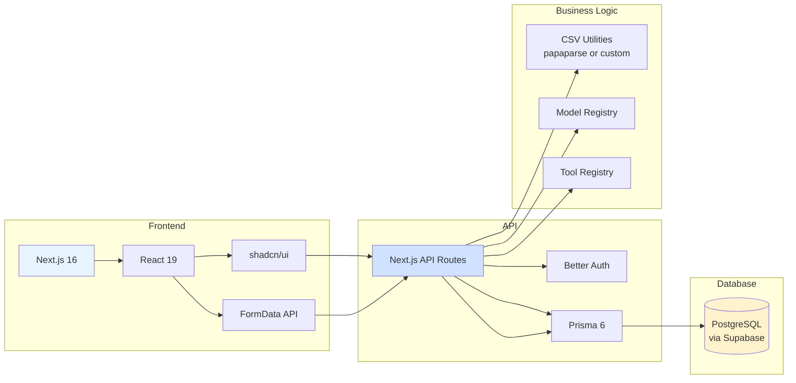
```mermaid
graph LR
    subgraph "Frontend"
        Next[Next.js 16] --> React[React 19]
        React --> UI[shadcn/ui]
        React --> Form[FormData API]
    end

    subgraph "API"
        NextAPI[Next.js API Routes] --> Auth[Better Auth]
        NextAPI --> Prisma[Prisma 6]
    end

    subgraph "Business Logic"
        CSVLib[CSV Utilities<br/>papaparse or custom]
        ModelVal[Model Registry]
        ToolVal[Tool Registry]
    end

    subgraph "Database"
        Postgres[(PostgreSQL<br/>via Supabase)]
    end

    UI --> NextAPI
    Form --> NextAPI
    
    NextAPI --> CSVLib
    NextAPI --> ModelVal
    NextAPI --> ToolVal
    NextAPI --> Prisma
    
    Prisma --> Postgres
    
    style Next fill:#e7f3ff
    style NextAPI fill:#cfe2ff
    style Postgres fill:#fff3cd
```

---

## 19. Security Layers

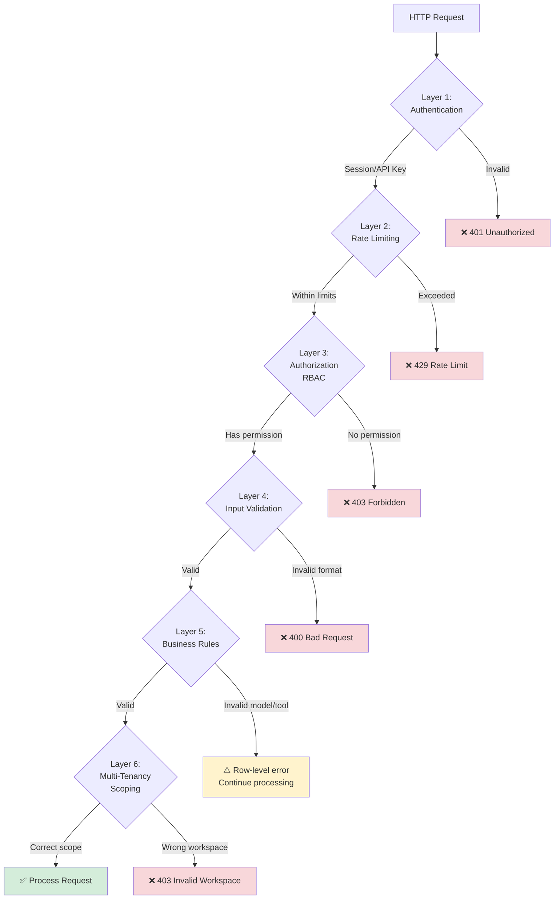
```mermaid
flowchart TD
    Request[HTTP Request] --> Layer1{Layer 1:<br/>Authentication}
    
    Layer1 -->|Session/API Key| Layer2{Layer 2:<br/>Rate Limiting}
    Layer1 -->|Invalid| Reject1[❌ 401 Unauthorized]
    
    Layer2 -->|Within limits| Layer3{Layer 3:<br/>Authorization<br/>RBAC}
    Layer2 -->|Exceeded| Reject2[❌ 429 Rate Limit]
    
    Layer3 -->|Has permission| Layer4{Layer 4:<br/>Input Validation}
    Layer3 -->|No permission| Reject3[❌ 403 Forbidden]
    
    Layer4 -->|Valid| Layer5{Layer 5:<br/>Business Rules}
    Layer4 -->|Invalid format| Reject4[❌ 400 Bad Request]
    
    Layer5 -->|Valid| Layer6{Layer 6:<br/>Multi-Tenancy<br/>Scoping}
    Layer5 -->|Invalid model/tool| RowLevelError[⚠️ Row-level error<br/>Continue processing]
    
    Layer6 -->|Correct scope| ProcessRequest[✅ Process Request]
    Layer6 -->|Wrong workspace| Reject5[❌ 403 Invalid Workspace]
    
    style ProcessRequest fill:#d4edda
    style RowLevelError fill:#fff3cd
    style Reject1 fill:#f8d7da
    style Reject2 fill:#f8d7da
    style Reject3 fill:#f8d7da
    style Reject4 fill:#f8d7da
    style Reject5 fill:#f8d7da
```

---

## 20. Phase Roadmap Timeline

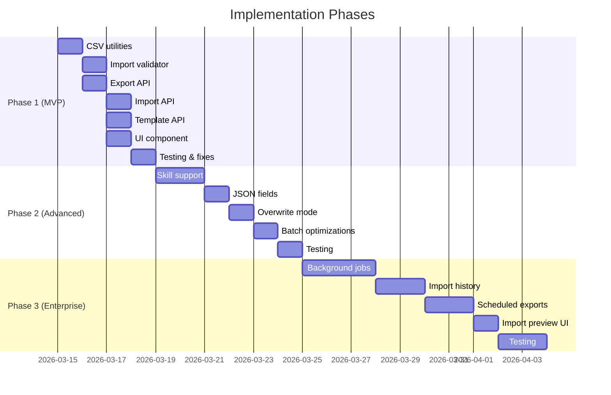
```mermaid
gantt
    title Implementation Phases
    dateFormat YYYY-MM-DD
    
    section Phase 1 (MVP)
    CSV utilities           :p1a, 2026-03-15, 1d
    Import validator        :p1b, after p1a, 1d
    Export API              :p1c, after p1a, 1d
    Import API              :p1d, after p1b, 1d
    Template API            :p1e, after p1c, 0.5d
    UI component            :p1f, after p1c, 1d
    Testing & fixes         :p1g, after p1f, 1d
    
    section Phase 2 (Advanced)
    Skill support           :p2a, after p1g, 2d
    JSON fields             :p2b, after p2a, 1d
    Overwrite mode          :p2c, after p2b, 1d
    Batch optimizations     :p2d, after p2c, 1d
    Testing                 :p2e, after p2d, 1d
    
    section Phase 3 (Enterprise)
    Background jobs         :p3a, after p2e, 3d
    Import history          :p3b, after p3a, 2d
    Scheduled exports       :p3c, after p3b, 2d
    Import preview UI       :p3d, after p3c, 1d
    Testing                 :p3e, after p3d, 2d
```

**Total Timeline:** 18 days (~3.5 sprints)

---

## Diagram Usage

These diagrams are available in Mermaid format and can be:
- Rendered in GitHub markdown
- Embedded in Notion, Confluence
- Exported to PNG/SVG via Mermaid CLI
- Used in design review presentations

---

**Document Version:** 1.0  
**Last Updated:** 2026-03-11  
**Format:** Mermaid.js diagrams
