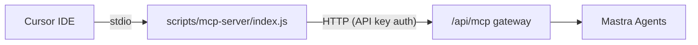
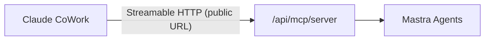

# Add Claude CoWork MCP Support

## Context

The current MCP setup uses a **stdio-based** architecture for Cursor:

Claude CoWork needs a **remote Streamable HTTP** endpoint it can reach directly:

**Nothing changes about the existing Cursor setup.** This is purely additive.

## What Gets Built

### 1. New API route: Remote MCP Server Endpoint

**File**: [apps/agent/src/app/api/mcp/server/route.ts](apps/agent/src/app/api/mcp/server/route.ts) (new)

Creates a Streamable HTTP endpoint using `MCPServer` from `@mastra/mcp`. This single route handles both `GET` and `POST` requests per the MCP Streamable HTTP spec.

Since Next.js App Router uses the Web Fetch API (`Request`/`Response`) but `MCPServer.startHTTP()` expects Node.js `http.IncomingMessage`/`http.ServerResponse`, we use the `fetch-to-node` package to bridge between them. Mastra's own docs show this exact pattern for serverless environments.

Key implementation details:

- Uses `MCPServer` with `startHTTP()` in **serverless mode** (`serverless: true`) since each Next.js request is stateless
- Exposes the same agents that the existing `/api/mcp` gateway exposes (fetched from the database)
- Authenticates via the existing MCP API key system (passed as a Bearer token or custom client secret)
- Accessible at `https://mastra.useappello.app/agent/api/mcp/server`

### 2. MCPServer factory module

**File**: [apps/agent/src/lib/mcp-server.ts](apps/agent/src/lib/mcp-server.ts) (new)

A helper that:

- Loads agents from the database (reuses existing `prisma` queries from the `/api/mcp` route)
- Converts each agent into a Mastra `createTool()` definition that calls the existing `/api/mcp` gateway internally (same pattern as `scripts/mcp-server/index.js` but server-side)
- Returns an `MCPServer` instance ready for `startHTTP()`

This keeps the route handler clean and the MCPServer configuration reusable.

### 3. Install `fetch-to-node` dependency

**File**: [apps/agent/package.json](apps/agent/package.json) (modify)

Add `fetch-to-node` to handle the Web Fetch API to Node.js stream conversion.

### 4. Update the `/mcp/setup` page with Claude CoWork instructions

**File**: [apps/agent/src/app/mcp/setup/page.tsx](apps/agent/src/app/mcp/setup/page.tsx) (modify)

The page currently has:

- Title: "MCP Setup for Cursor"
- Tabs: "Quick Setup" | "Manual Setup" (both Cursor-specific)

Changes:

- Update title to **"MCP Setup"** (platform-agnostic)
- Add a top-level tab bar: **"Cursor IDE"** | **"Claude CoWork"**
- Move existing Cursor content under the "Cursor IDE" tab (unchanged)
- Add new "Claude CoWork" tab with simple 3-step instructions:
    1. **Generate MCP API Key** -- reuses the existing org key section already on the page
    2. **Copy Remote MCP Server URL** -- shows `https://mastra.useappello.app/agent/api/mcp/server` with a copy button
    3. **Add to Claude** -- instructions to go to Claude Settings > Connectors > Add Custom Connector, paste the URL, and optionally add the API key as the client secret
- Include a screenshot/description matching the Claude "Add custom connector" dialog
- Keep the "Available Agents" and "Help" sections shared across both tabs

### 5. Authentication approach

**Initial implementation**: Authless (no OAuth) for simplicity. Claude CoWork supports authless MCP servers.

The API key from the existing MCP key system can optionally be used:

- Users can paste it as the "OAuth Client Secret" in Claude's custom connector dialog
- The server endpoint validates it if present, allows anonymous access if not (configurable)

This matches the screenshot the user shared -- the OAuth fields are marked "(optional)".

**Future enhancement** (not in this PR): Full OAuth 2.0 flow with DCR support for production-grade security.

## Files Summary

| File                                         | Action     | Purpose                                                          |
| -------------------------------------------- | ---------- | ---------------------------------------------------------------- |
| `apps/agent/src/lib/mcp-server.ts`           | **Create** | MCPServer factory that loads agents and creates tool definitions |
| `apps/agent/src/app/api/mcp/server/route.ts` | **Create** | Streamable HTTP endpoint for Claude CoWork                       |
| `apps/agent/src/app/mcp/setup/page.tsx`      | **Modify** | Add Claude CoWork tab with setup instructions                    |
| `apps/agent/package.json`                    | **Modify** | Add `fetch-to-node` dependency                                   |

## Testing

1. Start dev server locally: `bun run dev:local`
2. Test with curl: `curl -X POST http://localhost:3001/api/mcp/server -H "Content-Type: application/json" -d '{"jsonrpc":"2.0","method":"initialize","id":1,"params":{"protocolVersion":"2025-03-26","capabilities":{},"clientInfo":{"name":"test","version":"1.0"}}}'`
3. Test with [MCP Inspector](https://github.com/modelcontextprotocol/inspector) pointing at `http://localhost:3001/api/mcp/server`
4. Deploy to production and test in Claude CoWork by adding as custom connector at `https://mastra.useappello.app/agent/api/mcp/server`
