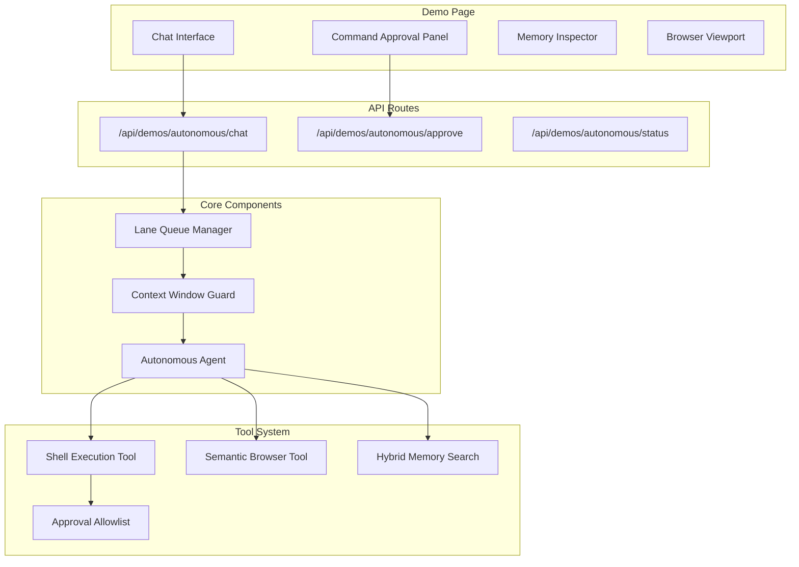

# Clawdbot-Style Autonomous Agent Demo

## Clawdbot Architecture Reference

### Key Patterns from openClaw

**Lane-Based Command Queue**: Rather than typical async/await patterns that lead to race conditions and interleaved state, Clawdbot uses a lane abstraction where each session gets its own lane and only low-risk tasks run in parallel. This follows Cognition's "Don't Build Multi-Agents" philosophy—serial by default, parallel only when explicitly chosen.

**Memory System**: Simple and explainable:

- JSONL transcripts for session history
- Markdown files (`MEMORY.md` or `memory/` folder) for long-term storage
- Hybrid search: SQLite for vectors + FTS5 for keywords
- The agent writes memory using standard file tools (no special API)
- Note: Old memories stick around forever with equal weight—no decay, no consolidation

**Browser Automation**: Semantic snapshots (accessibility tree) instead of screenshots:

```
- button "Sign In" [ref=1]
- textbox "Email" [ref=2]
```

This is significantly more token-efficient than vision-based approaches and allows interaction via reference numbers rather than coordinates.

---

## Component Comparison: Our Platform vs Clawdbot

| Clawdbot Feature          | Our Platform                                                          | Status                      |
| ------------------------- | --------------------------------------------------------------------- | --------------------------- |
| Agent Execution           | Mastra Agent with `agent.generate()`, streaming, multi-step reasoning | ✅ Have it                  |
| Message Handling          | Thread-based isolation, user scoping via resourceId                   | ✅ Have it                  |
| Lane-based Queue          | Not present - uses standard async execution                           | ❌ Gap                      |
| Memory - Session History  | PostgreSQL via PostgresStore, JSONL not used                          | ✅ Have it (different impl) |
| Memory - Semantic Search  | PgVector + embeddings, topK, messageRange, cross-thread search        | ✅ Have it                  |
| Memory - Keyword Search   | Not found (Clawdbot uses FTS5)                                        | ❌ Gap                      |
| Working Memory            | Structured template-based persistent user context                     | ✅ Have it                  |
| Tool Execution            | `createTool()` with Zod schemas, MCP integration                      | ✅ Have it                  |
| Shell/Exec Access         | Not present - no arbitrary command execution                          | ❌ Gap (by design?)         |
| Command Approval System   | No per-command allowlist                                              | ❌ Gap                      |
| Human-in-the-Loop         | Workflow-level suspend/resume with approval UI                        | ✅ Have it                  |
| Browser Automation        | Playwright MCP server integration                                     | ✅ Have it                  |
| Semantic Snapshots        | Not present - uses standard Playwright                                | ❌ Gap                      |
| Context Window Guard      | Not found                                                             | ❌ Gap                      |
| API Key Rotation/Fallback | Conditional loading only, no rotation                                 | ⚠️ Partial                  |
| Workflow Orchestration    | Sequential, parallel, branching, foreach, dowhile                     | ✅ Have it                  |
| Step Visualization        | WorkflowVisualizer, StepProgress components                           | ✅ Have it                  |

### What We Have That Clawdbot Doesn't Mention

- **Workflow Primitives** - Our branching, foreach, dowhile patterns are more sophisticated
- **Structured Output** - Zod schema-validated agent responses
- **Evaluation Scorers** - Built-in relevancy, toxicity, completeness, tone scorers
- **Voice Agents** - ElevenLabs + OpenAI voice integration
- **RAG Pipeline** - Document ingestion and query capabilities
- **MCP Ecosystem** - HubSpot, Jira, Firecrawl, JustCall, ATLAS integrations

---

## Best Practices Audit

| Best Practice                | Plan Status | Notes                                                 |
| ---------------------------- | ----------- | ----------------------------------------------------- |
| Start hosted, optimize later | ✅ Good     | Uses existing Claude model                            |
| Streaming everything         | ⚠️ Enhanced | Added progress streaming for shell commands           |
| Structured output (Zod)      | ✅ Good     | All tools use Zod schemas                             |
| Working memory               | ✅ Good     | Leverages existing memory system                      |
| Tool call filter             | ✅ Added    | Now includes filtering noisy tool results from memory |
| Suspend/Resume               | ✅ Good     | Uses existing workflow approval pattern               |
| Tracing/Observability        | ✅ Added    | Shell execution traces for debugging                  |
| Input sanitization           | ✅ Enhanced | Blocklist + allowlist approach                        |
| Principle of least privilege | ✅ Enhanced | Strict allowlist over blocklist                       |
| Human-in-the-loop            | ✅ Good     | Command approval system                               |
| Guardrails in system prompt  | ✅ Added    | Explicit constraints documented                       |

---

## Architecture Overview



## 1. Shell Execution Tool with Approval System

Create a new tool that executes shell commands with a pattern-based approval system.

### New Files

`**packages/agentc2/src/tools/shell-exec.ts**`

- Tool definition using `createTool()`
- Input: `{ command: string, args?: string[], cwd?: string }`
- Checks command against approval allowlist before execution
- Uses Node.js `child_process.spawn()` for execution
- Captures stdout, stderr, exit code
- Timeout protection (default 30s)

`**packages/agentc2/src/approvals/index.ts**`

- `ApprovalStore` class for managing command allowlists
- Pattern-based matching (glob patterns for commands)
- Pre-approved safe commands: `git status`, `ls`, `pwd`, `echo`, `cat`, `head`, `tail`, `grep`, `wc`
- Blocked patterns: `rm -rf /`, `sudo`, command substitution `$(...)`, pipes to sensitive files
- Methods: `isApproved(command)`, `addApproval(pattern)`, `removeApproval(pattern)`, `getPendingApprovals()`

`**packages/agentc2/src/approvals/store.ts**`

- PostgreSQL-backed storage for approvals per user
- Table: `mastra_command_approvals` with columns: `id`, `user_id`, `pattern`, `created_at`, `last_used_at`
- Caches approvals in memory for performance

### Security Boundaries

**Philosophy**: Default to a strict allowlist approach rather than blocklist. Only allow specific commands, not "anything except these patterns."

```typescript
// Blocked patterns (always rejected) - COMPREHENSIVE LIST
const BLOCKED_PATTERNS = [
    /\$\(.*\)/, // Command substitution
    /`.*`/, // Backtick substitution
    /;\s*/, // Command chaining with semicolon
    /&&/, // AND chaining
    /\|\|/, // OR chaining
    /\|/, // Pipes (can exfiltrate data)
    />/, // All output redirections
    /</, // Input redirection
    />\s*\/etc/, // Write to /etc
    /rm\s+-rf\s+\//, // rm -rf /
    /sudo/, // sudo commands
    /chmod\s+777/, // Dangerous permissions
    /\benv\b/, // Environment variable access
    /\bexport\b/, // Setting env vars
    /\bsource\b/, // Sourcing scripts
    /\bnc\b/, // Netcat
    /\bcurl\b.*-X\s*(POST|PUT|DELETE)/, // Destructive HTTP
    /\bwget\b/, // Download files
    /\beval\b/, // Eval execution
    /\bexec\b/ // Exec execution
];

// Pre-approved patterns (auto-approved) - READ-ONLY OPERATIONS
const SAFE_PATTERNS = [
    /^git\s+(status|log|diff|branch|show)/,
    /^ls(\s+-[alh]+)?(\s+[^;|&><]+)?$/,
    /^pwd$/,
    /^cat\s+[^;|&><]+$/,
    /^head\s+[^;|&><]+$/,
    /^tail\s+[^;|&><]+$/,
    /^wc\s+[^;|&><]+$/,
    /^echo\s+"[^"]*"$/, // Only quoted echo
    /^find\s+[^;|&><]+\s+-name\s+/, // Safe find patterns
    /^grep\s+[^;|&><]+$/ // Safe grep
];
```

### Shell Execution Tracing

Every shell execution should emit a trace for debugging and security auditing:

```typescript
interface ShellExecutionTrace {
    traceId: string;
    command: string;
    args: string[];
    cwd: string;
    userId: string;
    approved: boolean;
    approvalType: "pre-approved" | "user-approved" | "denied";
    exitCode?: number;
    stdout?: string;
    stderr?: string;
    durationMs: number;
    timestamp: Date;
}

// Emit trace on every execution
async function executeWithTrace(
    command: string,
    options: ExecuteOptions
): Promise<ExecutionResult> {
    const trace: ShellExecutionTrace = {
        traceId: crypto.randomUUID(),
        command,
        args: options.args ?? [],
        cwd: options.cwd ?? process.cwd(),
        userId: options.userId,
        approved: false,
        approvalType: "denied",
        timestamp: new Date(),
        durationMs: 0
    };

    const startTime = performance.now();
    try {
        // ... execution logic
        trace.durationMs = performance.now() - startTime;
        await emitTrace(trace);
        return result;
    } catch (error) {
        trace.durationMs = performance.now() - startTime;
        await emitTrace(trace);
        throw error;
    }
}
```

## 2. Lane-Based Command Queue

Implement session isolation to prevent race conditions in concurrent requests.

`**packages/agentc2/src/queue/lane-manager.ts**`

- Each user session gets its own "lane" (queue)
- Requests in the same lane execute sequentially
- Different lanes can run in parallel
- Low-risk operations (read-only) can bypass the queue

```typescript
interface LaneManager {
    acquireLane(sessionId: string): Promise<LaneLock>;
    releaseLane(lock: LaneLock): void;
    executeInLane<T>(sessionId: string, fn: () => Promise<T>): Promise<T>;
}
```

### Singleton Pattern for HMR Safety

The lane manager and approval store need HMR-safe singleton patterns (same as `mastra.ts`):

```typescript
// packages/agentc2/src/queue/lane-manager.ts

declare global {
    var laneManager: LaneManager | undefined;
    var approvalStore: ApprovalStore | undefined;
}

export function getLaneManager(): LaneManager {
    if (!global.laneManager) {
        global.laneManager = new LaneManager();
    }
    return global.laneManager;
}

export function getApprovalStore(): ApprovalStore {
    if (!global.approvalStore) {
        global.approvalStore = new ApprovalStore();
    }
    return global.approvalStore;
}
```

**Integration**: Wrap agent execution in `executeInLane()` in the API route.

## 3. Semantic Browser Snapshots

Modify Playwright integration to return accessibility tree instead of screenshots.

`**packages/agentc2/src/tools/semantic-browser.ts**`

- Wraps Playwright MCP tools
- New tool: `browser_semantic_snapshot`
- Returns structured accessibility tree:

```typescript
interface SemanticElement {
    ref: number; // Reference number for interaction
    role: string; // button, textbox, link, heading, etc.
    name: string; // Accessible name
    value?: string; // Current value (for inputs)
    children?: SemanticElement[];
}
```

- Interaction via reference: `browser_click({ ref: 1 })`, `browser_type({ ref: 2, text: "hello" })`
- Much more token-efficient than screenshots
- Uses Playwright's `page.accessibility.snapshot()` API

**Example output:**

```
- button "Sign In" [ref=1]
- textbox "Email" [ref=2]
- textbox "Password" [ref=3]
- link "Forgot password?" [ref=4]
- heading "Welcome back"
```

## 4. Context Window Management

Add guards to prevent context overflow, filter noisy tool calls, and auto-compress when needed.

`**packages/agentc2/src/context/guard.ts**`

- Estimates token count before LLM calls
- Uses `tiktoken` for accurate counting (or simple heuristic: chars/4)
- Configurable threshold (default: 80% of model's context window)
- Actions when threshold exceeded:
    1. Summarize older messages
    2. Truncate tool results
    3. Remove redundant context
    4. Fail gracefully with warning

```typescript
interface ContextGuard {
    estimateTokens(messages: Message[]): number;
    checkContext(messages: Message[], maxTokens: number): ContextStatus;
    compressContext(messages: Message[], targetTokens: number): Message[];
}
```

`**packages/agentc2/src/context/compressor.ts**`

- Summarizes old messages using a fast model
- Preserves recent context (last 5 messages)
- Keeps system prompt intact
- Truncates long tool outputs with `[truncated: X chars]`

### Tool Call Filter (Best Practice)

From best practices: "Automatically strip intermediate tool call steps from memory... Like editing a movie—cut the boring driving scene, just show arrival."

`**packages/agentc2/src/context/tool-filter.ts**`

The context compressor should filter tool results **before they enter memory**, not just when context is full:

```typescript
interface ToolCallFilter {
    // What to keep in memory
    keepInMemory: {
        userMessages: true; // User's question
        assistantFinalAnswer: true; // Agent's final response
        toolCallSummaries: true; // Brief "called X, got Y" summaries
    };

    // What to strip
    stripFromMemory: {
        rawToolJsonResponses: true; // Full JSON blobs
        intermediateReasoningSteps: true; // Chain of thought
        redundantToolCalls: true; // Repeated similar calls
    };
}

function filterToolResults(messages: Message[]): Message[] {
    return messages.map((msg) => {
        if (msg.role === "tool") {
            // Summarize large tool outputs
            if (msg.content.length > 500) {
                return {
                    ...msg,
                    content: summarizeToolOutput(msg.content),
                    metadata: {
                        ...msg.metadata,
                        truncated: true,
                        originalLength: msg.content.length
                    }
                };
            }
        }
        return msg;
    });
}
```

## 5. Hybrid Memory Search (Vector + FTS)

Extend memory to support both semantic and keyword search.

**Database Migration** (SQL script):

```sql
-- Add full-text search column
ALTER TABLE mastra_messages
ADD COLUMN IF NOT EXISTS content_fts tsvector
GENERATED ALWAYS AS (to_tsvector('english', content)) STORED;

-- Create GIN index
CREATE INDEX IF NOT EXISTS mastra_messages_content_fts_idx
ON mastra_messages USING gin(content_fts);
```

`**packages/agentc2/src/memory/hybrid-search.ts**`

- Combines vector similarity with keyword matching
- Configurable weights: `{ vector: 0.7, fts: 0.3 }`
- Deduplicates results from both sources
- Returns unified ranking

```typescript
interface HybridSearchResult {
    message: Message;
    vectorScore?: number;
    ftsScore?: number;
    combinedScore: number;
}

async function hybridSearch(
    query: string,
    options: {
        threadId?: string;
        resourceId: string;
        topK?: number;
        vectorWeight?: number;
        ftsWeight?: number;
    }
): Promise<HybridSearchResult[]>;
```

## 6. System Prompt Guardrails

The autonomous agent needs explicit constraints in its system prompt:

`**packages/agentc2/src/agents/autonomous.ts**`

```typescript
const SYSTEM_PROMPT = `
## Your Role
You are an autonomous agent with access to shell commands, browser automation, and file system operations.

## Critical Constraints
- NEVER execute commands that modify system files outside the project directory
- NEVER expose environment variables or secrets in output
- ALWAYS explain what a command will do BEFORE requesting approval
- If a task seems dangerous, explain the risks and ask for confirmation
- When uncertain, ask clarifying questions rather than guessing

## Command Execution Protocol
1. Analyze the user's request
2. Plan the necessary commands
3. For each command:
   - If pre-approved (read-only): execute directly
   - If requires approval: explain purpose, show command, wait for approval
   - If blocked: explain why it's not allowed and suggest alternatives

## Security Boundaries
- You cannot access files outside: ${PROJECT_ROOT}
- You cannot run commands as root/sudo
- You cannot modify system configuration files
- You cannot access or expose environment variables

## Progress Updates
Always provide progress updates during long-running operations:
- "Starting to..." when beginning a task
- "Found X results..." for search operations
- "Completed step N of M..." for multi-step tasks
- "Waiting for..." when blocked on external resources
`;
```

## 7. Demo Page UI

`**apps/agent/src/app/demos/autonomous/page.tsx**`

Layout with four panels:

1. **Chat Panel** (left, 50% width)

- Message history with tool call visualization
- Input box with send button
- Shows when agent is "thinking" or executing tools
- **Progress streaming**: Real-time updates during shell execution

1. **Command Approval Panel** (right top)

- Pending commands awaiting approval
- One-time approve / Always approve / Deny buttons
- Shows command, args, and risk level

1. **Browser Panel** (right middle)

- Live browser viewport (screenshot or iframe)
- Shows semantic snapshot as text tree
- Click to interact via reference numbers

1. **Memory Inspector** (right bottom, collapsible)

- Shows current context token usage
- Recent memory entries
- Working memory content

### Progress Streaming (Best Practice)

From best practices: "A blank screen for 30 seconds = user thinks it's broken"

```typescript
// Stream shell execution progress to UI
interface ShellProgressEvent {
    type: "start" | "stdout" | "stderr" | "complete" | "error";
    command: string;
    data?: string;
    exitCode?: number;
    timestamp: Date;
}

// API route streams events
export async function POST(request: Request) {
    const encoder = new TextEncoder();
    const stream = new TransformStream();
    const writer = stream.writable.getWriter();

    // Stream progress events
    executeCommand(command, {
        onStart: () =>
            writer.write(encoder.encode(`data: ${JSON.stringify({ type: "start", command })}\n\n`)),
        onStdout: (data) =>
            writer.write(encoder.encode(`data: ${JSON.stringify({ type: "stdout", data })}\n\n`)),
        onComplete: (exitCode) =>
            writer.write(
                encoder.encode(`data: ${JSON.stringify({ type: "complete", exitCode })}\n\n`)
            )
    });

    return new Response(stream.readable, {
        headers: { "Content-Type": "text/event-stream" }
    });
}
```

`**apps/agent/src/app/api/demos/autonomous/**`

- `chat/route.ts` - Main chat endpoint with lane queue and progress streaming
- `approve/route.ts` - Command approval/denial
- `status/route.ts` - Session status, pending approvals, context usage
- `browser/route.ts` - Browser snapshot and interaction

## 8. Module Exports

All new modules must be exported from `packages/agentc2/src/index.ts`:

```typescript
// packages/agentc2/src/index.ts

// Existing exports...

// NEW: Approval system
export * from "./approvals";
export type { ApprovalStore, ApprovalPattern, CommandApproval } from "./approvals";

// NEW: Queue management
export * from "./queue";
export { getLaneManager, LaneManager } from "./queue/lane-manager";

// NEW: Context management
export * from "./context";
export { ContextGuard, ContextCompressor, ToolCallFilter } from "./context";

// NEW: Shell execution tool
export { shellExecTool } from "./tools/shell-exec";
export type { ShellExecutionTrace, ExecuteOptions } from "./tools/shell-exec";

// NEW: Semantic browser tool
export { semanticBrowserTool } from "./tools/semantic-browser";
export type { SemanticElement, SemanticSnapshot } from "./tools/semantic-browser";

// NEW: Hybrid search
export { hybridSearch } from "./memory/hybrid-search";
export type { HybridSearchResult, HybridSearchOptions } from "./memory/hybrid-search";
```

## File Structure

```
packages/agentc2/src/
├── tools/
│   ├── shell-exec.ts          # NEW: Shell execution tool with tracing
│   └── semantic-browser.ts    # NEW: Semantic browser snapshots
├── approvals/
│   ├── index.ts               # NEW: Approval system exports
│   ├── store.ts               # NEW: PostgreSQL approval storage (singleton)
│   └── patterns.ts            # NEW: Safe/blocked patterns
├── queue/
│   ├── index.ts               # NEW: Queue exports
│   └── lane-manager.ts        # NEW: Lane-based queue (singleton)
├── context/
│   ├── index.ts               # NEW: Context exports
│   ├── guard.ts               # NEW: Context window guard
│   ├── compressor.ts          # NEW: Context compression
│   └── tool-filter.ts         # NEW: Tool call filtering
├── memory/
│   └── hybrid-search.ts       # NEW: Hybrid vector + FTS search
├── agents/
│   └── autonomous.ts          # NEW: Autonomous agent with guardrails
└── index.ts                   # MODIFIED: Add new exports

apps/agent/src/app/
├── demos/
│   └── autonomous/
│       └── page.tsx           # NEW: Demo UI page
└── api/demos/autonomous/
    ├── chat/route.ts          # NEW: Chat API with streaming
    ├── approve/route.ts       # NEW: Approval API
    ├── status/route.ts        # NEW: Status API
    └── browser/route.ts       # NEW: Browser API

scripts/
└── migrations/
    └── add-fts-index.sql      # NEW: FTS migration
```

## Implementation Order

The components have dependencies, so implementation should follow this order:

1. **Approval System** - Foundation for shell execution (with singleton pattern)
2. **Shell Execution Tool** - Depends on approval system, includes tracing
3. **Context Guard + Compressor + Tool Filter** - Independent, can parallel with 1-2
4. **Hybrid Memory Search** - Independent, requires DB migration
5. **Lane Queue Manager** - Independent (with singleton pattern)
6. **Semantic Browser Tool** - Wraps existing Playwright MCP
7. **Autonomous Agent** - Combines all tools, includes system prompt guardrails
8. **API Routes** - Wires everything together, includes progress streaming
9. **Module Exports** - Export all new modules from index.ts
10. **Demo Page UI** - Final integration

## Key Dependencies

- `tiktoken` - Token counting for context guard
- `@mastra/pg` - Already have, extend for FTS
- `@playwright/mcp` - Already have, wrap for semantic snapshots
- No new external dependencies for shell execution (Node.js built-in)

---

## Critical Considerations

### Security Tradeoffs

Shell execution is the highest-risk feature. The plan uses multiple layers of defense:

1. **Blocklist** - Known dangerous patterns always rejected
2. **Allowlist** - Only pre-approved safe commands auto-execute
3. **User Approval** - Everything else requires explicit approval
4. **Project Boundary** - Commands restricted to project directory
5. **Tracing** - All executions logged for audit

### What This Plan Doesn't Cover (Future Work)

- **Failure modes** - How to recover from shell command hangs or timeouts
- **Cost management** - Token budgets and API cost tracking
- **Tool execution timeouts** - Configurable limits for long-running commands
- **Memory decay** - Old memories stick around forever (Clawdbot limitation too)

### Verdict

This plan builds on our existing strengths (workflow orchestration, memory system, MCP ecosystem) while filling the gaps needed for Clawdbot-style autonomy. The main additions are:

| Gap                   | Solution                                  |
| --------------------- | ----------------------------------------- |
| No shell access       | Shell execution tool with approval system |
| No semantic snapshots | Playwright accessibility tree wrapper     |
| No context guards     | Token counting + auto-compression         |
| No lane-based queue   | Session isolation with singleton pattern  |
| No keyword search     | PostgreSQL FTS + hybrid search            |

Our platform already has more sophisticated workflow primitives and evaluation capabilities than Clawdbot. This plan adds the missing autonomous execution pieces while maintaining security through the approval system.

---

## 9. Agent Registration

The autonomous agent must be registered in `packages/agentc2/src/mastra.ts` following the existing pattern:

```typescript
// packages/agentc2/src/mastra.ts

import { autonomousAgent } from "./agents";

function buildAgents(): Record<string, Agent> {
    const agents: Record<string, Agent> = {
        assistant: assistantAgent,
        structured: structuredAgent,
        vision: visionAgent,
        research: researchAgent,
        evaluated: evaluatedAgent,
        autonomous: autonomousAgent // NEW
    };

    // ... rest of function
}
```

---

## 10. Environment Variables

Add to `.env.example`:

```bash
# Autonomous Agent Configuration
AUTONOMOUS_AGENT_ENABLED=true
AUTONOMOUS_SHELL_TIMEOUT_MS=30000
AUTONOMOUS_CONTEXT_MAX_TOKENS=100000
AUTONOMOUS_PROJECT_ROOT=/Users/coreyshelson/agentc2
```

---

## 11. Demo Page Registration

Add the autonomous demo to the demos landing page (`apps/agent/src/app/demos/page.tsx`):

```typescript
const demos = [
    // ... existing demos
    {
        title: "Autonomous Agent",
        description: "Clawdbot-style agent with shell execution, browser automation, and memory",
        href: "/demos/autonomous",
        features: ["Shell Execution", "Command Approval", "Semantic Browser", "Hybrid Memory"],
        status: "ready"
    }
];
```

---

## Quick Reference: Existing Patterns to Follow

### Tool Definition Pattern

```typescript
// packages/agentc2/src/tools/shell-exec.ts
import { createTool } from "@mastra/core/tools";
import { z } from "zod";

export const shellExecTool = createTool({
    id: "shell-exec",
    description: "Execute shell commands with approval",
    inputSchema: z.object({
        command: z.string().describe("The command to execute"),
        args: z.array(z.string()).optional().describe("Command arguments"),
        cwd: z.string().optional().describe("Working directory")
    }),
    outputSchema: z.object({
        stdout: z.string(),
        stderr: z.string(),
        exitCode: z.number(),
        approved: z.boolean(),
        approvalType: z.enum(["pre-approved", "user-approved", "pending", "denied"])
    }),
    execute: async ({ command, args, cwd }, context) => {
        // Implementation follows web-fetch.ts pattern
    }
});
```

### API Route Pattern

```typescript
// apps/agent/src/app/api/demos/autonomous/chat/route.ts
import { NextRequest, NextResponse } from "next/server";
import { mastra } from "@repo/agentc2";
import { getDemoSession } from "@/lib/standalone-auth";

export async function POST(req: NextRequest) {
    try {
        const session = await getDemoSession();
        if (!session?.user) {
            return NextResponse.json({ error: "Unauthorized" }, { status: 401 });
        }

        const { message, threadId } = await req.json();

        if (!message) {
            return NextResponse.json({ error: "Message is required" }, { status: 400 });
        }

        const agent = mastra.getAgent("autonomous");
        // ... execution with lane queue and progress streaming

        return NextResponse.json(result);
    } catch (error) {
        console.error("Autonomous agent error:", error);
        return NextResponse.json(
            { error: error instanceof Error ? error.message : "Agent failed" },
            { status: 500 }
        );
    }
}
```

### Agent Definition Pattern

```typescript
// packages/agentc2/src/agents/autonomous.ts
import { Agent } from "@mastra/core/agent";
import { memory } from "../memory";
import { shellExecTool } from "../tools/shell-exec";
import { semanticBrowserTool } from "../tools/semantic-browser";

export const autonomousAgent = new Agent({
    id: "autonomous",
    name: "Autonomous Agent",
    instructions: SYSTEM_PROMPT, // Defined in section 6
    model: "anthropic/claude-sonnet-4-20250514",
    memory,
    tools: {
        shellExec: shellExecTool,
        semanticBrowser: semanticBrowserTool
        // ... other tools
    }
});
```

### Demo Page Pattern

```typescript
// apps/agent/src/app/demos/autonomous/page.tsx
"use client";

import { useState } from "react";
import {
    Button,
    Card,
    CardContent,
    CardHeader,
    CardTitle,
    Tabs,
    TabsContent,
    TabsList,
    TabsTrigger,
    Input,
    Badge
} from "@repo/ui";

// Follow patterns from apps/agent/src/app/demos/memory/page.tsx
export default function AutonomousDemoPage() {
    const [messages, setMessages] = useState<Message[]>([]);
    const [input, setInput] = useState("");
    const [loading, setLoading] = useState(false);
    const [pendingApprovals, setPendingApprovals] = useState<Approval[]>([]);

    // ... implementation following existing demo patterns
}
```

---

## Summary Checklist

Before implementation:

- [ ] Run DB migration for FTS index
- [ ] Add tiktoken dependency: `bun add tiktoken`
- [ ] Add environment variables to `.env`

During implementation:

- [ ] Use singleton pattern for LaneManager and ApprovalStore
- [ ] Follow `createTool()` pattern with Zod schemas
- [ ] Include shell execution tracing
- [ ] Filter tool results before memory storage
- [ ] Stream progress events for long operations
- [ ] Add system prompt guardrails

After implementation:

- [ ] Export all new modules from `packages/agentc2/src/index.ts`
- [ ] Register agent in `packages/agentc2/src/mastra.ts`
- [ ] Add demo to demos landing page
- [ ] Run `bun run format && bun run lint`
- [ ] Test with adversarial inputs (prompt injection, blocked commands)
