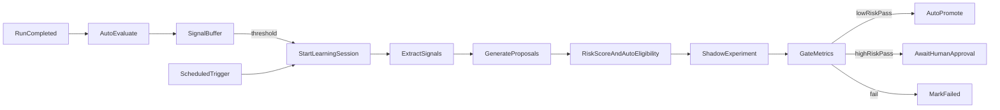

# Continuous Learning Automation Plan

## Goals

- Make learning continuous and autonomous (no manual button required).
- Use dual triggers: signal thresholds and scheduled backstop.
- Apply hybrid promotion: auto for low-risk changes, human approval for high-risk.
- Add real-traffic shadow testing with measurable A/B results.
- Preserve auditability and reproducibility for every decision.

## Architecture Overview

## Plan

### 1) Data Model Extensions

- Add risk and automation fields to learning models in [packages/database/prisma/schema.prisma](packages/database/prisma/schema.prisma):
    - `LearningProposal`: `riskTier` (low/medium/high), `autoEligible` (bool), `riskReasons` (Json).
    - `LearningApproval`: `decision` should allow `auto_approved` and include `autoApproved` flag.
    - `LearningExperiment`: add `trafficSplit` (Json), `shadowRunCount`, `baselineRunCount`, `candidateRunCount`.
- Link experiments to runs to enable real-traffic A/B scoring:
    - Add `experimentId` to `AgentRun` (or `LearningExperiment` to `AgentRun` junction) to tag baseline/candidate runs.
- Add indexes for query performance (session status, experiment status, experimentId on runs).

### 2) Centralized Learning Configuration

- Create a single config module for thresholds and schedules:
    - [apps/agent/src/lib/learning-config.ts](apps/agent/src/lib/learning-config.ts)
    - Define signal thresholds, cron schedule, traffic split defaults, auto-approval thresholds, and risk-tier rules.

### 3) Continuous Triggers (Threshold + Scheduled)

- Update Inngest schema in [apps/agent/src/lib/inngest.ts](apps/agent/src/lib/inngest.ts):
    - Add `learning/session.scheduled` event.
- Add scheduled Inngest function in [apps/agent/src/lib/inngest-functions.ts](apps/agent/src/lib/inngest-functions.ts):
    - Cron-triggered job that starts sessions when no active session exists.
- Extend `learningSignalDetectorFunction` to:
    - Accumulate signals in a time window.
    - Start sessions when thresholds are met.

### 4) Proposal Risk Scoring + Hybrid Promotion

- Extend proposal generation to classify risk and auto-eligibility:
    - Low risk: instruction-only edits, no tool/model changes, no cost increase.
    - High risk: model changes, tool changes, memory changes, guardrail changes.
- Record `riskTier`, `autoEligible`, and `riskReasons` on `LearningProposal`.
- Update experiment gating logic:
    - If `autoEligible` and win-rate/confidence thresholds passed, auto-promote.
    - Otherwise set `AWAITING_APPROVAL` and require human approval.

### 5) Real-Traffic Shadow Testing

- Add experiment-aware routing in run creation paths:
    - Identify candidate vs baseline in run creation logic (likely in [apps/agent/src/app/api/agents/[id]/runs/route.ts](apps/agent/src/app/api/agents/[id]/runs/route.ts) and/or [apps/agent/src/app/api/agents/[id]/chat/route.ts](apps/agent/src/app/api/agents/[id]/chat/route.ts)).
    - Use experiment traffic split to decide baseline vs candidate.
    - Tag `AgentRun` with `experimentId` and version info.
- Update evaluation aggregation to compare baseline vs candidate by experiment.
- Use real traffic metrics rather than simulated metrics for gating.

### 6) Auto-Promotion Pipeline

- Add an Inngest function to evaluate experiments continuously:
    - Triggered when enough shadow runs collected or at periodic intervals.
    - Compute win-rate, confidence intervals, guardrail regressions, cost deltas.
- If thresholds passed and `autoEligible`, promote automatically and write to `AuditLog`.
- If thresholds passed but high risk, request human approval.

### 7) API Enhancements

- Add endpoints in [apps/agent/src/app/api/agents/[id]/learning/](apps/agent/src/app/api/agents/[id]/learning/):
    - `POST /learning/policy` to set auto-promotion policy and thresholds per agent.
    - `POST /learning/pause` to pause continuous learning for an agent.
    - `GET /learning/experiments` to inspect active experiments and traffic splits.

### 8) UI Updates

- Update [apps/agent/src/app/workspace/[agentSlug]/learning/page.tsx](apps/agent/src/app/workspace/[agentSlug]/learning/page.tsx):
    - Show continuous mode status, next scheduled run, and signal thresholds.
    - Display auto-approval decisions vs human approvals.
    - Surface shadow test counts and traffic split details.
    - Allow per-agent policy settings (auto vs human).

### 9) Metrics + Rollups

- Extend daily rollups in [apps/agent/src/lib/inngest-functions.ts](apps/agent/src/lib/inngest-functions.ts):
    - Track auto-promotions vs manual promotions.
    - Track shadow run volume and A/B coverage.
    - Track regression counts and safety guardrail hits.

### 10) Testing

- Unit tests:
    - Risk scoring logic (low/medium/high classification).
    - Gating logic (win-rate, confidence, guardrails, cost deltas).
    - Auto-promotion vs human approval decisions.
    - Add tests in [tests/unit/inngest-functions.test.ts](tests/unit/inngest-functions.test.ts) and new unit test file for learning rules.
- Integration tests:
    - Scheduled trigger starts sessions when no active session exists.
    - Shadow routing tags runs with experimentId.
    - API policy endpoints work and persist.
    - Add to [tests/integration/inngest/](tests/integration/inngest/) and [tests/integration/api/](tests/integration/api/).

## Risks & Safeguards

- Ensure auto-promotion only for low-risk changes and requires sustained improvements.
- Guardrail regression check before any promotion (auto or manual).
- Limit traffic split for candidate versions until sufficient confidence.

## Rollout

- Phase 1: Enable scheduled backstop + signal threshold triggers, but keep human approval for all promotions.
- Phase 2: Turn on auto-promotion for low-risk changes with strict thresholds.
- Phase 3: Increase shadow traffic split and reduce manual steps where safe.
