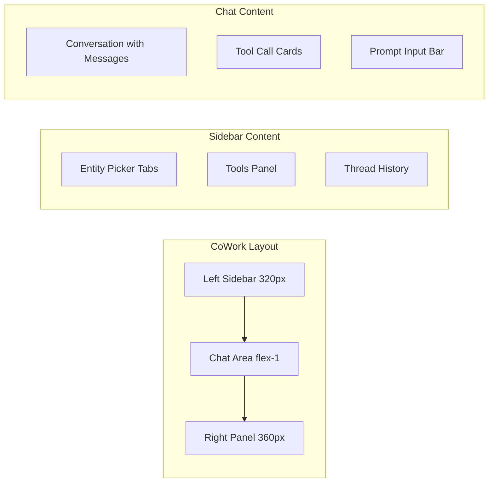

# CoWork: Unified Agent Chat Interface

## Architecture

The CoWork interface is a new page at `/cowork` with a three-panel layout: left sidebar (entity selector + tools), center (chat area), and a collapsible right panel (entity details/context). It replaces the current `/chat` as the primary interaction point with all agents, networks, and workflows.



## Key Design Decisions

- **Route**: New page at `apps/agent/src/app/cowork/page.tsx` with its own layout
- **Navigation**: Add "CoWork" as the first nav item in `AgentHeader`, replacing "Assistant"
- **Streaming**: Reuse existing `/api/agents/[id]/chat` for agents; build new `/api/cowork/chat` unified endpoint that can route to agents, networks, or workflows
- **Components**: Compose entirely from existing `@repo/ui` AI elements (Conversation, Message, PromptInput, Tool, ChainOfThought, Sources, Loader) -- no new base components needed
- **State**: Use `useChat` from `@ai-sdk/react` with `DefaultChatTransport`, same pattern as existing [apps/agent/src/app/chat/page.tsx](apps/agent/src/app/chat/page.tsx)

## Detailed Design

### 1. Left Sidebar -- Entity Selector + Tools

**Entity Picker** (top section):

- Three tabs: Agents | Networks | Workflows
- Each tab shows a searchable list of entities fetched from existing APIs (`/api/agents`, `/api/networks`, `/api/workflows`)
- Each entity card shows: name, description snippet, model badge, status indicator, tool count
- Selected entity is highlighted; clicking switches the active chat target
- Agent items show model provider icon (OpenAI/Anthropic)

**Tools Panel** (middle section, collapsible):

- When an entity is selected, shows its associated tools
- For agents: fetched from the agent detail endpoint (includes `tools[]` array)
- For networks: shows primitives (sub-agents, workflows, tools)
- For workflows: shows step types
- Each tool shows: name, source badge (registry/MCP), description on hover

**Thread History** (bottom section):

- List of previous conversation threads for the selected entity
- New thread button at top
- Thread titles (auto-generated or first message preview)
- Click to reload a thread

### 2. Center Panel -- Chat Area

**Header Bar**:

- Shows selected entity name + type badge (Agent/Network/Workflow)
- Model name and provider
- "New Thread" button
- Entity details toggle (right panel)
- Stop/Clear buttons

**Conversation Area**:

- Uses existing `Conversation` + `ConversationContent` + `ConversationScrollButton`
- Empty state: Shows entity description + suggested prompts
- Messages rendered with `Message` + `MessageContent` + `MessageResponse` (markdown via Streamdown)
- Tool calls rendered with `Tool` + `ToolHeader` + `ToolContent` + `ToolInput` + `ToolOutput`
- Internal tools (updateWorkingMemory, getWorkingMemory) hidden from UI
- Message actions: Copy, Regenerate, Feedback (thumbs up/down)
- Streaming indicator with `Loader`

**Prompt Input**:

- Uses existing `PromptInput` + `PromptInputBody` + `PromptInputTextarea` + `PromptInputSubmit` + `PromptInputFooter`
- Entity selector inline in footer (quick-switch without sidebar)
- File attachment support via `PromptInputActionMenu`
- Enter to send, Shift+Enter for newline
- Disable when no entity selected or streaming

### 3. Right Panel -- Entity Context (collapsible)

- Agent: Instructions preview, model config, memory settings, tool list
- Network: Topology visualization (primitives list), sub-agents, routing instructions
- Workflow: Step definitions, input/output schema, execution config
- Collapsible via toggle button in chat header

### 4. Unified Chat API

New API route at `apps/agent/src/app/api/cowork/chat/route.ts`:

```typescript
// POST /api/cowork/chat
// Body: { entityType: "agent" | "network" | "workflow", entitySlug: string, messages, threadId, requestContext }
// For agents: delegates to agentResolver.resolve() + agent.stream()
// For networks: delegates to buildNetworkAgent() + agent.network()
// For workflows: delegates to executeWorkflowDefinition()
// Returns: createUIMessageStreamResponse (same format for all)
```

This unifies all three entity types behind a single streaming endpoint compatible with `useChat`.

### 5. Entity Detail API

New API route at `apps/agent/src/app/api/cowork/entity/route.ts`:

- `GET /api/cowork/entity?type=agent&slug=assistant` -- Returns entity details + tools
- Consolidates agent/network/workflow detail fetching into one endpoint

## File Changes

### New Files

- `apps/agent/src/app/cowork/layout.tsx` -- CoWork layout (no top-level sidebar, full-width)
- `apps/agent/src/app/cowork/page.tsx` -- Main CoWork page component
- `apps/agent/src/components/cowork/CoWorkSidebar.tsx` -- Left sidebar with entity picker + tools
- `apps/agent/src/components/cowork/CoWorkChat.tsx` -- Center chat panel
- `apps/agent/src/components/cowork/CoWorkContext.tsx` -- Right context panel
- `apps/agent/src/components/cowork/EntityPicker.tsx` -- Tabbed entity selector (agents/networks/workflows)
- `apps/agent/src/components/cowork/ToolsPanel.tsx` -- Tools display for selected entity
- `apps/agent/src/components/cowork/ThreadList.tsx` -- Thread history list
- `apps/agent/src/components/cowork/EmptyState.tsx` -- CoWork-specific empty state
- `apps/agent/src/app/api/cowork/chat/route.ts` -- Unified chat streaming endpoint
- `apps/agent/src/app/api/cowork/entity/route.ts` -- Entity detail endpoint
- `apps/agent/src/hooks/useCoWork.ts` -- State management hook (selected entity, threads, tools)

### Modified Files

- [apps/agent/src/components/AgentHeader.tsx](apps/agent/src/components/AgentHeader.tsx) -- Add "CoWork" nav item, replace "Assistant"

## UX Patterns (Claude CoWork-inspired)

- **Keyboard shortcuts**: Cmd+K for entity switcher (command palette), Cmd+N for new thread, Cmd+Shift+S for sidebar toggle
- **Smooth transitions**: Entity switch clears chat with fade animation, loads new thread
- **Persistent selection**: Last used entity + thread stored in localStorage
- **Status indicators**: Streaming status, entity active/inactive, connection health
- **Responsive**: Sidebar collapses on smaller screens, context panel auto-hides
- **Tool call UX**: Collapsible tool cards with input/output preview, error highlighting, duration display
- **Message threading**: Each entity+thread combination is isolated via threadId
- **Quick entity switch**: Type `/` in the prompt to open inline entity picker (similar to Slack slash commands)
