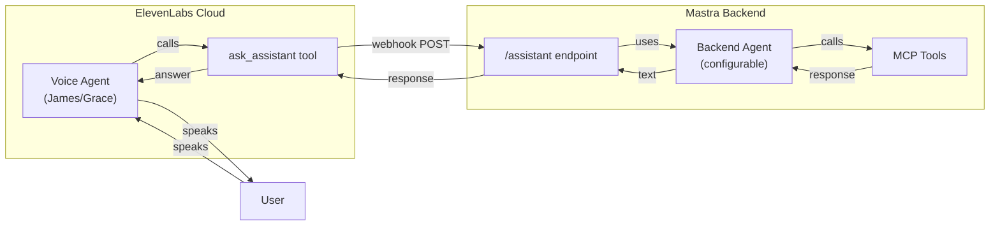
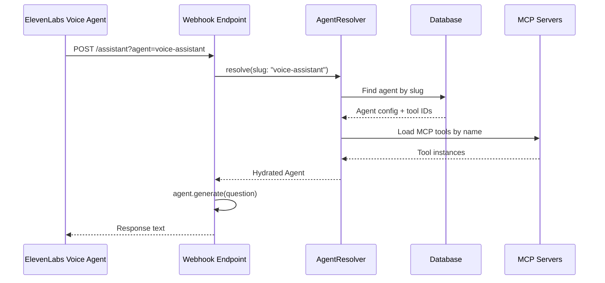

# ElevenLabs Database Agent Integration

## Two-Tier Architecture

There are two separate agent concepts in this integration:



1. **ElevenLabs Voice Agent** (James/Grace) - Configured in ElevenLabs dashboard

- Has a voice, system prompt, and tools
- Tool `ask_assistant` sends questions to your Mastra backend

1. **Mastra Backend Agent** - Currently hardcoded `createMcpAgent()`

- Receives questions from ElevenLabs via webhook
- Has access to MCP tools (HubSpot, Jira, etc.)
- **This is what we're making configurable**

## Current ElevenLabs Configuration

From the code, the current setup uses:

- **Tool ID**: `tool_2701kgar5c7xea1rremmc16whvhr` (referenced in monitor endpoint)
- **Agent ID**: `agent_0301kg9h2x19evavrqpfp3h54s48`
- **Tool Name**: `ask_assistant` - configured to call the `/assistant` endpoint
- **Webhook URL**: Currently points to your ngrok URL + `/agent/api/demos/live-agent-mcp/assistant`

The ElevenLabs tool sends:

```json
{ "question": "What contacts do I have in HubSpot?" }
```

## Problem: MCP Agent Missing from Database

The seed file [packages/database/prisma/seed-agents.ts](packages/database/prisma/seed-agents.ts) has 8 SYSTEM agents but is **missing the MCP Agent**.

Currently seeded agents:

- assistant, structured, vision, research, evaluated
- openai-voice, elevenlabs-voice, hybrid-voice

**Missing**: `mcp-agent` - the agent that handles ElevenLabs webhook requests

The MCP agent exists only as hardcoded code in [packages/mastra/src/agents/mcp-agent.ts](packages/mastra/src/agents/mcp-agent.ts).

## Proposed Change

1. **Add MCP Agent to seed file** - Make it a SYSTEM agent like the others
2. **Run the seed** - Populate the database with the MCP Agent
3. **Update webhooks** - Use `agentResolver.resolve()` with query parameter



## Files to Modify

### 1. Seed File - [packages/database/prisma/seed-agents.ts](packages/database/prisma/seed-agents.ts)

Add the MCP Agent to the `systemAgents` array:

```typescript
{
    slug: "mcp-agent",
    name: "MCP-Enabled Agent",
    description: "Voice assistant with access to external tools via MCP. Used by ElevenLabs for CRM, project management, and more.",
    instructions: `You are a helpful assistant with access to business tools...

Keep responses concise (2-4 sentences) since they may be spoken aloud.`,
    modelProvider: "anthropic",
    modelName: "claude-sonnet-4-20250514",
    tools: [], // MCP tools will be added dynamically or via UI
    memoryEnabled: false,
    memoryConfig: null,
    scorers: [],
    maxSteps: 5,
    metadata: {
        purpose: "elevenlabs-voice-backend",
        mcpEnabled: true
    }
}
```

**Note**: MCP tools need special handling since they're loaded dynamically. Options:

- Leave `tools: []` and add MCP tool IDs via the manage UI after seeding
- Pre-populate with known MCP tool names (e.g., `hubspot_search_contacts`)

### 2. Run Seed

After updating the seed file:

```bash
cd packages/database
bun run prisma/seed-agents.ts
```

This creates the `mcp-agent` in the database as a SYSTEM agent.

### 3. Assistant Webhook - [apps/agent/src/app/api/demos/live-agent-mcp/assistant/route.ts](apps/agent/src/app/api/demos/live-agent-mcp/assistant/route.ts)

- Add query parameter: `?agent=<slug>` (default: `mcp-agent`)
- Replace `createMcpAgent()` with `agentResolver.resolve({ slug })`
- Use agent's `maxSteps` from database config
- Keep existing observability (tracing, scoring) intact

### 4. Tools Webhook - [apps/agent/src/app/api/demos/live-agent-mcp/tools/route.ts](apps/agent/src/app/api/demos/live-agent-mcp/tools/route.ts)

- Add query parameter: `?agent=<slug>` (default: `mcp-agent`)
- Replace `createMcpAgent()` with `agentResolver.resolve({ slug })`

### 5. Debug Endpoint - [apps/agent/src/app/api/demos/live-agent-mcp/debug/route.ts](apps/agent/src/app/api/demos/live-agent-mcp/debug/route.ts)

- Update instructions to reflect new `?agent=slug` parameter

## ElevenLabs Dashboard Update (Optional)

**Existing configurations will continue to work** - the default fallback uses `mcp-agent`.

Only update ElevenLabs if you want to use a different backend agent:

**Current webhook URL (still works):**

```
https://your-ngrok-url/agent/api/demos/live-agent-mcp/assistant
```

**Custom agent URL (optional):**

```
https://your-ngrok-url/agent/api/demos/live-agent-mcp/assistant?agent=sales-voice
```

This allows different ElevenLabs agents (James, Grace) to use different backend agents.

## Default Fallback

If no `?agent` parameter is provided:

1. Use env var `ELEVENLABS_DEFAULT_AGENT_SLUG` if set
2. Otherwise default to `mcp-agent` (the seeded SYSTEM agent)

This ensures backward compatibility - existing ElevenLabs configurations will continue to work without URL changes.

## Using the Database Agent

After seeding, the `mcp-agent` will appear in `/demos/agents/manage` as a SYSTEM agent.

**To configure it:**

1. Go to `/demos/agents/manage`
2. Select "MCP-Enabled Agent"
3. Click "Edit" to modify:

- **Instructions**: Customize for your use case
- **Model**: Change to GPT-4o if preferred
- **Tools**: Add/remove MCP tools (HubSpot, Jira, etc.)

1. Test using the Test tab before connecting to ElevenLabs

**To create a custom voice agent:**

1. Click "Create Agent"
2. Configure with slug like `sales-voice` or `support-voice`
3. Add relevant MCP tools
4. Update ElevenLabs webhook URL to `?agent=sales-voice`

This allows different ElevenLabs agents (James for sales, Grace for support) to use different backend configurations.
