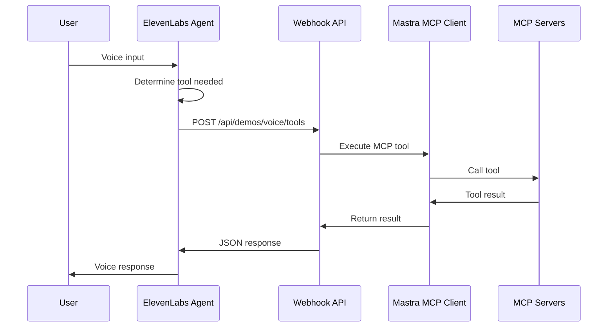

# ElevenLabs Voice Agent + Mastra MCP Tools Integration

## Architecture



## Implementation

### 1. Create Voice Tools Webhook Endpoint

Create a new API route at `apps/agent/src/app/api/demos/voice/tools/route.ts`:

- Accept POST requests from ElevenLabs with tool name and parameters
- Execute the requested MCP tool via Mastra
- Return JSON result for ElevenLabs to use in response

Key code pattern from existing MCP route ([apps/agent/src/app/api/mcp/route.ts](apps/agent/src/app/api/mcp/route.ts)):

```typescript
const agent = await createMcpAgent();
const response = await agent.generate(message, { maxSteps });
```

For webhooks, we need direct tool execution instead:

```typescript
import { mcpClient } from "@repo/mastra";

// Execute specific tool with parameters
const result = await mcpClient.callTool(toolName, parameters);
```

### 2. Expose Available Tools Metadata

Create endpoint to list available tools with their schemas:

- `GET /api/demos/voice/tools` - Returns tool definitions for ElevenLabs dashboard configuration

This uses the existing `getMcpTools()` from [packages/mastra/src/mcp/client.ts](packages/mastra/src/mcp/client.ts).

### 3. Add Tool Execution to MCP Client

The current MCP client exports `listTools()` and `listToolsets()` but doesn't expose direct tool execution. Add:

```typescript
// In packages/mastra/src/mcp/client.ts
export async function executeMcpTool(toolName: string, parameters: Record<string, unknown>) {
    // Find tool and execute via MCP client
}
```

### 4. ElevenLabs Dashboard Configuration

After deploying, configure each tool in the ElevenLabs agent dashboard:

- **Tool Type**: Webhook (Server)
- **Method**: POST
- **URL**: `https://catalyst.localhost/agent/api/demos/voice/tools` (or production URL)
- **Parameters**: Defined per tool based on the schema from step 2

## Files to Create/Modify

| File                                                | Action                          |
| --------------------------------------------------- | ------------------------------- |
| `apps/agent/src/app/api/demos/voice/tools/route.ts` | Create - Webhook endpoint       |
| `packages/mastra/src/mcp/client.ts`                 | Modify - Add `executeMcpTool()` |
| `packages/mastra/src/mcp/index.ts`                  | Modify - Export new function    |

## Security Considerations

- Add bearer token authentication to the webhook endpoint
- Store the token as `ELEVENLABS_WEBHOOK_SECRET` in `.env`
- Validate the token on each request from ElevenLabs

## Testing Approach

1. Test endpoint locally with curl/Postman
2. Use ngrok or Caddy to expose local endpoint
3. Configure one tool in ElevenLabs dashboard and test voice interaction
