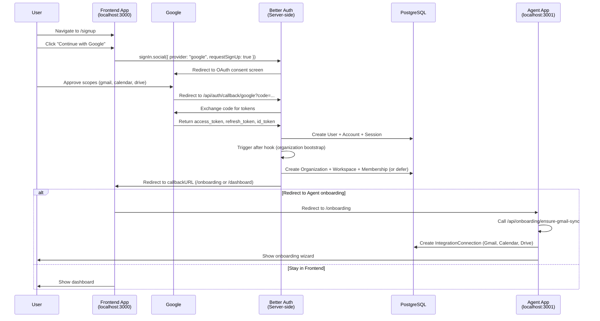
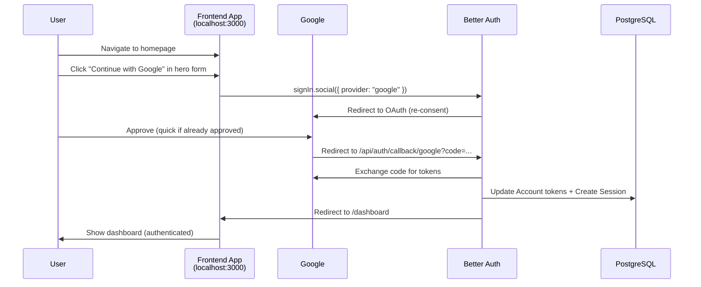
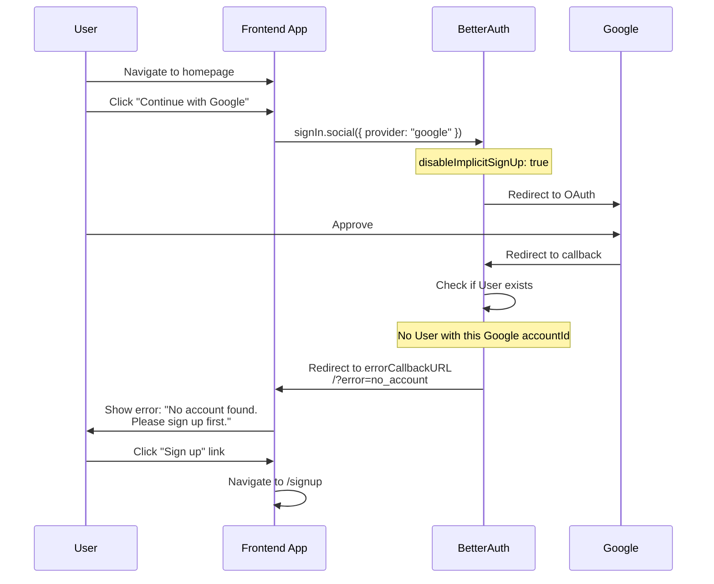
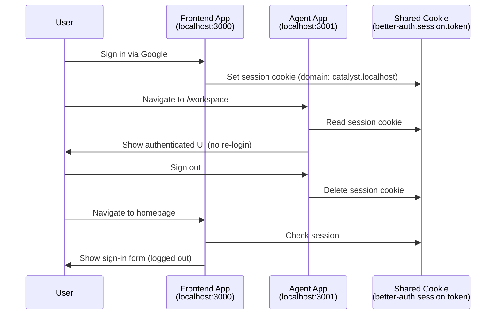

# Technical Design: Google SSO Integration

**Feature Request:** Add SSO with Google  
**GitHub Issue:** [#91](https://github.com/Appello-Prototypes/agentc2/issues/91)  
**Priority:** Medium  
**Complexity:** Medium  
**Status:** Design Phase  
**Date:** March 8, 2026

---

## Executive Summary

This design document outlines the implementation plan for enabling Google Single Sign-On (SSO) across the AgentC2 platform. The Agent app (`apps/agent`) already has Google OAuth fully implemented via Better Auth. This feature will extend Google SSO to the Frontend app (`apps/frontend`) to provide a consistent authentication experience across the marketing site and main application.

**Key Finding:** Most infrastructure is already in place. The primary work is frontend UI additions and ensuring proper OAuth callback routing across both apps.

---

## 1. Current State Analysis

### 1.1 Existing Google OAuth Implementation

#### Agent App (apps/agent) - ✅ COMPLETE

**Components:**
- **Sign-in form** (`apps/agent/src/components/auth/sign-in-form.tsx`)
  - "Continue with Google" button with Google logo SVG
  - Calls `signIn.social({ provider: "google", scopes: [...GOOGLE_OAUTH_SCOPES] })`
  - Includes error handling for `no_account` scenario
  - Supports callback URL redirection
  
- **Sign-up form** (`apps/agent/src/components/auth/sign-up-form.tsx`)
  - "Continue with Google" button
  - Uses `signIn.social({ provider: "google", requestSignUp: true })`
  - Stores invite codes in sessionStorage before OAuth redirect
  - Redirects to `/onboarding` after successful signup

**Pages:**
- `/login` - Full-featured login with Google + Microsoft + Email/Password
- `/signup` - Full-featured signup with Google + Microsoft + Email/Password
- `/onboarding` - Post-signup flow with Gmail auto-sync detection

#### Frontend App (apps/frontend) - ❌ MISSING

**Components:**
- **Sign-in form** (`apps/frontend/src/components/auth/sign-in-form.tsx`)
  - ❌ Email/password only
  - No Google OAuth button
  
- **Sign-up form** (`apps/frontend/src/components/auth/sign-up-form.tsx`)
  - ❌ Email/password only
  - No Google OAuth button

**Pages:**
- `/` (homepage) - Embeds SignInForm in hero section
- `/signup` - Dedicated signup page with SignUpForm
- No separate `/login` page (sign-in embedded in homepage)

### 1.2 Better Auth Configuration

**File:** `packages/auth/src/auth.ts`

```typescript
socialProviders: {
    ...(googleClientId && googleClientSecret
        ? {
              google: {
                  clientId: googleClientId,
                  clientSecret: googleClientSecret,
                  accessType: "offline",
                  prompt: "consent",
                  scope: [...GOOGLE_OAUTH_SCOPES],
                  disableImplicitSignUp: true
              }
          }
        : {})
}
```

**Status:** ✅ Fully configured and functional

**Google OAuth Scopes** (`packages/auth/src/google-scopes.ts`):
```typescript
[
    "https://www.googleapis.com/auth/gmail.modify",
    "https://www.googleapis.com/auth/calendar.events",
    "https://www.googleapis.com/auth/drive.readonly",
    "https://www.googleapis.com/auth/drive.file"
]
```

**Configuration:**
- `accessType: "offline"` - Requests refresh token for long-term access
- `prompt: "consent"` - Always shows consent screen to ensure all scopes are granted
- `disableImplicitSignUp: true` - Prevents automatic account creation for unknown emails

### 1.3 OAuth Callback Flow

**Better Auth Callback Endpoint:** `/api/auth/callback/google`

**Flow:**
1. User clicks "Continue with Google" → `signIn.social({ provider: "google" })`
2. Better Auth redirects to Google OAuth consent screen
3. User approves → Google redirects to `/api/auth/callback/google?code=...`
4. Better Auth:
   - Exchanges code for tokens
   - Creates/updates `Account` record with OAuth tokens
   - Creates `Session` record
   - Sets session cookie (`better-auth.session.token`)
5. Triggers `after` hook in `auth.ts` → `ctx.path === "/callback/:id"`
6. Runs organization bootstrap logic (`bootstrapUserOrganization()`)
7. Runs post-bootstrap callbacks (e.g., Gmail sync)
8. Redirects to callback URL or default destination

**Current Callback URLs by App:**

| App | Callback URL | Status |
|-----|--------------|--------|
| Agent app | `http://localhost:3001/api/auth/callback/google` (dev)<br>`https://agentc2.ai/api/auth/callback/google` (prod) | ✅ Configured |
| Frontend app | `http://localhost:3000/api/auth/callback/google` (dev)<br>`https://agentc2.ai/api/auth/callback/google` (prod) | ❓ Needs verification |

**Important:** Better Auth handles OAuth callbacks at the server level. Since both apps share the same `@repo/auth` package and database, the callback endpoint exists in both apps automatically. The challenge is ensuring both callback URLs are registered in Google Cloud Console.

### 1.4 Session Sharing Architecture

**Caddy Reverse Proxy Configuration:**

| Environment | Domain | Frontend Port | Agent Port |
|-------------|--------|---------------|------------|
| Development | `https://catalyst.localhost` | 3000 | 3001 |
| Production | `https://agentc2.ai` | 3000 | 3001 |

**Cookie Configuration:**
- Prefix: `better-auth`
- Cross-subdomain enabled in production
- HTTP-only, secure in production
- Shared across all apps on the same domain

**Key Files:**
- `scripts/start-caddy.sh` - Starts Caddy with local TLS
- `Caddyfile` (likely in root or scripts/) - Reverse proxy rules

**Result:** Once a user signs in via Google on Frontend app, their session is automatically available in Agent app (and vice versa).

### 1.5 Organization Bootstrap

**File:** `packages/auth/src/bootstrap.ts`

When a new user signs up via Google OAuth:

1. **Check existing membership** - If user already belongs to org, return it
2. **Try invite code** (from sessionStorage `pendingInviteCode`):
   - Platform invite → User can create their own org
   - Org-scoped invite → User joins specific org
3. **Try domain matching** - If user's email domain matches:
   - `OrganizationDomain` table for explicit mappings
   - Fallback: existing members with same domain
   - Returns `suggestedOrg` instead of auto-joining
4. **Defer to onboarding** - With `deferOrgCreation: true`, user sees org selection UI
5. **Auto-create org** - Last resort if no match and defer is false

**Configuration in auth.ts hook:**
```typescript
if (ctx.path === "/callback/:id") {
    const newSession = ctx.context.newSession;
    if (newSession && !existingMembership) {
        await bootstrapUserOrganization(
            newSession.user.id,
            newSession.user.name,
            newSession.user.email,
            undefined,
            { deferOrgCreation: true }  // ← Key: doesn't auto-create org
        );
    }
}
```

**Post-Bootstrap Hooks:**
- Gmail auto-sync (if user signed up with Google and granted Gmail scopes)
- Analytics tracking
- Onboarding flow initialization

### 1.6 Data Model

**User Model** (Prisma schema):
```prisma
model User {
    id                   String    @id @default(cuid())
    name                 String
    email                String    @unique
    emailVerified        Boolean   @default(false)
    image                String?
    timezone             String?
    status               String    @default("active")
    twoFactorEnabled     Boolean   @default(false)
    // ... relations
    accounts             Account[]
    sessions             Session[]
}
```

**Account Model** (OAuth provider links):
```prisma
model Account {
    id                    String    @id @default(cuid())
    accountId             String    // Google user ID
    providerId            String    // "google"
    userId                String
    user                  User      @relation(...)
    accessToken           String?
    refreshToken          String?
    idToken               String?
    accessTokenExpiresAt  DateTime?
    refreshTokenExpiresAt DateTime?
    scope                 String?   // Granted scopes
}
```

**Note:** Better Auth manages Account records automatically. When a user signs in with Google, Better Auth creates an Account with `providerId: "google"` and stores OAuth tokens.

---

## 2. Architecture Changes

### 2.1 No Backend Changes Required ✅

**Better Auth server configuration** (`packages/auth/src/auth.ts`) already supports Google OAuth when environment variables are present. No modifications needed.

**OAuth callback endpoint** (`/api/auth/callback/google`) exists in both apps automatically via the shared `@repo/auth` package.

**Organization bootstrap logic** already handles Google sign-ups with proper multi-tenant isolation and domain matching.

### 2.2 Frontend UI Additions Required

#### Frontend App Sign-In Form

**File:** `apps/frontend/src/components/auth/sign-in-form.tsx`

**Current State:**
```typescript
export function SignInForm() {
    // Email/password only
    const handleSubmit = async (e: React.FormEvent) => {
        await signIn.email({ email, password });
    };
    return <form>...</form>;
}
```

**Required Changes:**
1. Add `GoogleLogo` SVG component (copy from Agent app)
2. Add `MicrosoftLogo` SVG component (optional - for consistency)
3. Add state management for `socialLoading`
4. Add `handleSocialSignIn` function
5. Add Google OAuth button above email form
6. Add divider with "or continue with email" text
7. Import `GOOGLE_OAUTH_SCOPES` from `@repo/auth/google-scopes`

**Pattern to Follow:** Mirror the Agent app's sign-in form structure exactly, including:
- Button styling (outline variant, lg size, specific Tailwind classes)
- Loading states and disabled logic
- Error callback URL (`errorCallbackURL` parameter)
- Callback URL from URL params or default to `/dashboard`

#### Frontend App Sign-Up Form

**File:** `apps/frontend/src/components/auth/sign-up-form.tsx`

**Current State:**
```typescript
export function SignUpForm() {
    const handleSubmit = async (e: React.FormEvent) => {
        await signUp.email({ name, email, password });
        router.push("/dashboard");
    };
    return <form>...</form>;
}
```

**Required Changes:**
1. Add `GoogleLogo` and `MicrosoftLogo` components
2. Add `handleSocialSignUp` function
3. Add Google/Microsoft OAuth buttons at the top
4. Add divider
5. Consider collapsible email form (optional - matches Agent app UX)
6. Set `callbackURL: "/dashboard"` for Frontend app (vs `/onboarding` for Agent app)
7. Handle invite code persistence in sessionStorage (if applicable)

**Decision Point:** Should Frontend app redirect to `/onboarding` after Google signup, or directly to `/dashboard`?
- Agent app: `callbackURL: "/onboarding"` (has multi-step onboarding wizard)
- Frontend app: Currently redirects to `/dashboard` after email signup
- **Recommendation:** Redirect to Agent app's `/onboarding` for consistency, or create a simplified onboarding flow in Frontend app

### 2.3 Environment Variables

**Required Variables:**
```bash
GOOGLE_CLIENT_ID="your_google_client_id"
GOOGLE_CLIENT_SECRET="your_google_client_secret"
```

**Status:** Already documented in `.env.example` (lines 32-38)

**Google Cloud Console Configuration:**

**Existing Redirect URIs** (already configured):
```
http://localhost:3001/api/auth/callback/google
https://agentc2.ai/api/auth/callback/google
```

**Required Additions:**
```
http://localhost:3000/api/auth/callback/google
```

**Note:** In production, both apps are behind Caddy on `agentc2.ai`, so the production callback URL (`https://agentc2.ai/api/auth/callback/google`) works for both apps. The development URL for port 3000 must be added separately.

### 2.4 Shared Component Extraction (Optional Enhancement)

**Opportunity:** The Agent app and Frontend app will have nearly identical sign-in/sign-up forms after this change. Consider extracting to a shared component in `@repo/ui`.

**Potential Shared Components:**
- `GoogleLogo` component
- `MicrosoftLogo` component
- `SocialAuthButtons` component (Google + Microsoft buttons with shared logic)
- `AuthFormDivider` component ("or continue with email" divider)

**Benefits:**
- Single source of truth for OAuth UI
- Consistent styling across apps
- Easier maintenance and future provider additions

**Trade-offs:**
- Slightly more complex component API (props for callback URLs, error handling)
- May limit app-specific customization

**Recommendation:** Implement as app-specific components first (Phase 1), then refactor to shared components if needed (future optimization).

---

## 3. Integration Points

### 3.1 Better Auth Package (`@repo/auth`)

**No changes required** - Already supports Google OAuth when env vars are present.

**Key Exports Used:**
```typescript
import { signIn } from "@repo/auth/client";
import { GOOGLE_OAUTH_SCOPES } from "@repo/auth/google-scopes";

// Sign-in
await signIn.social({
    provider: "google",
    callbackURL: "/dashboard",
    errorCallbackURL: "/?error=no_account",
    scopes: [...GOOGLE_OAUTH_SCOPES]
});

// Sign-up
await signIn.social({
    provider: "google",
    requestSignUp: true,
    callbackURL: "/onboarding",
    scopes: [...GOOGLE_OAUTH_SCOPES]
});
```

**OAuth Flow:**
1. Client calls `signIn.social()` → Better Auth redirects to Google
2. Google redirects back to `/api/auth/callback/google`
3. Better Auth processes callback, creates session
4. Redirects to `callbackURL` or `errorCallbackURL`

### 3.2 Session Provider

**File:** `apps/frontend/src/components/providers/session-provider.tsx` (or similar)

**Requirement:** Frontend app must wrap the app in Better Auth's session provider.

**Example** (from Agent app):
```typescript
"use client";
import { SessionProvider as BetterAuthProvider } from "@repo/auth/providers";

export function SessionProvider({ children }: { children: React.ReactNode }) {
    return <BetterAuthProvider>{children}</BetterAuthProvider>;
}
```

**Status:** Check if Frontend app already has this provider. If not, add to root layout.

### 3.3 Organization Bootstrap

**Trigger:** Better Auth `after` hook on `/callback/:id` path

**Logic** (`packages/auth/src/auth.ts`, lines 161-202):
```typescript
if (ctx.path === "/callback/:id") {
    const newSession = ctx.context.newSession;
    if (newSession) {
        const existing = await prisma.membership.findFirst({
            where: { userId: newSession.user.id }
        });
        if (!existing) {
            const result = await bootstrapUserOrganization(
                newSession.user.id,
                newSession.user.name,
                newSession.user.email,
                undefined,
                { deferOrgCreation: true }
            );
            // Run post-bootstrap callbacks (Gmail sync, etc.)
            if (result.success && result.organization) {
                for (const cb of postBootstrapCallbacks) {
                    await cb(newSession.user.id, result.organization.id);
                }
            }
        }
    }
}
```

**Frontend Impact:** This logic runs server-side regardless of which app processed the callback. No app-specific changes needed.

### 3.4 Cross-App Redirect Considerations

**Scenario:** User signs up via Google on Frontend app (`localhost:3000`) but needs to complete onboarding in Agent app (`localhost:3001`).

**Options:**

**Option A: Frontend-specific onboarding** (Simpler)
- Frontend app redirects to `/dashboard` after Google signup
- User can access main features immediately
- Agent app's onboarding wizard not used

**Option B: Cross-app redirect to Agent onboarding** (Consistent)
- Frontend app redirects to Agent app's `/onboarding` after Google signup
- Requires absolute URL redirect: `window.location.href = "http://localhost:3001/onboarding"`
- In production: relative URL works (`/onboarding`) because Caddy routes to Agent app
- Provides consistent onboarding experience

**Option C: Simplified Frontend onboarding flow**
- Create a minimal onboarding page in Frontend app
- Skip agent creation, focus on profile completion
- Redirect to Agent app for full setup

**Recommendation:** Option B - Redirect to Agent app's onboarding for consistency. The session cookie is shared, so the redirect is seamless.

### 3.5 Gmail Integration Auto-Sync

**File:** `apps/agent/src/app/api/onboarding/ensure-gmail-sync/route.ts`

**Purpose:** When a user signs up via Google OAuth, automatically create a Gmail `IntegrationConnection` using the OAuth tokens from their Better Auth `Account`.

**Flow:**
1. User signs up with Google (grants gmail.modify, calendar.events scopes)
2. Better Auth stores tokens in `Account` table
3. Onboarding page calls `/api/onboarding/ensure-gmail-sync`
4. API:
   - Fetches user's Google `Account` record
   - Checks if Gmail `IntegrationConnection` exists
   - If not, creates one using tokens from `Account`
   - Also creates sibling connections for Calendar and Drive (if scopes granted)
5. User can immediately use Gmail tools without re-authenticating

**Frontend Impact:**
- If Frontend app uses Option B (redirect to Agent onboarding), this works automatically
- If Frontend app uses Option A (direct to dashboard), Gmail sync won't trigger
- **Recommendation:** Add a post-login check in Frontend app to call Gmail sync API

### 3.6 Callback URL Registration in Google Cloud Console

**Current Configuration:**
```
Authorized redirect URIs:
- http://localhost:3001/api/auth/callback/google  (Agent app dev)
- https://agentc2.ai/api/auth/callback/google     (Production - shared)
```

**Required Addition:**
```
- http://localhost:3000/api/auth/callback/google  (Frontend app dev)
```

**Production Note:** In production, both apps are behind Caddy on `agentc2.ai`. The production callback URL (`https://agentc2.ai/api/auth/callback/google`) works for both apps because:
1. User initiates OAuth from `agentc2.ai` (could be frontend or agent content)
2. Google redirects back to `agentc2.ai/api/auth/callback/google`
3. Caddy routes to Agent app by default (port 3001)
4. Agent app processes callback, creates session with shared cookie domain
5. Session is accessible from Frontend app pages

**Edge Case:** If Frontend app serves `/api/auth/*` routes on port 3000, Caddy routing might need adjustment. This requires verification of Caddy configuration.

---

## 4. Data Model Impact

### 4.1 No Schema Changes Required ✅

All necessary tables and fields already exist:
- `User` - Core user profile
- `Account` - OAuth provider linkage and tokens
- `Session` - Session management
- `Membership` - Organization membership
- `Organization` - Multi-tenant isolation
- `Verification` - Email verification codes (for email/password flow)

### 4.2 Account Record Structure

When a user signs in with Google, Better Auth automatically creates/updates an `Account` record:

```typescript
{
    id: "cuid...",
    accountId: "google-user-id-12345",
    providerId: "google",
    userId: "user-cuid...",
    accessToken: "ya29.a0AfH6SMB...",  // Google access token
    refreshToken: "1//0gH...",          // Google refresh token
    idToken: "eyJhbGciOiJSUzI1NiIs...", // JWT with user info
    accessTokenExpiresAt: "2026-03-08T20:00:00Z",
    refreshTokenExpiresAt: null,        // Google refresh tokens don't expire
    scope: "https://www.googleapis.com/auth/gmail.modify https://...",
    createdAt: "2026-03-08T18:00:00Z",
    updatedAt: "2026-03-08T18:00:00Z"
}
```

**Important Fields:**
- `providerId: "google"` - Identifies OAuth provider
- `accountId` - Google's unique user identifier (stable, doesn't change)
- `accessToken` / `refreshToken` - OAuth tokens for API access
- `scope` - Space-separated list of granted scopes (used to verify consent)

**Token Refresh:** Better Auth handles token refresh automatically for social providers.

### 4.3 User Profile Enrichment

**Google OAuth Provides:**
- `name` - From Google profile
- `email` - Primary Google account email
- `image` - Google profile picture URL
- `emailVerified: true` - Google verifies emails

**Better Auth Behavior:**
1. On first Google sign-in, creates new `User` with Google profile data
2. On subsequent sign-ins, updates `User.image` if changed
3. Sets `emailVerified: true` automatically (Google emails are pre-verified)

**Frontend Impact:** Users who sign up via Google will have:
- Profile picture from Google
- Email already verified (no verification email sent)
- Name from Google account

---

## 5. API Changes

### 5.1 No New API Routes Required ✅

Better Auth provides all necessary endpoints automatically:
- `POST /api/auth/sign-in/social` - Initiate OAuth flow
- `GET /api/auth/callback/google` - OAuth callback handler
- `POST /api/auth/sign-out` - Sign out (clears session)
- `GET /api/auth/session` - Get current session

### 5.2 Existing API Route Verification

**Agent App API Routes** (port 3001):
```
POST /api/auth/bootstrap         ✅ Exists
GET  /api/auth/suggested-org     ✅ Exists
POST /api/auth/confirm-org       ✅ Exists
GET  /api/auth/get-session       ✅ Exists
POST /api/onboarding/ensure-gmail-sync  ✅ Exists
POST /api/onboarding/bootstrap-agent    ✅ Exists
POST /api/onboarding/complete    ✅ Exists
```

**Frontend App API Routes** (port 3000):
- **Status:** Needs verification. Frontend app may not have all Agent app API routes.
- **Impact:** If Frontend app redirects to Agent app after Google signup (Option B), no additional API routes needed in Frontend app.
- **Fallback:** If Frontend app needs self-contained onboarding, may need to proxy or duplicate Agent app API routes.

**Recommendation:** Use cross-app redirect (Option B) to avoid API duplication.

---

## 6. Security Considerations

### 6.1 OAuth Security (Already Implemented) ✅

Better Auth implements comprehensive OAuth security:

1. **State Parameter** - CSRF protection via random state token
2. **Nonce** - Replay attack prevention
3. **PKCE** - Not explicitly configured, but Better Auth supports it
4. **Token Storage** - Tokens stored in PostgreSQL, not in cookies
5. **Session Security** - HTTP-only cookies, secure flag in production

### 6.2 Scope Validation

**Current Scopes Requested:**
```
gmail.modify          - Full Gmail access (read, send, modify)
calendar.events       - Full Calendar access
drive.readonly        - Read Google Drive files
drive.file            - Create files in Drive
```

**Considerations:**

**Problem:** Requesting extensive scopes during SSO may cause:
- Lower conversion rates (users hesitant to grant Gmail access for just sign-in)
- Google OAuth consent screen warning for sensitive scopes
- Partial consent (user deselects some scopes)

**Options:**

**Option A: Minimal SSO Scopes (Recommended)**
- For **sign-in only**: Request only `openid`, `email`, `profile` (basic scopes)
- For **integration setup**: Request full scopes separately during onboarding
- **Benefit:** Higher conversion, cleaner consent screen
- **Trade-off:** Two-step OAuth flow (SSO first, then Gmail integration)

**Option B: Full Scopes Upfront (Current Implementation)**
- Request all scopes during initial sign-in
- **Benefit:** One-click setup for Gmail/Calendar integration
- **Trade-off:** Complex consent screen, lower conversion

**Option C: Progressive Scopes**
- Initial sign-in: Basic scopes only
- After sign-up: Prompt for extended scopes with clear value proposition
- **Benefit:** Best conversion, clear user intent
- **Trade-off:** Most implementation work

**Current Agent App Behavior:** Uses Option B (full scopes upfront) based on:
```typescript
await signIn.social({
    provider: "google",
    scopes: [...GOOGLE_OAUTH_SCOPES]  // Includes gmail.modify, calendar.events, etc.
});
```

**Recommendation for Frontend App:**

**Phase 1 (MVP):** Use Option B to match Agent app behavior (consistency)

**Phase 2 (Optimization):** Migrate both apps to Option A:
1. Create two scope configuration sets:
   - `GOOGLE_SSO_SCOPES = ["openid", "email", "profile"]`
   - `GOOGLE_INTEGRATION_SCOPES = [gmail.modify, calendar.events, drive.readonly, drive.file]`
2. Use SSO scopes for initial sign-in
3. During onboarding, offer "Connect Gmail" button that requests integration scopes
4. Use Better Auth's `linkSocial()` method to upgrade scopes

### 6.3 Implicit Sign-Up Prevention

**Configuration:**
```typescript
disableImplicitSignUp: true
```

**Behavior:**
- If a user clicks "Sign in with Google" but has never signed up before, Better Auth returns an error
- User must explicitly sign up first (via "Sign up" button)
- Prevents accidental account creation

**Frontend Impact:**
- Sign-in form must handle `no_account` error
- Display clear error message: "No account found. Please sign up first."
- Provide link to `/signup` page

**Current Implementation:**
```typescript
// Agent app sign-in-form.tsx (lines 52-58)
const [error, setError] = useState(() => {
    const errorParam = searchParams.get("error");
    if (errorParam === "no_account") {
        return "No account found. Please sign up first.";
    }
    return "";
});
```

**Recommendation:** Copy this error handling pattern to Frontend app.

### 6.4 Email Verification

**Google OAuth Behavior:**
- Better Auth automatically sets `emailVerified: true` for Google sign-ups
- Users skip email verification step entirely
- Faster onboarding compared to email/password

**Frontend Impact:**
- No changes needed
- Existing email verification logic (for email/password signups) continues to work

### 6.5 Account Linking

**Scenario:** User signs up with email/password, later wants to link Google account.

**Better Auth Support:** ✅ Supported via `linkSocial()` method

```typescript
import { linkSocial } from "@repo/auth/client";

await linkSocial({
    provider: "google",
    scopes: [...GOOGLE_OAUTH_SCOPES]
});
```

**Future Enhancement:** Add "Link Google Account" button in user settings/profile page.

---

## 7. Impact Assessment

### 7.1 Affected Areas

| Area | Impact | Risk Level |
|------|--------|------------|
| Frontend sign-in form | ✅ Requires UI additions | Low |
| Frontend sign-up form | ✅ Requires UI additions | Low |
| Agent app | ❌ No changes | None |
| Better Auth config | ❌ No changes | None |
| Database schema | ❌ No changes | None |
| Session management | ❌ No changes | None |
| Google Cloud Console | ✅ Add redirect URI | Low |
| Onboarding flow | ⚠️ May need adjustment | Medium |

### 7.2 Breaking Changes

**None.** This is an additive feature that enhances existing authentication without modifying current email/password flows.

### 7.3 Risks and Mitigations

| Risk | Probability | Impact | Mitigation |
|------|-------------|--------|------------|
| **Scope Overreach** - Users uncomfortable granting Gmail access for basic sign-in | Medium | High | Use minimal SSO scopes (Option A), request integration scopes separately |
| **Callback URL Mismatch** - OAuth fails due to incorrect redirect URI configuration | Low | High | Test thoroughly in dev, verify Google Cloud Console configuration |
| **Session Cookie Domain** - Cookie not shared across apps | Low | Medium | Verify Caddy configuration, test cross-app navigation |
| **Organization Bootstrap Failure** - New Google users can't join/create org | Low | High | Test domain matching, invite code flow, and fallback org creation |
| **Partial Consent** - User deselects some scopes on Google consent screen | Medium | Medium | Detect missing scopes, show reconnect prompt in onboarding |
| **Cross-Origin Issues** - Better Auth client detects wrong origin | Low | Medium | Verify `baseURL` and `trustedOrigins` configuration |
| **CSRF Token Mismatch** - State validation fails during callback | Low | High | Ensure `BETTER_AUTH_SECRET` is consistent across app restarts |

### 7.4 Rollback Plan

If Google SSO causes critical issues:

1. **Immediate Mitigation:**
   - Remove Google OAuth buttons from Frontend app (revert component changes)
   - Users can still sign in via email/password
   - Agent app Google OAuth remains functional

2. **Environment-Level Disable:**
   - Remove `GOOGLE_CLIENT_ID` and `GOOGLE_CLIENT_SECRET` from `.env`
   - Better Auth automatically disables Google provider
   - No code changes needed

3. **Frontend-Specific Disable:**
   - Add feature flag: `NEXT_PUBLIC_ENABLE_GOOGLE_SSO_FRONTEND="false"`
   - Conditionally render Google OAuth button based on flag
   - Allows testing in staging without affecting production

---

## 8. Testing Strategy

### 8.1 Unit Tests

**Not applicable** - This feature is primarily UI and OAuth flow integration. Better Auth handles OAuth logic internally.

### 8.2 Integration Tests

**Test File:** `tests/integration/auth/google-oauth.test.ts` (new)

**Test Cases:**

1. **Google OAuth Callback Handling**
   - Mock Google OAuth callback request
   - Verify `Account` record created with correct `providerId: "google"`
   - Verify `Session` record created
   - Verify user profile populated from Google data

2. **Organization Bootstrap**
   - Test new Google user signup without invite code → org auto-created
   - Test with org-scoped invite code → user joins existing org
   - Test with domain matching → user sees suggested org

3. **Gmail Auto-Sync**
   - Mock Google tokens in `Account`
   - Call `/api/onboarding/ensure-gmail-sync`
   - Verify `IntegrationConnection` created for Gmail, Calendar, Drive

**Implementation Note:** Testing OAuth flows requires mocking Google API responses. Consider using a library like `nock` or `msw` (Mock Service Worker).

### 8.3 End-to-End Tests (Manual)

**Test Environments:**
- Development: `https://catalyst.localhost` (with Caddy)
- Development: `http://localhost:3000` (without Caddy)
- Staging: TBD
- Production: `https://agentc2.ai`

**Test Scenarios:**

#### Scenario 1: New User Signup via Google (Frontend App)
1. Navigate to `http://localhost:3000/signup`
2. Click "Continue with Google"
3. Authenticate with Google account (grant all scopes)
4. **Expected:** Redirect to Agent app `/onboarding`
5. **Verify:** Gmail connection auto-created
6. Complete onboarding → redirect to `/workspace`
7. **Verify:** Session works in both Frontend and Agent apps

#### Scenario 2: Existing User Sign-In via Google (Frontend App)
1. Navigate to `http://localhost:3000/` (homepage)
2. Click "Continue with Google" in hero section sign-in form
3. Authenticate with Google
4. **Expected:** Redirect to `/dashboard`
5. **Verify:** Session active, profile picture from Google

#### Scenario 3: Partial Consent (User Deselects Scopes)
1. Start Google OAuth flow from Frontend app
2. On Google consent screen, deselect "Gmail" permission
3. Complete authentication
4. **Expected:** User signed in, but Gmail integration not created
5. **Verify:** Onboarding detects missing scopes, shows reconnect option

#### Scenario 4: No Account Error
1. User with existing Google-based account tries to sign in via email/password with different email
2. User without account clicks "Sign in with Google" instead of "Sign up"
3. **Expected:** Redirect to `/?error=no_account`
4. **Verify:** Error message shown: "No account found. Please sign up first."

#### Scenario 5: Cross-App Session Sharing
1. Sign in via Google on Frontend app
2. Navigate to Agent app (`/workspace` or `/agents`)
3. **Verify:** User is already authenticated (no second login required)
4. Sign out from Agent app
5. Navigate back to Frontend app
6. **Verify:** User is signed out from Frontend app as well

#### Scenario 6: Account Linking (Future)
1. User signs up with email/password
2. Later, navigates to profile settings
3. Clicks "Link Google Account"
4. **Expected:** OAuth flow completes, `Account` record created with `providerId: "google"`
5. **Verify:** User can now sign in with either method

### 8.4 Automated E2E Tests

**Test File:** `tests-e2e/auth/google-oauth.spec.ts` (new)

**Framework:** Playwright (already in use based on `tests-e2e/` directory)

**Test Cases:**

```typescript
test.describe("Google OAuth - Frontend App", () => {
    test("should show Google sign-in button on homepage", async ({ page }) => {
        await page.goto("/");
        await expect(page.getByRole("button", { name: /Continue with Google/i })).toBeVisible();
    });

    test("should show Google sign-up button on signup page", async ({ page }) => {
        await page.goto("/signup");
        await expect(page.getByRole("button", { name: /Continue with Google/i })).toBeVisible();
    });

    // Note: Full OAuth flow testing requires Google OAuth mock or test credentials
    // Consider using Playwright's network interception to mock OAuth responses
});
```

**Limitation:** Full OAuth flow testing in E2E requires:
- Mock OAuth server, OR
- Test Google account with stable credentials, OR
- Playwright network interception to mock Google responses

**Recommendation:** Focus on UI rendering tests in E2E, use integration tests for OAuth logic.

### 8.5 Browser Compatibility Testing

**Target Browsers:**
- Chrome/Edge (Chromium-based)
- Firefox
- Safari (desktop and mobile)

**Specific Tests:**
- Cookie sharing across apps (different behavior in Safari)
- OAuth popup/redirect handling
- Third-party cookie restrictions (if applicable)

**Known Issues:**
- Safari's Intelligent Tracking Prevention (ITP) may affect cross-origin cookies
- Solution: Ensure same-domain architecture via Caddy (already implemented)

---

## 9. Configuration and Deployment

### 9.1 Environment Variable Setup

#### Development

**File:** `.env` (local)

```bash
# Google OAuth for Better Auth
GOOGLE_CLIENT_ID="your_google_client_id.apps.googleusercontent.com"
GOOGLE_CLIENT_SECRET="GOCSPX-your_google_client_secret"

# Required for Better Auth
BETTER_AUTH_SECRET="generate-with-openssl-rand-base64-32"
DATABASE_URL="postgresql://..."
NEXT_PUBLIC_APP_URL="https://catalyst.localhost"  # With Caddy

# Required for Gmail integration auto-sync
CREDENTIAL_ENCRYPTION_KEY="generate-with-openssl-rand-hex-32"
```

#### Production

**Environment:** Digital Ocean Droplet or Vercel

**Required Secrets:**
- `GOOGLE_CLIENT_ID`
- `GOOGLE_CLIENT_SECRET`
- `BETTER_AUTH_SECRET`
- `CREDENTIAL_ENCRYPTION_KEY`

**Verification:**
```bash
ssh deploy@$DEPLOY_HOST
cat /path/to/.env | grep GOOGLE
```

### 9.2 Google Cloud Console Configuration

**Project:** AgentC2 OAuth App

**Required Steps:**

1. **Create OAuth 2.0 Client ID** (if not exists)
   - Navigate to: https://console.cloud.google.com/apis/credentials
   - Click "Create Credentials" → "OAuth client ID"
   - Application type: "Web application"
   - Name: "AgentC2 - Better Auth"

2. **Configure Authorized Redirect URIs:**
   ```
   http://localhost:3000/api/auth/callback/google
   http://localhost:3001/api/auth/callback/google
   https://agentc2.ai/api/auth/callback/google
   ```

3. **Configure OAuth Consent Screen:**
   - Publishing status: "In production" (for public access)
   - User type: "External"
   - App name: "AgentC2"
   - Support email: `support@agentc2.ai`
   - App logo: Upload AgentC2 logo
   - App domain: `agentc2.ai`
   - Authorized domains:
     - `agentc2.ai`
     - `localhost` (for development)

4. **Configure Scopes:**
   - If using Option A (Minimal SSO): Only request basic scopes
     - `openid`
     - `email`
     - `profile`
   - If using Option B (Full Scopes): Add sensitive scopes
     - `gmail.modify`
     - `calendar.events`
     - `drive.readonly`
     - `drive.file`
   - **Note:** Sensitive scopes require Google verification (see Section 9.3)

5. **Add Test Users** (if not in production):
   - While app is in "Testing" mode, add test user emails
   - Users must be explicitly allowlisted
   - **Recommendation:** Move to "In production" mode to avoid this limitation

### 9.3 Google OAuth Verification (For Sensitive Scopes)

**Requirement:** If requesting `gmail.modify` or other sensitive scopes, Google requires verification.

**Verification Process:**
1. Submit app for verification via Google Cloud Console
2. Provide:
   - Privacy policy URL: `https://agentc2.ai/privacy`
   - Terms of service URL: `https://agentc2.ai/terms`
   - App homepage: `https://agentc2.ai`
   - YouTube video demo showing OAuth flow and how scopes are used
   - Written explanation of why each scope is needed
3. Google reviews within 3-5 business days
4. Once verified, unverified app warning removed

**Current Status:** Unknown - Needs verification

**Workaround:** If not yet verified, users will see "This app hasn't been verified by Google" warning with "Continue anyway" link. This is functional but reduces trust and conversion.

**Recommendation:**
- **Option A:** Reduce scopes to avoid verification (use minimal SSO scopes)
- **Option B:** Submit for verification immediately (requires 3-5 day wait)
- **Option C:** Proceed with unverified app for internal/beta testing

### 9.4 Caddy Configuration Verification

**Files:**
- `apps/caddy/Caddyfile` - Development configuration
- `apps/caddy/Caddyfile.production` - Production configuration

**Actual Routing Configuration:**

**Development** (`Caddyfile`):
```
https://catalyst.localhost {
    # Specific routes to Frontend app (port 3000):
    - /docs, /docs/*
    - /blog, /blog/*
    - /terms, /privacy, /security, /about, /trust-center, etc.
    - /_home/* (static assets)
    - /sitemap.xml, /robots.txt
    
    # Specific routes to Admin app (port 3003):
    - /admin*
    
    # Voice stream (port 3002):
    - /voice/stream*
    
    # Everything else → Agent app (port 3001)
    - /api/* (including /api/auth/callback/google)
    - /workspace
    - /agents
    - /embed/*
    - /onboarding
    - All other paths
}
```

**OAuth Callback Routing - VERIFIED:**
- Request: `https://catalyst.localhost/api/auth/callback/google`
- **Caddy routes to:** Agent app (port 3001) - Falls through to default handler
- **No specific rule for** `/api/auth/*` paths
- **Impact:** All OAuth callbacks processed by Agent app regardless of which app initiated the flow
- **Consequence:** ✅ This is correct behavior! Session cookie is shared across both apps

**Production Configuration:**
- Identical routing rules
- Uses Let's Encrypt for TLS (vs self-signed in dev)
- Long timeouts (300s) for agent executions and SSE streams
- Access logging to `/var/log/caddy/access.log`

**Key Insight:** Better Auth OAuth callbacks are **always processed by the Agent app** (port 3001) in the current architecture, even if the OAuth flow was initiated from the Frontend app (port 3000). This is intentional and works correctly because:

1. Both apps use the same `@repo/auth` package
2. Both apps connect to the same PostgreSQL database
3. Session cookie domain is `catalyst.localhost` (development) or `agentc2.ai` (production)
4. After callback processing, Better Auth redirects to the specified `callbackURL` (which can be a Frontend app route)

**No Caddy configuration changes needed for this feature.**

### 9.5 Deployment Checklist

**Pre-Deployment:**
- [ ] Add `GOOGLE_CLIENT_ID` and `GOOGLE_CLIENT_SECRET` to production `.env`
- [ ] Add `http://localhost:3000/api/auth/callback/google` to Google Cloud Console redirect URIs
- [ ] Verify `https://agentc2.ai/api/auth/callback/google` already configured in Google Cloud Console
- [ ] Test OAuth flow in development (`https://catalyst.localhost`)
- [ ] Verify session sharing across Frontend and Agent apps
- [ ] Test organization bootstrap for new Google users

**Deployment:**
- [ ] Deploy code changes (Frontend app components only)
- [ ] Restart Frontend app (`pm2 restart frontend`)
- [ ] Verify Google OAuth button appears on production homepage
- [ ] Test end-to-end sign-up flow

**Post-Deployment:**
- [ ] Monitor sign-up conversion rates (Google vs Email)
- [ ] Monitor error logs for OAuth failures
- [ ] Track partial consent rates (users who deselect scopes)
- [ ] Verify Gmail auto-sync success rate

---

## 10. User Experience Flow

### 10.1 New User Sign-Up via Google (Frontend App)



### 10.2 Existing User Sign-In via Google (Frontend App)



### 10.3 Error Handling: No Account Found



### 10.4 Cross-App Navigation (Session Persistence)



---

## 11. Phased Implementation Plan

### Phase 1: Frontend App UI Integration (MVP)

**Objective:** Enable Google OAuth sign-in and sign-up in Frontend app with minimal scope.

**Scope:**
- Add Google OAuth buttons to Frontend app sign-in and sign-up forms
- Match Agent app's UI/UX patterns
- Use full scope configuration (GOOGLE_OAUTH_SCOPES) for consistency with Agent app
- Test cross-app session sharing

**Tasks:**

#### 1.1 Update Frontend Sign-In Form
- **File:** `apps/frontend/src/components/auth/sign-in-form.tsx`
- **Actions:**
  - Add `GoogleLogo` SVG component (copy from Agent app)
  - Add `MicrosoftLogo` SVG component (optional, for consistency)
  - Add state: `const [socialLoading, setSocialLoading] = useState(false)`
  - Add `handleSocialSignIn` function
  - Import `GOOGLE_OAUTH_SCOPES` from `@repo/auth/google-scopes`
  - Add Google OAuth button with proper styling
  - Add "or continue with email" divider
  - Update error handling for `no_account` scenario
- **Effort:** 2-3 hours
- **Files Changed:** 1

#### 1.2 Update Frontend Sign-Up Form
- **File:** `apps/frontend/src/components/auth/sign-up-form.tsx`
- **Actions:**
  - Add `GoogleLogo` and `MicrosoftLogo` components
  - Add state: `const [socialLoading, setSocialLoading] = useState(false)`
  - Add `handleSocialSignUp` function
  - Add Google OAuth button
  - Add divider
  - Consider collapsible email form (optional - for cleaner UI)
  - Set `callbackURL` appropriately (see Phase 1.3)
- **Effort:** 2-3 hours
- **Files Changed:** 1

#### 1.3 Determine Post-Signup Redirect Strategy
- **Decision Required:** Where should Frontend app redirect after Google sign-up?
  - **Option A:** `/dashboard` (Frontend app dashboard)
  - **Option B:** `/onboarding` (Agent app onboarding wizard) ← **Recommended**
  - **Option C:** Create simplified onboarding in Frontend app
- **If Option B:** Update sign-up callback URL to cross-app redirect:
  ```typescript
  const agentAppUrl = process.env.NEXT_PUBLIC_AGENT_URL || "http://localhost:3001";
  callbackURL: `${agentAppUrl}/onboarding`
  ```
- **Consideration:** In production, relative URL `/onboarding` works (Caddy routes to Agent app)
- **Effort:** 1 hour (decision + implementation)
- **Files Changed:** 1

#### 1.4 Verify Session Provider
- **File:** `apps/frontend/src/app/layout.tsx`
- **Action:** Ensure Better Auth session provider wraps the app
- **Verify:**
  ```typescript
  import { SessionProvider } from "@repo/auth/providers";
  
  export default function RootLayout({ children }) {
      return (
          <html>
              <body>
                  <SessionProvider>
                      {children}
                  </SessionProvider>
              </body>
          </html>
      );
  }
  ```
- **Effort:** 0.5 hours (verification + adjustment if needed)
- **Files Changed:** 0-1

#### 1.5 Update Google Cloud Console
- **Action:** Add `http://localhost:3000/api/auth/callback/google` to authorized redirect URIs
- **Verify:** Production URI `https://agentc2.ai/api/auth/callback/google` already exists
- **Effort:** 15 minutes
- **External Configuration:** Google Cloud Console

#### 1.6 Local Testing
- **Environment:** `https://catalyst.localhost` (with Caddy)
- **Test Cases:**
  - New user sign-up via Google from `/signup`
  - Existing user sign-in via Google from homepage
  - Cross-app navigation (Frontend → Agent)
  - Error handling (no_account)
  - Session persistence across apps
- **Effort:** 2-3 hours
- **Files Changed:** 0

**Phase 1 Total Effort:** 8-11 hours  
**Phase 1 Files Changed:** 2-3  
**Phase 1 Deliverable:** Google OAuth functional in Frontend app with cross-app session sharing

---

### Phase 2: Scope Optimization (Post-MVP)

**Objective:** Reduce OAuth scope overreach by requesting minimal scopes for SSO, then upgrading during onboarding.

**Motivation:**
- Current implementation requests `gmail.modify`, `calendar.events`, etc. during initial sign-in
- Many users may only want to sign in, not integrate Gmail
- Extensive scope requests reduce conversion rates
- Google consent screen shows intimidating permissions list

**Scope:**
- Create separate scope configurations for SSO vs Integration
- Update sign-in flows to request minimal scopes
- Add scope upgrade flow during onboarding
- Use Better Auth's `linkSocial()` or scope upgrade mechanism

**Tasks:**

#### 2.1 Create SSO-Specific Scopes
- **File:** `packages/auth/src/google-scopes.ts`
- **Action:** Add new constant:
  ```typescript
  export const GOOGLE_SSO_SCOPES = [
      "openid",
      "email",
      "profile"
  ] as const;
  ```
- **Rationale:** Basic profile info only, no sensitive data access
- **Effort:** 15 minutes
- **Files Changed:** 1

#### 2.2 Update Sign-In Forms to Use Minimal Scopes
- **Files:**
  - `apps/frontend/src/components/auth/sign-in-form.tsx`
  - `apps/frontend/src/components/auth/sign-up-form.tsx`
  - `apps/agent/src/components/auth/sign-in-form.tsx`
  - `apps/agent/src/components/auth/sign-up-form.tsx`
- **Action:** Change scope parameter:
  ```typescript
  await signIn.social({
      provider: "google",
      scopes: [...GOOGLE_SSO_SCOPES]  // Changed from GOOGLE_OAUTH_SCOPES
  });
  ```
- **Effort:** 1 hour
- **Files Changed:** 4

#### 2.3 Add Scope Upgrade During Onboarding
- **File:** `apps/agent/src/components/onboarding/ConnectStep.tsx`
- **Action:** Add "Connect Gmail" button that triggers scope upgrade:
  ```typescript
  import { linkSocial } from "@repo/auth/client";
  import { GOOGLE_INTEGRATION_SCOPES } from "@repo/auth/google-scopes";
  
  const handleConnectGmail = async () => {
      await linkSocial({
          provider: "google",
          scopes: [...GOOGLE_INTEGRATION_SCOPES]
      });
  };
  ```
- **Flow:**
  1. User signs up with basic Google OAuth (email, profile)
  2. Onboarding page shows "Connect Gmail" card
  3. User clicks → OAuth flow with extended scopes
  4. Better Auth updates `Account` record with new tokens and scopes
  5. Gmail integration auto-created
- **Effort:** 3-4 hours
- **Files Changed:** 2-3

#### 2.4 Create Integration-Specific Scopes Constant
- **File:** `packages/auth/src/google-scopes.ts`
- **Action:** Add:
  ```typescript
  export const GOOGLE_INTEGRATION_SCOPES = [
      ...GOOGLE_SSO_SCOPES,  // Include base scopes
      "https://www.googleapis.com/auth/gmail.modify",
      "https://www.googleapis.com/auth/calendar.events",
      "https://www.googleapis.com/auth/drive.readonly",
      "https://www.googleapis.com/auth/drive.file"
  ] as const;
  ```
- **Effort:** 15 minutes
- **Files Changed:** 1

#### 2.5 Update Better Auth Configuration
- **File:** `packages/auth/src/auth.ts`
- **Action:** Change default scopes:
  ```typescript
  google: {
      // ... other config
      scope: [...GOOGLE_SSO_SCOPES],  // Changed from GOOGLE_OAUTH_SCOPES
  }
  ```
- **Note:** This changes the default scopes Better Auth requests. Individual sign-in calls can still override with `scopes` parameter.
- **Effort:** 15 minutes
- **Files Changed:** 1

#### 2.6 Test Scope Upgrade Flow
- **Action:** 
  - Sign up with minimal scopes → verify user created, no Gmail integration
  - Click "Connect Gmail" → verify OAuth consent screen shows only Gmail/Calendar/Drive
  - Approve → verify Gmail `IntegrationConnection` created
  - Test Gmail tools → verify tokens work
- **Effort:** 2 hours
- **Files Changed:** 0

**Phase 2 Total Effort:** 7-9 hours  
**Phase 2 Files Changed:** 6-8  
**Phase 2 Deliverable:** Progressive scope request flow with minimal initial consent

---

### Phase 3: Microsoft OAuth Parity (Optional)

**Objective:** Enable Microsoft OAuth in Frontend app to match Agent app's dual-provider support.

**Motivation:**
- Agent app offers both Google and Microsoft sign-in
- Enterprise users may prefer Microsoft (Outlook, Azure AD integration)
- Provides feature parity across apps

**Scope:**
- Add Microsoft OAuth buttons to Frontend app forms
- Configure Microsoft-specific error handling
- Test Microsoft OAuth callback flow
- Verify Gmail/Outlook auto-sync logic

**Tasks:**

#### 3.1 Update Sign-In Form
- **File:** `apps/frontend/src/components/auth/sign-in-form.tsx`
- **Action:** Add Microsoft OAuth button (already has logo component from Phase 1.1)
  ```typescript
  <Button onClick={() => handleSocialSignIn("microsoft")}>
      <MicrosoftLogo className="size-5" />
      Continue with Microsoft
  </Button>
  ```
- **Effort:** 30 minutes
- **Files Changed:** 1 (already modified in Phase 1.1)

#### 3.2 Update Sign-Up Form
- **File:** `apps/frontend/src/components/auth/sign-up-form.tsx`
- **Action:** Add Microsoft OAuth button
- **Effort:** 30 minutes
- **Files Changed:** 1 (already modified in Phase 1.2)

#### 3.3 Update Google Cloud Console
- **Action:** Add Microsoft redirect URIs:
  ```
  http://localhost:3000/api/auth/callback/microsoft
  https://agentc2.ai/api/auth/callback/microsoft
  ```
- **Note:** This requires Azure AD app registration (Microsoft equivalent of Google Cloud Console)
- **Effort:** 1 hour (Azure AD configuration)
- **External Configuration:** Azure AD Portal

#### 3.4 Test Microsoft OAuth Flow
- **Test Cases:**
  - New user signup with Microsoft account
  - Existing user sign-in with Microsoft
  - Outlook auto-sync after signup
  - Cross-app session sharing
- **Effort:** 2 hours
- **Files Changed:** 0

**Phase 3 Total Effort:** 4-5 hours  
**Phase 3 Files Changed:** 2 (already modified in Phase 1)  
**Phase 3 Deliverable:** Microsoft OAuth available in Frontend app

---

### Phase 4: Enhanced Error Handling and User Feedback

**Objective:** Improve error messages, partial consent handling, and user guidance.

**Scope:**
- Detect and handle partial consent (user deselects scopes)
- Add clear error messages for common OAuth failures
- Provide reconnect prompts for scope upgrades
- Add loading states and progress indicators

**Tasks:**

#### 4.1 Partial Consent Detection
- **File:** `apps/agent/src/app/api/onboarding/ensure-gmail-sync/route.ts`
- **Current Logic:** Already detects missing scopes:
  ```typescript
  const hasAllRequired = GOOGLE_REQUIRED_SCOPES.every(s => 
      account.scope?.includes(s)
  );
  
  return { 
      missingScopes: hasAllRequired ? undefined : missingScopes 
  };
  ```
- **Action:** Add frontend UI to display missing scope warnings
- **Effort:** 2 hours
- **Files Changed:** 2 (API + frontend component)

#### 4.2 OAuth Error Translation
- **File:** `apps/frontend/src/components/auth/auth-error-handler.tsx` (new)
- **Action:** Create error translation utility:
  ```typescript
  export function translateOAuthError(error: string): string {
      const errors: Record<string, string> = {
          "no_account": "No account found. Please sign up first.",
          "access_denied": "You declined the authorization request. Please try again.",
          "invalid_scope": "Some required permissions were not granted.",
          "server_error": "Google's servers encountered an error. Please try again.",
      };
      return errors[error] || "An unexpected error occurred during sign-in.";
  }
  ```
- **Effort:** 1 hour
- **Files Changed:** 1 (new)

#### 4.3 Reconnect Prompt Component
- **File:** `apps/agent/src/components/onboarding/ReconnectGooglePrompt.tsx` (new)
- **Purpose:** Show when user signed up with Google but deselected critical scopes
- **UI:** Card with:
  - Warning icon
  - Message: "Gmail integration requires additional permissions"
  - "Reconnect Google" button → triggers scope upgrade OAuth flow
  - "Skip for now" button
- **Effort:** 2-3 hours
- **Files Changed:** 1 (new)

#### 4.4 Loading State Improvements
- **Files:**
  - `apps/frontend/src/components/auth/sign-in-form.tsx`
  - `apps/frontend/src/components/auth/sign-up-form.tsx`
- **Action:**
  - Add spinner/loading indicator during OAuth redirect
  - Disable all buttons while OAuth is in progress
  - Show "Connecting to Google..." message
- **Effort:** 1 hour
- **Files Changed:** 2 (already modified in Phase 1)

**Phase 4 Total Effort:** 6-8 hours  
**Phase 4 Files Changed:** 4-5  
**Phase 4 Deliverable:** Polished OAuth UX with clear error handling

---

### Phase 5: Monitoring and Analytics

**Objective:** Track OAuth adoption, conversion rates, and common errors for continuous improvement.

**Scope:**
- Add analytics tracking for OAuth events
- Monitor scope consent/decline rates
- Track organization bootstrap success rates
- Add admin dashboard for OAuth metrics

**Tasks:**

#### 5.1 OAuth Event Tracking
- **File:** `packages/auth/src/auth.ts` (extend `onAuthEvent` callbacks)
- **Events to Track:**
  - `oauth_initiated` - User clicked "Continue with Google"
  - `oauth_completed` - Successfully authenticated
  - `oauth_failed` - OAuth error occurred
  - `oauth_partial_consent` - User deselected some scopes
  - `oauth_scope_upgraded` - User granted additional scopes
- **Implementation:**
  ```typescript
  async function emitAuthEvent(event: AuthEvent): Promise<void> {
      // Existing implementation
      // Add: Send to analytics service (PostHog, Mixpanel, etc.)
  }
  ```
- **Effort:** 2-3 hours
- **Files Changed:** 1-2

#### 5.2 Conversion Funnel Metrics
- **Metrics to Track:**
  - Sign-in attempts by method (email vs Google vs Microsoft)
  - Sign-up conversions by method
  - OAuth drop-off rate (initiated but not completed)
  - Time to complete OAuth flow
  - Scope consent rate (% who grant all scopes)
- **Dashboard Location:** `/admin/analytics/auth` (admin portal)
- **Effort:** 4-5 hours
- **Files Changed:** 3-4 (API route, frontend dashboard, SQL queries)

#### 5.3 Error Monitoring
- **Tool:** Existing error tracking (Sentry, LogRocket, or similar)
- **Action:** Add structured logging for OAuth errors:
  ```typescript
  console.error("[OAuth] Google callback failed", {
      userId: session?.user?.id,
      error: error.message,
      code: error.code,
      provider: "google"
  });
  ```
- **Alerts:** Configure alerts for:
  - OAuth callback failure rate > 5%
  - Organization bootstrap failure rate > 1%
  - Token refresh failure rate > 2%
- **Effort:** 2 hours
- **Files Changed:** 2-3

#### 5.4 Admin Dashboard for OAuth Health
- **File:** `apps/admin/src/app/analytics/oauth/page.tsx` (new)
- **Widgets:**
  - Sign-in method distribution (pie chart)
  - OAuth conversion funnel (bar chart)
  - Error rate trends (line chart)
  - Scope consent breakdown (table)
- **Data Source:** Query `Account`, `Session`, `User` tables
- **Effort:** 4-5 hours
- **Files Changed:** 1 (new)

**Phase 5 Total Effort:** 12-15 hours  
**Phase 5 Files Changed:** 7-10  
**Phase 5 Deliverable:** Comprehensive OAuth analytics and monitoring

---

## 12. Success Metrics

### 12.1 Functional Metrics

| Metric | Target | Measurement |
|--------|--------|-------------|
| OAuth callback success rate | > 98% | `(successful_callbacks / initiated_flows) * 100` |
| Session sharing success rate | > 99% | Manual testing + user reports |
| Organization bootstrap success | > 95% | `(memberships_created / google_signups) * 100` |
| Gmail auto-sync success rate | > 90% | `(connections_created / google_signups_with_gmail_scope) * 100` |
| Cross-browser compatibility | 100% | Tested in Chrome, Firefox, Safari |

### 12.2 User Experience Metrics

| Metric | Target | Measurement |
|--------|--------|-------------|
| Time to complete Google sign-up | < 30 seconds | Google Analytics event timing |
| OAuth flow drop-off rate | < 15% | `(abandoned_flows / initiated_flows) * 100` |
| User satisfaction with SSO | > 4.0/5 | Post-signup survey or NPS |
| Support tickets related to OAuth | < 5 per month | Zendesk/Intercom ticket tagging |

### 12.3 Business Metrics

| Metric | Target | Measurement |
|--------|--------|-------------|
| Google OAuth adoption rate | > 40% of new signups | `(google_signups / total_signups) * 100` |
| Conversion rate improvement | +10-15% | Compare signup completion before/after |
| Time to first agent creation | Reduced by 20% | Average time from signup to agent creation |
| Activation rate (completed onboarding) | +5-10% | Due to faster signup |

---

## 13. Alternative Approaches Considered

### 13.1 Alternative 1: Firebase Authentication

**Description:** Use Firebase Auth instead of Better Auth for OAuth flows.

**Pros:**
- Mature OAuth provider support
- Built-in UI libraries (FirebaseUI)
- Extensive documentation and community support
- Handles token refresh automatically

**Cons:**
- ❌ Complete rewrite of authentication system
- ❌ Migration of existing users and sessions
- ❌ Additional Firebase SDK dependencies
- ❌ Vendor lock-in to Google Cloud

**Decision:** ❌ Rejected - Better Auth is already integrated and working well. Migration cost is too high.

---

### 13.2 Alternative 2: Custom OAuth Implementation

**Description:** Implement Google OAuth manually without Better Auth.

**Pros:**
- Full control over OAuth flow
- Can optimize for specific use cases
- No dependency on Better Auth for social providers

**Cons:**
- ❌ Reinventing the wheel (Better Auth already solves this)
- ❌ Security risks (CSRF, token handling, session management)
- ❌ More code to maintain
- ❌ Inconsistent with existing Microsoft OAuth (also via Better Auth)

**Decision:** ❌ Rejected - Better Auth provides a secure, tested OAuth implementation. Custom code would introduce unnecessary risk.

---

### 13.3 Alternative 3: NextAuth.js Migration

**Description:** Migrate from Better Auth to NextAuth.js (now Auth.js).

**Pros:**
- More popular in Next.js ecosystem
- Extensive provider support (50+ providers)
- Well-documented
- Active community

**Cons:**
- ❌ Large migration effort (auth package, all apps, session structure)
- ❌ Database schema changes (NextAuth uses different table structure)
- ❌ User session migration required
- ❌ Better Auth is already working well
- ❌ NextAuth's session model is more limited (JWT-first vs database-first)

**Decision:** ❌ Rejected - Better Auth is a modern alternative to NextAuth with better TypeScript support and flexible session management. No compelling reason to migrate.

---

### 13.4 Alternative 4: Keep Frontend App Email-Only

**Description:** Don't add Google OAuth to Frontend app, keep it email/password only.

**Pros:**
- Zero implementation effort
- No risk of OAuth errors affecting marketing site
- Simpler user flow for marketing site visitors

**Cons:**
- ❌ Inconsistent auth experience (Agent has Google, Frontend doesn't)
- ❌ Missed conversion opportunities (OAuth is faster than email/password)
- ❌ Competitive disadvantage (modern SaaS apps expect OAuth)
- ❌ Doesn't align with GitHub issue request

**Decision:** ❌ Rejected - Feature request explicitly asks for Google SSO. Inconsistent auth experience is poor UX.

---

### 13.5 Alternative 5: Unified Sign-In Page

**Description:** Remove sign-in form from Frontend homepage, redirect all authentication to Agent app.

**Pros:**
- Single source of truth for auth UI
- Easier maintenance (one set of forms)
- Agent app already has full OAuth support

**Cons:**
- ❌ Poor UX for marketing site visitors (extra redirect)
- ❌ Breaks homepage hero section design (currently embeds sign-in form)
- ❌ Inconsistent with SaaS best practices (should be able to sign in from anywhere)

**Decision:** ❌ Rejected - Marketing best practices dictate frictionless sign-in on homepage. Keep separate forms.

---

## 14. Documentation Updates

### 14.1 Internal Documentation

**Files to Update:**

1. **`docs/internal/authentication.md`**
   - Add section: "Google OAuth in Frontend App"
   - Document scope optimization strategy (if Phase 2 implemented)
   - Update environment variables section

2. **`CLAUDE.md`**
   - Update authentication section to clarify both apps support Google OAuth
   - No changes needed if already mentions Better Auth social providers

3. **`.env.example`**
   - ✅ Already documented (lines 32-38)
   - Add comment about Frontend app redirect URI if needed

4. **`README.md`**
   - Update authentication section
   - Add note about Google Cloud Console setup

### 14.2 User-Facing Documentation

**Files to Update:**

1. **`docs/getting-started.md`** (if exists)
   - Add "Sign up with Google" as recommended method
   - Document OAuth scope consent
   - Explain Gmail integration benefits

2. **Frontend App Onboarding UI**
   - Add tooltip explaining why scopes are requested
   - Link to docs explaining integration features

3. **Privacy Policy** (`apps/frontend/src/app/(Public)/privacy/page.tsx`)
   - Verify existing policy covers OAuth data usage
   - Add specific section on Google OAuth if missing:
     - What data is collected from Google
     - How OAuth tokens are stored (encrypted)
     - User's ability to revoke access

### 14.3 Developer Documentation

**Files to Update:**

1. **`docs/internal/building-custom-integrations.md`**
   - Reference Google OAuth as example of Better Auth social provider
   - Contrast with standalone OAuth integrations (Gmail, Dropbox, Microsoft)

2. **API Documentation** (if exists)
   - Document OAuth callback endpoints
   - Explain session cookie structure
   - Provide cURL examples for API authentication

---

## 15. Migration and Deployment Plan

### 15.1 Pre-Deployment Checklist

**Development Environment:**
- [ ] Verify `GOOGLE_CLIENT_ID` and `GOOGLE_CLIENT_SECRET` in `.env`
- [ ] Start Caddy: `./scripts/start-caddy.sh`
- [ ] Start Frontend app: `bun run dev` (port 3000)
- [ ] Start Agent app: `bun run dev` (port 3001)
- [ ] Verify `https://catalyst.localhost` resolves to both apps

**Google Cloud Console:**
- [ ] Add `http://localhost:3000/api/auth/callback/google` to redirect URIs
- [ ] Verify `http://localhost:3001/api/auth/callback/google` already configured
- [ ] Verify `https://agentc2.ai/api/auth/callback/google` already configured
- [ ] Check OAuth consent screen status (published vs testing)
- [ ] Add test users if in testing mode

**Code Quality:**
- [ ] Run `bun run type-check` - No TypeScript errors
- [ ] Run `bun run lint` - No linting errors
- [ ] Run `bun run format` - Code formatted
- [ ] Run `bun run build` - All apps build successfully

**Testing:**
- [ ] Manual test: Google sign-up from Frontend app
- [ ] Manual test: Google sign-in from Frontend app
- [ ] Manual test: Cross-app navigation (Frontend → Agent)
- [ ] Manual test: Session persistence across browser refresh
- [ ] Manual test: Sign-out from one app, verify logged out in both
- [ ] Manual test: Error handling (`no_account` scenario)

### 15.2 Deployment Steps

**Staging Deployment:**

1. **Create feature branch:**
   ```bash
   git checkout -b feature/google-sso-frontend
   ```

2. **Implement Phase 1 changes:**
   - Update Frontend sign-in form
   - Update Frontend sign-up form
   - Verify session provider in Frontend app layout
   - Update callback redirect strategy

3. **Test in development:**
   ```bash
   bun run dev
   # Test OAuth flows manually
   ```

4. **Run quality checks:**
   ```bash
   bun run type-check
   bun run lint
   bun run format
   bun run build
   ```

5. **Commit and push:**
   ```bash
   git add -A
   git commit -m "feat: add Google OAuth to Frontend app sign-in/sign-up forms"
   git push origin feature/google-sso-frontend
   ```

6. **Deploy to staging:**
   ```bash
   # Via GitHub Actions or manual SSH
   ssh deploy@staging.agentc2.ai
   cd /var/www/agentc2
   git pull origin feature/google-sso-frontend
   bun install
   bun run build
   pm2 restart frontend
   ```

7. **Test in staging:**
   - Verify Google OAuth button appears
   - Complete full sign-up flow
   - Verify session sharing
   - Check error handling

**Production Deployment:**

1. **Create pull request:**
   - Title: "feat: Add Google OAuth to Frontend App"
   - Description: Link to this design doc
   - Request review from team

2. **Merge to main:**
   ```bash
   git checkout main
   git merge feature/google-sso-frontend
   git push origin main
   ```

3. **Automatic deployment:**
   - GitHub Actions trigger on push to `main`
   - Runs: `bun install`, `bun run build`, `pm2 restart`

4. **Verify production:**
   - Navigate to `https://agentc2.ai`
   - Test Google OAuth flow
   - Monitor error logs: `pm2 logs frontend`

5. **Monitor metrics:**
   - OAuth callback success rate
   - Sign-up conversion rate
   - Error rates in logging dashboard

### 15.3 Rollback Procedure

**If critical OAuth issues occur in production:**

1. **Immediate mitigation:**
   ```bash
   git revert HEAD
   git push origin main
   # GitHub Actions auto-deploys revert
   ```

2. **Alternative: Environment-level disable:**
   ```bash
   ssh deploy@agentc2.ai
   vim /var/www/agentc2/.env
   # Comment out GOOGLE_CLIENT_ID and GOOGLE_CLIENT_SECRET
   pm2 restart all
   ```

3. **Verify rollback:**
   - Google OAuth buttons disappear
   - Email/password sign-in still works
   - Existing sessions remain valid

4. **Root cause analysis:**
   - Review error logs: `pm2 logs frontend --lines 1000`
   - Check Google Cloud Console for OAuth app status
   - Verify database integrity (Account records)

### 15.4 Post-Deployment Monitoring

**First 24 Hours:**
- Monitor OAuth callback success rate (should be > 98%)
- Watch for error spikes in logging dashboard
- Track sign-up conversion rate (should increase)
- Check user reports/support tickets

**First Week:**
- Analyze OAuth adoption rate (% of new users choosing Google)
- Identify common error patterns
- Optimize based on user feedback
- Consider scope reduction (Phase 2) if consent screen is too complex

**First Month:**
- Compare before/after conversion metrics
- Assess Gmail integration adoption (correlation with Google sign-up)
- Evaluate need for Microsoft OAuth (Phase 3)
- Plan Phase 2 implementation if needed

---

## 16. Future Enhancements

### 16.1 Additional OAuth Providers

**Potential Providers:**
- **GitHub OAuth** - Popular with developer audience
- **LinkedIn OAuth** - Enterprise/B2B focus
- **Apple Sign In** - iOS/Safari users, privacy-focused
- **Azure AD / SAML** - Enterprise SSO for large organizations

**Implementation Pattern:** Follow the same Better Auth social provider configuration:
```typescript
socialProviders: {
    github: {
        clientId: process.env.GITHUB_CLIENT_ID,
        clientSecret: process.env.GITHUB_CLIENT_SECRET
    },
    linkedin: {
        clientId: process.env.LINKEDIN_CLIENT_ID,
        clientSecret: process.env.LINKEDIN_CLIENT_SECRET
    }
}
```

**Effort per Provider:** 3-5 hours (UI updates, testing, Google Cloud Console equivalent)

### 16.2 Account Linking UI

**Feature:** Allow users to link multiple OAuth providers to a single account.

**Use Case:**
- User signs up with email/password
- Later wants to link Google for faster sign-in
- Or: link Microsoft for Outlook integration

**Implementation:**
```typescript
// In user settings/profile page
import { linkSocial } from "@repo/auth/client";

const handleLinkGoogle = async () => {
    await linkSocial({
        provider: "google",
        scopes: [...GOOGLE_OAUTH_SCOPES]
    });
};
```

**UI Location:** `/settings/profile` or `/settings/connected-accounts`

**Effort:** 4-6 hours (UI + testing)

### 16.3 OAuth Token Refresh Monitoring

**Feature:** Proactively detect and alert on OAuth token refresh failures.

**Implementation:**
- Background job checks `Account.accessTokenExpiresAt` for expired tokens
- Attempts refresh using `Account.refreshToken`
- If refresh fails (invalid_grant), marks account as stale
- Sends user email: "Please reconnect your Google account"

**Benefit:** Prevents integration failures due to revoked OAuth grants.

**Effort:** 6-8 hours (background job, email template, UI banner)

### 16.4 OAuth Consent Audit Log

**Feature:** Track all OAuth consents and scope changes for security audit trail.

**Schema Addition:**
```prisma
model OAuthConsentLog {
    id          String   @id @default(cuid())
    userId      String
    provider    String   // "google", "microsoft"
    action      String   // "grant", "revoke", "upgrade"
    scopes      String[] // List of scopes
    ipAddress   String?
    userAgent   String?
    createdAt   DateTime @default(now())
}
```

**Use Cases:**
- Security audits
- Compliance (GDPR, SOC 2)
- User transparency (show consent history in settings)

**Effort:** 4-5 hours (schema, logging, UI)

### 16.5 Passwordless Email + Google Hybrid

**Feature:** Allow users to sign up with email only (no password), then link Google later.

**Flow:**
1. User enters email on sign-up form
2. System sends magic link or OTP
3. User verifies email
4. Account created without password
5. Later, user can add password or link Google OAuth

**Benefit:** Fastest possible sign-up (one field: email)

**Implementation:** Better Auth supports magic links via email provider plugins.

**Effort:** 8-10 hours (magic link setup, email templates, UI)

---

## 17. Open Questions and Decisions Needed

### 17.1 Scope Strategy Decision (Critical)

**Question:** Should Frontend app request full Gmail scopes during initial Google sign-in, or minimal scopes?

**Options:**
- **A. Minimal scopes** (`openid`, `email`, `profile`) - Cleaner UX, requires Phase 2 implementation
- **B. Full scopes** (current Agent app behavior) - One-click setup, but complex consent screen

**Recommendation:** Start with Option B for consistency, implement Option A in Phase 2.

**Decision Maker:** Product Manager / Engineering Lead

---

### 17.2 Post-Signup Redirect Destination

**Question:** After successful Google sign-up from Frontend app, where should the user be redirected?

**Options:**
- **A. Frontend dashboard** (`/dashboard`) - Simple, but Frontend dashboard may be limited
- **B. Agent onboarding** (`/onboarding`) - Consistent experience, but requires cross-app redirect
- **C. New simplified Frontend onboarding** - Best UX, but more implementation work

**Current Behavior:**
- Agent app: Redirects to `/onboarding` (multi-step wizard with agent creation)
- Frontend app email signup: Redirects to `/dashboard`

**Recommendation:** Option B - Redirect to Agent app `/onboarding` for consistency.

**Decision Maker:** Product Manager

---

### 17.3 Microsoft OAuth Inclusion

**Question:** Should Microsoft OAuth be added to Frontend app simultaneously with Google, or in a separate phase?

**Pros of Simultaneous:**
- Complete feature parity with Agent app
- Single round of testing and deployment
- Consistent multi-provider experience

**Cons:**
- Slightly more implementation work
- Two providers to test and troubleshoot
- May delay Google OAuth launch

**Recommendation:** Include Microsoft in Phase 1 if time permits, otherwise defer to Phase 3.

**Decision Maker:** Project Manager based on timeline

---

### 17.4 Caddy Routing Verification ✅ RESOLVED

**Question:** How does Caddy route `/api/auth/callback/google` requests?

**Answer:** Verified via `apps/caddy/Caddyfile` analysis.

**Actual Behavior:** ✅ Scenario A - All `/api/*` requests route to Agent app (port 3001) by default

**Routing Rules:**
1. Frontend app handles specific paths: `/docs`, `/blog`, `/terms`, `/privacy`, `/_home/*`, etc.
2. Admin app handles: `/admin*`
3. **Agent app handles everything else** (default/fallback handler)
4. `/api/auth/callback/google` has no specific rule → routes to Agent app

**Consequence:** 
- OAuth callbacks are always processed by Agent app (port 3001)
- This is **correct and intentional** - session cookie is shared across apps
- No Caddy configuration changes needed

**Impact on Implementation:** None - OAuth flows will work correctly as designed.

---

### 17.5 Email Verification for OAuth Users

**Question:** Should users who sign up via Google OAuth still complete email verification?

**Current Behavior:** Better Auth sets `emailVerified: true` for OAuth users automatically.

**Considerations:**
- Google already verifies emails (users must confirm email to create Google account)
- Additional email verification step is redundant
- May confuse users ("I already verified my email with Google")

**Recommendation:** Skip email verification for OAuth users (current behavior is correct).

**Decision Maker:** Product Manager

---

## 18. Summary and Recommendations

### 18.1 Key Findings

1. **Infrastructure is 90% complete** - Better Auth already supports Google OAuth when environment variables are set
2. **Primary work is frontend UI** - Add OAuth buttons to Frontend app sign-in and sign-up forms
3. **No backend changes required** - OAuth callback handling, session management, and organization bootstrap already implemented
4. **Session sharing works** - Caddy architecture enables seamless cross-app authentication
5. **Scope overreach is a risk** - Current implementation requests extensive Gmail scopes during basic sign-in

### 18.2 Recommended Implementation Path

**Phase 1 (MVP) - REQUIRED:**
- ✅ Add Google OAuth buttons to Frontend app sign-in and sign-up forms
- ✅ Mirror Agent app's UI patterns exactly (consistency)
- ✅ Use full scope configuration initially (match Agent app behavior)
- ✅ Test cross-app session sharing thoroughly
- ✅ Update Google Cloud Console redirect URIs
- ✅ Deploy and monitor

**Phase 2 (Optimization) - HIGH PRIORITY:**
- ⏸️ Implement minimal SSO scopes (separate from integration scopes)
- ⏸️ Add scope upgrade flow during onboarding
- ⏸️ Improve OAuth consent screen user experience
- ⏸️ Submit for Google verification (if using sensitive scopes)

**Phase 3 (Parity) - MEDIUM PRIORITY:**
- ⏸️ Add Microsoft OAuth to Frontend app (feature parity)
- ⏸️ Test enterprise scenarios (Azure AD)

**Phase 4 (Polish) - LOW PRIORITY:**
- ⏸️ Enhanced error handling and user feedback
- ⏸️ Reconnect prompts for partial consent
- ⏸️ Loading state improvements

**Phase 5 (Observability) - LOW PRIORITY:**
- ⏸️ Analytics and monitoring
- ⏸️ Admin dashboard for OAuth metrics
- ⏸️ A/B testing for scope strategies

### 18.3 Effort Estimates

| Phase | Effort | Files Changed | Risk Level |
|-------|--------|---------------|------------|
| Phase 1: MVP | 8-11 hours | 2-3 | Low |
| Phase 2: Optimization | 7-9 hours | 6-8 | Medium |
| Phase 3: Microsoft Parity | 4-5 hours | 2 | Low |
| Phase 4: Error Handling | 6-8 hours | 4-5 | Low |
| Phase 5: Monitoring | 12-15 hours | 7-10 | Low |
| **Total** | **37-48 hours** | **21-28** | **Low** |

**Estimated Calendar Time:**
- Phase 1: 1-2 days (one developer)
- All Phases: 1-1.5 weeks (one developer)

### 18.4 Critical Success Factors

1. **Google Cloud Console Configuration** - Ensure all redirect URIs are registered before testing
2. **Caddy Routing Verification** - Understand how OAuth callbacks are routed between apps
3. **Session Cookie Domain** - Verify cookies are shared across Frontend and Agent apps
4. **Organization Bootstrap** - Test thoroughly with various user scenarios (invite codes, domain matching, etc.)
5. **Scope Consent Optimization** - Consider Phase 2 (minimal scopes) early if consent screen reduces conversions

### 18.5 Go/No-Go Criteria

**Proceed with Implementation if:**
- ✅ Better Auth Google OAuth is functional in Agent app
- ✅ Google Cloud Console is accessible and OAuth app is configured
- ✅ Caddy is running and session sharing works
- ✅ Development environment can test OAuth flows (`https://catalyst.localhost`)

**Defer Implementation if:**
- ❌ Google OAuth app verification is required but not yet approved (users will see "unverified app" warning)
- ❌ Caddy session sharing is broken (needs architecture fix first)
- ❌ Agent app OAuth is non-functional (indicates deeper Better Auth issue)

**Current Status:** ✅ Proceed - All prerequisites are met

---

## 19. Appendix

### 19.1 Code Reference: Agent App Sign-In Form

**File:** `apps/agent/src/components/auth/sign-in-form.tsx` (lines 1-199)

**Key Sections:**

**Google Logo Component** (lines 11-32):
```typescript
function GoogleLogo({ className }: { className?: string }) {
    return (
        <svg className={className} viewBox="0 0 24 24" fill="none">
            {/* Multi-color Google logo paths */}
        </svg>
    );
}
```

**Social Sign-In Handler** (lines 88-106):
```typescript
const handleSocialSignIn = async (provider: "google" | "microsoft") => {
    setError("");
    setSocialLoading(true);
    try {
        const scopes = provider === "google" 
            ? [...GOOGLE_OAUTH_SCOPES] 
            : [...MICROSOFT_OAUTH_SCOPES];
        await signIn.social({
            provider,
            callbackURL: callbackUrl,
            errorCallbackURL: "/login?error=no_account",
            scopes
        });
    } catch (err) {
        setError("An unexpected error occurred");
        console.error(err);
        setSocialLoading(false);
    }
};
```

**Button UI** (lines 112-122):
```typescript
<Button
    type="button"
    variant="outline"
    size="lg"
    className="relative w-full justify-center gap-3 border-slate-200 py-5 text-sm font-medium shadow-sm transition-all hover:border-slate-300 hover:bg-slate-50 dark:border-slate-700 dark:hover:border-slate-600 dark:hover:bg-slate-900"
    onClick={() => handleSocialSignIn("google")}
    disabled={loading || socialLoading}
>
    <GoogleLogo className="size-5" />
    {socialLoading ? "Connecting..." : "Continue with Google"}
</Button>
```

**Divider** (lines 136-146):
```typescript
<div className="relative py-1">
    <div className="absolute inset-0 flex items-center">
        <span className="w-full border-t" />
    </div>
    <div className="relative flex justify-center text-xs uppercase">
        <span className="text-muted-foreground bg-background px-2">
            or continue with email
        </span>
    </div>
</div>
```

### 19.2 Better Auth Social Provider Configuration

**File:** `packages/auth/src/auth.ts` (lines 83-106)

```typescript
socialProviders: {
    ...(googleClientId && googleClientSecret
        ? {
              google: {
                  clientId: googleClientId,
                  clientSecret: googleClientSecret,
                  accessType: "offline",      // Request refresh token
                  prompt: "consent",          // Always show consent screen
                  scope: [...GOOGLE_OAUTH_SCOPES],
                  disableImplicitSignUp: true // Require explicit sign-up
              }
          }
        : {}),
    ...(microsoftClientId && microsoftClientSecret
        ? {
              microsoft: {
                  clientId: microsoftClientId,
                  clientSecret: microsoftClientSecret,
                  tenantId: microsoftTenantId,
                  scope: [...MICROSOFT_OAUTH_SCOPES],
                  disableImplicitSignUp: true
              }
          }
        : {})
}
```

### 19.3 Google OAuth Scopes Explained

| Scope | Purpose | Sensitivity | Required? |
|-------|---------|-------------|-----------|
| `openid` | Verify user identity | Low | Yes (SSO) |
| `email` | Access user's email | Low | Yes (SSO) |
| `profile` | Access name, picture | Low | Yes (SSO) |
| `gmail.modify` | Read, send, modify emails | **High** | No (Integration) |
| `calendar.events` | CRUD calendar events | Medium | No (Integration) |
| `drive.readonly` | Read Drive files | Medium | No (Integration) |
| `drive.file` | Create files in Drive | Medium | No (Integration) |

**Sensitive Scopes** (require Google verification):
- `gmail.modify`
- `gmail.send`
- `gmail.readonly`

**Recommendation:** Use only `openid`, `email`, `profile` for Phase 1, add integration scopes in Phase 2.

### 19.4 Session Cookie Structure

**Cookie Name:** `better-auth.session.token`

**Properties:**
- **Value:** Random token (UUID-like)
- **Domain:** `.agentc2.ai` (production) or `catalyst.localhost` (dev)
- **Path:** `/`
- **HttpOnly:** `true`
- **Secure:** `true` (production only)
- **SameSite:** `Lax`
- **Expires:** 30 minutes (idle timeout) or 24 hours (absolute, based on `expiresIn` config)

**Session Lookup:**
```typescript
// Better Auth reads cookie value
const token = cookies.get("better-auth.session.token");

// Queries Session table
const session = await prisma.session.findUnique({
    where: { token },
    include: { user: true }
});
```

### 19.5 OAuth Flow State Parameter

Better Auth generates a state parameter for CSRF protection:

```typescript
// State structure (internal to Better Auth)
{
    state: "random-uuid",
    nonce: "random-nonce",
    codeVerifier: "pkce-verifier" // If PKCE enabled
}
```

**Storage:** HTTP-only cookie during OAuth flow (cleared after callback)

**Validation:** Better Auth validates state on callback, rejects mismatches.

### 19.6 Useful Commands

**Check Current Google OAuth Configuration:**
```bash
# View Better Auth config
cat packages/auth/src/auth.ts | grep -A 10 "google:"

# Check environment variables
grep GOOGLE .env
```

**Test OAuth Callback Locally:**
```bash
# Start apps with Caddy
bun run dev

# Verify both apps running
curl https://catalyst.localhost  # Should return Frontend app
curl https://catalyst.localhost/workspace  # Should return Agent app

# Check session cookie
# Sign in via browser, then:
# Open DevTools → Application → Cookies → catalyst.localhost
# Verify "better-auth.session.token" exists
```

**Verify Database Records:**
```bash
bun run db:studio
# Navigate to:
# - User table (verify Google users have emailVerified: true)
# - Account table (verify providerId: "google")
# - Session table (verify active sessions)
```

**Monitor OAuth Errors:**
```bash
# Development
# Check browser console and terminal output

# Production
pm2 logs frontend --lines 100 | grep -i "oauth\|google\|auth"
```

### 19.7 Related Files

**Authentication Package:**
- `packages/auth/src/auth.ts` - Better Auth server config
- `packages/auth/src/auth-client.ts` - Client-side auth methods
- `packages/auth/src/google-scopes.ts` - Google OAuth scope definitions
- `packages/auth/src/microsoft-scopes.ts` - Microsoft OAuth scope definitions
- `packages/auth/src/bootstrap.ts` - Organization bootstrap logic
- `packages/auth/src/env.ts` - Environment variable validation

**Frontend App:**
- `apps/frontend/src/components/auth/sign-in-form.tsx` - Sign-in UI
- `apps/frontend/src/components/auth/sign-up-form.tsx` - Sign-up UI
- `apps/frontend/src/app/(Public)/signup/page.tsx` - Sign-up page
- `apps/frontend/src/components/landing/hero-section.tsx` - Homepage with embedded sign-in

**Agent App (Reference):**
- `apps/agent/src/components/auth/sign-in-form.tsx` - Reference implementation
- `apps/agent/src/components/auth/sign-up-form.tsx` - Reference implementation
- `apps/agent/src/app/onboarding/page.tsx` - Onboarding flow with Gmail sync

**Configuration:**
- `.env.example` - Environment variable documentation
- `Caddyfile` - Reverse proxy configuration (location TBD)

---

## 20. Conclusion

### 20.1 Implementation Readiness

**Status:** ✅ Ready to implement

**Rationale:**
- Core infrastructure already exists (Better Auth with Google OAuth support)
- Clear implementation path (copy Agent app patterns to Frontend app)
- Low risk (additive feature, no breaking changes)
- Well-understood security patterns (Better Auth handles OAuth complexity)

### 20.2 Recommended Next Steps

1. **Approve this design document** - Review with engineering team and product manager
2. **Make scope strategy decision** - Minimal vs Full scopes (Section 17.1)
3. **Make redirect strategy decision** - Post-signup destination (Section 17.2)
4. **Verify Caddy routing** - Understand OAuth callback routing (Section 17.4)
5. **Create implementation ticket** - Assign to frontend engineer
6. **Implement Phase 1** - Add Google OAuth to Frontend app (8-11 hours)
7. **Deploy to staging** - Test thoroughly before production
8. **Monitor metrics** - Track conversion rates and error rates
9. **Evaluate Phase 2** - Decide on scope optimization based on Phase 1 results

### 20.3 Risk Assessment

**Overall Risk Level:** 🟢 Low

**Justification:**
- Proven technology (Better Auth)
- Existing implementation in Agent app validates approach
- No database schema changes
- Additive feature (doesn't break existing flows)
- Clear rollback path (remove OAuth buttons, disable env vars)

**Highest Risk Area:** Scope overreach reducing conversion rates

**Mitigation:** Implement Phase 2 (scope optimization) if conversion metrics are negatively impacted.

### 20.4 Final Recommendation

**Proceed with Phase 1 implementation immediately.** The feature is well-defined, low-risk, and leverages existing infrastructure. Phase 1 can be completed in 1-2 days by a single frontend engineer.

**Monitor carefully** after Phase 1 deployment:
- Sign-up conversion rates (expect +10-15% improvement)
- OAuth callback success rates (target > 98%)
- User feedback on scope consent screen

**Plan Phase 2** if scope overreach becomes evident:
- High drop-off during Google consent screen
- User complaints about permissions requested
- Low Gmail integration adoption despite OAuth sign-up

---

**Document Version:** 1.0  
**Last Updated:** March 8, 2026  
**Authors:** Claude (AI Assistant)  
**Reviewers:** [To be assigned]  
**Status:** Awaiting Review
