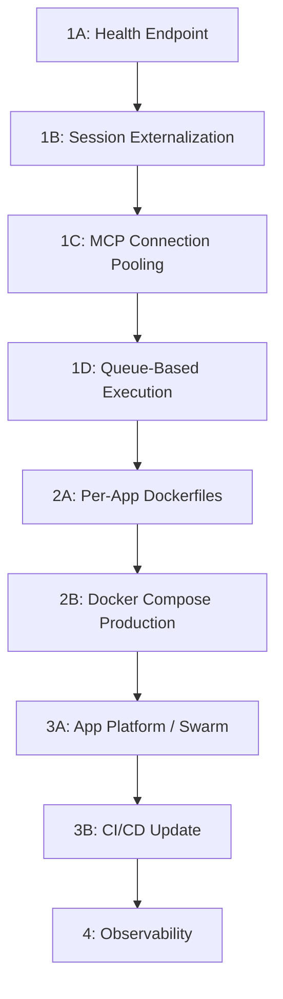

# Infrastructure Scaling: Gap 6

## Context

AgentC2 runs on a single Digital Ocean droplet (32GB RAM, 8 vCPUs, $96/mo) with PM2 for process management. This works for current scale but creates a ceiling:

- No horizontal scaling (single server handles all traffic)
- No auto-recovery beyond PM2 restart
- MCP server connections consume memory proportional to active organizations
- Long-running agent executions (200+ steps) hold HTTP connections open
- No multi-region deployment
- Deployment requires SSH and causes brief downtime

**Current architecture:**

```
Internet → Caddy (reverse proxy, TLS) → PM2 → {frontend:3000, agent:3001, admin:3003}
                                          ↓
                                    PostgreSQL (Supabase)
                                    Upstash Redis (rate limiting)
                                    Inngest (background jobs)
```

**Target architecture:**

```
Internet → Load Balancer (DO/Cloudflare)
            ↓
    ┌───────┼───────┐
    ↓       ↓       ↓
  Agent   Agent   Agent    (auto-scaled containers)
  Pod 1   Pod 2   Pod 3
    ↓       ↓       ↓
    └───────┼───────┘
            ↓
    PostgreSQL (Supabase)
    Redis (session, cache, rate-limit)
    Inngest Cloud (background jobs)
    MCP Pool (connection manager)
```

---

## Phase 1: Multi-Instance Readiness (No infrastructure change)

These changes make the app safe to run as multiple instances behind a load balancer, while still deployable on the current single server.

### 1A. Health Endpoint

Create [apps/agent/src/app/api/health/route.ts](apps/agent/src/app/api/health/route.ts):

```typescript
export async function GET() {
    const checks = {
        status: "ok",
        timestamp: new Date().toISOString(),
        uptime: process.uptime(),
        checks: {
            database: await checkDatabase(),
            redis: await checkRedis(),
            memory: checkMemory()
        }
    };

    const healthy = Object.values(checks.checks).every((c) => c.status === "ok");
    return Response.json(checks, { status: healthy ? 200 : 503 });
}
```

Three sub-checks:

- **Database**: `SELECT 1` query via Prisma with 5s timeout
- **Redis**: Upstash Redis PING (if configured) or skip
- **Memory**: `process.memoryUsage()` -- warn if RSS > 80% of limit

Also create a minimal `/api/health/live` (liveness probe -- always returns 200 if the process is running) and `/api/health/ready` (readiness probe -- checks database connectivity).

Add the health route to the public routes list in proxy middleware so it's not blocked by auth.

### 1B. Externalize Session State

**Current state**: Better Auth sessions are stored in PostgreSQL (already external -- good). But `apps/agent/src/lib/rate-limit.ts` has an in-memory fallback when Upstash is not configured:

```typescript
// Current: in-memory fallback
const memoryStore = new Map<string, { count: number; resetAt: number }>();
```

**Change**: Make Upstash Redis required in production. Add a startup check:

```typescript
if (process.env.NODE_ENV === "production" && !process.env.UPSTASH_REDIS_REST_URL) {
    console.warn(
        "[RateLimit] UPSTASH_REDIS_REST_URL not set. In-memory rate limiting will not work correctly with multiple instances."
    );
}
```

Also check for any other in-memory state that would break with multiple instances:

- `compressionCache` in `managed-generate.ts` -- per-instance is fine (cache miss just re-compresses)
- `cachedMcpToolsByOrg` in `tools/registry.ts` -- per-instance is fine (cache miss re-fetches)
- MCP client instances in `mcp/client.ts` -- see section 1D

### 1C. MCP Connection Pooling

**Problem**: Each organization gets its own MCP client instances. With N orgs and M MCP servers each, that's N\*M long-lived child processes consuming memory. On a single server with 32GB, this scales to ~50-100 orgs before memory pressure. With multiple instances, each instance would create its own set.

**Solution**: Add connection limits and idle cleanup to [packages/agentc2/src/mcp/client.ts](packages/agentc2/src/mcp/client.ts):

```typescript
const MAX_MCP_CLIENTS_PER_INSTANCE = 20;
const MCP_CLIENT_IDLE_TIMEOUT_MS = 10 * 60 * 1000; // 10 minutes
```

1. Track last-used timestamp per MCP client
2. Run a periodic cleanup (every 5 minutes) that disconnects clients idle for > 10 minutes
3. When creating a new client would exceed the limit, evict the least-recently-used client
4. Log connection pool metrics (active clients, evictions, cache hits/misses)

### 1D. Queue-Based Agent Execution

**Problem**: Long-running agent executions (invoke route with 200 max steps) hold an HTTP connection open for minutes. This ties up a server thread and is vulnerable to timeouts.

**Current state**: The invoke route already has an async mode via Inngest:

```typescript
// apps/agent/src/app/api/agents/[id]/invoke/route.ts
if (executionMode === "async") {
    await inngest.send({ name: "agent/run.execute", data: { ... } });
    return NextResponse.json({ runId, status: "queued" });
}
```

**Change**: Make async the default for runs with `maxSteps > 20`. The client polls for completion or receives a webhook callback.

Update [apps/agent/src/app/api/agents/[id]/invoke/route.ts](apps/agent/src/app/api/agents/[id]/invoke/route.ts):

```typescript
const ASYNC_THRESHOLD = 20;
const effectiveMode = executionMode || (effectiveMaxSteps > ASYNC_THRESHOLD ? "async" : "sync");
```

This ensures long-running executions don't hold HTTP connections, making the system safe for load balancer timeouts (typically 60-120s) and enabling horizontal scaling without sticky sessions.

---

## Phase 2: Containerization

### 2A. Per-App Dockerfiles

The existing `Dockerfile` is a monolith that builds everything. Create per-app Dockerfiles for independent scaling:

`**apps/agent/Dockerfile**`:

```dockerfile
FROM oven/bun:1.3.4-debian AS base

# Install system deps (Playwright, etc.)
FROM base AS deps
WORKDIR /app
COPY package.json bun.lock turbo.json ./
COPY packages/ packages/
COPY apps/agent/package.json apps/agent/
RUN bun install --frozen-lockfile

FROM deps AS builder
COPY . .
RUN bun run db:generate
RUN bunx turbo build --filter=agent

FROM base AS runner
WORKDIR /app
COPY --from=builder /app/apps/agent/.next/standalone ./
COPY --from=builder /app/apps/agent/.next/static ./apps/agent/.next/static
COPY --from=builder /app/apps/agent/public ./apps/agent/public

EXPOSE 3001
HEALTHCHECK --interval=30s --timeout=5s CMD curl -f http://localhost:3001/api/health/live || exit 1
CMD ["bun", "run", "apps/agent/server.js"]
```

Similar Dockerfiles for `apps/frontend/Dockerfile` and `apps/admin/Dockerfile` (if applicable).

### 2B. docker-compose.production.yml

```yaml
services:
    agent:
        build:
            context: .
            dockerfile: apps/agent/Dockerfile
        deploy:
            replicas: 2
            resources:
                limits:
                    memory: 4G
                    cpus: "2"
        ports:
            - "3001"
        healthcheck:
            test: ["CMD", "curl", "-f", "http://localhost:3001/api/health/live"]
            interval: 30s
            timeout: 5s
            retries: 3
        env_file: .env
        restart: unless-stopped

    frontend:
        build:
            context: .
            dockerfile: apps/frontend/Dockerfile
        deploy:
            replicas: 1
            resources:
                limits:
                    memory: 2G
        ports:
            - "3000"
        env_file: .env
        restart: unless-stopped

    caddy:
        image: caddy:2-alpine
        ports:
            - "80:80"
            - "443:443"
        volumes:
            - ./apps/caddy/Caddyfile.production:/etc/caddy/Caddyfile
            - caddy_data:/data
        depends_on:
            agent:
                condition: service_healthy
            frontend:
                condition: service_started

volumes:
    caddy_data:
```

Update the Caddyfile to use Docker service names instead of localhost:

```
reverse_proxy agent:3001
```

---

## Phase 3: Auto-Scaling Deployment

### 3A. DigitalOcean App Platform Spec

Create `.do/app.yaml`:

```yaml
name: agentc2
region: nyc
services:
    - name: agent
      dockerfile_path: apps/agent/Dockerfile
      instance_count: 2
      instance_size_slug: professional-m
      http_port: 3001
      health_check:
          http_path: /api/health/ready
          initial_delay_seconds: 30
          period_seconds: 10
      autoscaling:
          min_instance_count: 2
          max_instance_count: 8
          metrics:
              - cpu:
                    percent: 70
      envs:
          - key: DATABASE_URL
            type: SECRET
          - key: OPENAI_API_KEY
            type: SECRET
          # ... other env vars

    - name: frontend
      dockerfile_path: apps/frontend/Dockerfile
      instance_count: 1
      instance_size_slug: professional-s
      http_port: 3000

    - name: inngest-worker
      dockerfile_path: apps/agent/Dockerfile
      instance_count: 1
      instance_size_slug: professional-m
      # No http_port -- runs as worker only
```

**Alternative**: If staying on the droplet, use Docker Swarm (already available on Docker Engine) for basic horizontal scaling:

```bash
docker swarm init
docker stack deploy -c docker-compose.production.yml agentc2
docker service scale agentc2_agent=3
```

### 3B. Update GitHub Actions

Update [.github/workflows/deploy-do.yml](.github/workflows/deploy-do.yml):

**Current**: SSH → git pull → bun install → build → pm2 restart
**New**: Build Docker images → Push to registry → Deploy with zero-downtime rolling update

```yaml
- name: Build and push images
  run: |
      docker build -t registry.digitalocean.com/agentc2/agent:${{ github.sha }} -f apps/agent/Dockerfile .
      docker push registry.digitalocean.com/agentc2/agent:${{ github.sha }}

- name: Deploy with rolling update
  run: |
      ssh $SERVER "cd /var/www/agentc2 && \
        docker service update --image registry.digitalocean.com/agentc2/agent:${{ github.sha }} agentc2_agent"
```

This gives zero-downtime deployments (rolling update replaces instances one at a time).

---

## Phase 4: Observability

### 4A. Structured Logging

Replace `console.log` with structured JSON logging throughout the codebase. Create a shared logger:

```typescript
// packages/agentc2/src/lib/logger.ts
export function log(
    level: "info" | "warn" | "error",
    message: string,
    data?: Record<string, unknown>
) {
    const entry = {
        level,
        message,
        timestamp: new Date().toISOString(),
        ...data
    };
    console[level === "error" ? "error" : "log"](JSON.stringify(entry));
}
```

This enables log aggregation tools (Datadog, Grafana Loki, etc.) to parse and index logs.

### 4B. Metrics Endpoint

Create [apps/agent/src/app/api/metrics/route.ts](apps/agent/src/app/api/metrics/route.ts) that exposes Prometheus-format metrics:

```
# HELP agentc2_active_mcp_clients Number of active MCP client connections
# TYPE agentc2_active_mcp_clients gauge
agentc2_active_mcp_clients 12

# HELP agentc2_agent_execution_duration_seconds Agent execution duration
# TYPE agentc2_agent_execution_duration_seconds histogram
agentc2_agent_execution_duration_seconds_bucket{le="1"} 45
agentc2_agent_execution_duration_seconds_bucket{le="5"} 120

# HELP agentc2_compression_cache_hits Semantic compression cache hit count
# TYPE agentc2_compression_cache_hits counter
agentc2_compression_cache_hits 342
```

Key metrics to track:

- Active MCP connections (gauge)
- Agent execution duration (histogram by agent slug)
- Token usage per step (counter)
- Compression cache hit rate (counter)
- Model routing decisions (counter by tier)
- RAG query latency (histogram by mode)
- Memory usage (gauge)

### 4C. Alerting

Add alert rules for:

- Health check failures (any sub-check returns non-ok)
- Memory usage > 80% of limit
- Agent execution error rate > 10%
- MCP connection pool exhaustion
- Database query latency > 5s

These can be configured via Grafana alerting, DigitalOcean monitoring, or a simple Slack webhook from the health endpoint.

---

## Implementation Order



**Phase 1** (multi-instance readiness) can be deployed to the current droplet immediately. No infrastructure change needed.

**Phase 2** (containerization) replaces PM2 with Docker. Can run on the same droplet initially.

**Phase 3** (auto-scaling) requires either DigitalOcean App Platform ($$$) or Docker Swarm (free on existing droplet).

**Phase 4** (observability) is independent and can be done at any point.

## Files Modified/Created (Summary)

| File                                                 | Changes                                         |
| ---------------------------------------------------- | ----------------------------------------------- |
| `apps/agent/src/app/api/health/route.ts`             | **NEW** -- Health endpoint with sub-checks      |
| `apps/agent/src/lib/rate-limit.ts`                   | Production Redis requirement warning            |
| `packages/agentc2/src/mcp/client.ts`                 | Connection pooling with idle cleanup and limits |
| `apps/agent/src/app/api/agents/[id]/invoke/route.ts` | Async default for long runs                     |
| `apps/agent/Dockerfile`                              | **NEW** -- Per-app Dockerfile                   |
| `apps/frontend/Dockerfile`                           | **NEW** -- Per-app Dockerfile                   |
| `docker-compose.production.yml`                      | **NEW** -- Production compose with replicas     |
| `.do/app.yaml`                                       | **NEW** -- DigitalOcean App Platform spec       |
| `.github/workflows/deploy-do.yml`                    | Container-based deployment                      |
| `packages/agentc2/src/lib/logger.ts`                 | **NEW** -- Structured JSON logger               |
| `apps/agent/src/app/api/metrics/route.ts`            | **NEW** -- Prometheus metrics endpoint          |
