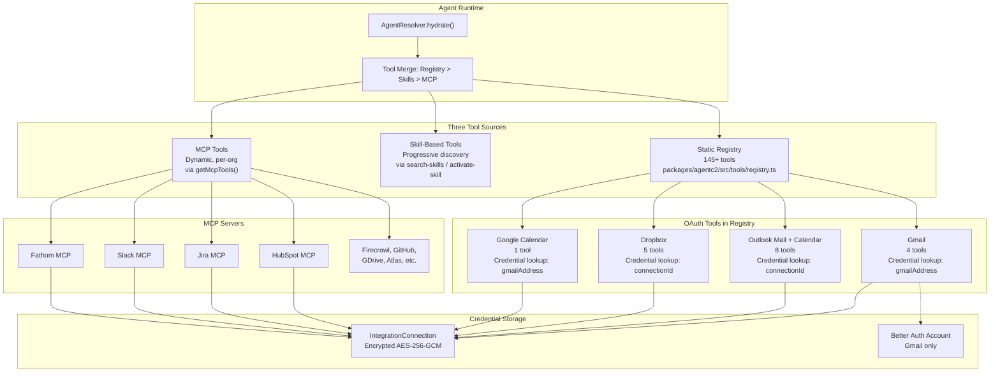

# Integration Architecture: Analysis and Implementation Options

## What Was Done (Recent Changes)

Four new OAuth tools were created to fix the "Tool not found" errors blocking the email-triage agent:

- `gmail-search-emails` ([packages/agentc2/src/tools/gmail/search-emails.ts](packages/agentc2/src/tools/gmail/search-emails.ts)) - Search Gmail using Gmail query syntax
- `gmail-read-email` ([packages/agentc2/src/tools/gmail/read-email.ts](packages/agentc2/src/tools/gmail/read-email.ts)) - Read full email content by message ID
- `gmail-draft-email` ([packages/agentc2/src/tools/gmail/draft-email.ts](packages/agentc2/src/tools/gmail/draft-email.ts)) - Create drafts for human review
- `google-calendar-search-events` ([packages/agentc2/src/tools/google-calendar/search-events.ts](packages/agentc2/src/tools/google-calendar/search-events.ts)) - Search calendar events

A shared OAuth helper module was extracted: [packages/agentc2/src/tools/gmail/shared.ts](packages/agentc2/src/tools/gmail/shared.ts)

All tools were registered in [packages/agentc2/src/tools/registry.ts](packages/agentc2/src/tools/registry.ts) and `calendar.readonly` scope was added to [apps/agent/src/lib/gmail.ts](apps/agent/src/lib/gmail.ts).

**Result**: 7 of 8 enrichment tool calls now succeed. Google Calendar returns 403 because the existing OAuth token lacks the newly added `calendar.readonly` scope (requires re-authorization).

---

## System Architecture Overview



---

## Underlying Issues (Ranked by Severity)

### Issue 1: Two Parallel Tool Systems With No Unified Resolution

MCP tools and OAuth tools follow completely different lifecycles:

- **MCP tools** are dynamic, loaded per-organization from external servers, and only appear when connections are active
- **OAuth tools** are static, hardcoded in the registry, and always appear regardless of connection status

This means an agent can be configured with `gmail-draft-email` even when no Gmail OAuth connection exists. The tool will fail at runtime with a cryptic database error rather than being filtered out at configuration time.

**Impact**: Agents with OAuth tools attached will crash if the organization hasn't connected that integration. No guardrails exist.

### Issue 2: Gmail OAuth Is Fundamentally Different From All Other OAuth Providers

| Aspect            | Gmail                                                          | Microsoft / Dropbox                        |
| ----------------- | -------------------------------------------------------------- | ------------------------------------------ |
| Initial Auth      | Better Auth (piggybacked on sign-in)                           | Standalone PKCE flow                       |
| Credential Source | Better Auth `Account` table, synced to `IntegrationConnection` | Directly stored in `IntegrationConnection` |
| Credential Lookup | By `gmailAddress` (requires GmailIntegration model)            | By `connectionId` (direct)                 |
| Multi-tenant      | Hardcoded defaults (`corey@useappello.com`)                    | Uses `connectionId` from agent context     |
| Scope Management  | Tied to Better Auth sign-in                                    | Independent OAuth scopes                   |

Gmail's reliance on Better Auth means:

- Adding new scopes (like `calendar.readonly`) requires the user to re-sign-in through Better Auth
- No way to add Google Calendar as a separate integration with separate consent
- The `GmailIntegration` model creates an unnecessary dependency chain: `Agent -> GmailIntegration -> Workspace -> Organization -> IntegrationConnection`

### Issue 3: Google Calendar Is Bolted Onto Gmail OAuth

The new `google-calendar-search-events` tool reuses Gmail's `getAccessToken()`, which looks up credentials via the Gmail provider (`key: "gmail"`). This means:

- Calendar only works if Gmail is connected
- Calendar scopes are embedded in Gmail's scope list
- No independent Google Calendar integration provider exists in `INTEGRATION_PROVIDER_SEEDS`
- UI shows no "Google Calendar" option in the integrations hub
- Users can't connect Google Calendar without also connecting Gmail

### Issue 4: No Multi-Tenant Credential Resolution for OAuth Tools

The new Gmail tools default to `corey@useappello.com`:

```typescript
gmailAddress: z.string().email().default("corey@useappello.com");
```

The Outlook/Dropbox tools solve this properly by requiring a `connectionId` parameter. The Gmail tools need to resolve credentials via organizational context, not hardcoded email addresses.

For production multi-tenant use, every OAuth tool must resolve credentials through the agent's organizational context, not through user-specific parameters.

### Issue 5: OAuth Tools Don't Check Connection Status

MCP tools are inherently gated by connection status (no connection = no server = no tools). OAuth tools in the registry are always present. There's no mechanism to:

- Filter OAuth tools by active connections in the agent configuration UI
- Validate at agent save time that required connections exist
- Show clear errors when an agent has OAuth tools but no active connection

### Issue 6: No Shared OAuth Tool Base Pattern

Each OAuth integration implements credential resolution independently:

- Gmail: `getAccessToken()` in `shared.ts` via `GmailIntegration -> workspace -> org -> IntegrationConnection`
- Outlook: Inline `callGraph()` in each tool file with direct `IntegrationConnection` lookup
- Dropbox: Inline `callDropboxApi()` with direct `IntegrationConnection` lookup

There's no shared utility for "resolve OAuth credentials for a tool execution given the agent's organizational context."

### Issue 7: Scope Upgrade Detection and Re-authorization

When new scopes are added (e.g., `calendar.readonly` to Gmail), there's no mechanism to:

- Detect that the stored token has insufficient scopes
- Prompt the user to re-authorize
- Gracefully degrade when scopes are missing
- Track which scopes each connection has authorized

The status endpoint checks scopes, but there's no proactive notification.

---

## Implementation Options

### Option A: Unified OAuth Tool Factory (Recommended for Near-Term)

Create a shared `createOAuthTool()` factory that standardizes credential resolution for all OAuth tools:

```typescript
// packages/agentc2/src/tools/oauth-tool-factory.ts
export function createOAuthTool<TInput, TOutput>({
    id, description, providerKey, inputSchema, outputSchema,
    execute: (params: TInput, credentials: OAuthCredentials) => Promise<TOutput>
}) {
    return createTool({
        id, description, inputSchema: inputSchema.extend({
            connectionId: z.string().optional()
                .describe("IntegrationConnection ID (resolved from agent context if omitted)")
        }),
        outputSchema,
        execute: async (input, context) => {
            const creds = await resolveOAuthCredentials({
                providerKey,
                connectionId: input.connectionId,
                organizationId: context?.organizationId
            });
            return execute(input, creds);
        }
    });
}
```

**Pros**: Minimal refactor, standardizes credential resolution, works with existing architecture.
**Cons**: Still two parallel systems (MCP vs OAuth), doesn't solve UI filtering.
**Effort**: Medium (3-5 days). Refactor existing tools + create factory.

### Option B: Google OAuth Provider Split

Separate Gmail and Google Calendar into distinct integration providers:

- Add `google-calendar` to `INTEGRATION_PROVIDER_SEEDS` with `providerType: "oauth"`
- Create `/api/integrations/google-calendar/start`, `/callback`, `/status` routes
- Use standalone PKCE OAuth flow (like Microsoft/Dropbox) instead of Better Auth
- Each provider requests only its own scopes
- Google Calendar tools resolve credentials via `google-calendar` provider

**Pros**: Clean separation of concerns, independent connection management, users can connect Calendar without Gmail.
**Cons**: Users may need to authorize Google twice (once for Gmail, once for Calendar). Can mitigate with shared Google OAuth client.
**Effort**: Medium (2-3 days). New provider + routes + update tools.

### Option C: Migrate Gmail to Standalone PKCE (Like Microsoft/Dropbox)

Remove Gmail's dependency on Better Auth and use a standalone PKCE OAuth flow:

- Create `/api/integrations/gmail/start`, `/callback` routes (PKCE)
- Remove the Better Auth sync flow
- Gmail tools use `connectionId` lookup (like Outlook)
- Keep `GmailIntegration` model for webhook management only

**Pros**: Consistent pattern across all OAuth providers, simpler credential resolution, supports multi-tenant properly.
**Cons**: Breaking change - existing Gmail connections need migration. Users must re-authorize.
**Effort**: High (5-7 days). Migration + test + backward compatibility.

### Option D: OAuth Tool Availability Gating

Add connection-aware tool availability to the agent configuration:

- At agent configuration time, check if required OAuth connections exist for the organization
- In the tools UI, gray out OAuth tools when no connection is active
- At agent runtime, validate OAuth tool availability before hydration
- Return clear errors: "Gmail connection required for gmail-search-emails"

**Pros**: Prevents misconfiguration, better UX, clear error messages.
**Cons**: Doesn't fix the underlying architecture, just adds guardrails.
**Effort**: Low-Medium (2-3 days). UI changes + runtime validation.

### Option E: Full Unification - OAuth-as-MCP

Long-term: wrap all OAuth integrations as lightweight MCP servers that only load when connections are active:

- Create an in-process MCP adapter that exposes OAuth tools as MCP tools
- OAuth tools get the same lifecycle as MCP tools (connection-gated, org-scoped, dynamic loading)
- Eliminates the two-track system entirely
- Tools named consistently: `gmail_search-emails`, `google-calendar_search-events`

**Pros**: Single unified tool system, consistent naming, connection-gated availability, clean architecture.
**Cons**: Significant refactor, may impact performance (MCP overhead for local tools), complex migration.
**Effort**: High (2-3 weeks). Full architectural change.

---

## Recommended Implementation Path

**Phase 1 (Immediate - 1-2 days)**: Option D (Availability Gating) + fix multi-tenant defaults

- Remove hardcoded `corey@useappello.com` defaults from Gmail tools
- Add `connectionId` or organizational context resolution to Gmail tools
- Add runtime validation for OAuth tool availability

**Phase 2 (Short-term - 3-5 days)**: Option B (Google OAuth Provider Split) + Option A (OAuth Tool Factory)

- Split Google Calendar into its own provider with standalone PKCE
- Create `createOAuthTool()` factory for standardized credential resolution
- Refactor existing OAuth tools to use the factory

**Phase 3 (Medium-term - 1-2 weeks)**: Option C (Migrate Gmail to Standalone PKCE)

- Align Gmail with Microsoft/Dropbox pattern
- Remove Better Auth dependency for Gmail
- Support multi-account Gmail connections per organization

**Phase 4 (Long-term)**: Option E (OAuth-as-MCP)

- Unify all tools under single MCP-like lifecycle
- Connection-gated availability for all tool types

---

## Immediate Action Required

**Google Calendar re-authorization**: The existing Gmail OAuth token lacks the `calendar.readonly` scope added in this session. To enable Google Calendar search:

1. Navigate to the platform integrations page
2. Disconnect and reconnect Gmail
3. The new consent screen will request calendar permissions
4. After reconnection, `google-calendar-search-events` will work

This is a one-time action caused by scope expansion. Phase 2 (separate Google Calendar provider) eliminates this coupling.
