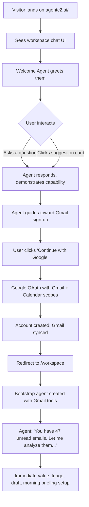
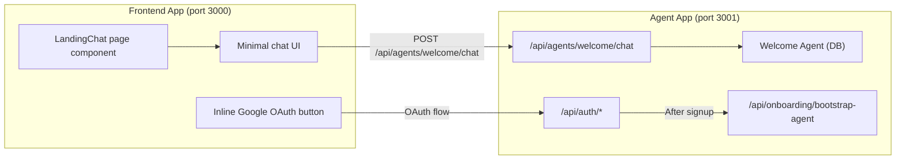

# Interactive Landing Page: Product-as-Homepage

## Concept Analysis

The core idea: **the product IS the landing page**. Instead of a traditional marketing page with hero sections and feature grids, visitors land directly in the workspace chat interface and immediately interact with an AI agent. The agent demonstrates value, then guides users to sign up with Google -- granting Gmail access in one click. Upon sign-up, the agent immediately starts analyzing their inbox.

### User Journey

### Why This Works (Technical Feasibility)

Three existing capabilities make this almost plug-and-play:

1. **Chat API is already public** -- `/api/agents/[id]/chat` has no auth checks. Any visitor can chat with any agent without being logged in. The proxy middleware excludes all `/api/*` routes.
2. **Google OAuth already requests Gmail scopes** -- The sign-in form already calls `signIn.social()` with `gmail.modify`, `gmail.send`, and `calendar.readonly` scopes. Sign-up = Gmail access in one click.
3. **Gmail auto-sync on login** -- The `GmailSyncOnLogin` component in `AppProvidersWrapper` already syncs Gmail tokens to `IntegrationConnection` on every login. Combined with the bootstrap agent flow, Gmail tools are ready instantly.

---

## Architecture

### Routing (via Caddy)

No changes to Caddy routing needed. The current setup already works:

- `agentc2.ai/` --> Caddy --> frontend app (port 3000) -- renders the chat UI page
- Chat UI calls `POST /api/agents/welcome/chat` --> Caddy --> agent app (port 3001) -- processes chat
- `agentc2.ai/workspace` --> Caddy --> agent app -- full authenticated workspace

API calls from the frontend at `/` go to `/api/...` paths, which Caddy routes to the agent app. Same domain = no CORS issues.

### Component Architecture

---

## Implementation Details

### 1. Welcome Agent (Database Record)

Create a SYSTEM agent in the database with slug `welcome`. This agent is purpose-built for the landing page:

**Key design principles:**

- No tools (pure conversational, no data access for anonymous users)
- Personality: warm, concise, capability-focused
- Knows about all platform features (email triage, workflows, networks, integrations)
- Trained to naturally guide conversations toward "Want me to try this on your email?"
- Has demo examples baked into instructions (e.g., "Here's what an email triage looks like...")

**Instructions outline:**

- Greet the visitor warmly, ask what brought them here
- When they ask "what can you do?" -- show concrete examples
- When they express interest in email -- pivot to "I can do that right now, just sign in with Google"
- Handle objections (privacy, data access, pricing) conversationally
- If they ask about pricing/features -- answer directly (no deflection)
- Never hallucinate capabilities -- stick to what the platform actually does

### 2. Landing Page Replacement

Replace [apps/frontend/src/app/page.tsx](apps/frontend/src/app/page.tsx) and [apps/frontend/src/app/landing-page.tsx](apps/frontend/src/app/landing-page.tsx) with a new `LandingChat` component.

**UI design:**

- Full viewport height (`h-dvh`), dark theme matching the workspace
- No header navigation, no sidebar, no footer -- just the chat
- Centered input at the bottom (same `PromptInput` style as workspace)
- Small, subtle branding top-left (AgentC2 logo)
- Minimal "Log in" text link top-right for returning users
- Greeting area above the input with:
    - Agent avatar/icon
    - "Hi, I'm C2. Ask me anything." (or similar)
    - 3-4 suggestion chips: "What can you do?", "Help with my email", "Set up a morning briefing", "Show me integrations"

**What it does NOT have** (vs the full workspace):

- No conversation sidebar
- No agent selector / model selector / thinking toggle
- No conversation history persistence
- No mode dropdown (Ask/Agent/Plan)
- No file upload, voice input, or action menu

**Technical approach:**

- Lightweight client component using `useChat` from `@ai-sdk/react` with `DefaultChatTransport`
- API endpoint: `/api/agents/welcome/chat` (routed through Caddy to agent app)
- Thread ID: ephemeral, generated on page load (no persistence)
- When agent suggests sign-up, render an inline CTA button in the chat

### 3. Inline Sign-Up CTA

The Welcome Agent's response will include a special marker (via a custom data part or a recognized pattern) that triggers the frontend to render a "Continue with Google" button inline in the chat.

**Two approaches (recommend Approach A):**

**Approach A: Pattern-based** -- The agent includes a specific phrase like `[SIGNUP_CTA]` in its response. The chat renderer detects this and replaces it with a styled Google OAuth button. Simple, no backend changes needed.

**Approach B: Tool-based** -- The agent has a `show_signup_cta` tool that, when called, streams a custom data part to the frontend. The frontend renders the CTA when it receives this part. More elegant but requires a custom tool.

**CTA button behavior:**

- Calls `signIn.social({ provider: "google", callbackURL: "/workspace?firstRun=true", scopes: GMAIL_SCOPES })`
- This creates the account + grants Gmail access in one step
- Redirect to `/workspace?firstRun=true` triggers the bootstrap agent flow

### 4. Post-Signup Immediate Value

After Google OAuth, the user lands at `/workspace?firstRun=true`. The existing onboarding bootstrap flow handles agent creation. However, we should optimize for the "instant gratification" moment:

**Option A: Skip traditional onboarding entirely** -- Detect `?firstRun=true`, auto-bootstrap the agent with Gmail tools, and immediately start a conversation: "Welcome back! I've connected to your Gmail. Let me take a look at your inbox..."

**Option B: One-screen onboarding** -- Brief "Welcome! I've connected your Gmail. Want me to also connect Slack?" with a Skip button. Then straight to the workspace.

The bootstrap agent already creates a personalized `"{Name}'s Assistant"` with Gmail tools when `connectedIntegrations` includes `gmail` (see [apps/agent/src/app/api/onboarding/bootstrap-agent/route.ts](apps/agent/src/app/api/onboarding/bootstrap-agent/route.ts)).

### 5. Preserving the Marketing Page

The current landing page content (features, pricing, FAQ, etc.) should still be accessible for SEO and reference. Options:

- Move to `/about` or `/features`
- Or let the Welcome Agent answer those questions conversationally (the agent knows about pricing, features, etc.)
- Keep `/privacy`, `/terms`, `/security` as standalone pages

---

## Key Technical Risks and Mitigations

| Risk                                                  | Mitigation                                                                                                                            |
| ----------------------------------------------------- | ------------------------------------------------------------------------------------------------------------------------------------- |
| Abuse of public chat API (spam, token cost)           | Rate limit the `welcome` agent: low `maxSteps` (3), low token budget, no tools. Use Caddy rate limiting or a simple IP-based limiter. |
| Agent gives wrong information                         | Carefully crafted instructions with explicit guardrails. No tools = no data leakage. Regular review of conversation logs.             |
| Google OAuth failure mid-flow                         | Graceful fallback: "Something went wrong. You can also sign up with email at /signup"                                                 |
| Chat feels slow on first load                         | Preload the chat API connection. Use streaming (already supported). Keep welcome agent on a fast model (gpt-4o-mini).                 |
| Returning users see landing chat instead of workspace | Frontend page already redirects authenticated users to `/workspace` (existing behavior).                                              |
| Mobile responsiveness                                 | The workspace chat UI is already responsive. The landing version with fewer elements will be simpler.                                 |

---

## Files to Create/Modify

### New files:

- `apps/frontend/src/app/landing-chat.tsx` -- New landing page chat component
- `apps/frontend/src/components/landing/suggestion-chips.tsx` -- Suggestion chip buttons
- `apps/frontend/src/components/landing/inline-signup-cta.tsx` -- Inline Google OAuth CTA
- Database seed/migration for the `welcome` agent record

### Modified files:

- [apps/frontend/src/app/page.tsx](apps/frontend/src/app/page.tsx) -- Replace `LandingPage` with `LandingChat` for unauthenticated users
- [apps/frontend/src/app/layout.tsx](apps/frontend/src/app/layout.tsx) -- Ensure dark theme support, no extra chrome
- [apps/agent/src/app/api/agents/[id]/chat/route.ts](apps/agent/src/app/api/agents/[id]/chat/route.ts) -- Optional: add rate limiting for the `welcome` agent slug

### Preserved files (moved, not deleted):

- [apps/frontend/src/app/landing-page.tsx](apps/frontend/src/app/landing-page.tsx) -- Move to `/about` or keep as fallback

---

## Open Questions for You

Before implementation, a few decisions that shape the approach significantly:

1. **Traditional landing page fate** -- Should we move the existing marketing page to `/about` (or similar), or drop it entirely and let the agent handle all questions about pricing/features?
2. **Welcome Agent model** -- Use `gpt-4o-mini` (faster, cheaper, good for simple conversations) or `gpt-4o` (smarter, better at nuanced conversation)? Given this is high-volume anonymous traffic, cost matters.
3. **Post-signup flow** -- Skip onboarding entirely (auto-bootstrap + straight to workspace) or show a brief one-screen onboarding ("Also connect Slack?")?
