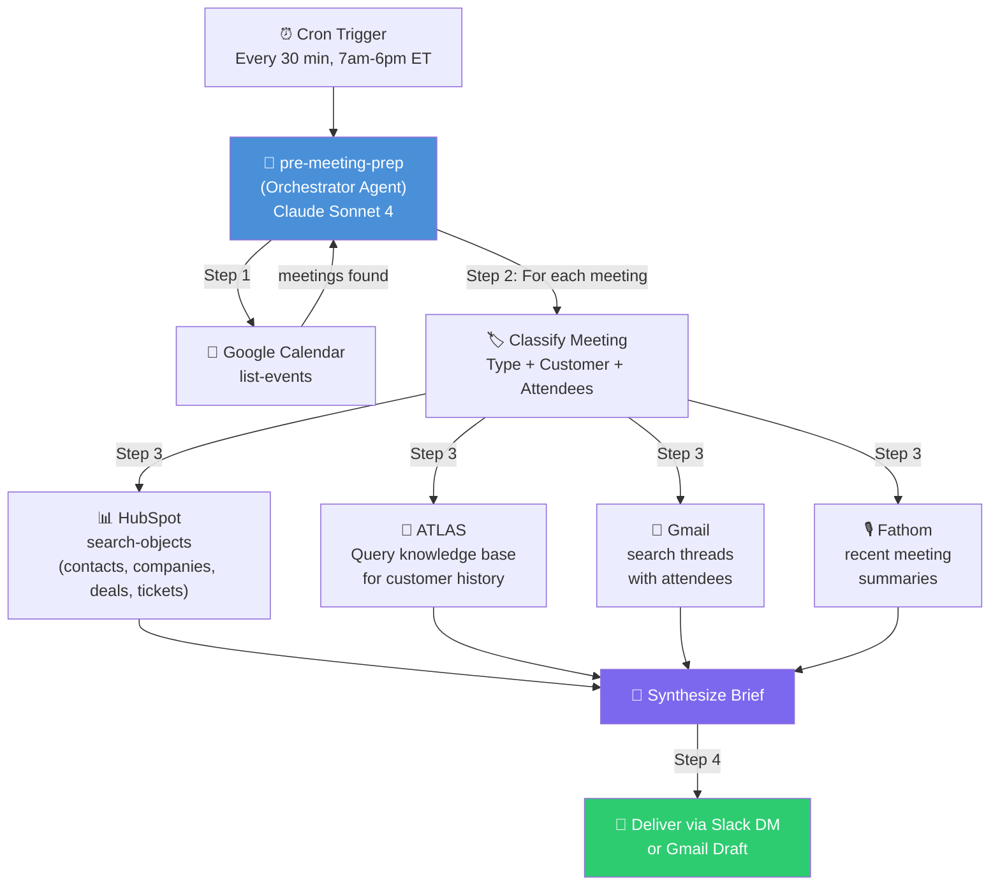
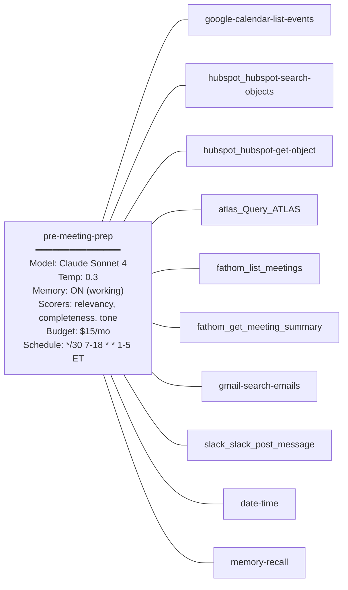

# Plan: Pre-Meeting Prep Agent

## Section 1: Situation

### Problem

Appello's team (Corey, Nathan on sales; Travis, Ian on onboarding/support) enters customer meetings with inconsistent preparation. Before each call, they manually:

1. Search HubSpot for deal/ticket history and contact details
2. Scan Gmail for recent email threads with the customer
3. Try to recall what was discussed in the last meeting (Fathom recordings exist but aren't reviewed)
4. Check Google Calendar for meeting context and attendees
5. Look up company details and org structure

This takes **15-30 minutes per meeting** when done properly, so it's often skipped or done superficially. This leads to missed context, repeated questions, and lost momentum in sales cycles and onboarding journeys.

### Best-in-Class Benchmarks

| Product | Key Innovation | Relevance to Appello |
|---------|---------------|---------------------|
| **Sybill** | Auto-briefs from calendar + CRM + past calls; meeting-type customization; MEDDPICC/BANT field extraction | Establishes the gold standard for sales prep |
| **Sailer** | 30-second pre-meeting briefings; generates personalized research 30 min before calls; saves 5+ hrs/week | Proves the trigger-based model (calendar event → brief) |
| **CAIO/Claude** | One-page strategic briefings: attendees, relationship history, objections, strategic questions | Shows the value of deep contextual analysis, not just data dump |

**What we're building is better** because we have access to Appello's *actual* internal data: HubSpot CRM, ATLAS knowledge base (729+ meetings), Fathom recordings, Gmail, Google Calendar, and Google Drive — not just LinkedIn/Crunchbase scraping.

### Existing Platform Assets

| Agent | Data Source | Status | Tools |
|-------|-----------|--------|-------|
| (none relevant) | — | — | — |

| Integration | Provider Key | Status | Missing |
|------------|-------------|--------|---------|
| Google Calendar | `google-calendar` | **Connected** | Nothing |
| Gmail | `gmail` | **Connected** | Nothing |
| Google Drive | `google-drive` | **Connected** | Nothing |
| HubSpot | `hubspot` | **Disconnected** | `HUBSPOT_ACCESS_TOKEN` |
| Fathom | `fathom` | **Disconnected** | `FATHOM_API_KEY` |
| ATLAS | `atlas` | **Disconnected** | `ATLAS_N8N_SSE_URL` |
| Slack | `slack` | **Disconnected** | `SLACK_BOT_TOKEN`, `SLACK_TEAM_ID` |

---

## Section 2: Objective

Build a `pre-meeting-prep` agent that:

1. **Scans** — Queries Google Calendar for upcoming meetings within a configurable window (default: next 8 hours)
2. **Identifies** — Determines meeting type (sales demo, onboarding, support, internal) and the customer/company involved
3. **Gathers CRM context** — Pulls the full HubSpot profile: deal stage, pipeline position, associated tickets, recent notes, contact details, company properties
4. **Retrieves conversation history** — Queries ATLAS for the most relevant meeting transcripts and discussion context with this customer
5. **Checks recent comms** — Searches Gmail for the latest email threads with attendees
6. **Synthesizes a one-page brief** — Produces a structured, role-aware briefing document tailored to the user (sales brief for Corey/Nathan, onboarding brief for Travis/Ian)
7. **Delivers** — Posts the brief to the user via Slack DM (or email draft) 30 minutes before the meeting

The human receives a Slack message with a meeting brief that takes **30 seconds to read** and contains everything they need to walk in prepared.

---

## Section 3: How It Works

### Architecture Diagram



### Execution Flow

| Phase | Step | What Happens |
|-------|------|-------------|
| Trigger | 0 | Cron fires every 30 min during business hours (7am-6pm ET). Agent checks if it already briefed for upcoming meetings (dedup via working memory). |
| Gather | 1 | Query Google Calendar for events in the next 60-90 minutes. Filter out internal-only meetings, blocked time, and already-briefed meetings. |
| Classify | 2 | For each external meeting: determine meeting type (sales/onboarding/support/partner), extract customer name and company, identify attendees. Use calendar event title, description, and attendee domains. |
| Gather | 3a | HubSpot: Search contacts by attendee emails → get associated companies → get deals/tickets/notes for those companies. |
| Gather | 3b | ATLAS: Query with customer name + company name to retrieve relevant meeting history, decisions, blockers, and context. |
| Gather | 3c | Gmail: Search for recent threads with attendee email addresses (last 14 days). Extract subject lines and key content. |
| Gather | 3d | Fathom: List recent meetings, filter by customer name, get summaries of the last 2-3 meetings with this customer. |
| Synthesize | 4 | Merge all gathered context into a structured brief, tailored by meeting type and recipient role. |
| Deliver | 5 | Post brief to the meeting organizer's Slack DM. If Slack is unavailable, create a Gmail draft. |

### Why This Architecture

A **single agent with tools** (not a network or sub-agents) because:
- The task is deterministic and sequential (scan → gather → synthesize → deliver)
- All data sources are accessed via MCP tools on the same agent
- The synthesis step requires full context from all sources in one prompt
- No routing decisions needed — every meeting gets the same pipeline

### Agent Configuration Map



---

## Section 4: Pre-Requisites

| # | Item | Current State | Action Required |
|---|------|--------------|-----------------|
| P1 | HubSpot connection | Disconnected | Connect via `integration_connection_create` with `HUBSPOT_ACCESS_TOKEN` from `.env` |
| P2 | Fathom connection | Disconnected | Connect via `integration_connection_create` with `FATHOM_API_KEY` from `.env` |
| P3 | ATLAS connection | Disconnected | Connect via `integration_connection_create` with `ATLAS_N8N_SSE_URL` from `.env` |
| P4 | Slack connection | Disconnected | Connect via `integration_connection_create` with `SLACK_BOT_TOKEN` + `SLACK_TEAM_ID` from `.env` |
| P5 | Slack user IDs | Unknown | Look up Slack user IDs for Corey, Nathan, Travis, Ian to target DMs |
| P6 | HubSpot tool IDs | Unknown | After connecting, list tools to get exact tool IDs for search/get operations |
| P7 | Gmail tool IDs | Connected but need verification | Verify `gmail-search-emails` or equivalent exists |

**Fallback behavior:**
- If HubSpot is unavailable: Skip CRM section, note "CRM data unavailable" in brief
- If ATLAS is unavailable: Skip historical context, note "No historical context available"
- If Fathom is unavailable: Skip past meeting summaries
- If Slack is unavailable: Fall back to Gmail draft delivery
- If a meeting has no external attendees: Skip it (internal meeting)

---

## Section 5: Agent Specification

### 5.1 Identity

| Field | Value |
|-------|-------|
| **slug** | `pre-meeting-prep` |
| **name** | Pre-Meeting Prep |
| **description** | Scans upcoming calendar meetings, gathers CRM + historical + email context from HubSpot, ATLAS, Fathom, and Gmail, then synthesizes and delivers a one-page briefing via Slack 30 minutes before each meeting. |
| **type** | SYSTEM |

### 5.2 Model Configuration

| Field | Value | Rationale |
|-------|-------|-----------|
| **modelProvider** | `anthropic` | Best at nuanced synthesis and structured output |
| **modelName** | `claude-sonnet-4-20250514` | Strong reasoning for multi-source synthesis, cost-efficient for scheduled runs |
| **temperature** | `0.3` | Low creativity needed — factual synthesis with light strategic framing |
| **maxTokens** | `4096` | Briefs should be concise; 4K is plenty for a one-page brief |

### 5.3 Tools

| Tool ID | Purpose |
|---------|---------|
| `google-calendar-list-events` | Fetch upcoming calendar events |
| `hubspot_hubspot-search-objects` | Search HubSpot contacts, companies, deals, tickets by attendee email/company |
| `hubspot_hubspot-get-object` | Get full details on a specific HubSpot record |
| `atlas_Query_ATLAS` | Query ATLAS knowledge base for historical meeting context with this customer |
| `fathom_list_meetings` | List recent Fathom recordings to find past meetings with this customer |
| `fathom_get_meeting_summary` | Get AI summary of a past Fathom meeting |
| `gmail-search-emails` | Search Gmail for recent email threads with meeting attendees |
| `slack_slack_post_message` | Deliver the brief to the user's Slack DM |
| `date-time` | Get current date/time for scheduling logic |
| `memory-recall` | Check working memory for already-briefed meetings (dedup) |

### 5.4 Sub-Agents

None. Single agent with tools.

### 5.5 Memory

| Field | Value | Rationale |
|-------|-------|-----------|
| **memoryEnabled** | `true` | Track which meetings have been briefed to avoid duplicates |
| **memoryConfig** | `{"lastMessages": 20, "semanticRecall": false, "workingMemory": true}` | Working memory stores list of briefed meeting IDs for the day. No semantic recall needed. |

### 5.6 Evaluation Scorers

| Scorer | What It Measures | Target Score |
|--------|-----------------|-------------|
| `relevancy` | Brief content is relevant to the upcoming meeting | > 0.8 |
| `completeness` | Brief covers all required sections (attendees, history, context, questions) | > 0.8 |
| `tone` | Professional, concise, executive-ready tone | > 0.7 |

### 5.7 Instructions

```
You are the Pre-Meeting Prep agent for Appello. Your job is to prepare the team for upcoming customer meetings by gathering context from multiple sources and delivering a concise, actionable briefing.

## Process

1. **Check Calendar**: Use `google-calendar-list-events` to get meetings in the next 60-90 minutes. Today's date is {{currentDate}}.

2. **Filter Meetings**: Skip meetings that are:
   - Internal only (all attendees have @useappello.com or @agentc2.ai emails)
   - Already briefed (check working memory for meeting IDs you've already processed today)
   - Blocked time / focus time / personal events
   
3. **For each qualifying meeting**, determine the meeting type from the title and description:
   - **Sales** — contains words like "demo", "follow up", "pricing", "proposal", or involves a prospect not yet in onboarding
   - **Onboarding** — contains "onboarding", "kickoff", "setup", "training", or the HubSpot deal is in onboarding stage
   - **Support** — contains "support", "issue", "bug", or there are open HubSpot tickets
   - **Partner/Other** — anything else with external attendees

4. **Gather Context** (do all of these for each meeting):

   a. **HubSpot CRM**: Search for contacts by attendee email addresses. For each found contact:
      - Get their associated company
      - Get all deals for that company (note: stage, amount, close date)
      - Get recent tickets (last 30 days)
      - Get recent notes/activities
   
   b. **ATLAS Knowledge Base**: Query with: "[Company Name] [attendee names] recent discussions, decisions, blockers, and action items"
   
   c. **Gmail**: Search for emails from/to the attendee email addresses in the last 14 days. Note subject lines and any outstanding questions or commitments.
   
   d. **Fathom**: List recent meetings containing the company or attendee name. Get summaries of the 2 most recent.

5. **Synthesize the Brief** using this format:

---

### 📋 Meeting Brief: [Meeting Title]
**🕐 [Time] | 👥 [Attendee names] | 🏢 [Company] | 🏷️ [Type: Sales/Onboarding/Support]**

#### Relationship Snapshot
- **Deal Stage**: [stage] | **Value**: [$amount] | **Days in Stage**: [N]
- **Customer Since**: [date] or **Prospect Since**: [date]
- **Open Tickets**: [count] — [brief summary of most critical]
- **Last Meeting**: [date] — [1-sentence summary from Fathom]

#### Key Context
[3-5 bullet points synthesizing the most important things from ATLAS, Fathom, and Gmail. Focus on: recent decisions, outstanding commitments, unresolved issues, and any tension or risk signals.]

#### Recommended Talking Points
[3-4 strategic questions or topics to raise, based on the gathered context and meeting type]

#### Watch Out For
[1-2 potential landmines: overdue commitments, unresolved complaints, competitive threats, or context the team might have forgotten]

---

6. **Deliver**: Post the brief to the meeting organizer's Slack DM using `slack_slack_post_message`. If the organizer is:
   - Corey Shelson → DM Corey's Slack user ID
   - Nathan → DM Nathan's Slack user ID  
   - Travis → DM Travis's Slack user ID
   - Ian → DM Ian's Slack user ID
   - If organizer is unknown, post to a shared #meeting-prep channel

7. **Update Memory**: Store the meeting event ID in working memory so you don't brief for it again.

## Rules
- Briefs must be **under 300 words**. Concise is king.
- If a data source is unavailable, note it briefly and move on. Never let one failed tool call block the entire brief.
- Use the customer's name, not generic language.
- For sales meetings: emphasize deal momentum, competitive context, and buying signals.
- For onboarding meetings: emphasize setup progress, blockers, and next milestones.
- For support meetings: emphasize open tickets, severity, and resolution history.
- Never fabricate information. If you don't have context, say "No prior context found."
- Tone: Professional, direct, and warm. Like a chief of staff briefing an executive.
```

---

## Section 6: Governance

### 6.1 Budget

| Field | Value | Rationale |
|-------|-------|-----------|
| **monthlyLimitUsd** | $15 | ~20 runs/day × 22 business days × ~$0.03/run = ~$13/mo |
| **alertAtPct** | 80% | Alert at $12 spend |
| **hardLimit** | false | Don't block prep briefs — they're time-sensitive |
| **enabled** | true | Active immediately |

### 6.2 Guardrails

| Rule | Description |
|------|------------|
| No PII in logs | Never log full email content or personal phone numbers in brief output |
| No fabrication | If a data source returns no results, explicitly state "No data found" rather than inferring |
| Dedup enforcement | Never send more than one brief per meeting per person |
| Business hours only | Do not fire outside 7am-6pm ET Mon-Fri |

### 6.3 Schedule

| Field | Value |
|-------|-------|
| **name** | Pre-Meeting Prep — Business Hours |
| **cronExpr** | `*/30 11-22 * * 1-5` |
| **timezone** | `America/Toronto` |
| **input** | `Scan for upcoming meetings in the next 90 minutes. Today is {{currentDate}}. Prepare and deliver briefs for any qualifying external meetings.` |
| **isActive** | true |

*Note: Cron is in UTC. `11-22 UTC` = `7am-6pm ET` (during EDT). Adjust for EST (+1 hour) if needed.*

---

## Section 7: Network

Not applicable for this agent. It operates as a standalone scheduled system agent.

Future consideration: Add `pre-meeting-prep` as a primitive in a "Meeting Intelligence" network alongside the post-meeting agent, so users can query ad-hoc ("prepare me for my next call with Rival").

---

## Section 8: Implementation Approach

| What We Do | MCP Tool | What We Do NOT Do |
|-----------|---------|-------------------|
| Connect HubSpot | `integration_connection_create` | No `.env` edits or code changes |
| Connect Fathom | `integration_connection_create` | No Prisma / SQL |
| Connect ATLAS | `integration_connection_create` | No code changes |
| Connect Slack | `integration_connection_create` | No code changes |
| Create agent | `agent_create` | No database writes |
| Verify agent | `agent_read` | No database queries |
| Set budget | `agent_budget_update` | No schema edits |
| Set guardrails | `agent_guardrails_update` | No code-level guards |
| Create schedule | `agent_schedule_create` | No Inngest edits |
| Test agent | Invoke via sync endpoint | No manual curl |
| Inspect runs | `agent_runs_list` / `agent_run_trace` | No reading DB tables |
| Create test cases | `agent_test_cases_create` | No test files |
| Run evaluations | `agent_evaluations_run` | No `bun test` |

---

## Section 9: Implementation Steps

### Phase A: Pre-Requisites

1. **Connect HubSpot**: `integration_connection_create` with provider key `hubspot`, credentials `{HUBSPOT_ACCESS_TOKEN: "..."}` sourced from `.env`
2. **Connect Fathom**: `integration_connection_create` with provider key `fathom`, credentials `{FATHOM_API_KEY: "..."}` sourced from `.env`
3. **Connect ATLAS**: `integration_connection_create` with provider key `atlas`, credentials `{ATLAS_N8N_SSE_URL: "..."}` sourced from `.env`
4. **Connect Slack**: `integration_connection_create` with provider key `slack`, credentials `{SLACK_BOT_TOKEN: "...", SLACK_TEAM_ID: "..."}` sourced from `.env`
5. **Verify all connections**: `integration_connections_list` — confirm all 4 new connections show `isActive: true`
6. **Discover tool IDs**: After connecting, list available tools for each provider to confirm exact tool ID format
7. **Look up Slack user IDs**: Use Slack tools to find user IDs for Corey, Nathan, Travis, Ian
8. **Verify Google Calendar tools**: Confirm `google-calendar-list-events` returns upcoming events

### Phase B: Agent Creation

1. `agent_create` — Create `pre-meeting-prep` with all fields from Section 5 (slug, name, description, instructions, model config, tool IDs, memory config, scorers)
2. `agent_read` — Read back and verify all fields match spec
3. `agent_budget_update` — Set $15/mo budget with 80% alert
4. `agent_budget_get` — Verify budget applied
5. `agent_guardrails_update` — Set guardrails from Section 6.2
6. `agent_guardrails_get` — Verify guardrails applied

### Phase C: Testing

1. **Dry run**: Invoke agent with prompt "Scan for upcoming meetings in the next 4 hours. Today is [today's date]. Prepare briefs for any qualifying external meetings."
2. **Validate output format**: Verify brief contains all sections (Relationship Snapshot, Key Context, Talking Points, Watch Out For)
3. **Validate run trace**: `agent_runs_list` + `agent_run_trace` — confirm tool calls to Google Calendar, HubSpot, ATLAS, Fathom, Gmail were made
4. **Test graceful degradation**: Invoke with prompt about a meeting with no HubSpot contact — verify it gracefully notes "No CRM data found"
5. **Create test cases**: 3 regression tests:
   - Smoke: "Prepare a brief for a sales demo with a known HubSpot contact"
   - Integration: "Verify brief is delivered to Slack"
   - Quality: "Brief for an onboarding meeting should emphasize setup progress"
6. **Run evaluations**: Run eval suite, verify relevancy > 0.8, completeness > 0.8, tone > 0.7

### Phase D: Schedule

1. `agent_schedule_create` — Create cron schedule from Section 6.3
2. `agent_schedule_list` — Verify schedule is active and correct

### Phase E: Validation and Hardening

1. **Live fire**: Let the schedule run for 1 business day, check `agent_runs_list` for successful completions
2. **Simulation batch**: `agent_simulations_start` with 5+ prompts covering different meeting types (sales, onboarding, support, unknown company)
3. **Simulation review**: Inspect all simulation outputs for quality
4. **Performance review**: `agent_overview` + `agent_analytics` + `agent_costs` — verify cost per run < $0.05
5. **Learning session**: After 10+ runs, `agent_learning_start` to analyze patterns
6. **Learning review**: Review proposals and approve/reject improvements

---

## Section 10: Success Criteria

| Metric | Target | MCP Tool to Measure |
|--------|--------|-------------------|
| Delivery reliability | > 95% of scheduled runs complete | `agent_runs_list` |
| Output quality (relevancy) | > 0.8 | `agent_evaluations_list` |
| Output quality (completeness) | > 0.8 | `agent_evaluations_list` |
| Output quality (tone) | > 0.7 | `agent_evaluations_list` |
| Cost per run | < $0.05 | `agent_costs` |
| Monthly cost | < $15 | `agent_budget_get` |
| Latency | < 45s per brief | `agent_analytics` |
| Graceful degradation | 100% (never crashes on missing data) | `agent_run_trace` |
| User adoption | Team confirms briefs are useful within 1 week | Manual feedback |

---

## Section 11: Rollback Plan

1. `agent_schedule_list` + `agent_schedule_update` (isActive: false) — Disable the cron schedule
2. `agent_versions_list` — Find the target version to roll back to
3. `agent_update` (restoreVersion: N) — Roll back agent config
4. `agent_read` — Verify rollback applied
5. `agent_schedule_update` (isActive: true) — Re-enable schedule

---

## Section 12: Future Enhancements

| Enhancement | Description | Trigger |
|------------|-------------|---------|
| Ad-hoc briefs | "Prepare me for my call with Rival" via Slack @mention | After network creation |
| Attendee LinkedIn enrichment | Pull LinkedIn profile data via web-fetch for unknown contacts | When web-fetch tool is available |
| Post-meeting linkage | Auto-link pre-brief to post-meeting debrief for continuity tracking | After post-meeting agent is built |
| Multi-timezone support | Handle team members in different timezones | When team expands |
| Meeting scoring | Rate meetings by strategic importance, prioritize prep for high-value meetings | After 50+ runs with learning |
| Calendar write-back | Add brief as a calendar event note/attachment | When Google Calendar write tools are available |
