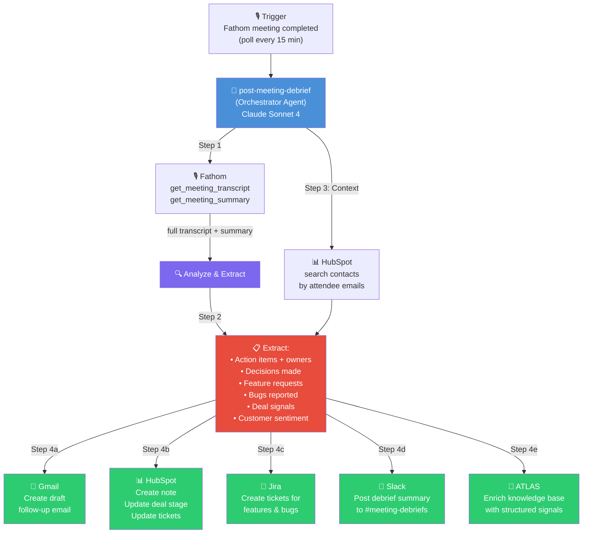
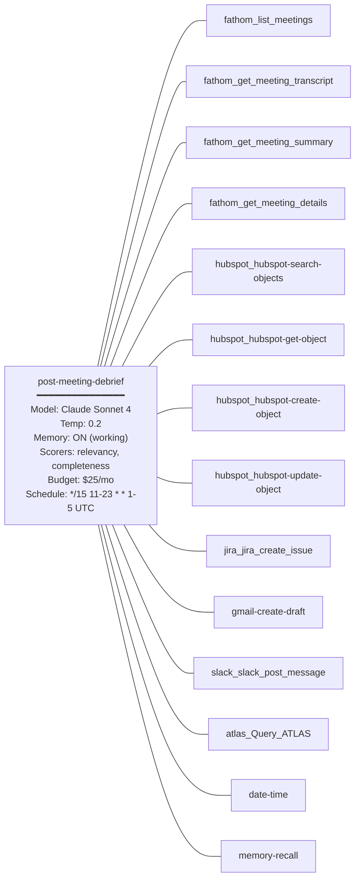

# Plan: Post-Meeting Debrief & Action Agent

## Section 1: Situation

### Problem

After every customer meeting at Appello, significant manual work is required to translate outcomes into actions:

1. **Follow-up emails** — Currently, a Zapier workflow processes Fathom recordings into email drafts: `Fathom Recording → Transcription → Zapier Table ("Fathom Recordings") → AI Email Subject/Body Generation → Gmail Draft`. Corey finishes a meeting, goes into Gmail Drafts, reviews the AI-generated email, tweaks it, and clicks send. This saves time but still requires manual review and misses action items beyond the email.

2. **HubSpot updates** — After meetings, deal stages, notes, ticket statuses, and next steps must be manually entered into HubSpot. This frequently gets delayed or forgotten, leading to stale CRM data.

3. **JIRA ticket creation** — Feature requests and bug reports discussed in meetings need to be manually translated into JIRA tickets. The current Zapier automation only handles HubSpot→JIRA sync; meeting-sourced tickets require manual creation.

4. **Action item tracking** — Commitments made during meetings ("we'll send the quote by Friday", "I'll check on the payroll integration") are captured in Fathom transcripts but not systematically tracked or assigned.

5. **ATLAS knowledge ingestion** — Meeting transcripts feed into ATLAS but the processing is batch-oriented. Real-time extraction of decisions, commitments, and customer signals doesn't happen.

**Net effect**: 30-45 minutes of post-meeting admin per call, often done late or incompletely. At 5-8 meetings per day across the team, this is 2.5-6 hours of daily admin work.

### Best-in-Class Benchmarks

| Product | Key Innovation | Relevance to Appello |
|---------|---------------|---------------------|
| **Circleback** | TIME's #1 pick — auto action items, CRM autofill, webhook automations, 100+ language support | Proves the "meeting → actions" pipeline; their webhook architecture is the model |
| **Vomo.ai** | 50%+ reduction in follow-up time, 99% transcription accuracy, consistent CRM updates | Shows the ROI: 3-5 hours saved per week per user |
| **ActFlux** | Kanban board auto-generated from meetings, 50K+ action items tracked across 10K meetings | Demonstrates the value of structured action extraction, not just summaries |
| **Zoom AI Companion 3.0** | Agentic AI that takes actions, not just notes — moves beyond transcription to execution | The vision: meetings that automatically *do things* as a result |

**What we're building is better** because:
- We replace Appello's existing Zapier workflow (saving Zapier costs)
- We update HubSpot, create JIRA tickets, and send emails in a single automated pass
- ATLAS integration means every meeting enriches the knowledge base
- The agent is on AgentC2 — learnable, versionable, governable, and improvable

### Existing Platform Assets

| Agent | Data Source | Status | Tools |
|-------|-----------|--------|-------|
| (none relevant) | — | — | — |

**Existing Zapier workflow to replace:**
```
Fathom Recording → Transcription → Zapier Table → AI Email Generation → Gmail Draft
```
This becomes: `Fathom webhook/trigger → post-meeting-debrief agent → [Email + HubSpot + JIRA + Slack]`

| Integration | Provider Key | Status | Missing |
|------------|-------------|--------|---------|
| Google Calendar | `google-calendar` | **Connected** | Nothing |
| Gmail | `gmail` | **Connected** | Nothing (has trigger: `gmail.message.received`) |
| Google Drive | `google-drive` | **Connected** | Nothing |
| HubSpot | `hubspot` | **Disconnected** | `HUBSPOT_ACCESS_TOKEN` |
| Fathom | `fathom` | **Disconnected** | `FATHOM_API_KEY` |
| ATLAS | `atlas` | **Disconnected** | `ATLAS_N8N_SSE_URL` |
| Slack | `slack` | **Disconnected** | `SLACK_BOT_TOKEN`, `SLACK_TEAM_ID` |
| Jira | `jira` | **Disconnected** | `JIRA_URL`, `JIRA_USERNAME`, `JIRA_API_TOKEN`, `JIRA_PROJECTS_FILTER` |

---

## Section 2: Objective

Build a `post-meeting-debrief` agent that:

1. **Ingests** — Receives a Fathom meeting recording/transcript (via trigger or scheduled polling) and analyzes the full content
2. **Extracts** — Identifies action items, decisions made, commitments given, feature requests, bugs reported, customer sentiment, and deal signals
3. **Drafts follow-up email** — Generates a personalized follow-up email (thank you, summary, action items, next steps) and creates a Gmail draft for human review
4. **Updates CRM** — Creates/updates HubSpot notes, adjusts deal stage if warranted, logs meeting activity, and updates ticket statuses
5. **Creates tickets** — Generates JIRA tickets for any feature requests or bug reports discussed, with full customer context
6. **Notifies team** — Posts a structured debrief summary to Slack with extracted actions and who owns them
7. **Enriches knowledge base** — Sends structured meeting intelligence (decisions, commitments, signals) to ATLAS for long-term institutional memory

The human finishes a meeting and within 5 minutes receives: a Gmail draft ready to review and send, a Slack debrief with action items, and CRM/JIRA updated automatically.

---

## Section 3: How It Works

### Architecture Diagram



### Execution Flow

| Phase | Step | What Happens |
|-------|------|-------------|
| Trigger | 0 | Agent polls Fathom every 15 minutes for new completed meetings. Checks working memory for already-processed meeting IDs to dedup. |
| Ingest | 1 | For each new meeting: get full transcript via `fathom_get_meeting_transcript` and AI summary via `fathom_get_meeting_summary`. |
| Context | 2 | Identify attendee emails from meeting metadata. Search HubSpot for contacts → companies → deals → tickets to understand the customer relationship. |
| Analyze | 3 | Process transcript + summary + CRM context to extract structured data: action items (with assignees), decisions, feature requests, bugs, deal signals, sentiment. |
| Act: Email | 4a | Draft a follow-up email in Gmail. Structure: greeting, meeting recap, action items (theirs and ours), next steps, sign-off. Addressed to external attendees. |
| Act: CRM | 4b | Create a HubSpot note on the contact/company with meeting summary. If deal signals suggest stage change, flag it (don't auto-advance without approval). Update any referenced tickets. |
| Act: Tickets | 4c | For each feature request or bug identified: create a JIRA ticket with title, description, customer context, priority assessment, and link to HubSpot ticket if applicable. |
| Act: Notify | 4d | Post a structured debrief to Slack `#meeting-debriefs` channel with: meeting title, attendees, key decisions, action items with owners, and any escalation flags. |
| Act: Knowledge | 4e | Send structured meeting intelligence to ATLAS: customer name, decisions made, commitments, blockers, competitive mentions, sentiment score. |
| Dedup | 5 | Store processed meeting ID in working memory. |

### Why This Architecture

A **single agent with many tools** (not sub-agents) because:
- The analysis must happen in a single context window — the transcript, CRM data, and all extracted items need to be in one prompt for accurate cross-referencing
- The output actions (email, CRM, JIRA, Slack) are all deterministic writes that don't need separate reasoning
- A single agent run keeps the trace unified and debuggable
- Tool count is high (~15) but well within limits; all are write-or-search tools, not complex reasoning endpoints

### Agent Configuration Map



---

## Section 4: Pre-Requisites

| # | Item | Current State | Action Required |
|---|------|--------------|-----------------|
| P1 | HubSpot connection | Disconnected | Connect via `integration_connection_create` with `HUBSPOT_ACCESS_TOKEN` |
| P2 | Fathom connection | Disconnected | Connect via `integration_connection_create` with `FATHOM_API_KEY` |
| P3 | ATLAS connection | Disconnected | Connect via `integration_connection_create` with `ATLAS_N8N_SSE_URL` |
| P4 | Slack connection | Disconnected | Connect via `integration_connection_create` with `SLACK_BOT_TOKEN` + `SLACK_TEAM_ID` |
| P5 | Jira connection | Disconnected | Connect via `integration_connection_create` with `JIRA_URL`, `JIRA_USERNAME`, `JIRA_API_TOKEN`, `JIRA_PROJECTS_FILTER` |
| P6 | HubSpot write tool IDs | Unknown | After connecting, discover tools for creating notes, updating deals |
| P7 | Jira create tool ID | Unknown | After connecting, discover exact tool ID for `jira_create_issue` |
| P8 | Gmail draft tool ID | Unknown | Verify `gmail-create-draft` exists in connected Gmail tools |
| P9 | Slack channel ID | Unknown | Create or identify `#meeting-debriefs` channel, get channel ID |

**Fallback behavior:**
- If Fathom is unavailable: Agent cannot run — this is the primary trigger. Log error and retry next cycle.
- If HubSpot write fails: Log the note content in Slack debrief as "CRM update pending — manual entry needed"
- If Jira create fails: Include ticket details in Slack debrief for manual creation
- If Gmail draft fails: Include follow-up email text in Slack debrief
- If Slack is unavailable: Send all outputs via Gmail draft to the meeting organizer
- If ATLAS is unavailable: Skip knowledge base enrichment (non-critical)

---

## Section 5: Agent Specification

### 5.1 Identity

| Field | Value |
|-------|-------|
| **slug** | `post-meeting-debrief` |
| **name** | Post-Meeting Debrief & Action |
| **description** | Processes completed Fathom meeting recordings to extract action items, draft follow-up emails, update HubSpot CRM, create JIRA tickets, post Slack debriefs, and enrich the ATLAS knowledge base — replacing the existing Zapier meeting processing workflow. |
| **type** | SYSTEM |

### 5.2 Model Configuration

| Field | Value | Rationale |
|-------|-------|-----------|
| **modelProvider** | `anthropic` | Best at nuanced transcript analysis and structured extraction |
| **modelName** | `claude-sonnet-4-20250514` | Strong at long-context transcript processing, reliable structured output |
| **temperature** | `0.2` | Very low — extraction and CRM updates must be factual, not creative |
| **maxTokens** | `8192` | Transcripts can be long; need room for analysis + all output actions |

### 5.3 Tools

| Tool ID | Purpose |
|---------|---------|
| `fathom_list_meetings` | Poll for newly completed meetings |
| `fathom_get_meeting_transcript` | Get full transcript of a meeting |
| `fathom_get_meeting_summary` | Get Fathom's AI-generated summary |
| `fathom_get_meeting_details` | Get meeting metadata (attendees, duration, title) |
| `hubspot_hubspot-search-objects` | Find contacts/companies by attendee email |
| `hubspot_hubspot-get-object` | Get full record details (deals, tickets) |
| `hubspot_hubspot-create-object` | Create a note/activity on a HubSpot record |
| `hubspot_hubspot-update-object` | Update deal stage, ticket status |
| `jira_jira_create_issue` | Create JIRA tickets for feature requests and bugs |
| `gmail-create-draft` | Create a follow-up email draft in Gmail |
| `slack_slack_post_message` | Post debrief summary to Slack |
| `atlas_Query_ATLAS` | Query ATLAS for prior context to enrich analysis |
| `date-time` | Current date/time for timestamps |
| `memory-recall` | Dedup — check if meeting already processed |

### 5.4 Sub-Agents

None. Single agent with tools.

### 5.5 Memory

| Field | Value | Rationale |
|-------|-------|-----------|
| **memoryEnabled** | `true` | Track processed meeting IDs to avoid duplicate processing |
| **memoryConfig** | `{"lastMessages": 30, "semanticRecall": false, "workingMemory": true}` | Working memory stores processed meeting IDs. Higher lastMessages because transcripts are verbose. |

### 5.6 Evaluation Scorers

| Scorer | What It Measures | Target Score |
|--------|-----------------|-------------|
| `relevancy` | Extracted actions and email are relevant to the meeting content | > 0.85 |
| `completeness` | All action types extracted (items, decisions, requests, bugs, signals) and all output channels hit | > 0.85 |

### 5.7 Instructions

```
You are the Post-Meeting Debrief & Action agent for Appello. Your job is to process completed meetings and turn them into concrete actions: follow-up emails, CRM updates, JIRA tickets, Slack debriefs, and knowledge base entries.

## Process

1. **Poll for New Meetings**: Use `fathom_list_meetings` to check for recently completed meetings. Use `date-time` to get the current time. Look for meetings completed in the last 20 minutes (to handle the 15-min polling interval with buffer).

2. **Dedup Check**: Check working memory for meeting IDs already processed today. Skip any already-processed meetings.

3. **For each new meeting**:

   a. **Get Full Context**: 
      - `fathom_get_meeting_details` — get title, attendees, duration
      - `fathom_get_meeting_transcript` — get full transcript
      - `fathom_get_meeting_summary` — get AI summary
   
   b. **Skip Internal Meetings**: If all attendees have @useappello.com or @agentc2.ai emails, skip processing.

   c. **Get CRM Context**: Search HubSpot for contacts matching attendee emails. For found contacts, get associated companies, deals, and open tickets. This context enriches your extraction.

4. **Extract Structured Data** from the transcript:

   **Action Items**: 
   - Parse for commitments: "I'll...", "We will...", "Let's...", "Can you...", "By [date]..."
   - Assign each to: APPELLO (internal team) or CUSTOMER (external)
   - Include: description, owner (name), deadline (if mentioned), priority (high/medium/low)

   **Decisions Made**:
   - Parse for: "We decided...", "Let's go with...", "The plan is...", agreements, approvals
   
   **Feature Requests**:
   - Any new functionality the customer asked for or suggested
   - Include: title, description, customer justification, priority assessment

   **Bugs / Issues Reported**:
   - Any problems, errors, or broken functionality mentioned
   - Include: title, description, steps to reproduce (if discussed), severity

   **Deal Signals** (for sales meetings):
   - Buying signals: budget discussion, timeline urgency, stakeholder buy-in
   - Risk signals: competitor mentions, hesitation, objections, delays
   - Recommended stage: advance / hold / at risk

   **Customer Sentiment**:
   - Overall: positive / neutral / negative / mixed
   - Key indicators: specific praise, frustration, excitement, concern

5. **Execute Actions**:

   a. **Draft Follow-Up Email** (`gmail-create-draft`):
   ```
   Subject: [Meeting Title] — Follow-Up & Next Steps
   
   Hi [First Name],

   Thank you for taking the time to meet today. Here's a quick recap of what we covered and the next steps:

   **What We Discussed**
   [2-3 sentence summary of key topics]

   **Action Items**
   - **You**: [customer action items with deadlines]
   - **Us**: [Appello action items with deadlines]

   **Next Steps**
   [Next meeting date if scheduled, or proposed next step]

   Please don't hesitate to reach out if anything comes up before then. Looking forward to continuing the conversation.

   Best,
   [Meeting organizer name]
   ```
   Address to: external attendee emails. CC: internal attendees.

   b. **Update HubSpot** (`hubspot_hubspot-create-object` for notes, `hubspot_hubspot-update-object` for deals):
   - Create a NOTE on the contact/company with:
     - Meeting date, attendees, duration
     - Key decisions made
     - Action items (ours and theirs)
     - Sentiment assessment
   - If deal signals suggest a stage change, add a note flagging it: "⚠️ Deal signal: [signal]. Consider advancing to [stage]." Do NOT auto-change the deal stage.
   - If bugs were reported, check for existing HubSpot tickets and update them, or note "New bug reported — JIRA ticket created."

   c. **Create JIRA Tickets** (`jira_jira_create_issue`) for each feature request and bug:
   - Project: Use the configured JIRA project filter
   - Type: "Story" for features, "Bug" for bugs
   - Title: Clear, descriptive title
   - Description: Include customer name, meeting context, detailed description, and customer's exact words (quoted from transcript)
   - Priority: Map from your assessment
   - Labels: ["customer-request", "[company-name]"]

   d. **Post Slack Debrief** (`slack_slack_post_message` to #meeting-debriefs):
   ```
   📋 *Meeting Debrief: [Title]*
   🕐 [Time] | 👥 [Attendees] | 🏢 [Company] | ⏱️ [Duration]

   *Sentiment*: [emoji] [assessment]

   *Key Decisions*:
   • [decision 1]
   • [decision 2]

   *Action Items*:
   🔴 *Appello*:
   • [action] — [owner] — [deadline]
   🔵 *Customer*:
   • [action] — [deadline]

   *Tickets Created*:
   • [JIRA-123] [title] (feature/bug)

   *Deal Signals*: [signal summary]

   ✉️ Follow-up email drafted in Gmail — review and send.
   ```

   e. **Enrich ATLAS** (`atlas_Query_ATLAS` — use as a write/signal mechanism if supported, otherwise skip):
   - Send structured summary with: company, date, decisions, commitments, signals
   - This ensures future pre-meeting briefs have this context

6. **Update Memory**: Store processed meeting ID in working memory.

## Rules

- **Never auto-advance a HubSpot deal stage.** Flag it with a note; let a human make the call.
- **Never send the follow-up email automatically.** Always create as a Gmail DRAFT for human review.
- **Quote the customer's actual words** when creating JIRA tickets. Don't paraphrase their request.
- **Be conservative on action item extraction.** Only extract clear, explicit commitments — not vague discussion topics.
- **Prioritize correctly**: Bugs get "High" priority if they block the customer's work. Feature requests default to "Medium" unless the customer explicitly said it's urgent.
- **If transcript is very short** (< 2 minutes or < 500 words), it may be a test or accidental recording. Process it but note "Short recording — may be incomplete" in the debrief.
- **Tone for emails**: Warm, professional, and concise. Mirror the Appello brand voice — helpful partner, not corporate vendor.
- **Never fabricate** action items, decisions, or quotes. If you're unsure, omit rather than guess.
```

---

## Section 6: Governance

### 6.1 Budget

| Field | Value | Rationale |
|-------|-------|-----------|
| **monthlyLimitUsd** | $25 | ~8 meetings/day × 22 days × ~$0.12/run (higher due to transcript length) = ~$21/mo |
| **alertAtPct** | 80% | Alert at $20 spend |
| **hardLimit** | false | Don't block meeting processing — time-sensitive outputs |
| **enabled** | true | Active immediately |

### 6.2 Guardrails

| Rule | Description |
|------|------------|
| No auto-send emails | ALWAYS create as Gmail draft, never auto-send |
| No auto-advance deals | Flag deal signals with a note; never change deal stage |
| No PII in Slack | Don't post customer phone numbers or financial details in Slack debriefs |
| Conservative extraction | Only extract explicit commitments and requests, not inferred ones |
| No duplicate tickets | Check JIRA for existing similar tickets before creating new ones |
| Human-readable JIRA | Every JIRA ticket must be actionable by a developer who wasn't in the meeting |

### 6.3 Schedule

| Field | Value |
|-------|-------|
| **name** | Post-Meeting Debrief — Business Hours Poll |
| **cronExpr** | `*/15 11-23 * * 1-5` |
| **timezone** | `America/Toronto` |
| **input** | `Check for newly completed Fathom meetings in the last 20 minutes. Today is {{currentDate}}. For each new meeting, extract action items, draft follow-up email, update HubSpot, create JIRA tickets, post Slack debrief, and enrich ATLAS.` |
| **isActive** | true |

*Note: `11-23 UTC` = `7am-7pm ET` (during EDT). Extended to 7pm to catch end-of-day meetings.*

---

## Section 7: Network

Not applicable as standalone. Future: combine with `pre-meeting-prep` in a "Meeting Intelligence" network.

---

## Section 8: Implementation Approach

| What We Do | MCP Tool | What We Do NOT Do |
|-----------|---------|-------------------|
| Connect HubSpot | `integration_connection_create` | No `.env` edits |
| Connect Fathom | `integration_connection_create` | No code changes |
| Connect ATLAS | `integration_connection_create` | No Prisma / SQL |
| Connect Slack | `integration_connection_create` | No code changes |
| Connect Jira | `integration_connection_create` | No code changes |
| Create agent | `agent_create` | No database writes |
| Verify agent | `agent_read` | No database queries |
| Set budget | `agent_budget_update` | No schema edits |
| Set guardrails | `agent_guardrails_update` | No code-level guards |
| Create schedule | `agent_schedule_create` | No Inngest edits |
| Test agent | Invoke via sync endpoint | No manual curl |
| Inspect runs | `agent_runs_list` / `agent_run_trace` | No reading DB tables |
| Create test cases | `agent_test_cases_create` | No test files |
| Run evaluations | `agent_evaluations_run` | No `bun test` |

---

## Section 9: Implementation Steps

### Phase A: Pre-Requisites

*Note: P1-P4 are shared with the pre-meeting-prep agent. If already connected, skip.*

1. **Connect HubSpot**: `integration_connection_create` with provider key `hubspot`, credentials from `.env`
2. **Connect Fathom**: `integration_connection_create` with provider key `fathom`, credentials from `.env`
3. **Connect ATLAS**: `integration_connection_create` with provider key `atlas`, credentials from `.env`
4. **Connect Slack**: `integration_connection_create` with provider key `slack`, credentials from `.env`
5. **Connect Jira**: `integration_connection_create` with provider key `jira`, credentials from `.env` (4 fields: URL, username, API token, projects filter)
6. **Verify all connections**: `integration_connections_list` — confirm all show `isActive: true`
7. **Discover tool IDs**: List tools for each provider, particularly:
   - Fathom: `list_meetings`, `get_meeting_transcript`, `get_meeting_summary`, `get_meeting_details`
   - HubSpot: `search-objects`, `get-object`, `create-object`, `update-object`
   - Jira: `create_issue`, `search` (for dedup)
   - Gmail: `create-draft` or equivalent
   - Slack: `post_message`
8. **Create Slack channel**: Create `#meeting-debriefs` channel if it doesn't exist; get channel ID
9. **Verify Gmail draft capability**: Test `gmail-create-draft` tool
10. **Verify Jira project key**: Confirm the target project key for ticket creation

### Phase B: Agent Creation

1. `agent_create` — Create `post-meeting-debrief` with all fields from Section 5
2. `agent_read` — Verify all fields match spec
3. `agent_budget_update` — Set $25/mo budget with 80% alert
4. `agent_budget_get` — Verify budget applied
5. `agent_guardrails_update` — Set guardrails from Section 6.2
6. `agent_guardrails_get` — Verify guardrails applied

### Phase C: Testing

1. **Dry run**: Invoke agent with prompt "Check for recently completed Fathom meetings. Process any new ones found. Today is [today's date]."
2. **Validate output format**: Check that the agent:
   - Fetched a Fathom meeting transcript
   - Extracted action items with owners
   - Created a Gmail draft
   - Posted to Slack
   - Created HubSpot note
   - Created JIRA ticket (if applicable)
3. **Validate run trace**: `agent_runs_list` + `agent_run_trace` — confirm tool calls to Fathom, HubSpot, Gmail, Slack, Jira in correct order
4. **Test graceful degradation**: 
   - Invoke with a meeting that has no HubSpot contacts — verify it still processes
   - Invoke with a very short meeting (< 2 min) — verify it notes the short duration
5. **Create test cases**: 3 regression tests:
   - Smoke: "Process a recent Fathom meeting and produce all outputs"
   - Integration: "Verify Gmail draft is created and Slack debrief is posted"
   - Quality: "Action items extracted match what was discussed in the meeting"
6. **Run evaluations**: Verify relevancy > 0.85, completeness > 0.85

### Phase D: Schedule

1. `agent_schedule_create` — Create cron schedule from Section 6.3
2. `agent_schedule_list` — Verify schedule is active and correct

### Phase E: Validation and Hardening

1. **Live fire**: Let schedule run for 1 business day after real meetings happen. Check `agent_runs_list` for completions.
2. **Human review**: Have Corey/Ian review the Gmail drafts and Slack debriefs for accuracy
3. **Simulation batch**: `agent_simulations_start` with 5+ prompts covering:
   - Sales demo with strong buying signals
   - Onboarding meeting with setup blockers
   - Support call with a bug report
   - Quick check-in with no action items
   - Meeting with unknown (non-HubSpot) attendees
4. **Simulation review**: Inspect all outputs for accuracy and appropriate tone
5. **Performance review**: `agent_overview` + `agent_analytics` + `agent_costs`
6. **Learning session**: After 10+ runs, `agent_learning_start`
7. **Learning review**: Review and approve/reject proposals
8. **Decommission Zapier workflow**: Once validated, disable the Zapier Fathom→Gmail automation (save cost)

---

## Section 10: Success Criteria

| Metric | Target | MCP Tool to Measure |
|--------|--------|-------------------|
| Delivery reliability | > 95% of meetings processed within 15 min of completion | `agent_runs_list` |
| Output quality (relevancy) | > 0.85 | `agent_evaluations_list` |
| Output quality (completeness) | > 0.85 | `agent_evaluations_list` |
| Action item accuracy | > 90% precision (human verified) | Manual review |
| Email draft quality | < 2 edits before sending (human verified) | Manual review |
| JIRA ticket quality | Actionable without meeting context (human verified) | Manual review |
| Cost per run | < $0.15 | `agent_costs` |
| Monthly cost | < $25 | `agent_budget_get` |
| Latency | < 90s per meeting processed | `agent_analytics` |
| Graceful degradation | 100% | `agent_run_trace` |
| Zapier replacement | Zapier meeting workflow fully decommissioned | Manual verification |

---

## Section 11: Rollback Plan

1. `agent_schedule_list` + `agent_schedule_update` (isActive: false) — Disable the cron schedule
2. Re-enable the Zapier Fathom→Gmail workflow as fallback
3. `agent_versions_list` — Find the target version
4. `agent_update` (restoreVersion: N) — Roll back agent config
5. `agent_read` — Verify rollback applied
6. `agent_schedule_update` (isActive: true) — Re-enable when fixed

---

## Section 12: Future Enhancements

| Enhancement | Description | Trigger |
|------------|-------------|---------|
| Webhook trigger | Replace polling with Fathom webhook for instant processing | When Fathom supports webhooks or AgentC2 supports webhook triggers |
| Auto-link to pre-meeting brief | Connect post-meeting debrief to the pre-meeting brief for continuity scoring | After pre-meeting agent is live |
| Sentiment trending | Track customer sentiment across meetings over time, alert on negative trends | After 50+ meetings processed |
| Smart email personalization | Use ATLAS history to personalize email tone per customer relationship | After learning session insights |
| Calendar auto-schedule | If next meeting was discussed, auto-create calendar invite as draft | When Google Calendar write tools are available |
| Approval workflow | For high-stakes deal stage changes, create an approval request before updating | When workflow integration is available |
| Meeting quality scoring | Rate meeting effectiveness based on outcomes vs. objectives | After pre-meeting + post-meeting linkage |
| Cross-meeting pattern detection | Identify recurring themes, escalating issues, or stalled deals across customers | After 100+ meetings processed |
| Automatic Zapier replacement | Once validated, fully replace all 14-15 Zapier workflows with AgentC2 equivalents | After 30 days of successful operation |
