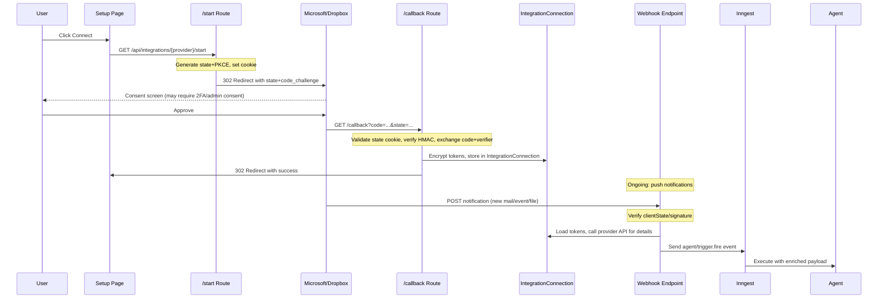

# Native OAuth Integrations: Outlook Mail, Outlook Calendar, Dropbox

## Current State Analysis

Gmail is the only native OAuth integration today. Its architecture spans multiple layers:

- **Provider seed** in [packages/mastra/src/mcp/client.ts](packages/mastra/src/mcp/client.ts) (lines 479-511) -- `providerType: "oauth"`, `authType: "oauth"`, triggers metadata
- **OAuth helper** at [apps/agent/src/lib/gmail.ts](apps/agent/src/lib/gmail.ts) -- OAuth2Client, token refresh, credential save/load from `IntegrationConnection`
- **API routes** under `apps/agent/src/app/api/integrations/gmail/` -- start, callback, status, sync, watch
- **Webhook** at [apps/agent/src/app/api/gmail/webhook/route.ts](apps/agent/src/app/api/gmail/webhook/route.ts) -- Pub/Sub push, fires `gmail.message.received` via Inngest `agent/trigger.fire`
- **Tools** at [packages/mastra/src/tools/gmail/](packages/mastra/src/tools/gmail/) -- archive-email action tool
- **Prisma model** `GmailIntegration` -- binds agent + mailbox + Slack user
- **Setup UI** at [apps/agent/src/app/mcp/gmail/page.tsx](apps/agent/src/app/mcp/gmail/page.tsx)

### Known Issues in Current Gmail Implementation

These must be fixed as part of this work to establish a correct baseline for all new integrations:

1. `**CREDENTIAL_ENCRYPTION_KEY` is missing from `.env**` -- The entire encryption system in [apps/agent/src/lib/credential-crypto.ts](apps/agent/src/lib/credential-crypto.ts) silently falls back to plaintext when this key is absent. Gmail OAuth tokens are currently stored **unencrypted** in the database.
2. **No OAuth CSRF/state protection** -- The Gmail flow (via Better Auth social provider) relies on Better Auth's internal CSRF. The standalone flows we're building have no such safety net; we must add explicit state parameter protection.
3. **No `actionsJson` on Gmail provider seed** -- The connection actions route at `/api/integrations/connections/[connectionId]/actions` returns `null` for OAuth providers because `actionsJson` is never populated.

---

## Phase 0: Security Foundation (Must Complete First)

### 0a. Generate and Deploy `CREDENTIAL_ENCRYPTION_KEY`

Generate with `openssl rand -hex 32`, add to `.env`. This is a prerequisite for storing any OAuth tokens securely.

### 0b. Shared OAuth Security Module

Create `apps/agent/src/lib/oauth-security.ts` providing:

- **State parameter**: HMAC-signed JSON containing `{organizationId, userId, providerKey, nonce, expiresAt}`. Signed with `BETTER_AUTH_SECRET`. Stored in an HTTP-only cookie (`__oauth_state`) for validation in the callback.
- **PKCE**: Generate `code_verifier` (random 43-128 char string), derive `code_challenge` via SHA-256. Store `code_verifier` alongside state in the cookie.
- **State validation**: Callback routes call `validateOAuthState(cookie, queryState)` which verifies HMAC signature, checks expiry, and returns the decoded payload + PKCE verifier.

```typescript
// Pseudocode for the module API
export function generateOAuthState(params: {
    organizationId: string;
    userId: string;
    providerKey: string;
}): { state: string; codeVerifier: string; cookie: string };

export function validateOAuthState(
    cookie: string,
    queryState: string
): { organizationId: string; userId: string; providerKey: string; codeVerifier: string };
```

---

## Architecture: Standalone OAuth Flow



---

## Provider Design: Unified Microsoft OAuth

Both Outlook Mail and Outlook Calendar share a single Azure AD app registration. Rather than making the user authenticate twice, we use a **single `microsoft` provider** with combined scopes. The tools are separated in the registry but share one `IntegrationConnection`.

### Single `microsoft` Provider

- **Provider key**: `microsoft`
- **Combined OAuth scopes**: `Mail.Read Mail.ReadWrite Mail.Send Calendars.Read Calendars.ReadWrite offline_access User.Read`
- **OAuth endpoint**: `https://login.microsoftonline.com/{tenant}/oauth2/v2.0/authorize`
- **Token endpoint**: `https://login.microsoftonline.com/{tenant}/oauth2/v2.0/token`
- One `IntegrationConnection` per org, storing tokens with combined scope
- Separate webhook subscriptions for mail vs calendar (each tracked in `WebhookSubscription`)

### Env Vars

```
MICROSOFT_CLIENT_ID=...       # Azure AD app (Application) client ID
MICROSOFT_CLIENT_SECRET=...   # Azure AD client secret
MICROSOFT_TENANT_ID=common    # "common" for multi-tenant, or specific tenant ID
```

### Microsoft-Specific Concerns

- **Admin consent**: Enterprise orgs may require admin consent for `Mail.ReadWrite` and `Calendars.ReadWrite`. The OAuth start route should add `prompt=consent` and the callback should detect `admin_consent_required` errors and surface a clear message.
- **2FA / Conditional Access**: Microsoft may return `interaction_required` during token refresh if the session was invalidated by policy. The refresh helper must catch this, set `IntegrationConnection.errorMessage`, mark `isActive = false`, and surface a "Re-authenticate" prompt in the UI.
- **Token lifetime**: Access tokens ~60-90 min, refresh tokens up to 90 days (but admin-revocable). Refresh logic must handle `invalid_grant` as permanent failure.

---

## Provider Design: Dropbox

- **Provider key**: `dropbox`
- **OAuth endpoint**: `https://www.dropbox.com/oauth2/authorize`
- **Token endpoint**: `https://api.dropboxapi.com/oauth2/token`
- **Scopes**: `files.metadata.read files.content.read files.content.write sharing.read` (Dropbox uses scope strings in the `scope` query param)
- **Token type**: Short-lived access tokens (4 hours) + refresh token with `token_access_type=offline`

### Dropbox-Specific Concerns

- **App-level webhooks**: Dropbox registers ONE webhook URL per app (in app settings), not per user. All change notifications for all linked accounts come to that single URL.
- **Webhook flow**: POST body contains `list_folder.accounts[]` (array of account IDs with changes). The webhook route must fan out: look up all active `IntegrationConnection` records for Dropbox, match by account ID stored in `metadata.accountId`, then call `files/list_folder/continue` with each connection's stored cursor.
- **GET verification**: Dropbox sends a GET with `?challenge=...` to verify the webhook URL. Must echo the challenge back as plain text.
- **Cursor persistence**: Each connection stores a `cursor` in `WebhookSubscription.cursor` for delta tracking.

### Env Vars

```
DROPBOX_APP_KEY=...     # Dropbox app key (= client ID)
DROPBOX_APP_SECRET=...  # Dropbox app secret
```

---

## Integration Details

### 1. Outlook Mail

- **Triggers**: `microsoft.mail.received` (via Graph webhook subscription on `/me/mailFolders('Inbox')/messages`)
- **Actions/Tools**: `outlook-mail-send-email`, `outlook-mail-archive-email`, `outlook-mail-list-emails`, `outlook-mail-get-email`
- **Data storage**: Reuse existing `EmailThread` / `EmailMessage` models (already provider-agnostic via `integrationConnectionId`)

### 2. Outlook Calendar

- **Triggers**: `microsoft.calendar.event.created`, `microsoft.calendar.event.updated`
- **Actions/Tools**: `outlook-calendar-list-events`, `outlook-calendar-get-event`, `outlook-calendar-create-event`, `outlook-calendar-update-event`
- **Data storage**: New `CalendarEvent` model for normalized event storage

### 3. Dropbox

- **Triggers**: `dropbox.file.changed` (via app-level webhook + per-connection cursor delta)
- **Actions/Tools**: `dropbox-list-files`, `dropbox-get-file`, `dropbox-upload-file`, `dropbox-search-files`, `dropbox-get-sharing-links`
- **Data storage**: No new model -- file metadata returned directly from API

---

## Schema Changes

### New Model: `WebhookSubscription`

Generic model for tracking webhook/subscription lifecycle across all providers:

```prisma
model WebhookSubscription {
    id                      String    @id @default(cuid())
    integrationConnectionId String
    integrationConnection   IntegrationConnection @relation(...)
    providerKey             String // "microsoft-mail", "microsoft-calendar", "dropbox"
    externalSubscriptionId  String? // Graph subscription ID (null for Dropbox)
    resourcePath            String? // "/me/mailFolders('Inbox')/messages" etc
    clientState             String? // HMAC verification secret for Graph webhooks
    notificationUrl         String? // Full webhook URL
    cursor                  String? // Dropbox delta cursor
    expiresAt               DateTime? // Graph subscription expiry (3-day max)
    lastRenewedAt           DateTime?
    errorCount              Int       @default(0)
    errorMessage            String?   @db.Text
    isActive                Boolean   @default(true)
    metadata                Json?
    createdAt               DateTime  @default(now())
    updatedAt               DateTime  @updatedAt

    @@unique([integrationConnectionId, providerKey, resourcePath])
    @@index([providerKey, isActive])
    @@index([expiresAt])
    @@map("webhook_subscription")
}
```

### New Model: `CalendarEvent`

```prisma
model CalendarEvent {
    id                      String    @id @default(cuid())
    organizationId          String
    integrationConnectionId String?
    externalEventId         String // Graph event ID
    calendarId              String? // Which calendar
    subject                 String?
    bodyPreview             String?   @db.Text
    startAt                 DateTime?
    endAt                   DateTime?
    isAllDay                Boolean   @default(false)
    location                String?
    organizerEmail          String?
    attendeesJson           Json?
    recurrenceJson          Json?
    status                  String? // "confirmed", "tentative", "cancelled"
    sensitivity             String? // "normal", "personal", "private", "confidential"
    metadata                Json?
    createdAt               DateTime  @default(now())
    updatedAt               DateTime  @updatedAt

    @@unique([integrationConnectionId, externalEventId])
    @@index([organizationId])
    @@index([startAt])
    @@map("calendar_event")
}
```

### Update: `IntegrationConnection`

Add relation to `WebhookSubscription`:

```prisma
// Add to IntegrationConnection model:
webhookSubscriptions WebhookSubscription[]
```

### Decision: Integration Binding Models

**For Phase 1**: Keep `GmailIntegration` as-is and do NOT create per-provider binding models. Instead, use `IntegrationConnection` directly -- the `metadata` JSON field stores provider-specific config (email address, Slack user ID, etc.) and the `agentTriggerId` field links to the agent trigger. This avoids N models for N integrations.

**For reference**: `GmailIntegration` will be migrated to this pattern in a future cleanup pass (tech debt item).

---

## Token Refresh and Connection Health

All three providers need a consistent approach to token lifecycle:

### Shared Pattern (in each provider's OAuth helper)

```typescript
async function callWithAutoRefresh<T>(
    connectionId: string,
    apiCall: (accessToken: string) => Promise<T>
): Promise<T> {
    const connection = await loadConnection(connectionId);
    const tokens = decryptCredentials(connection.credentials);

    // 1. Try with current access token
    try {
        return await apiCall(tokens.accessToken);
    } catch (error) {
        if (!is401(error)) throw error;
    }

    // 2. Attempt refresh
    try {
        const newTokens = await refreshToken(tokens.refreshToken, {
            clientId: connection.metadata?.clientId || process.env.XXX_CLIENT_ID,
            clientSecret: connection.metadata?.clientSecret || process.env.XXX_CLIENT_SECRET
        });
        await saveTokens(connectionId, newTokens);
        return await apiCall(newTokens.accessToken);
    } catch (refreshError) {
        // 3. Permanent failure -- mark connection as broken
        if (isInteractionRequired(refreshError) || isInvalidGrant(refreshError)) {
            await prisma.integrationConnection.update({
                where: { id: connectionId },
                data: {
                    isActive: false,
                    errorMessage: `Token refresh failed: ${refreshError.message}. Re-authentication required.`
                }
            });
        }
        throw refreshError;
    }
}
```

### Per-Org OAuth App Customization (Future-Proof)

All OAuth helpers accept `clientId` and `clientSecret` as parameters, falling back to env vars:

```typescript
function getClientCredentials(connection?: IntegrationConnection) {
    const meta = connection?.metadata as Record<string, unknown> | null;
    return {
        clientId: (meta?.clientId as string) || process.env.MICROSOFT_CLIENT_ID,
        clientSecret: (meta?.clientSecret as string) || process.env.MICROSOFT_CLIENT_SECRET
    };
}
```

This means a future admin UI can let orgs supply their own Azure AD app / Dropbox app credentials without any code changes.

---

## Webhook Subscription Lifecycle

### Microsoft Graph Subscriptions

- Max TTL: **3 days** (4230 minutes) for mail and calendar change notifications
- Must send a **validation handshake**: When creating/renewing, Graph sends a GET to the `notificationUrl` with `?validationToken=...`. Must echo back as `text/plain 200`.
- Each notification POST includes `clientState` for verification
- **Renewal cron**: Inngest function runs every 12 hours, finds subscriptions expiring within 24 hours, renews them

### Dropbox Webhooks

- **App-level** (not per-user): One URL configured in Dropbox App Console
- **Verification**: GET `?challenge=xxx` -- echo back as plain text
- **Notification**: POST with `{"list_folder": {"accounts": ["dbid:AAH..."]}}` -- fan out to matching connections
- **Cursor**: Each connection maintains a cursor via `files/list_folder/continue`

### Inngest Subscription Manager

New function in [apps/agent/src/lib/inngest-functions.ts](apps/agent/src/lib/inngest-functions.ts):

```typescript
// Cron: every 12 hours
// 1. Find WebhookSubscriptions where expiresAt < now + 24h AND isActive = true
// 2. For each: call Graph PATCH to renew, update expiresAt
// 3. For failed renewals: increment errorCount, log, alert if errorCount > 3
// 4. For Dropbox: no renewal needed (app-level), but check cursor staleness
```

---

## File Plan

### Phase 0: Security Foundation (2 files + env change)

- `.env` -- Add `CREDENTIAL_ENCRYPTION_KEY` (generate with `openssl rand -hex 32`)
- `apps/agent/src/lib/oauth-security.ts` -- Signed state params, PKCE generation/validation

### Shared Infrastructure (3 files changed)

- [packages/mastra/src/mcp/client.ts](packages/mastra/src/mcp/client.ts) -- Add `microsoft` and `dropbox` provider seeds with `actionsJson` + `triggersJson`
- [packages/database/prisma/schema.prisma](packages/database/prisma/schema.prisma) -- Add `WebhookSubscription`, `CalendarEvent` models, add `webhookSubscriptions` relation to `IntegrationConnection`
- `.env` + [CLAUDE.md](CLAUDE.md) -- Document all new env vars

### Microsoft OAuth + Mail + Calendar (11 files)

- `apps/agent/src/lib/microsoft-oauth.ts` -- Shared: auth URL with PKCE+state, token exchange, refresh with `interaction_required` handling, Graph client factory, `callWithAutoRefresh`
- `apps/agent/src/lib/outlook-mail.ts` -- Graph Mail API: list messages, get message, send, archive, parse message, create/renew mail subscription
- `apps/agent/src/lib/outlook-calendar.ts` -- Graph Calendar API: list events, get event, create event, update event, create/renew calendar subscription
- `apps/agent/src/app/api/integrations/microsoft/start/route.ts` -- OAuth start (shared for mail+calendar)
- `apps/agent/src/app/api/integrations/microsoft/callback/route.ts` -- OAuth callback (shared)
- `apps/agent/src/app/api/integrations/microsoft/status/route.ts` -- Connection status + health
- `apps/agent/src/app/api/microsoft/webhook/route.ts` -- Graph webhook: validation handshake + notification dispatch (routes to mail or calendar handler based on resource)
- `packages/mastra/src/tools/outlook-mail/index.ts` + `actions.ts` -- Mail tool exports and implementations
- `packages/mastra/src/tools/outlook-calendar/index.ts` + `actions.ts` -- Calendar tool exports and implementations
- `apps/agent/src/app/mcp/microsoft/page.tsx` -- Unified setup UI (shows both mail and calendar status, single Connect button)

### Dropbox (8 files)

- `apps/agent/src/lib/dropbox.ts` -- OAuth with PKCE+state, API client, delta cursor, `callWithAutoRefresh`
- `apps/agent/src/app/api/integrations/dropbox/start/route.ts` -- OAuth start
- `apps/agent/src/app/api/integrations/dropbox/callback/route.ts` -- OAuth callback
- `apps/agent/src/app/api/integrations/dropbox/status/route.ts` -- Connection status
- `apps/agent/src/app/api/dropbox/webhook/route.ts` -- GET challenge verification + POST multi-account fanout
- `packages/mastra/src/tools/dropbox/index.ts` + `actions.ts` -- Tool exports and implementations
- `apps/agent/src/app/mcp/dropbox/page.tsx` -- Setup UI

### Tool Registry + Inngest (3 files changed)

- [packages/mastra/src/tools/registry.ts](packages/mastra/src/tools/registry.ts) -- Register all new tools
- [packages/mastra/src/index.ts](packages/mastra/src/index.ts) -- Export new modules
- [apps/agent/src/lib/inngest-functions.ts](apps/agent/src/lib/inngest-functions.ts) -- Add subscription renewal cron

---

## Key Design Decisions Summary

| Decision                 | Choice                                                       | Rationale                                                                                   |
| ------------------------ | ------------------------------------------------------------ | ------------------------------------------------------------------------------------------- |
| Microsoft provider model | Single `microsoft` provider with combined scopes             | Users authenticate once for both mail and calendar; separate scopes per-service is worse UX |
| OAuth CSRF protection    | HMAC-signed state cookie + PKCE                              | Prevents authorization code injection and CSRF attacks                                      |
| Token storage            | AES-256-GCM encrypted via `CREDENTIAL_ENCRYPTION_KEY`        | Tokens are as sensitive as passwords; must be encrypted at rest                             |
| Per-org customization    | OAuth helpers accept clientId/secret as params, env fallback | Future-proofs for multi-tenant without code changes                                         |
| Webhook tracking         | Generic `WebhookSubscription` model                          | One model serves Graph subscriptions and Dropbox cursors; avoids per-provider schema sprawl |
| Integration binding      | Use `IntegrationConnection.metadata` + `agentTriggerId`      | Avoids creating per-provider Prisma models; `GmailIntegration` pattern noted as tech debt   |
| Token refresh failures   | Auto-disable connection + set errorMessage                   | User sees clear "Re-authenticate" prompt; prevents repeated failed API calls                |
| Dropbox webhooks         | App-level with multi-account fanout in webhook route         | Dropbox doesn't support per-user subscriptions; route must iterate connections              |
| Subscription renewal     | Inngest cron every 12h                                       | Graph subscriptions expire in 3 days; 12h interval gives margin                             |

---

## Dependencies

No new npm packages required. All three providers use raw `fetch`:

- **Microsoft Graph**: `fetch` to `graph.microsoft.com/v1.0/...`
- **Dropbox**: `fetch` to `api.dropboxapi.com/2/...` and `content.dropboxapi.com/2/...`
- Token endpoints are standard OAuth2 via `fetch` with `application/x-www-form-urlencoded`

The existing `googleapis` package is only used by Gmail and is unrelated.

---

## Tech Debt Acknowledged

- `GmailIntegration` model should be migrated to use `IntegrationConnection.metadata` pattern (same as new integrations)
- Gmail provider seed should have `actionsJson` populated (fix alongside new providers)
- Gmail OAuth flow (via Better Auth social provider) should be migrated to standalone with PKCE to match the new integrations (lower priority -- it works, just differently)
