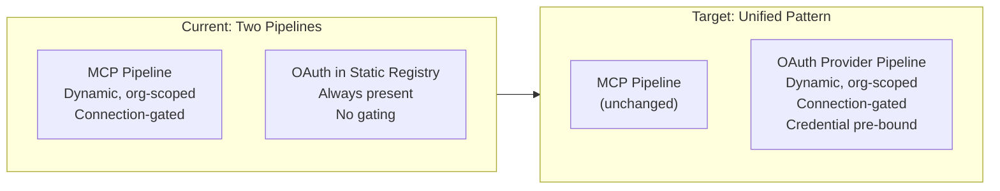
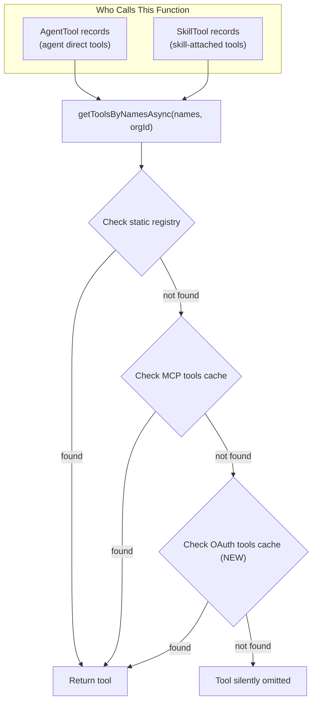
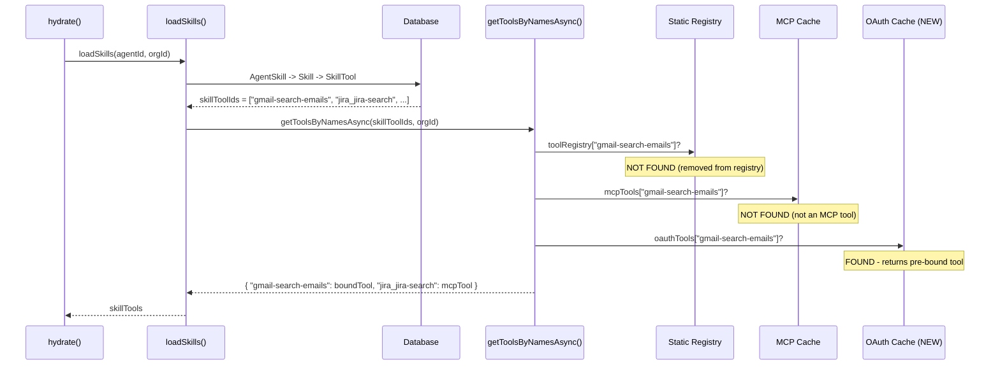
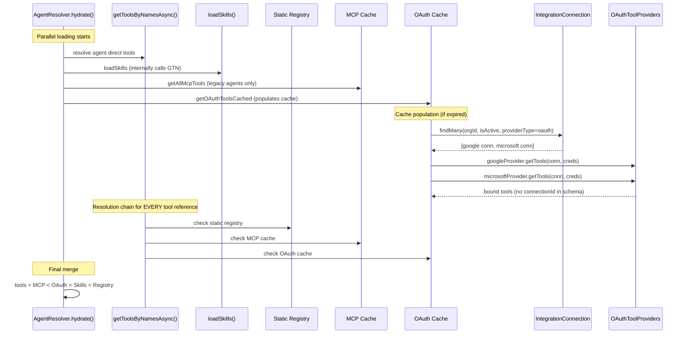

# OAuth Tool Provider Architecture: The Definitive Plan

## Core Problem

The system has two completely different tool loading pipelines:

- **MCP tools**: Dynamic, org-scoped, connection-gated, loaded at hydration time. When no connection exists, the tools simply don't appear. This is correct.
- **OAuth tools** (Gmail, Outlook, Dropbox, Google Calendar): Static, always in the registry, no connection gating, credential resolution varies per provider. The LLM must pass credential identifiers (`gmailAddress` or `connectionId`) as tool parameters. Fails at runtime with cryptic errors when connections are missing.



## The Architecture: Internal OAuth Tool Providers

Instead of wrapping OAuth tools as MCP servers (unnecessary process/serialization overhead), create a parallel in-process pipeline that follows the same principles. OAuth tools become **dynamically loaded, connection-gated, credential-pre-bound** -- identical behavior to MCP, zero MCP overhead.

---

## CRITICAL: How Skills and Tools Interact (Why This Must Be Done Correctly)

### The Single Resolution Choke Point

Every tool reference in the system -- whether from an agent's direct tool list (`AgentTool`) or from a skill's tool list (`SkillTool`) -- is resolved through ONE function:

```
getToolsByNamesAsync(names, organizationId)
  1. Check static toolRegistry[name]          -> found? return it
  2. Check getMcpToolsCached(organizationId)   -> found? return it
  3. Not found?                               -> SILENTLY DROPPED
```

This function is called in TWO places during `hydrate()`:

- **Agent direct tools** (line 287): `getToolsByNamesAsync(toolNames, organizationId)` where `toolNames` comes from `AgentTool` records
- **Skill tools** (line 549): `getToolsByNamesAsync(skillToolIds, organizationId)` where `skillToolIds` comes from `SkillTool` records via `loadSkills()`

If OAuth tools are removed from the static registry WITHOUT adding them to this resolution chain, every skill that references an OAuth tool (e.g., a "Gmail Email History" skill with `gmail-search-emails` and `gmail-read-email`) will silently lose those tools. The skill loads, but the tools are gone. No error, no warning.

### The Fix: OAuth as Third Resolution Source in getToolsByNamesAsync

The correct integration point is inside `getToolsByNamesAsync()` itself -- NOT just in the `hydrate()` merge. This ensures that both agent direct tools and skill tools resolve OAuth tools identically:



### How Skills Currently Use Tools



Without the OAuth cache as a third source, the `gmail-search-emails` tool would be silently dropped and the skill would be incomplete.

### Existing Skill-Tool Relationships to Protect

These skill-tool patterns currently exist or will exist in the system:

- **MCP Integration Skills** (e.g., `mcp-crm-hubspot`): Tools like `hubspot_hubspot-search-objects` resolved via MCP cache
- **Email Management Skills** (e.g., `email-management`): Currently references `gmail-archive-email` from static registry -- must migrate to OAuth resolution
- **Future Email Triage Skills**: Will reference `gmail-search-emails`, `gmail-read-email`, `gmail-draft-email`, `google-calendar-search-events` -- all OAuth tools
- **Outlook/Dropbox Skills**: May reference `outlook-mail-list-emails`, `dropbox-search-files`, etc.

All of these MUST resolve through `getToolsByNamesAsync()`.

---

## Data Flow (Target State)



### Key Design Principles

1. **Credential pre-binding**: Tools are instantiated with credentials already captured in a closure. The LLM never sees or passes `connectionId`, `gmailAddress`, or any credential identifier. The `inputSchema` only contains the business parameters (query, messageId, etc.).
2. **Connection-gating**: If an org has no active Gmail connection, Gmail tools simply don't exist for that agent. No "Tool not found" errors -- the tools aren't there to call.
3. **Scope-gating**: For Google, each tool declares the scopes it requires. If the connection's granted scopes don't cover a tool, that tool is excluded. Clear metadata explains why.
4. **Skill-compatible**: OAuth tools resolve through the same `getToolsByNamesAsync()` that skills use. A skill can reference `gmail-search-emails` and it will resolve from the OAuth cache exactly like `hubspot_hubspot-search-objects` resolves from the MCP cache.
5. **Org-scoped caching**: Per-org cache with same TTL as MCP tools (60s). Same invalidation pattern.
6. **Unified provider for Google services**: One "google" OAuth provider handles Gmail + Calendar + future Drive. Single OAuth connection, scope-gated tool availability. Users authorize once and get all Google tools their scopes cover.

---

## File-Level Implementation

### 1. Create the OAuth Tool Provider interface and loader

**New file**: [packages/agentc2/src/tools/oauth-providers/types.ts](packages/agentc2/src/tools/oauth-providers/types.ts)

```typescript
export interface OAuthToolProvider {
    providerKey: string; // matches IntegrationProvider.key
    getTools(
        connection: {
            id: string;
            credentials: Record<string, unknown>;
            metadata: unknown;
        },
        refreshToken: () => Promise<string>
    ): Record<string, Tool>;
}
```

Each provider implements `getTools()` which returns tools with credentials already bound. The `refreshToken` callback handles token refresh transparently.

### 2. Create the Google tool provider (unified Gmail + Calendar)

**New file**: [packages/agentc2/src/tools/oauth-providers/google.ts](packages/agentc2/src/tools/oauth-providers/google.ts)

This provider:

- Inspects `credentials.scope` to determine which scopes are granted
- Only returns tools whose required scopes are satisfied
- Creates bound tool instances via `createBoundTool()` helper
- Each bound tool's `inputSchema` omits credential parameters
- Each bound tool's `execute` function captures the connection in closure

The `createBoundTool()` pattern:

```typescript
function createBoundTool(
    baseTool: {
        id: string;
        description: string;
        inputSchema: ZodSchema;
        outputSchema: ZodSchema;
    },
    boundExecute: (params: any) => Promise<any>
) {
    return createTool({
        id: baseTool.id,
        description: baseTool.description,
        inputSchema: baseTool.inputSchema, // no connectionId/gmailAddress
        outputSchema: baseTool.outputSchema,
        execute: boundExecute
    });
}
```

Scope-gating logic:

```typescript
const TOOL_SCOPES = {
    "gmail-search-emails": ["gmail.modify"],
    "gmail-read-email": ["gmail.modify"],
    "gmail-draft-email": ["gmail.send"],
    "gmail-archive-email": ["gmail.modify"],
    "google-calendar-search-events": ["calendar.readonly"]
};
```

### 3. Create Microsoft and Dropbox providers

**New files**:

- [packages/agentc2/src/tools/oauth-providers/microsoft.ts](packages/agentc2/src/tools/oauth-providers/microsoft.ts)
- [packages/agentc2/src/tools/oauth-providers/dropbox.ts](packages/agentc2/src/tools/oauth-providers/dropbox.ts)

Same pattern. Each provider returns bound tools. Microsoft returns both Outlook Mail and Calendar tools from a single connection. Dropbox returns file tools.

### 4. Create the OAuth tools loader

**New file**: [packages/agentc2/src/tools/oauth-providers/loader.ts](packages/agentc2/src/tools/oauth-providers/loader.ts)

Core function:

```typescript
export async function getOAuthTools(organizationId: string): Promise<{
    tools: Record<string, Tool>;
    providerStatus: Record<
        string,
        { connected: boolean; toolCount: number; missingScopes?: string[] }
    >;
}> {
    // 1. Find all active OAuth connections for this org
    //    WHERE providerType = 'oauth' AND isActive = true
    // 2. For each connection, find matching OAuthToolProvider
    // 3. Decrypt credentials, create refresh callback
    // 4. Call provider.getTools() to get bound tools
    // 5. Return merged tools + status metadata
}
```

Per-org caching with same pattern as MCP:

```typescript
const oauthToolsCache = new Map<string, { tools: Record<string, Tool>; loadedAt: number }>();
const OAUTH_CACHE_TTL = 60000;

export async function getOAuthToolsCached(
    organizationId?: string | null
): Promise<Record<string, Tool>> {
    if (!organizationId) return {};
    const cacheKey = organizationId;
    const now = Date.now();
    const cached = oauthToolsCache.get(cacheKey);
    if (cached && now - cached.loadedAt < OAUTH_CACHE_TTL) {
        return cached.tools;
    }
    const result = await getOAuthTools(organizationId);
    oauthToolsCache.set(cacheKey, { tools: result.tools, loadedAt: now });
    return result.tools;
}
```

### 5. Refactor existing tool files to export "base" definitions

Current tools export singleton instances. Refactor to export both:

- **Base definitions** (schema + logic, no credential binding) -- used by providers
- **Legacy singletons** (kept temporarily for backward compatibility)

For example, [packages/agentc2/src/tools/gmail/search-emails.ts](packages/agentc2/src/tools/gmail/search-emails.ts):

```typescript
// Base definition (used by OAuth provider to create bound instances)
export const gmailSearchEmailsBase = {
    id: "gmail-search-emails",
    description: "Search Gmail emails...",
    inputSchema: z.object({
        query: z.string(),
        maxResults: z.number().default(5)
        // NOTE: no gmailAddress -- credentials are pre-bound by provider
    }),
    outputSchema: gmailSearchOutputSchema,
    // Factory: accepts an API caller, returns the execute function
    createExecute:
        (apiCall: GmailApiCaller) =>
        async ({ query, maxResults }: { query: string; maxResults: number }) => {
            // Same logic as current tool, but uses injected apiCall
        }
};
```

This applies to all 18 OAuth tools across Gmail (4), Google Calendar (1), Outlook Mail (4), Outlook Calendar (4), and Dropbox (5).

### 6. CRITICAL: Update getToolsByNamesAsync() -- The Single Resolution Function

This is the most important change. In [packages/agentc2/src/tools/registry.ts](packages/agentc2/src/tools/registry.ts), add OAuth tools as a third resolution source:

```typescript
export async function getToolsByNamesAsync(
    names: string[],
    organizationId?: string | null
): Promise<Record<string, any>> {
    const result: Record<string, any> = {};

    // 1. Check static registry (highest priority for name-based lookup)
    for (const name of names) {
        const tool = toolRegistry[name];
        if (tool) {
            result[name] = tool;
        }
    }

    // 2. Check MCP tools for unresolved names
    const unresolvedAfterRegistry = names.filter((name) => !result[name]);
    if (unresolvedAfterRegistry.length > 0) {
        const mcpTools = await getMcpToolsCached(organizationId);
        for (const name of unresolvedAfterRegistry) {
            if (mcpTools[name]) {
                result[name] = mcpTools[name];
            }
        }
    }

    // 3. Check OAuth tools for still-unresolved names (NEW)
    const unresolvedAfterMcp = names.filter((name) => !result[name]);
    if (unresolvedAfterMcp.length > 0) {
        const oauthTools = await getOAuthToolsCached(organizationId);
        for (const name of unresolvedAfterMcp) {
            if (oauthTools[name]) {
                result[name] = oauthTools[name];
            }
        }
    }

    return result;
}
```

**Why this matters**: This function is called by BOTH `hydrate()` for agent direct tools AND `loadSkills()` for skill tools. By adding OAuth to this function, skills that reference `gmail-search-emails` or `outlook-mail-list-emails` will automatically resolve to the correct pre-bound tool instance for the agent's organization.

**Resolution priority**: Static registry > MCP > OAuth. This means:

- If a tool exists in the static registry, it takes precedence (backward compatibility during migration)
- MCP tools take precedence over OAuth (unlikely conflict since naming conventions differ)
- OAuth tools are the fallback for tool names that aren't in registry or MCP

### 7. Update AgentResolver.hydrate()

In [packages/agentc2/src/agents/resolver.ts](packages/agentc2/src/agents/resolver.ts), two changes:

**Change A**: For legacy agents without skills, load ALL OAuth tools (parallel to `getAllMcpTools`):

```typescript
const [registryTools, skillResult, subAgents, mcpTools, allOAuthTools] = await Promise.all([
    getToolsByNamesAsync(toolNames, organizationId),
    this.loadSkills(record.id, organizationId, threadActivatedSlugs),
    this.loadSubAgents(record.subAgents, context),
    // Legacy: load ALL MCP tools for agents without skills
    hasSkills === 0 && metadata?.mcpEnabled ? getAllMcpTools(organizationId) : Promise.resolve({}),
    // Legacy: load ALL OAuth tools for agents without skills
    // (For skill-based agents, OAuth tools are resolved per-skill
    //  inside getToolsByNamesAsync via the OAuth cache)
    hasSkills === 0 ? getOAuthToolsCached(organizationId) : Promise.resolve({})
]);
```

**Change B**: Update merge and origin map:

```typescript
// Merge: allMCP < allOAuth < skillTools < registryTools
const tools: Record<string, any> = {
    ...mcpTools,
    ...allOAuthTools,
    ...skillTools,
    ...registryTools
};

// Tool origin map -- add OAuth tracking
for (const key of Object.keys(allOAuthTools)) {
    if (!toolOriginMap[key]) {
        // Determine provider from tool ID prefix
        const provider = key.startsWith("outlook-")
            ? "microsoft"
            : key.startsWith("dropbox-")
              ? "dropbox"
              : "google";
        toolOriginMap[key] = `oauth:${provider}`;
    }
}
```

**Note**: For skill-based agents, OAuth tools are NOT loaded globally in `hydrate()`. Instead, they are resolved per-skill through `getToolsByNamesAsync()` (which now checks the OAuth cache). This mirrors how MCP tools work for skill-based agents -- they're only available if a skill references them.

### 8. Remove OAuth tools from static registry (AFTER validation)

In [packages/agentc2/src/tools/registry.ts](packages/agentc2/src/tools/registry.ts), remove all 18 OAuth tool entries from `toolRegistry` and `toolCategoryMap`. They are now loaded dynamically via the OAuth cache.

**Safety**: Because `getToolsByNamesAsync()` checks static registry FIRST, we can run both systems in parallel during migration. OAuth tools in the registry serve as fallback. Only remove them after confirming the OAuth provider pipeline works end-to-end.

### 9. Update the tools API for the UI

In [apps/agent/src/app/api/agents/tools/route.ts](apps/agent/src/app/api/agents/tools/route.ts), add OAuth tools as a third source:

```typescript
const staticTools = listAvailableTools(); // source: "registry"
const mcpResult = await listMcpToolDefinitions(mcpOptions); // source: "mcp:server"
const oauthResult = await listOAuthToolDefinitions(orgId); // source: "oauth:provider" (NEW)

const allTools = [
    ...staticTools.map((t) => ({ ...t, source: "registry" })),
    ...mcpResult.definitions.map((d) => ({
        id: d.name,
        name: d.name,
        description: d.description,
        source: `mcp:${d.server}`
    })),
    ...oauthResult.definitions.map((d) => ({
        id: d.name,
        name: d.name,
        description: d.description,
        source: `oauth:${d.provider}`
    }))
];
```

Response includes provider status for UI indicators:

```json
{
    "oauthProviderStatus": {
        "google": {
            "connected": true,
            "scopes": ["gmail.modify", "gmail.send"],
            "toolCount": 4,
            "missingScopes": ["calendar.readonly"]
        },
        "microsoft": { "connected": true, "toolCount": 8 },
        "dropbox": { "connected": false, "toolCount": 0 }
    }
}
```

This feeds BOTH the agent configure page AND the skill tools page (both fetch from `/api/agents/tools`).

### 10. Update agent configure UI and skill tools UI

In [apps/agent/src/app/agents/[agentSlug]/configure/page.tsx](apps/agent/src/app/agents/[agentSlug]/configure/page.tsx), the `groupTools()` function already splits by `source`. OAuth tools will group under `"oauth:google"`, `"oauth:microsoft"`, `"oauth:dropbox"` with connection status indicators.

In [apps/agent/src/app/skills/[skillSlug]/tools/page.tsx](apps/agent/src/app/skills/[skillSlug]/tools/page.tsx), the same `/api/agents/tools` endpoint is used. OAuth tools will appear alongside registry and MCP tools, with connection status indicators. Tools from disconnected providers are shown grayed out with a "Connect" link.

### 11. Migrate Gmail to standalone PKCE OAuth

Eliminate the Better Auth dependency for Gmail by following the established Microsoft/Dropbox pattern:

- **New route**: `apps/agent/src/app/api/integrations/google/start/route.ts` -- standalone PKCE flow using the same `generateOAuthState()` / `validateOAuthState()` from [apps/agent/src/lib/oauth-security.ts](apps/agent/src/lib/oauth-security.ts)
- **New route**: `apps/agent/src/app/api/integrations/google/callback/route.ts` -- stores tokens directly to `IntegrationConnection` (no Better Auth sync)
- **New route**: `apps/agent/src/app/api/integrations/google/status/route.ts` -- scope checking and connection health
- **Rename provider**: `gmail` -> `google` in `INTEGRATION_PROVIDER_SEEDS` (with migration for existing connections)
- **Incremental authorization**: The `/start` route accepts a `scopes` query parameter. If the user already has a connection but needs additional scopes, redirect to Google consent with `include_granted_scopes=true` and the new scopes appended
- **Scope tracking**: Store `grantedScopes` in `IntegrationConnection.metadata` after each authorization
- **Token refresh**: Custom refresh logic in the provider (similar to [apps/agent/src/lib/microsoft-oauth.ts](apps/agent/src/lib/microsoft-oauth.ts) `callGraphApi`)
- **Migration**: Keep `GmailIntegration` model for webhook/trigger management, but credential resolution moves to `IntegrationConnection` exclusively

### 12. Shared token refresh utility

**New file**: [packages/agentc2/src/tools/oauth-providers/token-refresh.ts](packages/agentc2/src/tools/oauth-providers/token-refresh.ts)

Standardize token refresh across all providers:

```typescript
export async function withTokenRefresh<T>(
    connectionId: string,
    refreshFn: (refreshToken: string) => Promise<TokenResponse>,
    apiCall: (accessToken: string) => Promise<T>
): Promise<T> {
    // 1. Load connection, decrypt credentials
    // 2. Check token expiry
    // 3. If expired, refresh and persist new tokens
    // 4. Execute apiCall with valid token
    // 5. On 401, retry once with fresh token
    // 6. On permanent failure, mark connection inactive + invalidate OAuth cache
}
```

This replaces the duplicated refresh logic in `gmail/shared.ts`, `microsoft-oauth.ts`, and adds refresh to Outlook/Dropbox tools (which currently lack it).

---

## What Gets Removed

- `gmailAddress` parameter from all Gmail tool inputSchemas
- `connectionId` parameter from all Outlook/Dropbox tool inputSchemas
- Hardcoded `corey@useappello.com` defaults
- All 18 OAuth tool entries from `toolRegistry` (they load dynamically now)
- Gmail's dependency on Better Auth for OAuth tokens
- The `gmail/shared.ts` credential resolution (replaced by provider pattern)
- Duplicated decryption logic across tool files (centralized in token-refresh utility)

## What Gets Added

- `packages/agentc2/src/tools/oauth-providers/` directory with types, loader, and per-provider implementations
- `packages/agentc2/src/tools/oauth-providers/token-refresh.ts` shared utility
- Third resolution source in `getToolsByNamesAsync()` for OAuth tools
- `apps/agent/src/app/api/integrations/google/` routes (standalone PKCE)
- OAuth tool origin tracking in `AgentResolver.hydrate()` and tools API
- Connection status indicators in agent configuration UI and skill tools UI
- Scope-gated tool availability for Google services

## Migration Strategy

1. Build the OAuth provider pipeline and cache
2. Add OAuth as third source in `getToolsByNamesAsync()` -- both systems run in parallel (registry fallback still works)
3. Update the tools API and UI to show OAuth tools
4. Test: verify skills and agents resolve OAuth tools from the new cache
5. Remove OAuth tools from static registry (registry > MCP > OAuth priority means no conflict during overlap)
6. Gmail PKCE migration: existing Gmail connections continue working via legacy path; new connections use PKCE
7. After all orgs have migrated, remove Better Auth sync code

## Architecture Comparison

| Aspect                 | Current (Static Registry)            | Target (OAuth Providers)                  | MCP Pipeline           |
| ---------------------- | ------------------------------------ | ----------------------------------------- | ---------------------- |
| **Loading**            | Always present                       | Dynamic, per-org                          | Dynamic, per-org       |
| **Connection gating**  | None                                 | Yes                                       | Yes                    |
| **Org scoping**        | None (hardcoded defaults)            | Yes                                       | Yes                    |
| **Credential passing** | LLM passes gmailAddress/connectionId | Pre-bound in closure                      | N/A (MCP env vars)     |
| **Scope awareness**    | None                                 | Yes (scope-gated)                         | N/A                    |
| **Token refresh**      | Inconsistent                         | Standardized                              | N/A                    |
| **UI indicators**      | No connection status                 | Connected/disconnected + scopes           | Connected/disconnected |
| **Multi-tenant**       | Broken                               | Full support                              | Full support           |
| **Skill compatible**   | Yes (in registry)                    | Yes (via getToolsByNamesAsync OAuth step) | Yes (via MCP step)     |
| **Performance**        | Zero overhead                        | Zero overhead (in-process)                | Process spawn + IPC    |
