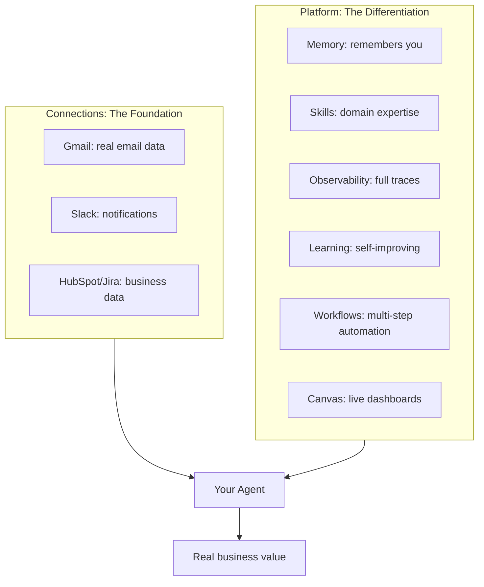
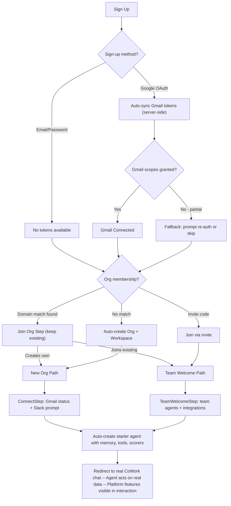

# Onboarding Optimization: Integration-First, Platform-Showcasing Redesign

## Core Thesis: Connections = Power, Platform = Differentiation

AgentC2 is not "chat with an AI" (ChatGPT does that) or "connect apps" (Zapier does that). It is an **intelligent agent platform** where AI agents act on your real data, remember context across conversations, learn and improve over time, orchestrate complex workflows, and generate live dashboards -- all connected to the tools you already use.

The onboarding must communicate TWO things simultaneously:

1. **Connections = power** -- Get integrations connected fast (the Zapier insight)
2. **This is not just another chatbot** -- The agent has memory, skills, observability, learning, workflows, and canvas. Show this through the agent's behavior during onboarding, not through feature lists.



**The onboarding agent itself demonstrates the platform.** It uses memory to remember what it learned about the user. It shows tool calls transparently (observability). It suggests creating a canvas dashboard (canvas). It proposes a workflow based on the user's data (workflows). The user experiences the differentiation by using it, not by reading about it.

---

---

## Critical Discovery: Google OAuth = Free Gmail Access

The existing sign-up flow already requests Gmail scopes when users sign up with Google OAuth:

```typescript
// packages/auth/src/auth.ts (lines 12-16)
const googleScopes = [
    "https://www.googleapis.com/auth/gmail.modify",
    "https://www.googleapis.com/auth/gmail.send",
    "https://www.googleapis.com/auth/calendar.readonly"
];
// accessType: "offline" -- gets refresh token
// prompt: "consent" -- forces scope grant
```

This means: **every Google sign-up user has already granted Gmail access**. The tokens sit in the `Account` table. A sync endpoint (`/api/integrations/gmail/sync`) already exists to copy them to `IntegrationConnection`. There is even a `GmailSyncOnLogin` component that attempts auto-sync.

The problem: this sync is unreliable during onboarding, happens asynchronously on login, and the user never sees the result. We must make this sync **instant and guaranteed during the onboarding bootstrap**, so by the time the user sees any onboarding screen, Gmail is already connected and ready.

**Gmail tools available immediately after sync:**

- `gmail-search-emails` -- Search using Gmail query syntax
- `gmail-read-email` -- Read full email content
- `gmail-archive-email` -- Archive emails
- `gmail-draft-email` -- Create draft emails for human review
- `google-calendar-search-events` -- Search calendar events (bonus, same OAuth)

**Slack tools available after separate OAuth (~5 seconds):**

- `slack_post_message` -- Post to channels/DMs
- `slack_reply_to_thread` -- Reply in threads
- `slack_list_channels` -- List channels
- `slack_get_channel_history` -- Read channel messages
- `slack_get_users` -- List workspace users
- Plus 3 more tools

---

## Current Flow Audit

7 clicks to first value. 3-5 minutes. No real data. No platform differentiation shown.

### The 8-Step Problem (Summary)

```
Sign Up --> Bootstrap Org --> /onboarding
                                  |
                          1. Join Org (conditional)
                          2. Welcome (marketing filler)
                          3. Template (premature choice)
                          4. Configure (premature complexity)
                          5. Integrations (ALL show "Not connected")
                          6. Tools (meaningless without context)
                          7. Test (finally, value! -- but in a mini-chat box)
                          8. Success (redundant)
```

Key failures:

- Integrations step shows 10 "Not connected" badges -- demoralizing, no way to connect in-place
- Google OAuth tokens sit unused in `Account` table during the entire onboarding
- SYSTEM agents (`assistant`, `workspace-concierge`) are never surfaced
- Zero platform differentiators demonstrated (memory, skills, observability, evaluations, canvas, workflows, networks, learning)
- Everyone gets the same flow regardless of sign-up method or available integrations
- The user leaves onboarding thinking this is "ChatGPT with a nice UI"

### Platform Features Missing from Current Onboarding

| Capability                                | Current Status    | Should Be                                               |
| ----------------------------------------- | ----------------- | ------------------------------------------------------- |
| Memory (working memory + semantic recall) | Not mentioned     | Agent remembers user's name/role from first interaction |
| Skills (progressive disclosure)           | Not mentioned     | Agent discovers capabilities as user asks               |
| Observability (runs, traces, analytics)   | Not shown         | Tool calls visible in UI, run traces created            |
| Evaluation/Scoring                        | Not configured    | Scorers attached from day one, quality tracked          |
| Canvas (AI-generated dashboards)          | Not demonstrated  | Agent suggests creating a dashboard                     |
| Workflows (multi-step orchestration)      | Welcome text only | Agent suggests workflow for repeated tasks              |
| Triggers/Automations                      | Not mentioned     | Agent mentions "I could do this automatically"          |
| Learning (self-improving)                 | Not mentioned     | Foundation laid for future improvement                  |

---

## Best-in-Class Comparison

Common pattern across best-in-class SaaS: Zapier, Retool, Vercel, Plaid, Calendly all connect ONE real data source first, then immediately show value with real data. None show 10 empty badges.

**Our edge**: Unlike Zapier (connect and automate), we have an intelligent agent that ACTS on the data with memory, skills, observability, learning, and dashboard generation. The onboarding should show this.

---

## Proposed Redesign: Integration-First, Platform-Showcasing Onboarding

### Design Principles

1. **Connections before configuration** -- Get Gmail connected instantly via Google OAuth; prompt Slack as second domino
2. **Show, don't tell** -- The onboarding agent USES memory, tools, and canvas to demonstrate the platform. No feature bullet lists
3. **Real data, not demos** -- Show the user's actual emails, not "What can you help me with?"
4. **Use existing components** -- Build with existing UI library (Conversation, PromptInput, Card, Badge, etc.)
5. **Graceful degradation** -- Every edge case has a fallback path. Partial scopes? Skip Gmail. Empty inbox? Show capabilities
6. **Feature flag safety** -- Old flow preserved behind `FEATURE_NEW_ONBOARDING`. Rollback in one env var change

### Flow Architecture



### Path 1: Google OAuth Sign-Up (First in Org) -- The Golden Path

**Step 0 (invisible to user): Server-side Bootstrap**

1. Google OAuth completes -> Better Auth stores tokens in `Account`
2. `bootstrapUserOrganization()` runs:

- Creates org + default workspace
- NEW: Calls `syncGmailFromAccount()` server-side
- Edge case: if Gmail scopes missing, sets `gmailSyncStatus: "partial_scopes"` in membership metadata
- Creates `IntegrationConnection` for Gmail (org-scoped, AES-256-GCM encrypted)

1. Redirect to `/onboarding`

**Step 1: ConnectStep (single screen, ~5 seconds)**
Built with existing `Card`, `Badge`, `Button`, `Separator` components.

- Top: Gmail status card with green Badge ("Connected"), user's email, "4 email tools unlocked"
- Middle: Slack CTA card with "Connect Slack" button (popup OAuth -- stays on page)
- Bottom: "Continue" button + "Add more integrations anytime"
- Edge case: Gmail sync failed -> Yellow badge, "Re-authorize" button using `linkSocial` with `include_granted_scopes`

**Step 2: Redirect to Real CoWork Chat**

- `POST /api/onboarding/bootstrap-agent` creates starter agent (see "Starter Agent Design" below)
- `POST /api/onboarding/complete` marks onboarding done, records `onboardingPath: "google_oauth"`
- Redirect to `/?agent=<slug>&firstRun=true`
- CoWork detects `firstRun`, auto-sends first message
- Agent searches Gmail, shows real inbox summary, demonstrates tool calls in existing Tool component UI
- User is now in the real product with real value

**Total time: Sign up -> 1 screen -> real product. Under 30 seconds.**

### Path 2: Email/Password Sign-Up (First in Org)

Same ConnectStep, but Gmail shows "not connected" with:

- Large "Connect with Google" CTA card (triggers `linkSocial` with Gmail scopes)
- Clear value prop: "Unlock email management, calendar awareness, and smart drafts"
- Subtle "Skip for now" link

If they connect Google, tokens sync immediately -> same as Path 1 from Step 2.
If they skip, agent created with core tools only. Connection Power Bar persists in app sidebar.

### Path 3: Joining Existing Org (via Invite or Domain Match)

**TeamWelcomeStep** (built with existing Card, Avatar, Badge components):

- "Welcome to [Org Name]!" with org avatar
- Connected integrations shown as Badge row (inherits org-scoped connections)
- Team agent cards (name, description, tool count) using same pattern as `/agents` grid
- "Start Chatting" CTA -> CoWork with team's default agent
- Edge case: org has no USER agents -> show SYSTEM agents (`assistant`, `workspace-concierge`)
- Edge case: org has no integrations -> skip integration badges, show "Your team can add integrations"

**Total time: ~5 seconds (everything already set up)**

### Path 4: Domain Match Creates Own Org

After `JoinOrgStep` (keep existing -- works correctly), flows into Path 1 or 2.

---

## The Starter Agent: Showcasing the Platform

This is the most important design decision. The auto-created agent must demonstrate what makes AgentC2 different from ChatGPT.

### Agent Configuration

```typescript
{
  name: "Your Assistant",  // "Inbox Assistant" if Gmail connected
  slug: auto-generated,
  type: "USER",
  isOnboardingAgent: true,
  modelProvider: "openai",
  modelName: "gpt-4o",

  // MEMORY -- demonstrates memory from the start
  memoryEnabled: true,
  memoryConfig: {
    lastMessages: 15,
    workingMemory: {
      enabled: true,
      template: `# About You\n- **Name**: \n- **Role**: \n- **Key tools**: \n- **Preferences**: \n# Priorities\n- \n# Things Learned\n- `
    },
    semanticRecall: { topK: 3, messageRange: 2 }
  },

  // TOOLS -- based on connected integrations
  tools: [
    "date-time", "calculator", "web-fetch", "memory-recall", "json-parser",
    // If Gmail: "gmail-search-emails", "gmail-read-email", "gmail-archive-email",
    //           "gmail-draft-email", "google-calendar-search-events"
    // If Slack: Slack tools added dynamically
  ],

  // SCORERS -- quality tracking from day one
  scorers: ["relevancy", "completeness"],
}
```

### Agent Instructions (Engineered to Showcase Platform)

```
You are the user's personal AI assistant on AgentC2. You have real tools
connected to their accounts and you can take real actions.

FIRST INTERACTION:
1. If Gmail connected: Search inbox for 5 most recent important emails
   (skip newsletters/promotions). Summarize with sender, subject, key point.
   Ask which to dig into.
2. If no Gmail: Greet warmly, explain capabilities, suggest connecting Gmail.

ONGOING BEHAVIOR:
- Use tools visibly. When you search email, check calendar, draft a reply --
  show what you're doing. The user should SEE the platform working.
- Remember what you learn about the user. Update working memory with name,
  role, preferences, key contacts as you learn them.
- When appropriate, suggest platform capabilities:
  - "I could set up a daily email digest automatically" (Triggers)
  - "Want me to create a dashboard showing email volume trends?" (Canvas)
  - "I can draft a workflow that routes urgent emails to Slack" (Workflows)
- If user asks about something needing an unconnected integration,
  explain what's possible and how to connect it.
```

### What the User Experiences (Platform Features in Action)

| Platform Feature  | How It's Demonstrated During Onboarding                                                 |
| ----------------- | --------------------------------------------------------------------------------------- |
| **Tools**         | Agent calls `gmail-search-emails`, user sees tool call UI (existing Tool component)     |
| **Memory**        | Agent remembers name, role, preferences across messages. Working memory visibly updates |
| **Observability** | Each message creates `AgentRun` with trace. Available in runs/analytics pages           |
| **Evaluation**    | Scorers run on each turn. Quality tracked from day one                                  |
| **Real data**     | Agent shows THEIR emails, not generic responses                                         |
| **Canvas**        | Agent suggests creating a dashboard (user can try it)                                   |
| **Workflows**     | Agent suggests automations (plants the seed for exploration)                            |
| **Triggers**      | Agent mentions "I could do this automatically every morning"                            |

**The user doesn't read about features. They experience them.**

---

## The Connection Power Bar

Persistent, non-blocking component. Built with existing `Badge`, `Button`, `Collapsible`, `Tooltip` components.

### Compact Mode (in sidebar/header after onboarding)

Shows as a row of Badges in the app header: `[Gmail] [Slack] [+3 more]`

### Expanded Mode (on /mcp page and first week after sign-up)

Shows tiers with tool counts and next-unlock suggestions. Clicking unconnected integration opens popup OAuth.

### Smart "Next Unlock" Suggestions

Based on what tools the user has TRIED to use but couldn't (tracked via failed tool calls in `AgentRun` or agent mentions of unconnected services):

- User asks about CRM data -> suggest HubSpot
- User asks about project tracking -> suggest Jira
- User asks about meetings -> suggest Fathom

### Integration Power Tiers

| Tier | Integrations    | New Agent Capabilities                                      |
| ---- | --------------- | ----------------------------------------------------------- |
| 0    | None            | Generic chat, web search, calculations                      |
| 1    | Gmail           | Email management, calendar awareness, drafts                |
| 2    | Gmail + Slack   | Notifications, team messaging, email-to-Slack workflows     |
| 3    | + CRM (HubSpot) | Customer context, deal tracking, contact enrichment         |
| 4    | + PM (Jira)     | Ticket management, sprint tracking, cross-system automation |
| 5    | + All           | Complete business operations with full observability        |

---

## Slack as the Second Domino

Slack transforms agents from "tools you query" into "assistants that proactively help." Three touch points:

1. **ConnectStep**: After Gmail status, Slack card: "Get notified when important emails arrive"
2. **In-chat**: Agent suggests: "Want me to Slack you when VIP contacts email? [Connect Slack]"
3. **Connection Power Bar**: "Add Slack to unlock notifications and team messaging"

**Inline OAuth implementation**: Slack connect opens `window.open()` popup. Modified `/api/slack/callback` detects `mode=popup` query param, returns HTML page that calls `window.opener.postMessage({ type: 'slack-connected', teamId, teamName })` and closes. Parent page listens for message, refreshes connection state, invalidates MCP cache.

Edge case: Browser blocks popup -> fall back to full-page redirect with `returnTo` param.

---

## Edge Cases and Fallbacks

### Google OAuth Edge Cases

| Edge Case                             | Detection                              | Fallback                                                                                                    |
| ------------------------------------- | -------------------------------------- | ----------------------------------------------------------------------------------------------------------- |
| User denies Gmail scopes              | `Account.scope` missing `gmail.modify` | ConnectStep shows "Gmail needs permissions" + re-auth button via `linkSocial` with `include_granted_scopes` |
| Access token expired before sync      | `Account.accessTokenExpiresAt` in past | Use refresh token. If refresh fails, prompt re-auth                                                         |
| Previous sign-up without Gmail scopes | `Account.scope` incomplete             | Treat as email/password path                                                                                |
| Gmail API rate limit                  | 429 response                           | Retry 3x with exponential backoff. If fails, defer to `GmailSyncOnLogin` fallback                           |
| Multiple Google accounts              | Multiple `Account` records             | Use most recently updated for active session                                                                |
| Empty inbox                           | `gmail-search-emails` returns 0        | Agent: "Inbox is empty! I'll be ready when emails arrive. Here's what else I can do..."                     |

### Slack OAuth Edge Cases

| Edge Case       | Detection                   | Fallback                                           |
| --------------- | --------------------------- | -------------------------------------------------- |
| Not Slack admin | `error: "access_denied"`    | "Ask your Slack admin to install AgentC2, or skip" |
| Popup blocked   | `window.open` returns null  | Full-page redirect with `returnTo`                 |
| Enterprise Grid | `isEnterpriseInstall: true` | Handle normally (already supported)                |
| Callback fails  | Error param in callback     | Show retry button in ConnectStep                   |

### Migration and Existing Users

| Edge Case                             | Detection                                          | Handling                                                                                |
| ------------------------------------- | -------------------------------------------------- | --------------------------------------------------------------------------------------- |
| User already completed old onboarding | `membership.onboardingCompletedAt` is set          | Do NOT re-onboard. App loads normally. Connection Power Bar appears if < 3 integrations |
| User mid-old-onboarding               | `onboardingStep` set, `onboardingCompletedAt` null | If `FEATURE_NEW_ONBOARDING=true`, reset step and show new flow                          |
| Auto-agent slug collision             | Slug conflicts with existing                       | `generateUniqueSlug()` with suffix                                                      |
| Feature flag rollback                 | `FEATURE_NEW_ONBOARDING=false`                     | Old flow fully functional, not deleted                                                  |
| `FEATURE_DB_AGENTS=false`             | Env var check                                      | Onboarding still works -- uses SYSTEM agents instead of auto-creating                   |

### Multi-Tenant Edge Cases

| Edge Case                                     | Detection                                                | Handling                                                                                         |
| --------------------------------------------- | -------------------------------------------------------- | ------------------------------------------------------------------------------------------------ |
| User joins org with existing Gmail connection | `IntegrationConnection` exists for gmail, `scope: "org"` | User inherits. No need to sync their own tokens                                                  |
| User-scoped and org-scoped conflict           | Both exist for same provider                             | `isDefault` flag determines priority in agent resolver                                           |
| MCP cache stale after connection              | New connection not reflected                             | `invalidateMcpCacheForOrg()` called on create. 60s TTL as safety net                             |
| Bootstrap fails mid-way                       | Partial state                                            | Each step idempotent. Gmail sync retries on next login via `GmailSyncOnLogin` (kept as fallback) |

### Privacy and Consent

| Concern                         | Handling                                                                                              |
| ------------------------------- | ----------------------------------------------------------------------------------------------------- |
| User alarmed about email access | ConnectStep shows clear scope: "Read and search emails, create drafts (never sends without approval)" |
| Revoking access                 | Settings > Integrations has "Disconnect" per integration                                              |
| GDPR                            | Gmail tools read-only by design. Archive is only "write" action                                       |

---

## File Changes Required

### Modified Files

- [`apps/agent/src/app/onboarding/page.tsx`](apps/agent/src/app/onboarding/page.tsx) -- Feature-flagged rewrite with path branching
- [`packages/auth/src/bootstrap.ts`](packages/auth/src/bootstrap.ts) -- Add `syncGmailFromAccount()` call during bootstrap
- [`apps/agent/src/app/api/integrations/gmail/sync/route.ts`](apps/agent/src/app/api/integrations/gmail/sync/route.ts) -- Extract core logic into importable function
- [`apps/agent/src/components/AppProvidersWrapper.tsx`](apps/agent/src/components/AppProvidersWrapper.tsx) -- KEEP `GmailSyncOnLogin` as fallback
- [`apps/agent/src/app/api/slack/install/route.ts`](apps/agent/src/app/api/slack/install/route.ts) -- Add `mode=popup` query param
- [`apps/agent/src/app/api/slack/callback/route.ts`](apps/agent/src/app/api/slack/callback/route.ts) -- Add popup close + `postMessage`
- [`packages/database/prisma/schema.prisma`](packages/database/prisma/schema.prisma) -- Add fields to Membership and Agent

### New Files

- `apps/agent/src/components/onboarding/ConnectStep.tsx` -- Integration connection screen
- `apps/agent/src/components/onboarding/TeamWelcomeStep.tsx` -- Team onboarding path
- `apps/agent/src/components/ConnectionPowerBar.tsx` -- Persistent integration progress
- `apps/agent/src/app/api/onboarding/bootstrap-agent/route.ts` -- Auto-creates starter agent
- `packages/auth/src/gmail-sync.ts` -- Extracted Gmail sync (server-callable)

### Preserved Files

All existing step components remain behind `FEATURE_NEW_ONBOARDING` flag. `JoinOrgStep.tsx` reused in new flow. `GmailSyncOnLogin` kept as fallback.

### Database Migration

Add to `Membership`: `onboardingPath` (String?), `connectedDuringOnboarding` (String[], default []), `setupProgress` (Json?)
Add to `Agent`: `isOnboardingAgent` (Boolean, default false)

All new fields nullable/defaulted. No data loss. No re-onboarding for existing users.

---

## Existing Components to Reuse

| New Feature            | Existing Components                                                     |
| ---------------------- | ----------------------------------------------------------------------- |
| ConnectStep layout     | `Card`, `CardContent`, `CardHeader`, `Badge`, `Button`, `Separator`     |
| Gmail status indicator | `Badge` with variant coloring                                           |
| Integration tiles      | `Card` pattern from current IntegrationsStep                            |
| TeamWelcomeStep        | `Card`, `Badge`, `Avatar` (same as `/agents` grid)                      |
| Connection Power Bar   | `Badge`, `Button`, `Tooltip`, `Collapsible`                             |
| Live demo              | Full CoWork: `Conversation`, `PromptInput`, `Message`, `MessageContent` |
| Tool calls             | `Tool` component from `packages/ui/src/components/ai-elements/tool.tsx` |
| Loading states         | `Skeleton`, `Loader`, `Shimmer`                                         |
| Empty states           | `ConversationEmptyState` pattern                                        |

---

## Implementation Phases

### Phase 1: Foundation (Gmail sync + DB schema)

- Extract Gmail sync from route handler into `packages/auth/src/gmail-sync.ts`
- Call from `bootstrapUserOrganization()` when Google Account has Gmail scopes
- Edge case handling: partial scopes, expired tokens, retry logic
- Add `FEATURE_NEW_ONBOARDING` env var (default: false)
- `prisma migrate` for new fields
- **Test**: Google sign-up -> `IntegrationConnection` created for Gmail before redirect

### Phase 2: ConnectStep + Bootstrap Agent

- Build `ConnectStep.tsx` using existing Card, Badge, Button
- Build `POST /api/onboarding/bootstrap-agent` route
- Agent created with memory config, scorers, tools based on connections
- **Test**: Google sign-up -> ConnectStep shows Gmail connected -> Continue creates agent

### Phase 3: Live Demo (CoWork integration)

- Wire onboarding completion to redirect to `/?agent=<slug>&firstRun=true`
- CoWork detects `firstRun`, auto-sends first message to agent
- Agent instructions cause Gmail search and inbox summary
- Tool calls visible in existing Tool component UI
- **Test**: Full golden path. Google sign-up -> 1 screen -> chatting with real email data

### Phase 4: Team Welcome + Path Branching

- Build `TeamWelcomeStep.tsx` using existing Card, Avatar, Badge
- Rewrite `onboarding/page.tsx` with feature-flagged path branching
- **Test**: All 4 paths end-to-end

### Phase 5: Connection Power Bar + Inline OAuth

- Build `ConnectionPowerBar.tsx` (compact + expanded)
- Add to main layout after onboarding
- Modify Slack install/callback for popup mode (`window.postMessage`)
- **Test**: Connect Slack from Power Bar without page navigation

### Phase 6: Polish, Edge Cases, Rollback

- Handle all edge cases from tables above
- Privacy consent copy on ConnectStep
- Empty inbox fallback in agent instructions
- Feature flag verified: `FEATURE_NEW_ONBOARDING=false` reverts cleanly
- Analytics: track `onboardingPath`, `connectedDuringOnboarding`
- **Test**: Partial scopes, expired tokens, Slack non-admin, empty inbox, popup blocked

---

## Success Metrics

| Metric                                | Current    | Target                  | Measurement                                                 |
| ------------------------------------- | ---------- | ----------------------- | ----------------------------------------------------------- |
| Time to first real-data interaction   | 3-5 min    | Under 30s (Google path) | Timestamp: sign-up to first `AgentRun` with Gmail tool call |
| Gmail connection rate (Google users)  | ~0% manual | 95%+                    | `connectedDuringOnboarding` includes "gmail"                |
| Slack connection rate (first session) | ~0%        | 30%+                    | `connectedDuringOnboarding` includes "slack"                |
| Onboarding completion rate            | Unknown    | 95%+                    | `onboardingCompletedAt` set / sign-ups                      |
| Platform features experienced         | 0          | 4+ in first session     | Agent uses memory, tools, suggests canvas/workflows         |
| Second-day retention                  | Baseline   | +20%                    | User returns within 24h                                     |
| Integrations per org at 30 days       | Baseline   | 3+ average              | Active `IntegrationConnection` count                        |

---

## What Makes This Industry-Leading

| Aspect                 | Typical SaaS Onboarding             | AgentC2 Onboarding                                                    |
| ---------------------- | ----------------------------------- | --------------------------------------------------------------------- |
| Integration timing     | "Configure integrations later" page | Auto-connected from sign-up OAuth                                     |
| First value            | Feature tour or generic demo        | Agent acts on user's real email data                                  |
| AI differentiation     | Chatbot greeting                    | Memory, tool calls visible, canvas suggested, workflows mentioned     |
| Progressive complexity | Feature dump or slow reveal         | Platform capabilities discovered organically through agent behavior   |
| Observability          | Hidden                              | Every interaction creates traced, evaluated, scored runs              |
| Personalization        | None until manual config            | Working memory template learns user's context from first conversation |
| Team experience        | Same flow as solo                   | Shows team's ecosystem, existing agents, shared integrations          |
| Rollback safety        | No fallback                         | Feature-flagged, old flow preserved, `GmailSyncOnLogin` as backup     |
