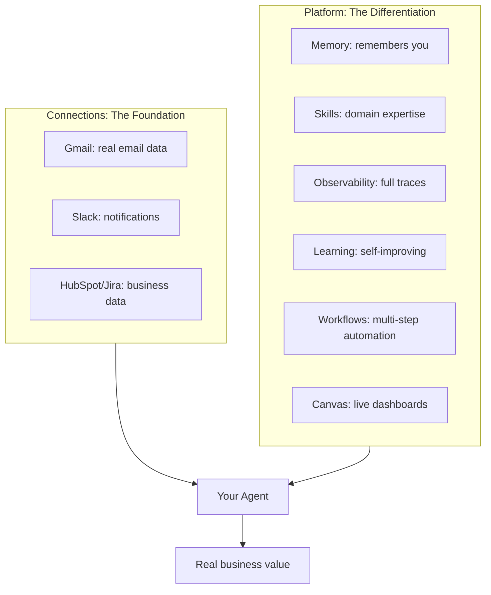
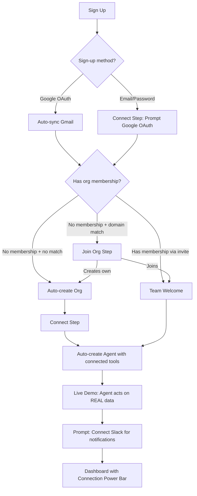

# Onboarding Optimization: Integration-First, Platform-Showcasing Redesign

## Core Thesis: Connections = Power, Platform = Differentiation

AgentC2 is not "chat with an AI" (ChatGPT does that) or "connect apps" (Zapier does that). It is an **intelligent agent platform** where AI agents act on your real data, remember context across conversations, learn and improve over time, orchestrate complex workflows, and generate live dashboards -- all connected to the tools you already use.

The onboarding must communicate TWO things simultaneously:

1. **Connections = power** -- Get integrations connected fast (the Zapier insight)
2. **This is not just another chatbot** -- The agent has memory, skills, observability, learning, workflows, and canvas. Show this through the agent's behavior during onboarding, not through feature lists.



**The onboarding agent itself demonstrates the platform.** It uses memory to remember what it learned about the user. It shows tool calls transparently (observability). It suggests creating a canvas dashboard (canvas). It proposes a workflow based on the user's data (workflows). The user experiences the differentiation by using it, not by reading about it.

---

---

## Critical Discovery: Google OAuth = Free Gmail Access

The existing sign-up flow already requests Gmail scopes when users sign up with Google OAuth:

```typescript
// packages/auth/src/auth.ts (lines 12-16)
const googleScopes = [
    "https://www.googleapis.com/auth/gmail.modify",
    "https://www.googleapis.com/auth/gmail.send",
    "https://www.googleapis.com/auth/calendar.readonly"
];
// accessType: "offline" -- gets refresh token
// prompt: "consent" -- forces scope grant
```

This means: **every Google sign-up user has already granted Gmail access**. The tokens sit in the `Account` table. A sync endpoint (`/api/integrations/gmail/sync`) already exists to copy them to `IntegrationConnection`. There is even a `GmailSyncOnLogin` component that attempts auto-sync.

The problem: this sync is unreliable during onboarding, happens asynchronously on login, and the user never sees the result. We must make this sync **instant and guaranteed during the onboarding bootstrap**, so by the time the user sees any onboarding screen, Gmail is already connected and ready.

**Gmail tools available immediately after sync:**

- `gmail-search-emails` -- Search using Gmail query syntax
- `gmail-read-email` -- Read full email content
- `gmail-archive-email` -- Archive emails
- `gmail-draft-email` -- Create draft emails for human review
- `google-calendar-search-events` -- Search calendar events (bonus, same OAuth)

**Slack tools available after separate OAuth (~5 seconds):**

- `slack_post_message` -- Post to channels/DMs
- `slack_reply_to_thread` -- Reply in threads
- `slack_list_channels` -- List channels
- `slack_get_channel_history` -- Read channel messages
- `slack_get_users` -- List workspace users
- Plus 3 more tools

---

## Current Flow Audit

7 clicks to first value. 3-5 minutes. No real data. No platform differentiation shown.

### The 8-Step Problem (Summary)

```
Sign Up --> Bootstrap Org --> /onboarding
                                  |
                          1. Join Org (conditional)
                          2. Welcome (marketing filler)
                          3. Template (premature choice)
                          4. Configure (premature complexity)
                          5. Integrations (ALL show "Not connected")
                          6. Tools (meaningless without context)
                          7. Test (finally, value! -- but in a mini-chat box)
                          8. Success (redundant)
```

Key failures:

- Integrations step shows 10 "Not connected" badges -- demoralizing, no way to connect in-place
- Google OAuth tokens sit unused in `Account` table during the entire onboarding
- SYSTEM agents (`assistant`, `workspace-concierge`) are never surfaced
- Zero platform differentiators demonstrated (memory, skills, observability, evaluations, canvas, workflows, networks, learning)
- Everyone gets the same flow regardless of sign-up method or available integrations
- The user leaves onboarding thinking this is "ChatGPT with a nice UI"

### Platform Features Missing from Current Onboarding

| Capability                                | Current Status    | Should Be                                               |
| ----------------------------------------- | ----------------- | ------------------------------------------------------- |
| Memory (working memory + semantic recall) | Not mentioned     | Agent remembers user's name/role from first interaction |
| Skills (progressive disclosure)           | Not mentioned     | Agent discovers capabilities as user asks               |
| Observability (runs, traces, analytics)   | Not shown         | Tool calls visible in UI, run traces created            |
| Evaluation/Scoring                        | Not configured    | Scorers attached from day one, quality tracked          |
| Canvas (AI-generated dashboards)          | Not demonstrated  | Agent suggests creating a dashboard                     |
| Workflows (multi-step orchestration)      | Welcome text only | Agent suggests workflow for repeated tasks              |
| Triggers/Automations                      | Not mentioned     | Agent mentions "I could do this automatically"          |
| Learning (self-improving)                 | Not mentioned     | Foundation laid for future improvement                  |

---

## Best-in-Class Comparison

| Product      | Integration-First Pattern                                          | Time to Value |
| ------------ | ------------------------------------------------------------------ | ------------- |
| **Zapier**   | Pick trigger app -> pick action app -> test with real data -> live | Under 2 min   |
| **Retool**   | Connect database -> auto-generate UI from real schema -> customize | Under 3 min   |
| **Vercel**   | Connect GitHub repo -> auto-deploy real code -> live site          | Under 2 min   |
| **Plaid**    | Connect bank account -> see real transactions immediately          | Under 1 min   |
| **Calendly** | Connect Google Calendar -> see real availability -> share link     | Under 1 min   |

**Common pattern: Connect real data source FIRST, then show value with that real data.**

None of these products show you 10 empty "not connected" badges. They guide you to connect ONE thing, then immediately demonstrate value with it.

---

## Proposed Redesign: Integration-First Onboarding

### Design Principles

1. **Connections before configuration** -- Get at least one real integration connected before asking ANY questions about agents
2. **Leverage the sign-up method** -- Google OAuth users already have Gmail; use it immediately
3. **Real data, not demos** -- Show the user their actual emails, not a canned "What can you help me with?"
4. **Slack is the second domino** -- Once they see Gmail value, Slack is the natural next step for notifications
5. **Progressive power** -- Each new connection visibly increases what agents can do

### Flow Architecture



### Path 1: Google OAuth Sign-Up (First in Org)

This is the golden path. The user has already granted Gmail access during sign-up.

**What the user sees:**

```
[Sign Up with Google -- already done, Gmail tokens captured]
        |
        v
Step 1: CONNECT (single screen, ~5 seconds)
  "Gmail is connected! Here's what your agent can do with your email."
  [Preview: 3 recent email subjects from their inbox]

  "Supercharge with Slack" [Connect Slack button]
  "You can always add more integrations later"

  [Continue ->]
        |
        v
Step 2: LIVE DEMO (in real CoWork chat)
  Agent auto-created with Gmail tools + core tools
  Agent's first message:
    "Welcome! I've already connected to your Gmail.
     Here's a quick look at your inbox:
     - [3 important unread emails with sender, subject, snippet]
     Want me to summarize any of these? Or ask me anything about your email."

  [Floating: Connection Power Bar showing Gmail connected, Slack suggested]
        |
        v
[Onboarding complete -- user is in the product with real value]
```

**Total time to value: ~15 seconds (sign-up + one screen + live email data)**

**Backend sequence:**

1. Google OAuth completes -> Better Auth stores tokens in `Account`
2. Bootstrap fires -> auto-creates org + workspace
3. NEW: Immediately sync Gmail tokens from `Account` -> `IntegrationConnection` (guaranteed, not async)
4. NEW: Auto-create agent with Gmail tools + core tools (no user input needed)
5. Redirect to `/onboarding` -> Connect Step shows Gmail already connected
6. User clicks Continue -> redirected to CoWork chat
7. Agent greets with real email summary (calls `gmail-search-emails` + `gmail-read-email`)
8. Onboarding marked complete

### Path 2: Email/Password Sign-Up (First in Org)

The user has no pre-existing connections. We need to motivate them to connect.

**What the user sees:**

```
[Sign Up with email/password -- no tokens]
        |
        v
Step 1: CONNECT (single screen)
  "Your agents are most powerful when connected to your tools."

  [Big card] "Connect Google"
    -> Unlock: Email management, calendar awareness, drafts
    -> Preview: "Your agent will be able to read, search, and
                 organize your inbox"

  [Secondary] "Connect Slack"
    -> Unlock: Notifications, team messaging, channel management

  [Subtle] "Skip for now -- explore with basic tools"

  [Continue ->]
        |
        v
  [If connected Google] -> Same as Path 1 from Step 2
  [If skipped] ->

Step 2: LITE DEMO (in real CoWork chat)
  Agent auto-created with core tools only (calculator, web-fetch, etc.)
  Agent's first message:
    "Welcome! I'm your AI assistant. I can help with research,
     calculations, and general tasks.

     Tip: Connect Gmail to let me manage your inbox, or
     connect Slack for team notifications. [Connect now]"

  [Connection Power Bar: 0/5 connected, "Connect Gmail to unlock email tools"]
```

**Total time to value: ~30 seconds (reduced, but without real data the aha is weaker)**

### Path 3: Joining Existing Org (via Invite or Domain Match)

The org likely already has integrations connected. The user inherits team connections.

**What the user sees:**

```
[Sign Up with invite code or domain match]
        |
        v
Step 1: TEAM WELCOME (single screen)
  "Welcome to [Org Name]!"

  Connected integrations: [Gmail icon] [Slack icon] [HubSpot icon]
  "Your team has 4 agents and 3 integrations ready to use."

  [Agent cards showing team's agents with descriptions]

  [Start Chatting ->] (drops into CoWork with all team agents)
  [Or: Create your own agent]
        |
        v
[Onboarding complete -- user has full access to team's ecosystem]
```

**Total time to value: ~5 seconds (everything is already set up)**

### Path 4: Domain Match -- Creates Own Org

Same as Path 1 (Google) or Path 2 (email/password) after the org decision.

---

## The Connection Power Bar

Replaces both the old Integrations step and the post-onboarding Setup Guide. This is a persistent, non-blocking component visible across the app.

**Concept:**

```
[===Gmail====][===Slack====][           ][           ][           ]
 Connected     Connected    + HubSpot    + Jira        + More
 4 tools       8 tools      "Unlock CRM" "Unlock PM"

 Your agents can: Read email, Send notifications
 Next unlock: Connect HubSpot to manage deals and contacts
```

**Behavior:**

- Shows during onboarding as a floating bar
- Persists in dashboard sidebar/header as a compact indicator
- Each connection shows: what tools it unlocked, what the agent can now do
- "Next unlock" suggests the most impactful next connection based on usage patterns
- Clicking an unconnected integration starts the OAuth flow inline (no page navigation)
- Dismissible after 3+ connections or manually

**Integration power tiers:**

| Tier   | Integrations             | Agent Capabilities                                           |
| ------ | ------------------------ | ------------------------------------------------------------ |
| Tier 0 | None                     | Generic chat, web search, calculations                       |
| Tier 1 | Gmail                    | Read/search/archive email, draft replies, calendar awareness |
| Tier 2 | Gmail + Slack            | Email triage with Slack notifications, team updates          |
| Tier 3 | Gmail + Slack + CRM      | Full customer context, deal tracking, lead scoring           |
| Tier 4 | Gmail + Slack + CRM + PM | Cross-system automation, ticket/deal correlation             |
| Tier 5 | All major integrations   | Complete business operations autopilot                       |

---

## Auto-Created Starter Agent

Instead of asking users to configure an agent, we auto-create one based on what integrations are available:

**With Gmail connected:**

- Name: "Inbox Assistant"
- Instructions: Email-focused -- triage, summarize, draft replies, find important messages
- Tools: `gmail-search-emails`, `gmail-read-email`, `gmail-archive-email`, `gmail-draft-email`, `google-calendar-search-events`, `date-time`, `memory-recall`, `web-fetch`
- First message: Actual inbox summary using real data

**With Gmail + Slack:**

- Name: "Work Assistant"
- Instructions: Email + communication -- triage email, notify via Slack, team coordination
- Tools: All Gmail tools + all Slack tools + core tools
- First message: Inbox summary + "I can also post updates to your Slack channels"

**With no integrations:**

- Name: "Assistant"
- Instructions: General purpose with strong prompts to connect tools
- Tools: `calculator`, `web-fetch`, `date-time`, `memory-recall`, `json-parser`
- First message: Capability overview with integration prompts

The agent is automatically upgraded when new integrations are connected (tools added, instructions updated).

---

## Slack as the Second Domino

Slack is strategically critical because it transforms agents from "tools you query" into "assistants that proactively help you." The onboarding should make Slack the natural next step after Gmail:

**In-onboarding prompt (Connect Step):**
After showing Gmail is connected, show Slack as the recommended next connection with a clear value proposition: "Get Slack notifications when important emails arrive."

**In-chat prompt (Live Demo):**
After the agent shows the email summary, suggest: "Want me to send you a Slack message when you get emails from VIP contacts? [Connect Slack]"

**Post-onboarding prompt (Connection Power Bar):**
"You have Gmail connected. Add Slack to unlock notifications and team messaging."

**Inline Slack OAuth:**
The Slack connect button should trigger OAuth in a popup/modal, not navigate away from the current page. The user stays in context, Slack connects in the background, and new tools appear immediately.

---

## File Changes Required

### Modified Files

- `[apps/agent/src/app/onboarding/page.tsx](apps/agent/src/app/onboarding/page.tsx)` -- Complete rewrite: 3-step flow with path branching
- `[apps/agent/src/app/onboarding/layout.tsx](apps/agent/src/app/onboarding/layout.tsx)` -- Simplify layout, add Connection Power Bar slot
- `[packages/auth/src/bootstrap.ts](packages/auth/src/bootstrap.ts)` -- Add guaranteed Gmail sync during bootstrap for Google OAuth users
- `[apps/agent/src/app/api/integrations/gmail/sync/route.ts](apps/agent/src/app/api/integrations/gmail/sync/route.ts)` -- Make callable from bootstrap (not just from client component)
- `[apps/agent/src/components/AppProvidersWrapper.tsx](apps/agent/src/components/AppProvidersWrapper.tsx)` -- Remove `GmailSyncOnLogin` (sync now happens in bootstrap)
- `[apps/agent/src/app/api/slack/install/route.ts](apps/agent/src/app/api/slack/install/route.ts)` -- Support popup-mode OAuth callback for inline connect

### New Files

- `apps/agent/src/components/onboarding/ConnectStep.tsx` -- Integration connection screen (shows Gmail status, Slack prompt)
- `apps/agent/src/components/onboarding/LiveDemoStep.tsx` -- Redirects to CoWork with auto-created agent and first-message override
- `apps/agent/src/components/onboarding/TeamWelcomeStep.tsx` -- For users joining orgs with existing integrations/agents
- `apps/agent/src/components/ConnectionPowerBar.tsx` -- Persistent integration progress indicator
- `apps/agent/src/app/api/onboarding/bootstrap-agent/route.ts` -- Auto-creates starter agent based on connected integrations
- `packages/auth/src/gmail-sync.ts` -- Extracted Gmail sync logic callable from bootstrap (server-side, not client)

### Deprecated Files (archive, do not delete yet)

- `apps/agent/src/components/onboarding/WelcomeStep.tsx` -- Replaced by ConnectStep
- `apps/agent/src/components/onboarding/TemplateStep.tsx` -- Replaced by auto-creation
- `apps/agent/src/components/onboarding/ConfigureStep.tsx` -- Replaced by auto-creation
- `apps/agent/src/components/onboarding/IntegrationsStep.tsx` -- Replaced by ConnectStep + ConnectionPowerBar
- `apps/agent/src/components/onboarding/ToolStep.tsx` -- Replaced by auto-creation
- `apps/agent/src/components/onboarding/TestStep.tsx` -- Replaced by LiveDemoStep (real CoWork chat)
- `apps/agent/src/components/onboarding/SuccessStep.tsx` -- Replaced by ConnectionPowerBar

### Database Changes

- Add to `Membership` model:
    - `onboardingPath` (String?) -- "google_oauth" | "email_password" | "invite_join" | "domain_join" | "domain_create" (for analytics)
    - `connectedDuringOnboarding` (String[]?) -- Which integrations were connected during onboarding
    - `setupProgress` (Json?) -- Tracks Connection Power Bar state
- Add to `Agent` model:
    - `isOnboardingAgent` (Boolean, default false) -- Identifies auto-created starter agents for upgrade logic

---

## Implementation Phases

### Phase 1: Gmail Auto-Sync on Bootstrap (foundation)

Extract Gmail sync logic into a server-callable function. Call it from `bootstrapUserOrganization()` when the user has a Google Account with Gmail scopes. This ensures Gmail is connected before the user sees any onboarding screen.

### Phase 2: ConnectStep + Auto-Agent Creation

Build the new ConnectStep component and the `bootstrap-agent` API. ConnectStep shows Gmail as already connected (for Google users) and prompts Slack. Auto-agent creation builds the right agent based on available connections.

### Phase 3: LiveDemoStep + Real Data

Build the LiveDemoStep that drops users into CoWork chat where the auto-created agent immediately acts on real data (inbox summary for Gmail users, general greeting for others).

### Phase 4: Connection Power Bar

Build the persistent integration progress indicator. Shows across the app, suggests next connections, enables inline OAuth.

### Phase 5: TeamWelcomeStep + Full Path Branching

Build the team onboarding path for invite/domain-match users. Complete the path branching logic in the rewritten onboarding page.

### Phase 6: Inline Slack OAuth + Agent Upgrade

Build popup-mode Slack OAuth so users can connect without leaving the current page. Implement agent auto-upgrade when new integrations are connected (add tools, update instructions).

---

## Success Metrics

- **Time to first real-data interaction**: Target under 30 seconds for Google OAuth users (currently 3-5 minutes)
- **Gmail connection rate during onboarding**: Target 95%+ for Google users (currently requires manual sync)
- **Slack connection rate within first session**: Target 40%+ (currently near 0% during onboarding)
- **Onboarding completion rate**: Target 95%+ (fewer steps = less drop-off)
- **Integration connection rate within 7 days**: Target 60%+ (Connection Power Bar drives ongoing connection)
- **Second-day retention**: Measure improvement from real-data aha moment vs generic chat
- **Integrations per org at 30 days**: Target 3+ (Zapier benchmark: value correlates with connections)
