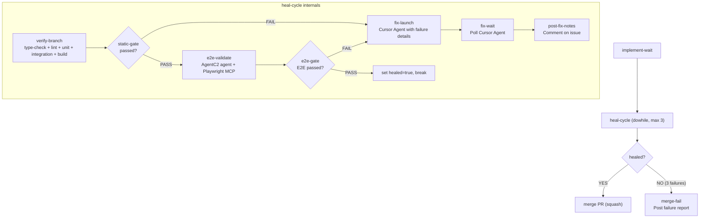

# Intelligent Self-Healing Merge Step for SDLC Pipeline

## Architecture

Replace `merge-review` (human) + `merge` (tool) with a **self-healing validation loop**:

### Steps inside heal-cycle (dowhile, maxIterations: 3)

1. **verify-branch** (tool) -- Run type-check, lint, test:unit, test:integration, build in sandbox
2. **static-gate** (branch) -- If passed, continue. If failed, jump to fix.
3. **e2e-validate** (agent) -- SDLC Auditor + Playwright MCP navigates live app, validates key flows
4. **e2e-gate** (branch) -- If passed, set healed flag. If failed, jump to fix.
5. **fix-launch** (tool) -- Launch Cursor agent with full failure context to fix the code
6. **fix-wait** (tool) -- Poll until Cursor agent pushes fixes
7. **post-fix-notes** (tool) -- Post repair attempt details to GitHub issue

### After heal-cycle

- **merge** (tool) -- Squash merge if healed
- **merge-fail** (tool) -- Post detailed failure report if 3 attempts exhausted

## Files to Modify

- [scripts/seed-sdlc-playbook.ts](scripts/seed-sdlc-playbook.ts) -- 3 locations (bugfix, feature, standard)
- [scripts/seed-sdlc-claude-playbook.ts](scripts/seed-sdlc-claude-playbook.ts) -- 2 locations (bugfix, feature)
- Revert the simple agent swap already made
