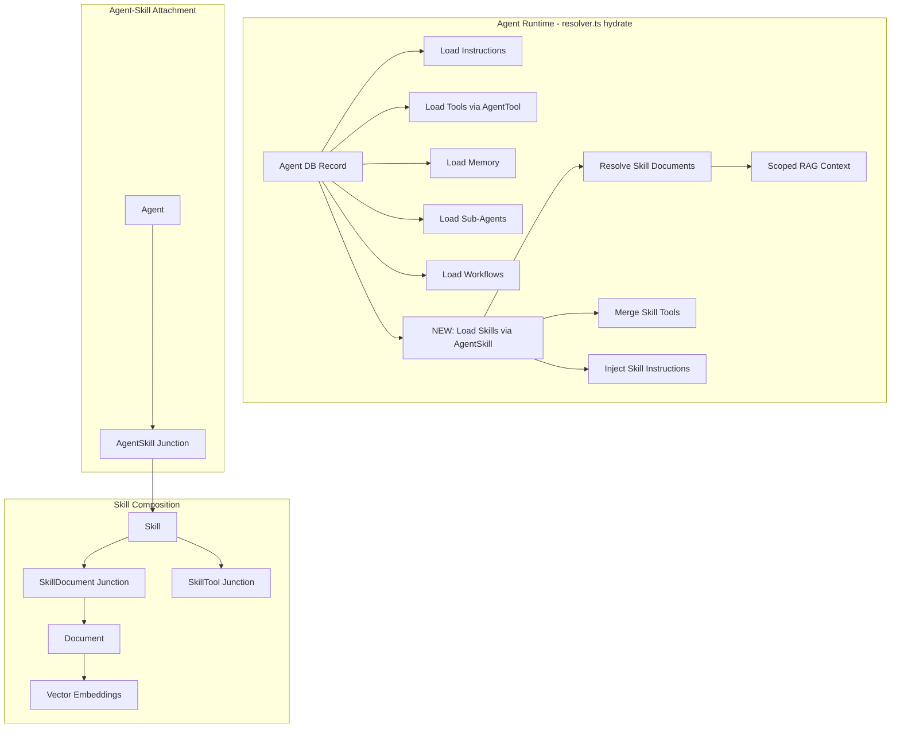

# Skills and Documents Primitives

## Current Primitive Landscape

The platform has 5 primitives today: **Agents**, **Workflows**, **Networks**, **Tools**, **Scorers**. All follow consistent patterns:

- Workspace ownership via nullable `workspaceId` (SetNull on delete)
- Versioning via companion `*Version` models
- MCP exposure via definitions in `packages/mastra/src/tools/mcp-schemas/`
- Tool implementations in `packages/mastra/src/tools/*-tools.ts`
- Registry in `packages/mastra/src/tools/registry.ts`

The gap: Tools provide capability (WHAT an agent can do), but nothing provides competence (HOW/WHEN/WHY). Knowledge exists in `docs/*.md` files but is disconnected from agents and RAG.

## Architecture



## Phase 1: Documents (Foundation)

### 1A. Database Schema

Add to [packages/database/prisma/schema.prisma](packages/database/prisma/schema.prisma):

```prisma
model Document {
    id          String  @id @default(cuid())
    slug        String  @unique
    name        String
    description String? @db.Text
    content     String  @db.Text
    type        String  @default("markdown") // markdown, text, html, json

    // RAG integration
    vectorIds  String[]
    chunkCount Int       @default(0)
    embeddedAt DateTime?

    // Categorization
    category String?
    tags     String[]
    metadata Json?

    // Multi-tenancy (follows existing pattern)
    workspaceId String?
    workspace   Workspace? @relation(fields: [workspaceId], references: [id], onDelete: SetNull)

    // Versioning
    version  Int               @default(1)
    versions DocumentVersion[]

    // Skill relations (added in Phase 2)
    skills SkillDocument[]

    // Type + Audit
    type_     String   @default("USER") @map("doc_type") // USER or SYSTEM
    createdAt DateTime @default(now())
    updatedAt DateTime @updatedAt
    createdBy String?

    @@index([workspaceId])
    @@index([category])
    @@map("document")
}

model DocumentVersion {
    id            String   @id @default(cuid())
    documentId    String
    document      Document @relation(fields: [documentId], references: [id], onDelete: Cascade)
    version       Int
    content       String   @db.Text
    changeSummary String?
    createdAt     DateTime @default(now())
    createdBy     String?

    @@unique([documentId, version])
    @@map("document_version")
}
```

Also add `documents Document[]` relation to the `Workspace` model.

### 1B. Document Service

Create `packages/mastra/src/documents/service.ts` -- handles CRUD with automatic RAG embedding:

- `createDocument()` -- insert DB row, chunk content, embed into vector DB, store vectorIds back
- `updateDocument()` -- create version, delete old vectors, re-chunk, re-embed
- `deleteDocument()` -- delete DB row + cascade, delete vectors by documentId filter
- `getDocument()` / `listDocuments()` -- standard queries
- `searchDocuments()` -- semantic search via existing `queryRag()` with `documentId` filter
- `reembedDocument()` -- force re-chunk and re-embed (useful after RAG config changes)

Key: The existing [packages/mastra/src/rag/pipeline.ts](packages/mastra/src/rag/pipeline.ts) already has `ingestDocument()`, `queryRag()`, and `deleteDocument()`. The service wraps these with the Prisma model layer.

### 1C. API Routes

Create under `apps/agent/src/app/api/documents/`:

- `GET /api/documents` -- list documents (filter by category, tags, workspace)
- `POST /api/documents` -- create document (auto-embeds)
- `GET /api/documents/[id]` -- get single document
- `PUT /api/documents/[id]` -- update document (auto-re-embeds)
- `DELETE /api/documents/[id]` -- delete document + vectors
- `POST /api/documents/[id]/search` -- semantic search scoped to document
- `GET /api/documents/[id]/versions` -- version history

### 1D. MCP Tool Exposure

Create `packages/mastra/src/tools/document-tools.ts` with tool implementations, then expose via:

- Create `packages/mastra/src/tools/mcp-schemas/documents.ts` with definitions + routes
- Update [packages/mastra/src/tools/mcp-schemas/index.ts](packages/mastra/src/tools/mcp-schemas/index.ts) to aggregate
- Update [packages/mastra/src/tools/registry.ts](packages/mastra/src/tools/registry.ts) to register

MCP tools to expose:

- `document-create` -- create a document, auto-embed into RAG
- `document-read` -- read a document by ID or slug
- `document-update` -- update content, auto-re-embed
- `document-delete` -- remove document and its embeddings
- `document-list` -- list documents with filters
- `document-search` -- semantic search across documents (wraps queryRag with doc filter)

### 1E. Seed Existing Docs

Create a seed script that ingests the 15 existing `docs/*.md` files as Documents. This proves the system works and immediately makes organizational knowledge RAG-searchable.

---

## Phase 2: Skills (Composition Layer)

### 2A. Database Schema

Add to [packages/database/prisma/schema.prisma](packages/database/prisma/schema.prisma):

```prisma
model Skill {
    id           String  @id @default(cuid())
    slug         String  @unique
    name         String
    description  String? @db.Text
    instructions String  @db.Text // Procedural knowledge
    examples     String? @db.Text // Reference outputs

    // Categorization
    category String?
    tags     String[]
    metadata Json?

    // Multi-tenancy
    workspaceId String?
    workspace   Workspace? @relation(fields: [workspaceId], references: [id], onDelete: SetNull)

    // Versioning
    version  Int            @default(1)
    versions SkillVersion[]

    // Composition
    documents SkillDocument[]
    tools     SkillTool[]
    agents    AgentSkill[]

    // Type + Audit
    type      String   @default("USER") // USER or SYSTEM
    createdAt DateTime @default(now())
    updatedAt DateTime @updatedAt
    createdBy String?

    @@index([workspaceId])
    @@index([category])
    @@map("skill")
}

model SkillVersion {
    id            String   @id @default(cuid())
    skillId       String
    skill         Skill    @relation(fields: [skillId], references: [id], onDelete: Cascade)
    version       Int
    instructions  String   @db.Text
    configJson    Json? // Snapshot of documents, tools
    changeSummary String?
    createdAt     DateTime @default(now())
    createdBy     String?

    @@unique([skillId, version])
    @@map("skill_version")
}

model SkillDocument {
    id         String   @id @default(cuid())
    skillId    String
    skill      Skill    @relation(fields: [skillId], references: [id], onDelete: Cascade)
    documentId String
    document   Document @relation(fields: [documentId], references: [id], onDelete: Cascade)
    role       String? // "reference", "procedure", "example", "context"

    @@unique([skillId, documentId])
    @@map("skill_document")
}

model SkillTool {
    id      String @id @default(cuid())
    skillId String
    skill   Skill  @relation(fields: [skillId], references: [id], onDelete: Cascade)
    toolId  String // Tool registry key or MCP tool name

    @@unique([skillId, toolId])
    @@map("skill_tool")
}

model AgentSkill {
    id      String @id @default(cuid())
    agentId String
    agent   Agent  @relation(fields: [agentId], references: [id], onDelete: Cascade)
    skillId String
    skill   Skill  @relation(fields: [skillId], references: [id], onDelete: Cascade)

    @@unique([agentId, skillId])
    @@map("agent_skill")
}
```

Also add `skills AgentSkill[]` to the `Agent` model and `skills Skill[]` to `Workspace`.

### 2B. Agent Resolver Integration (Critical Change)

Modify [packages/mastra/src/agents/resolver.ts](packages/mastra/src/agents/resolver.ts) `hydrate()` method:

**Current flow:**

1. Process instructions
2. Build memory
3. Load tools from AgentTool
4. Load scorers
5. Build model config
6. Load sub-agents
7. Load workflows
8. Construct Agent

**New flow (additions in bold):**

1. Process base instructions
2. Build memory
3. Load tools from AgentTool
4. **Load skills from AgentSkill (with documents + tools)**
5. **Merge skill tools into agent tools**
6. **Assemble skill context into instructions**
7. Load scorers
8. Build model config
9. Load sub-agents
10. Load workflows
11. Construct Agent

New method `loadSkills()`:

```typescript
private async loadSkills(agentId: string): Promise<{
    skillInstructions: string;
    skillTools: Record<string, Tool>;
    skillDocumentIds: string[];
}> {
    const agentSkills = await prisma.agentSkill.findMany({
        where: { agentId },
        include: {
            skill: {
                include: {
                    documents: { include: { document: true } },
                    tools: true
                }
            }
        }
    });

    let skillInstructions = "";
    const skillToolIds: string[] = [];
    const skillDocumentIds: string[] = [];

    for (const { skill } of agentSkills) {
        // Collect skill instructions
        skillInstructions += `\n\n## Skill: ${skill.name}\n${skill.instructions}`;
        if (skill.examples) {
            skillInstructions += `\n\n### Examples:\n${skill.examples}`;
        }

        // Collect tool IDs
        for (const st of skill.tools) {
            skillToolIds.push(st.toolId);
        }

        // Collect document IDs for scoped RAG
        for (const sd of skill.documents) {
            skillDocumentIds.push(sd.documentId);
        }
    }

    // Resolve skill tools (same flow as agent tools)
    const skillTools = skillToolIds.length > 0
        ? await getToolsByNamesAsync(skillToolIds, organizationId)
        : {};

    return { skillInstructions, skillTools, skillDocumentIds };
}
```

Instructions assembly becomes:

```typescript
let instructions = record.instructionsTemplate
    ? this.interpolateInstructions(record.instructionsTemplate, context || {})
    : record.instructions;

// Inject skill context
const { skillInstructions, skillTools, skillDocumentIds } = await this.loadSkills(record.id);
if (skillInstructions) {
    instructions += `\n\n---\n# Skills & Domain Knowledge\n${skillInstructions}`;
}

// Merge skill tools with agent tools
tools = { ...skillTools, ...tools }; // Agent-explicit tools take precedence
```

The `skillDocumentIds` array gets stored on the agent instance (or passed via metadata) so that RAG queries at runtime can be scoped to relevant documents only.

### 2C. API Routes

Create under `apps/agent/src/app/api/skills/`:

- `GET /api/skills` -- list skills
- `POST /api/skills` -- create skill
- `GET /api/skills/[id]` -- get skill with documents + tools
- `PUT /api/skills/[id]` -- update skill
- `DELETE /api/skills/[id]` -- delete skill
- `POST /api/skills/[id]/documents` -- attach document to skill
- `DELETE /api/skills/[id]/documents/[docId]` -- detach document
- `POST /api/skills/[id]/tools` -- attach tool to skill
- `DELETE /api/skills/[id]/tools/[toolId]` -- detach tool
- `POST /api/agents/[agentId]/skills` -- attach skill to agent
- `DELETE /api/agents/[agentId]/skills/[skillId]` -- detach skill from agent

### 2D. MCP Tool Exposure

Same pattern as Documents: create `skill-tools.ts`, `mcp-schemas/skills.ts`, register in index + registry.

MCP tools:

- `skill-create`, `skill-read`, `skill-update`, `skill-delete`, `skill-list`
- `skill-attach-document`, `skill-detach-document`
- `skill-attach-tool`, `skill-detach-tool`
- `agent-attach-skill`, `agent-detach-skill`

---

## Files Changed Summary

### Phase 1 (Documents)

- **Modified:** [packages/database/prisma/schema.prisma](packages/database/prisma/schema.prisma) -- Document + DocumentVersion models
- **New:** `packages/mastra/src/documents/service.ts` -- Document service with RAG integration
- **New:** `packages/mastra/src/documents/index.ts` -- Exports
- **Modified:** [packages/mastra/src/rag/pipeline.ts](packages/mastra/src/rag/pipeline.ts) -- Add document-scoped query support
- **New:** `packages/mastra/src/tools/document-tools.ts` -- Document tool implementations
- **New:** `packages/mastra/src/tools/mcp-schemas/documents.ts` -- MCP definitions + routes
- **Modified:** [packages/mastra/src/tools/mcp-schemas/index.ts](packages/mastra/src/tools/mcp-schemas/index.ts) -- Aggregate document tools
- **Modified:** [packages/mastra/src/tools/registry.ts](packages/mastra/src/tools/registry.ts) -- Register document tools
- **New:** `apps/agent/src/app/api/documents/route.ts` -- Document list + create
- **New:** `apps/agent/src/app/api/documents/[documentId]/route.ts` -- Document read + update + delete
- **New:** `scripts/seed-documents.ts` -- Seed existing docs/.md files

### Phase 2 (Skills)

- **Modified:** [packages/database/prisma/schema.prisma](packages/database/prisma/schema.prisma) -- Skill + SkillVersion + junction tables + Agent.skills relation
- **New:** `packages/mastra/src/skills/service.ts` -- Skill service
- **New:** `packages/mastra/src/skills/index.ts` -- Exports
- **Modified:** [packages/mastra/src/agents/resolver.ts](packages/mastra/src/agents/resolver.ts) -- `loadSkills()` method, instruction injection, tool merging
- **New:** `packages/mastra/src/tools/skill-tools.ts` -- Skill tool implementations
- **New:** `packages/mastra/src/tools/mcp-schemas/skills.ts` -- MCP definitions + routes
- **Modified:** [packages/mastra/src/tools/mcp-schemas/index.ts](packages/mastra/src/tools/mcp-schemas/index.ts) -- Aggregate skill tools
- **Modified:** [packages/mastra/src/tools/registry.ts](packages/mastra/src/tools/registry.ts) -- Register skill tools
- **New:** `apps/agent/src/app/api/skills/route.ts` -- Skill list + create
- **New:** `apps/agent/src/app/api/skills/[skillId]/route.ts` -- Skill CRUD
- **New:** `apps/agent/src/app/api/skills/[skillId]/documents/route.ts` -- Attach/detach documents
- **New:** `apps/agent/src/app/api/skills/[skillId]/tools/route.ts` -- Attach/detach tools
- **Modified:** `apps/agent/src/app/api/agents/[agentId]/` -- Add skill attach/detach endpoints
