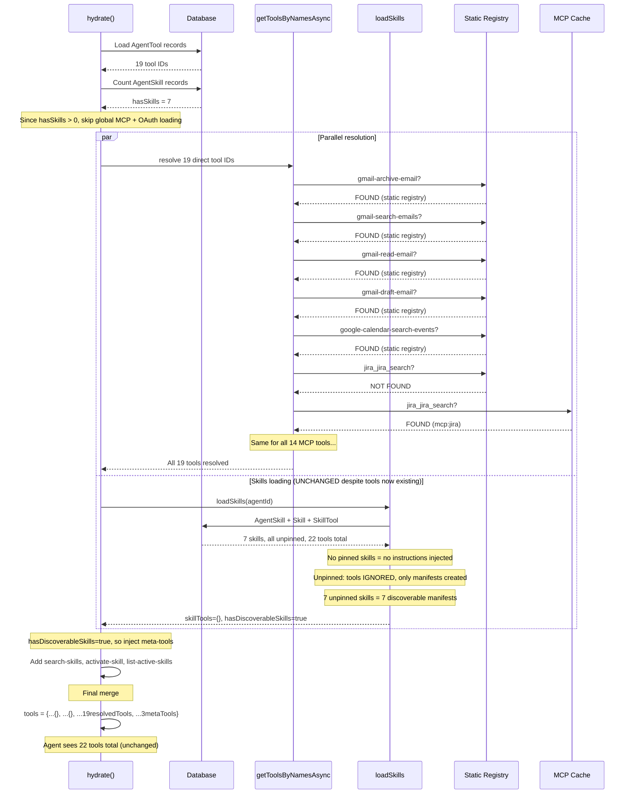
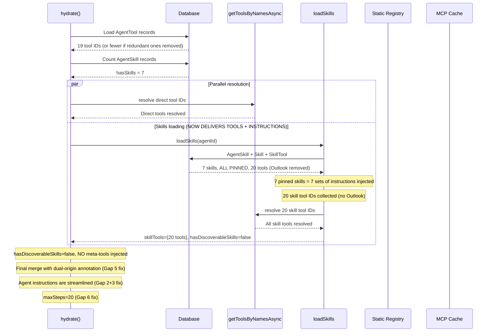

# Email-Triage Runtime Analysis: Skills, Tools, and the Proof

> **UPDATE (Feb 12, 2026)**: Architecture audit completed. Identified 6 gaps requiring remediation before skills can be pinned safely. Key issues: (1) unsafe `outlook-mail-send-email` in `gmail-draft-response` skill, (2) instruction duplication between agent and skills, (3) hardcoded tool allowlist in ABSOLUTE RULES, (4) Outlook tools with no Microsoft OAuth connection, (5) origin map attribution for overlapping tools, (6) maxSteps too low for expanded tool set. All pre-requisites are sequenced before the pin step.

## Pre-Pinning Remediation (Gaps 1-6)

These issues were discovered during the architecture audit and MUST be resolved before executing the `pin-email-triage-skills` step.

### Gap 1 (CRITICAL): Remove unsafe Outlook tools from email-triage skills

The `gmail-draft-response` skill has `outlook-mail-send-email` -- a SEND operation. The agent's safety rules state "ONLY create drafts via gmail-draft-email. NEVER send emails." Pinning would inject this tool into the agent's tool set, violating safety constraints. Additionally, there are **zero Microsoft OAuth connections**, so the tool would fail at runtime regardless.

The `calendar-email-enrichment` skill has `outlook-calendar-list-events` -- same issue (no Microsoft connection, tool will always fail).

**Action**: Detach `outlook-mail-send-email` from `gmail-draft-response` and `outlook-calendar-list-events` from `calendar-email-enrichment` via `skill_detach_tool`. After this:

- `gmail-draft-response`: 1 tool (`gmail-draft-email`)
- `calendar-email-enrichment`: 1 tool (`google-calendar-search-events`)
- Total skill tools: 20 (was 22)

### Gap 2+3 (HIGH): Reconcile agent instructions with skill instructions

**Problem**: The agent's main instructions contain detailed step-by-step enrichment procedures (9 steps for SUPPORT, 7 for SALES) that duplicate what the skill instructions provide. After pinning, the agent sees BOTH, creating contradictory guidance. Additionally, the ABSOLUTE RULES section hardcodes a specific tool allowlist (`Your available tools are: ...`). After pinning, 6 new tools arrive via skills that aren't in this list, creating a paradox where the agent is told "ONLY use these tools" but has additional tools available.

**Action**: Rewrite agent instructions in two passes:

1. **Remove detailed enrichment procedures** from main instructions. Keep classification logic, business context (customers, domains, channels), safety constraints, and output format. Let skills drive the "how to use tools" guidance.
2. **Rewrite ABSOLUTE RULES** to say "ONLY use tools in your tool set" instead of enumerating specific tools. Keep explicit prohibition of `search-skills`, `activate-skill`, `list-active-skills`. Keep safety rules about drafts-only and no archiving SUPPORT/SALES.

### Gap 4 (resolved by Gap 1): Outlook tools removed

Addressed entirely by Gap 1. No separate action needed.

### Gap 5 (MEDIUM): Fix origin map attribution for overlapping tools

**Problem**: After pinning, 14 tools exist in both direct `AgentTool` records and `SkillTool` records. The merge order `{...skillTools, ...registryTools}` means registry wins, so `toolOriginMap` marks all 14 as `"registry"` instead of attributing them to their skill. This breaks skill effectiveness tracking in traces/UI.

**Action**: In `resolver.ts`, after the final tool merge, add an annotation pass that checks if a tool exists in BOTH `skillTools` and `registryTools`. If so, set `toolOriginMap[key]` to a dual format like `"registry+skill:slug"` to preserve skill attribution.

### Gap 6 (MEDIUM): Increase maxSteps

**Problem**: Current `maxSteps: 15` with `parallelToolCalls: false`. SUPPORT enrichment alone is 9 sequential steps. With skill-delivered tools adding deeper enrichment options (batch-read, meeting-details) and failed tool calls wasting steps, 15 is too tight.

**Action**: Increase `maxSteps` to 20 via `agent_update`.

---

## Part 1: What the email-triage agent ACTUALLY does at runtime

### The agent's configuration (v30)

- **19 direct tool references** (`AgentTool` records): 8 Slack MCP, 4 Gmail OAuth, 1 Google Calendar OAuth, 2 Jira MCP, 2 HubSpot MCP, 2 Fathom MCP
- **7 skills attached** (`AgentSkill` records): `hubspot-email-enrichment`, `jira-ticket-context`, `fathom-meeting-context`, `calendar-email-enrichment`, `gmail-draft-response`, `gmail-email-history`, `slack-channel-context`
- **All 7 skills have tools attached** (20 total after Gap 1 remediation): HubSpot enrichment (5), Jira context (4), Fathom meetings (3), Calendar enrichment (1), Gmail history (2), Gmail drafts (1), Slack context (4)
- **None of the 7 skills are pinned** -- they are all "discoverable"
- **Because skills are unpinned, their tools are NOT loaded into the agent's tool set.** The resolver only creates discoverable manifests for unpinned skills (see `loadSkills()` line 539). Tools are only delivered when skills are pinned or thread-activated.
- **No `mcpEnabled**`in metadata (only`{slack: {iconEmoji, displayName}}`)

### The exact `hydrate()` sequence for this agent

[UPDATED] Now that skills have tools, pinning them would change this flow significantly.

**Current flow (skills unpinned -- tools still come from direct AgentTool records):**



**Target flow (after all pre-pin remediation + pinning -- tools come from skills, direct tools become redundant):**



### What the agent actually sees at runtime

Currently still **22 tools** (unchanged from before the audit):

- 19 declared tools (resolved from registry + MCP cache via direct AgentTool records)
- 3 injected meta-tools: `search-skills`, `activate-skill`, `list-active-skills`

**After all pre-pin remediation + pinning**, the agent will see approximately **25 tools**:

- 19 from direct `AgentTool` records (14 overlap with skills, 5 are agent-only: `slack_slack_post_message`, `slack_slack_reply_to_thread`, `slack_slack_add_reaction`, `slack_slack_get_thread_replies`, `gmail-archive-email`)
- 6 net-new tools from skills (not in direct list): `hubspot_hubspot-batch-read-objects`, `hubspot_hubspot-get-user-details`, `hubspot_hubspot-list-objects`, `jira_jira_get_transitions`, `jira_jira_get_all_projects`, `fathom_get_meeting_details`
- 0 meta-tools (eliminated by pinning all skills)

Agent instructions will be streamlined: classification logic, business context, safety rules, output format. Skill instructions provide tool-specific enrichment guidance. ABSOLUTE RULES no longer enumerate specific tools.

### Evidence from traces: skills are NOT being used

Looking at the 10 most recent production runs (113 total runs), here are the actual tool calls made:

| Run                 | Category    | Tools Called                                                                                                                                                                     | Any Skill Invocation? |
| ------------------- | ----------- | -------------------------------------------------------------------------------------------------------------------------------------------------------------------------------- | --------------------- |
| Fathom recap        | OPERATIONAL | gmail-read-email, gmail-archive-email, slack_slack_post_message                                                                                                                  | No                    |
| Software Connect    | SALES       | hubspot_hubspot-search-objects, slack_slack_post_message x2                                                                                                                      | No                    |
| Substack newsletter | NEWSLETTER  | gmail-archive-email, slack_slack_post_message                                                                                                                                    | No                    |
| LDCA                | SALES       | hubspot_hubspot-search-objects, google-calendar-search-events, fathom_list_meetings, gmail-search-emails, slack_slack_post_message x2                                            | No                    |
| RB2B newsletter     | NEWSLETTER  | gmail-read-email, gmail-archive-email, slack_slack_post_message                                                                                                                  | No                    |
| Fathom recap 2      | OPERATIONAL | gmail-read-email, gmail-archive-email, slack_slack_post_message                                                                                                                  | No                    |
| Envato newsletter   | NEWSLETTER  | gmail-archive-email, slack_slack_post_message                                                                                                                                    | No                    |
| Fathom competitors  | OPERATIONAL | gmail-read-email, jira_jira_search, jira_jira_get_issue, fathom_list_meetings, fathom_get_meeting_summary, gmail-search-emails, gmail-archive-email, slack_slack_post_message x2 | No                    |
| GitHub CI/CD        | CI_CD       | slack_slack_post_message                                                                                                                                                         | No                    |
| Internal email      | INTERNAL    | (no tool calls)                                                                                                                                                                  | No                    |

**Zero skill invocations across all 10 runs.** No `search-skills`, no `activate-skill`, no `list-active-skills`. [UPDATED] This is expected because skills are unpinned. After pinning, skills will contribute tools and instructions directly -- no meta-tool invocation needed.

---

## Part 2: How skills and tools relate across the ENTIRE system

### Unified skill pattern in production

After the skill-tool association audit and Gap 1 remediation, all skills follow the same pattern:

**Skills as tool bundles** -- skills carry BOTH instructions AND tool references.

- **workspace-concierge** (32 skills): MCP skills (e.g., `mcp-crm-hubspot` with 21 tools, `mcp-project-jira` with 32 tools) + SYSTEM skills
- **email-triage** (7 skills, 20 tools after Outlook removal):
    - `hubspot-email-enrichment`: 5 HubSpot tools (search, batch read, associations, user details, list)
    - `jira-ticket-context`: 4 Jira tools (search, get issue, transitions, all projects)
    - `fathom-meeting-context`: 3 Fathom tools (list meetings, summary, details)
    - `calendar-email-enrichment`: 1 tool (Google Calendar search) -- Outlook Calendar removed (Gap 1)
    - `gmail-email-history`: 2 Gmail tools (search, read)
    - `gmail-draft-response`: 1 tool (Gmail draft) -- Outlook send removed (Gap 1)
    - `slack-channel-context`: 4 Slack tools (channel history, list channels, users, user profile)

All skills are tool bundles. The remaining issue is that the email-triage skills are **unpinned**, so their tools are not delivered to the agent at runtime (see Part 1 diagram). Pre-pin remediation (Gaps 1-6) must be completed first.

### Which skills reference OAuth tools?

| Skill                       | OAuth Tools Attached                                                 | Status                          |
| --------------------------- | -------------------------------------------------------------------- | ------------------------------- |
| `email-management`          | 13 tools (4 Gmail, 1 GCal, 4 Outlook Mail, 4 Outlook Cal)            | Attached to workspace-concierge |
| `cloud-file-storage`        | 5 Dropbox tools                                                      | SYSTEM skill, not yet attached  |
| `gmail-draft-response`      | 1 tool (`gmail-draft-email`) -- Outlook send removed                 | Attached to email-triage        |
| `gmail-email-history`       | 2 tools (`gmail-search-emails`, `gmail-read-email`)                  | Attached to email-triage        |
| `calendar-email-enrichment` | 1 tool (`google-calendar-search-events`) -- Outlook Calendar removed | Attached to email-triage        |

**Note**: Outlook and Dropbox tools remain in SYSTEM skills (`email-management`, `cloud-file-storage`) for workspace-concierge and future agents that will have Microsoft/Dropbox OAuth connections. They are only removed from email-triage skills where no connection exists.

**Critical finding (unchanged)**: These OAuth tool IDs resolve from the static registry today. When the OAuth Provider is implemented, `getToolsByNamesAsync()` will find them via the OAuth cache instead. No skill or agent configuration changes needed -- the tool IDs stay the same.

---

## Part 3: Is the current system working properly?

### What works

1. **Tool resolution chain**: `getToolsByNamesAsync()` correctly resolves tools from static registry first, then MCP cache. All 19 email-triage tools resolve successfully.
2. **MCP tools**: Jira, HubSpot, Fathom, Slack all work via MCP cache -- zero issues in traces.
3. **Gmail OAuth tools**: `gmail-archive-email`, `gmail-search-emails`, `gmail-read-email`, `gmail-draft-email` all work from static registry with shared OAuth credential resolution.
4. **Classification accuracy**: Agent correctly classifies across all 8 categories.
5. **Skill data integrity**: All skills (SYSTEM and USER) now have correct tool associations. The data layer is sound.

### What is broken or fragile

1. **Google Calendar tool fails at runtime**: `google-calendar-search-events` resolves from the registry (tool exists) but fails with 403 at execution time because the OAuth token lacks `calendar.readonly` scope. Visible in the LDCA SALES run trace:

```
 "error": "Calendar access denied (403). The Google OAuth token may need calendar scopes."
```

The agent correctly follows the "if tool fails, move on" rule, but the enrichment is incomplete.

1. **Skills are structurally sound but operationally inactive**: The 7 email-triage skills now have tools correctly attached (20 after Gap 1 Outlook removal), but remain **unpinned**. Because the resolver only loads tools for pinned or thread-activated skills (`loadSkills()` line 511: `shouldLoadFull = isPinned || isThreadActivated`), the tools are never delivered. Before pinning, the following pre-requisites must be completed:

- **Gap 1**: Remove unsafe Outlook tools (`outlook-mail-send-email`, `outlook-calendar-list-events`) from email-triage skills
    - **Gap 2+3**: Rewrite agent instructions to remove enrichment step duplication and replace hardcoded tool allowlist with dynamic rule
    - **Gap 5**: Fix origin map to annotate dual-origin tools (registry+skill)
    - **Gap 6**: Increase maxSteps from 15 to 20
      After pre-requisites, pinning will:
    - Inject skill instructions into the system prompt (contextual guidance for when/how to use each tool group)
    - Deliver skill tools to the agent (20 tools via skills, 6 net-new beyond direct tools)
    - Eliminate meta-tool injection (`hasDiscoverableSkills` becomes `false` when no unpinned skills remain)
    - Allow removal of redundant direct `AgentTool` references for the 14 tools now covered by skills

1. **Meta-tool injection fights instructions**: The resolver injects `search-skills`, `activate-skill`, `list-active-skills` because `hasDiscoverableSkills=true`. The instructions then explicitly forbid calling them. This was added in v28 after the agent kept trying to activate skills instead of calling tools directly. Pinning all 7 skills eliminates this entirely.
2. **OAuth tools are not connection-gated**: Gmail tools appear even if no Gmail connection exists. They fail at runtime with cryptic errors. Unlike MCP tools (which don't appear if the server isn't connected), OAuth tools are always present.
3. **Single-tenant credential hardcoding**: The static Gmail tools use `corey@useappello.com` as a default fallback. This works for one user but breaks multi-tenancy.

---

## Part 4: Why the OAuth Tool Provider plan is correct

### The core thesis

The plan replaces static OAuth tools with dynamically loaded, connection-gated, credential-pre-bound tools. The single critical integration point is `getToolsByNamesAsync()` -- the ONE function that resolves ALL tool references for both direct agent tools and skill tools.

### Proof by tracing through the LDCA SALES run

Here's how the LDCA run (6 tool calls) would change under the new architecture:

**Current flow (static registry)**:

1. `hubspot_hubspot-search-objects` -- resolved from MCP cache -- works
2. `google-calendar-search-events` -- resolved from static registry -- **FAILS at runtime (403)**
3. `fathom_list_meetings` -- resolved from MCP cache -- works
4. `gmail-search-emails` -- resolved from static registry -- works (credential found)
5. `slack_slack_post_message` x2 -- resolved from MCP cache -- works

**New flow (OAuth provider pipeline)**:

1. `hubspot_hubspot-search-objects` -- resolved from MCP cache -- unchanged
2. `google-calendar-search-events` -- NOT in static registry (removed) -- NOT in MCP cache -- found in OAuth cache via GoogleToolProvider -- **but only if `calendar.readonly` scope is granted**. If scope isn't granted, the tool simply doesn't exist at hydration time. Agent never tries to call it. No 403.
3. `fathom_list_meetings` -- resolved from MCP cache -- unchanged
4. `gmail-search-emails` -- NOT in static registry (removed) -- NOT in MCP cache -- found in OAuth cache via GoogleToolProvider -- credentials pre-bound, no `gmailAddress` parameter needed
5. `slack_slack_post_message` x2 -- resolved from MCP cache -- unchanged

The difference: tools that can't work (missing scopes, missing connection) are excluded at hydration time, not at runtime. The agent never sees tools it can't use.

### Proof for skill compatibility

[UPDATED] The `email-management` skill on `workspace-concierge` now has **13 tools** attached (4 Gmail, 1 GCal, 4 Outlook Mail, 4 Outlook Cal). Here's how tool resolution works for ALL of them:

**Current flow**: `loadSkills()` collects `skillToolIds = ["gmail-archive-email", "gmail-search-emails", ..., "outlook-calendar-update-event"]` -> calls `getToolsByNamesAsync(skillToolIds)` -> found in static registry -> works.

**New flow**: `loadSkills()` collects the same 13 `skillToolIds` -> calls `getToolsByNamesAsync(skillToolIds)` -> NOT in static registry (removed) -> NOT in MCP cache -> **found in OAuth cache** (new third source) -> works.

Same function. Same call path. One additional resolution step. The skill never knows the difference. This now covers 13 tools instead of just 1.

### Proof for the email-triage agent specifically

The email-triage agent has `gmail-search-emails` as a direct `AgentTool` record. Here's how it resolves:

**Current flow**: `hydrate()` collects `toolNames` from `AgentTool` records -> calls `getToolsByNamesAsync(["gmail-search-emails", ...])` -> found in static registry -> works.

**New flow**: `hydrate()` collects `toolNames` from `AgentTool` records -> calls `getToolsByNamesAsync(["gmail-search-emails", ...])` -> NOT in static registry (removed) -> NOT in MCP cache -> **found in OAuth cache** (new third source) -> works.

Identical behavior. The agent configuration doesn't change at all.

### What about Outlook and Dropbox skills?

Outlook tools are covered by the `email-management` SYSTEM skill (13 tools including 4 Outlook Mail + 4 Outlook Cal) on workspace-concierge. Dropbox tools are covered by `cloud-file-storage` SYSTEM skill (5 tools). Both are properly associated at the SYSTEM level.

**Important**: Outlook tools were removed from the email-triage USER skills (Gap 1) because no Microsoft OAuth connection exists. They remain in SYSTEM skills for agents that will have Microsoft connections in the future.

When attached to an agent with a valid Microsoft OAuth connection and pinned:

**Current flow**: `loadSkills()` -> `getToolsByNamesAsync(["outlook-mail-list-emails", ...])` -> found in static registry -> works, but credentials fail because the LLM must pass `connectionId`.

**New flow**: `loadSkills()` -> `getToolsByNamesAsync(["outlook-mail-list-emails", ...])` -> found in OAuth cache with credentials pre-bound -> works seamlessly. The LLM just passes business parameters.

---

## Summary of Findings

[Updated after architecture audit, Feb 12 2026]

1. **Skills have correct tool associations** but are **not yet safe to pin**. The architecture audit identified 6 gaps that must be remediated first: unsafe Outlook tool injection (Gap 1), instruction duplication (Gap 2), stale tool allowlist (Gap 3), disconnected OAuth tools (Gap 4, resolved by Gap 1), origin map attribution (Gap 5), and maxSteps pressure (Gap 6).
2. **After Gap 1 remediation**, email-triage skills will have 20 tools (down from 22) -- all safe, all with working integrations (except Google Calendar which needs re-auth).
3. **After Gap 2+3 remediation**, agent instructions will be streamlined: classification + business context + safety + output format. Skills drive tool-specific enrichment guidance. No hardcoded tool allowlist.
4. **After all pre-pin remediation + pinning**, the agent will see ~25 tools (19 direct + 6 net-new from skills, minus 3 meta-tools eliminated). Instructions are lean, skills provide depth, and origin tracking attributes tools to their skills.
5. **The OAuth Provider plan remains correct** because it targets `getToolsByNamesAsync()` which serves BOTH direct tool references AND skill tool references. The skill-tool audit ensures all `SkillTool` records are correct for when the OAuth Provider replaces the static registry.
6. **No agent configuration changes needed for the OAuth Provider migration**. `AgentTool` and `SkillTool` records stay the same. Only the resolution backend changes.

## Execution Sequence

The correct order of operations is:

1. **Gap 1**: Detach `outlook-mail-send-email` from `gmail-draft-response`, detach `outlook-calendar-list-events` from `calendar-email-enrichment`
2. **Gap 2+3**: Rewrite email-triage agent instructions (remove enrichment procedures, replace hardcoded tool allowlist)
3. **Gap 5**: Update `resolver.ts` origin map to annotate dual-origin tools
4. **Gap 6**: Increase `maxSteps` to 20
5. **Pin**: Set `pinned=true` on all 7 AgentSkill records
6. **Verify**: Run test emails across categories, confirm skill instructions inject correctly, confirm meta-tools are gone, confirm tool resolution
7. **Cleanup**: Evaluate removing redundant direct `AgentTool` references for the 14 tools now covered by skills. Keep agent-only tools: `slack_slack_post_message`, `slack_slack_reply_to_thread`, `slack_slack_add_reaction`, `slack_slack_get_thread_replies`, `gmail-archive-email`
8. **Re-auth GCal**: Re-authorize Google OAuth with `calendar.readonly` scope
9. **Continue to OAuth Provider architecture** (separate plan)
