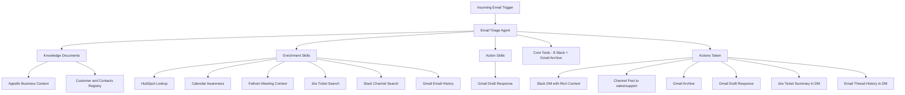
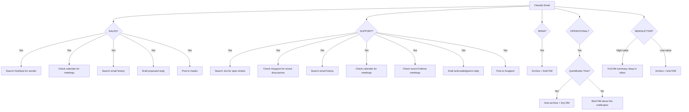

# Ultimate Email Triage Agent Enhancement Plan

## Current State

The Email Triage Agent (v14) classifies emails into 5 categories (SALES, SPAM, SUPPORT, INTERNAL, NEWSLETTER), sends Slack DMs, posts to channels, and archives. It uses `gpt-4o-mini` with 9 tools (8 Slack + Gmail archive).

**Known failures from production runs:**

- Missed HIGH PRIORITY flag on ESICA (insulation association = channel partner)
- Misclassified QuickBooks Time notification -- these are from a customer who set Corey up on their TSheets account to see staff timesheet submissions. They clog the inbox and should be auto-archived
- No awareness of who Appello's customers are, what tools the company uses, or what's on the calendar
- Summaries lack actionable business context
- No ability to draft responses
- No ability to search Jira for related open tickets when support emails arrive
- No ability to search Slack channels for recent conversation context
- No ability to search past email threads for conversation history

## Research Findings

### Appello Business Profile (from ATLAS)

- **Company**: Construction tech SaaS for ICI subcontractors (insulation, HVAC, sheet metal, electrical, mechanical)
- **Revenue**: ~$400k ARR, targeting $1M by Sept 2026. Average deal $15k, largest $70k+
- **Customers**: 30 active in HubSpot, 8 demos booked, targeting 50+ pipeline
- **Sales**: Corey handling 20% solo + Nathan Friesen. Lead sources: conferences, cold calling, TIAC list, referrals, website
- **Using HubSpot CRM** for pipeline management

### Appello Team (from ATLAS + Fathom)

- **Corey Shelson** (Co-founder/CEO) - [corey@useappello.com](mailto:corey@useappello.com)
- **Ian Haase** (CFO/HR/Onboarding) - [ian@useappello.com](mailto:ian@useappello.com)
- **Chris Vachon** (CTO) - [chris@useappello.com](mailto:chris@useappello.com)
- **Nathan "Nate" Friesen** (Sales) - [nathan@useappello.com](mailto:nathan@useappello.com)
- **Travis McKenna** (Business/Customer Success) - [tmckenna@useappello.com](mailto:tmckenna@useappello.com)
- **Eric Rabiner** (Dev) - [erabiner@useappello.com](mailto:erabiner@useappello.com)
- **Filip Altankov** (Dev) - [faltankov@useappello.com](mailto:faltankov@useappello.com)
- **Kylin Cheong** (Dev) - [kcheong@useappello.com](mailto:kcheong@useappello.com)
- **Eric Mann** (Dev) - [emann@useappello.com](mailto:emann@useappello.com)
- **Tristan Gemus** (Dev/Contractor) - [tristangemus@gmail.com](mailto:tristangemus@gmail.com)

### HubSpot CRM: Active Customers (lifecycle = customer, 30 companies)

| Company                             | Domain                       |
| ----------------------------------- | ---------------------------- |
| Vanos Insulations                   | vanosinsulations.com         |
| All Temperature Thermal Insulations | alltempinsulations.com       |
| Tight 5                             | tight5.net                   |
| Westglas                            | westglas.ca                  |
| Isolation Elite                     | isolationelite.ca            |
| Thomas Kanata                       | thomasinsulation.ca          |
| Thermec Insulation Services         | thermec.ca                   |
| Ace Insulation Inc.                 | aceinsul.com                 |
| Ontario Insulation Oshawa           | ontarioinsulation.ca         |
| Vortex Insulation                   | (no domain)                  |
| Thermogenix                         | thermogenix.ca               |
| Rival Insulation                    | rivalinsulation.com          |
| Owens Insulation Inc.               | owensinsulation.com          |
| Headrick Insulation                 | headrickinsulation.com       |
| EPI Insulation                      | epiinsulation.com            |
| R.A. Barnes Electrical              | barneselectric.ca            |
| Bluewater Energy                    | bluewaterenergy.ca           |
| AB Insulation                       | abinsulationltd.com          |
| L J Insulation Services             | ljinsulation.com             |
| SMS Industrial                      | sms-industrial.com           |
| Sommerdkye Construction             | sommerdykconstruction.ca     |
| Mkwa / Pic River                    | picriver.com                 |
| Southern States Insulation          | southernstatesinsulation.com |
| Collins Construction                | collinsconstruction.ca       |
| Hexcon                              | hexcon.ca                    |
| Clement Construction                | clementcon.com               |
| DM Industries                       | (no domain)                  |
| WestCal Insulation                  | westcalinsulation.com        |
| Bison Ibi                           | bisonibi.ca                  |
| Accuratus Design and Build          | accuratusdesignbuild.com     |

Plus 70+ companies at "opportunity" stage and 100+ at "lead" stage in HubSpot.

**Key contacts (from ATLAS + Fathom + Calendar):**

- Thomas Kanata: Dan Givlin, Kyle Sippola (active onboarding)
- Taurus Insulation: German Olivas (sales follow-up)
- Rival Insulation: Josh Kemp, Eric Krekelberg, Nick Newman (onboarding)
- Tight 5: Brad, Bill, Logan, Kaili, Skye (onboarding)
- RA Barnes: Louise Metcalfe, Katharine Barnes (onboarding)
- Isolation Elite: Mathieu Hamel (active)
- Canadian Industrial Specialties (cisenviro.com) - upcoming demo
- American Rentals (wereintents.com) - upcoming demo

### Industry Associations = Channel Partners (CRITICAL)

Construction associations are NOT just newsletters. They are **channel partners** -- Appello sees them as opportunities to generate new business through membership, events, and referrals. Emails from these should be treated as **SALES/business development**, not generic newsletters.

- **TIAC** (tiac.ca) - Thermal Insulation Association of Canada. Appello is a member, uses their membership list for prospecting
- **NIA** (insulation.org) - National Insulation Association. Corey is on the YPAC committee, meeting Feb 18
- **ESICA** - Eastern States Insulation Contractors Association
- **BCICA** - BC Insulation Contractors Association
- **MIAO** - Mechanical Insulation Association of Ontario
- **CCA** - Canadian Construction Association
- **OGCA** - Ontario General Contractors Association
- **COCA** - Council of Ontario Construction Associations
- **Trimble App XChange** - Technology partner (recurring office hours on calendar)

### Jira Project (from Jira MCP)

One Jira project: **Q21030** (Vanos Insulation ERP -- the Appello product). Issues use customer names in summaries, enabling search by company:

- `Q21030-11116` - "Thomas Kanata - PWA Navigation"
- `Q21030-11117` - "Mkwa - converting estimates to jobs, files not transferring"
- `Q21030-11087` - "Rival Insulation - Timecard upload to CSV"
- `Q21030-11114` - "All Temperature Thermal Insulations - team member phone numbers"
- `Q21030-11119` - "SOV - not allowing for scrolling for longer setups"
- `Q21030-11097` - "Allow Clock In/Clock Out Without GPS Enabled" (High priority, assigned to Tristan Gemus)

This means when a SUPPORT email arrives from a known customer, the agent can search Jira with JQL like `summary ~ "Thomas" AND status != Done` to find open tickets and provide context like "There are 2 open tickets for Thomas Kanata: PWA Navigation (Medium) and Progress Billing (Medium)."

### Slack Channels (from Slack MCP)

Key channels for context searching:

- **#general** (C053S06FP) - team-wide, 13 members
- **#developers** (C0148KPHXCN) - dev discussions, 3 members
- **#hubspot-incoming** (C01VDEG6UDU) - CRM lead notifications
- **#sales** and **#support** - (to be verified/created) for agent posting

The Slack MCP has no dedicated search tool, but `get_channel_history` retrieves recent messages from any channel. The agent can check #support and #sales for recent discussions about the email sender's company.

### Gmail Search (from Gmail MCP)

The Gmail MCP provides `search_emails` which accepts Gmail search syntax (e.g., `from:thomasinsulation.ca`, `subject:ticket`, `newer_than:7d`). This enables the agent to:

- Look up recent email threads with the sender
- Find the last time Corey communicated with this person
- Understand ongoing conversation context before drafting a response

Also provides `read_email` to get full email content and `draft_email` to save proposed responses. The `send_email` and `delete_email` tools are EXPLICITLY EXCLUDED -- the agent must never send or delete emails, only draft and archive.

### Internal Business Tools (from ATLAS + Gmail patterns)

- **QuickBooks Time/TSheets** (tsheets.com) - Customer timesheet submissions from a customer account -- AUTO-ARCHIVE (not Appello's own timesheets)
- **QuickBooks Online** - Accounting integration
- **JustCall** (justcall.io) - Phone/SMS for sales calls
- **Fathom** (fathom.video) - Meeting recording/transcripts
- **Zoom** (zoom.us) - Video meetings
- **GitHub** (github.com) - CI/CD notifications for mastra-experiment
- **n8n** / Paddle (paddle.com) - Workflow automation billing
- **Cursor** - AI dev tool billing notifications
- **HubSpot** - CRM pipeline
- **Zapier** - Integration workflows

### Calendar Context (today Feb 12)

- Thomas Onboarding (12:00 PM) - with Dan Givlin who emailed about tickets
- American Rentals Demo (11:00 AM) - new prospect
- Canadian Industrial Specialties Follow-up (12:00 PM) - new prospect
- Mkwa Onboarding (9:00 AM)
- Eric x Corey: Rival Native App Testing (9:00 AM)

### Email Volume Patterns (3 days, 30 emails)

- ~40% SaaS notifications/newsletters (archive candidates)
- ~20% GitHub CI/CD alerts (operational)
- ~15% Internal Appello team
- ~15% Client support/follow-up
- ~10% Personal forwards from gmail.com

---

## Architecture: The Enhanced Agent

### New Classification System (8 categories, up from 5)

1. **SALES** - Inbound inquiries, partnership proposals, demos, pricing, RFPs, AND all construction association communications (conferences, membership, events from channel partners like TIAC, NIA, ESICA, BCICA, MIAO, CCA, OGCA, COCA)
2. **SUPPORT** - Client support requests, bug reports, feature requests from known customers
3. **INTERNAL** - @useappello.com emails
4. **HIGH-VALUE NEWSLETTER** - The Rundown AI, AI/automation newsletters with curated content. NOT construction associations (those are SALES)
5. **LOW-VALUE NEWSLETTER** - Generic SaaS digests, community digests, webinar promos
6. **OPERATIONAL** - Business tool notifications (JustCall summaries, Fathom recaps, Zoom alerts). QuickBooks Time/TSheets is special: auto-archive immediately
7. **CI/CD** - GitHub Actions notifications, deploy alerts, build failures
8. **SPAM** - Cold outreach, marketing blasts from unknown senders, truly unsolicited

### New Tool + Skill Architecture



### Complete Tool Inventory (current 9 + 9 new = 18 total)

**Communication tools (8 -- Slack, already attached):**

- `slack_slack_post_message` - Post messages to channels or DM users
- `slack_slack_reply_to_thread` - Reply within existing thread
- `slack_slack_add_reaction` - Add emoji reactions
- `slack_slack_list_channels` - Find channels (also used for channel context skill)
- `slack_slack_get_channel_history` - Read recent messages (also used for channel context skill)
- `slack_slack_get_thread_replies` - Read thread replies
- `slack_slack_get_users` - List workspace users
- `slack_slack_get_user_profile` - Look up user profile

**Gmail tools (3 -- 1 existing + 2 new):**

- `gmail-archive-email` - Archive email (existing)
- `Gmail_search_emails` - Search past emails by sender, subject, date range (NEW)
- `Gmail_read_email` - Read full content of a specific email (NEW)
- ~~`Gmail_send_email`~~ - **EXPLICITLY EXCLUDED. Agent must NEVER send emails.**
- ~~`Gmail_delete_email`~~ - **EXPLICITLY EXCLUDED. Agent must NEVER delete emails.**

**Gmail draft tool (1 -- action, human review required):**

- `Gmail_draft_email` - Create draft responses in Gmail drafts folder. Human always reviews and sends.

**Jira tools (2 -- read-only):**

- `jira_jira_search` - JQL search for issues (e.g., `summary ~ "Thomas" AND status != Done`)
- `jira_jira_get_issue` - Get full details of a specific issue
- ~~`jira_create_issue`, `jira_update_issue~~` - **EXPLICITLY EXCLUDED. Read-only access.**

**HubSpot tools (2 -- read-only):**

- `hubspot_hubspot-search-objects` - Search companies/contacts by domain
- `hubspot_hubspot-list-associations` - Find deals/contacts associated with a company
- ~~`hubspot-batch-create-objects`, `hubspot-batch-update-objects~~` - **EXPLICITLY EXCLUDED. Read-only access.**

**Calendar tools (2 -- read-only):**

- `google-calendar_list-events` - List today's/this week's events
- `google-calendar_search-events` - Search events by attendee name or company

**Fathom tools (2 -- read-only):**

- `fathom_list_meetings` - List recent meetings
- `fathom_get_meeting_summary` - Get AI summary of a specific meeting

### Phase 1: Knowledge Documents

Create two platform documents that get attached to the agent via skills. These give the agent persistent business context without bloating the system prompt.

**Document 1: `appello-business-context**`
Contains:

- Company description, ICI subcontractor focus, product modules
- Revenue targets ($1M ARR by Sept 2026)
- Sales strategy (conferences, TIAC list, chocolate outreach, referrals)
- Sales signal taxonomy (from the other agent's rules): pipeline signals, GTM signals, sales ops signals, source indicators
- Explicit exclusion rules (what is NOT sales)
- Known industry associations and their relevance (TIAC, NIA, ESICA, BCICA, MIAO)
- Appello's unique value propositions for contextualizing responses

**Document 2: `appello-contacts-registry**`
Contains:

- All known customer domains with company names and lifecycle stage (active, onboarding, prospect, lead)
- Key contact names per company
- All Appello team member emails and roles
- Known internal tool domains (tsheets.com, justcall.io, fathom.video, zoom.us, paddle.com, github.com, skool.com, etc.) with descriptions
- Known association domains (insulation.org, tiac.ca, etc.)
- Personal email ([corey.shelson@gmail.com](mailto:corey.shelson@gmail.com)) flagged as personal forward

### Phase 2: Skills Creation (7 skills)

**Skill 1: `hubspot-email-enrichment**`

- Tools: `hubspot_hubspot-search-objects`, `hubspot_hubspot-list-associations`
- Purpose: When a sender domain is unknown, check HubSpot to see if they're in the CRM (contact, company, deal)
- Provides: Deal stage, contact owner, last activity date, company info
- When to use: SALES and unknown sender domains

**Skill 2: `calendar-email-enrichment**`

- Tools: `google-calendar_list-events`, `google-calendar_search-events`
- Purpose: Cross-reference sender with today's/this week's calendar
- Provides: "You have a Thomas Onboarding call at 12:00 PM today with Dan Givlin" when Dan emails about tickets
- When to use: SALES and SUPPORT from known customers/prospects

**Skill 3: `fathom-meeting-context**`

- Tools: `fathom_list_meetings`, `fathom_get_meeting_summary`
- Purpose: Look up recent meetings with the sender's company/domain
- Provides: "Last meeting with Rival Insulation was Feb 11 - Onboarding Session"
- When to use: SALES and SUPPORT from known customers/prospects

**Skill 4: `jira-ticket-context**`

- Tools: `jira_jira_search`, `jira_jira_get_issue`
- Purpose: Search Jira project Q21030 for open issues related to the sender's company. Jira issues use customer names in summaries (e.g., "Thomas Kanata - PWA Navigation"), so JQL search `summary ~ "Thomas" AND status != Done` finds related tickets
- Provides: "There are 2 open tickets for Thomas Kanata: Q21030-11116 PWA Navigation (Medium, unassigned) and Q21030-11118 Progress Billing (Medium, Filip)"
- When to use: SUPPORT emails from known customers -- always search Jira. Also SALES from prospects to check if they have any prior engagement history

**Skill 5: `slack-channel-context**`

- Tools: `slack_slack_get_channel_history`, `slack_slack_list_channels`
- Purpose: Search recent messages in #support, #sales, and #developers for discussions about the sender's company. No dedicated Slack search tool exists, but `get_channel_history` retrieves recent messages that the agent can scan for relevant mentions
- Provides: "Recent #support thread (2 days ago): Filip mentioned Thomas Kanata PWA issue is being investigated"
- When to use: SUPPORT and SALES from known customers -- check #support and #sales for recent conversations. Selective use only (not every email)

**Skill 6: `gmail-email-history**`

- Tools: `Gmail_search_emails`, `Gmail_read_email`
- Purpose: Search past email threads with the sender to understand conversation history. Uses Gmail search syntax like `from:dan@thomasinsulation.ca newer_than:30d`
- Provides: "Last email exchange with Dan Givlin was 3 days ago about ticket upload issues. He sent 2 follow-ups since"
- When to use: SUPPORT and SALES emails where understanding prior conversation context would improve the triage (not for spam/newsletters)

**Skill 7: `gmail-draft-response**`

- Tools: `Gmail_draft_email`
- Purpose: For SUPPORT and SALES emails, draft a proposed response in Gmail drafts folder
- Provides: A ready-to-review draft that Corey can edit and send
- When to use: SUPPORT from active clients (acknowledge + reference Jira tickets), SALES from warm prospects (confirm interest + propose next steps)

### Phase 3: Enhanced Instructions

The agent instructions will be completely rewritten to incorporate:

- **Appello business context** (distilled from the knowledge document)
- **8 classification categories** instead of 5
- **Construction associations = SALES** (channel partners, not newsletters)
- **QuickBooks Time = auto-archive** (customer timesheet noise, not valued operational tool)
- **Enrichment workflow with decision tree**: Determine which enrichment tools to call based on classification:



- **Jira cross-reference**: For SUPPORT emails, search Jira Q21030 for open tickets from the sender's company. Include ticket count, summaries, statuses, and assignees in the "What's in it" section
- **Slack channel awareness**: For SUPPORT/SALES, optionally scan #support or #sales channel history for recent conversations about the sender's company
- **Gmail thread history**: For SUPPORT/SALES, search past emails with the sender to understand conversation context and identify follow-up patterns
- **Draft response capability**: For support emails from active clients, draft an acknowledgment referencing any open Jira tickets. For sales opportunities, draft a next-steps proposal
- **Calendar cross-reference**: Mention relevant upcoming meetings in the "Why it matters" section
- **Fathom context**: Reference recent meetings with the sender's company
- **Explicit known-tool handling**: QuickBooks Time = AUTO-ARCHIVE. JustCall, Fathom, Zoom, etc. = OPERATIONAL
- **Personal forward handling**: [corey.shelson@gmail.com](mailto:corey.shelson@gmail.com) forwards get classified as PERSONAL (new sub-type)
- **Sales signal taxonomy**: The granular pipeline/GTM/sales-ops signals from the other agent
- **Response format enhanced**: Add "Open Jira tickets", "Recent email thread", "Calendar context", and "Draft saved" fields to the output where applicable

### Phase 4: Model and Config Upgrade

Currently using `gpt-4o-mini` with `maxSteps: 7` and 9 tools.

**After upgrade:**

- **Model: `gpt-4o**`-- Upgrading from`gpt-4o-mini`. This is non-negotiable given the expanded complexity:
    - 18 tools requiring intelligent selection (which to call, which to skip)
    - Nuanced 8-category classification with subtle distinctions (association = SALES vs newsletter = NEWSLETTER)
    - Multi-hop enrichment reasoning (identify company -> search Jira -> cross-reference calendar -> draft response referencing both)
    - `gpt-4o-mini` already failed on the nuanced cases in production (ESICA miss, QuickBooks misclassification)
    - Cost: ~$0.01-0.03/run worst case (full enrichment), ~$0.005/run average. At 30-50 emails/day = $5-45/month. Acceptable for the quality improvement
- **maxSteps: 15** -- a SUPPORT email from a known customer could trigger: classify -> Jira search -> Jira get issue -> Gmail search history -> Calendar check -> Slack channel history -> Draft response -> Post to #support -> DM to Corey = 9 tool calls. Need headroom
- **18 tools** (9 existing + 2 Gmail read-only + 1 Gmail draft + 2 Jira + 2 HubSpot + 2 Calendar + 2 Fathom -- note: `send_email` is EXPLICITLY EXCLUDED, see safety constraints)

### SAFETY CONSTRAINTS (non-negotiable)

1. **NO EMAIL SENDING** -- The agent must NEVER have the `send_email` tool. It is not attached, not referenced in instructions, not available. The agent can ONLY create drafts via `draft_email`. A human must always review and send.
2. **NO EMAIL DELETION** -- The agent must NEVER have the `delete_email` tool. It can only archive (remove from inbox, keep in All Mail).
3. **NO JIRA MUTATIONS** -- The agent gets `jira_search` and `jira_get_issue` (read-only). It does NOT get `jira_create_issue`, `jira_update_issue`, or any write tools. It observes Jira, it does not modify it.
4. **NO HUBSPOT MUTATIONS** -- The agent gets `hubspot-search-objects` and `hubspot-list-associations` (read-only). No create/update tools.
5. **DRAFT TONE** -- Drafts must sound like Corey wrote them. No watermarks, no disclaimers, no "[Draft by AI]" headers. The draft should be ready to send as-is after human review. Specific rules:

- NEVER use em dashes (--) or en dashes. Use commas, periods, or restructure the sentence
- NEVER use overly formal or corporate language ("I hope this email finds you well", "Please do not hesitate to", "As per our conversation")
- Keep it casual-professional: short sentences, conversational, direct. Mirror how Corey actually writes
- No exclamation marks unless genuinely enthusiastic
- No bullet points in short replies -- just write naturally
- Sign off simply: "Corey" or "Thanks, Corey" -- not "Best regards" or "Kind regards"

### Phase 5: Test and Iterate

- Rerun the 10 most recent emails through the upgraded agent using simulations
- Verify: ESICA gets flagged HIGH PRIORITY + SALES (channel partner)
- Verify: QuickBooks Time gets auto-archived with brief DM
- Verify: Construction association emails classified as SALES, not NEWSLETTER
- Verify: Dan Givlin support email shows open Jira tickets + Thomas Onboarding on calendar
- Verify: Support emails include Jira ticket summary in the DM
- Verify: Past email thread context included for SALES/SUPPORT
- Verify: Draft responses generated for support emails from active clients
- Verify: Agent does NOT over-enrich (spam/newsletters should NOT trigger Jira/HubSpot lookups)
- Collect feedback, iterate on classification and enrichment trigger rules

---

## Execution Steps

### Step 1: Create knowledge documents on the platform

- Create `appello-business-context` document with all business context, sales signals, and exclusion rules
- Create `appello-contacts-registry` document with all customer domains, team members, tool domains, and association domains

### Step 2: Create skills on the platform

- Create `hubspot-email-enrichment` skill with HubSpot search + associations tools
- Create `calendar-email-enrichment` skill with Google Calendar list + search events tools
- Create `fathom-meeting-context` skill with Fathom list meetings + get summary tools
- Create `jira-ticket-context` skill with Jira search + get issue tools (project Q21030, customer name matching)
- Create `slack-channel-context` skill with Slack get channel history + list channels tools (scan #support, #sales)
- Create `gmail-email-history` skill with Gmail search emails + read email tools (past thread lookup)
- Create `gmail-draft-response` skill with Gmail draft email tool (proposed response drafting)

### Step 3: Attach skills and documents to the agent

- Attach all 7 new skills to the `email-triage` agent
- Attach both knowledge documents to relevant skills or directly referenced in instructions

### Step 4: Rewrite agent instructions

- Incorporate 8-category classification system with construction associations as SALES
- Add enrichment decision tree (which tools to call for which category)
- Add Jira cross-reference workflow: search Q21030 by sender company name, include ticket summaries
- Add Slack channel awareness: scan #support/#sales for recent discussions about sender
- Add Gmail thread history: search past emails with sender for conversation context
- Add draft response rules (when to draft, tone, format, reference Jira tickets in drafts). Drafts must sound like Corey wrote them: no watermarks, no em dashes, no corporate filler, casual-professional tone, sign off as "Corey" or "Thanks, Corey"
- Add SAFETY CONSTRAINTS section in instructions: "You can ONLY create drafts. You NEVER send emails. You NEVER delete emails. You NEVER create or modify Jira issues. You NEVER create or modify HubSpot records. All external system access is READ-ONLY except Gmail drafts and Slack messages."
- Add QuickBooks Time auto-archive rule
- Add sales signal taxonomy
- Add explicit tool/domain handling rules
- Keep Slack mrkdwn formatting rules
- Update response format with new conditional fields: "Open Jira tickets", "Recent thread", "Calendar context", "Draft saved"

### Step 5: Update agent configuration

- Upgrade model from `gpt-4o-mini` to `gpt-4o`
- Add 9 new tool IDs: Gmail search + read + draft, Jira search + get-issue, HubSpot search + associations, Calendar list + search, Fathom list + summary
- Increase `maxSteps` from 7 to 15 to accommodate full enrichment chains
- Total tools: 18 (8 Slack + 1 Gmail archive + 2 Gmail read-only + 1 Gmail draft + 2 Jira read-only + 2 HubSpot read-only + 2 Calendar read-only + 2 Fathom read-only)
- VERIFY: `send_email` is NOT in the tool list. `delete_email` is NOT in the tool list. No Jira/HubSpot write tools attached.

### Step 6: Run simulations

- Replay the 10 most recent emails through the new agent
- **Key test cases:**
    - ESICA email -> should classify as SALES (channel partner), flag HIGH PRIORITY
    - QuickBooks Time notification -> should auto-archive with brief DM
    - Dan Givlin (Thomas Kanata) support email -> should search Jira for Thomas tickets, check calendar for Thomas meeting, check email history, draft acknowledgment
    - German Olivas (Taurus) sales email -> should check HubSpot deal stage, search email history, draft follow-up
    - The Rundown AI newsletter -> should classify HIGH-VALUE NEWSLETTER, keep in inbox
    - GitHub Actions CI/CD alert -> should classify CI/CD, brief DM, archive
    - Random cold outreach -> should classify SPAM, archive, no enrichment (verify agent doesn't waste tool calls)
- Evaluate classification accuracy, enrichment quality, draft response usefulness, and tool call efficiency
- Submit feedback on runs and iterate

---

## Expected Outcome

The enhanced agent will transform Corey's email from "I got a Slack notification that something was classified" to deeply contextualized briefings:

**Example 1 -- SUPPORT email with Jira + Calendar + Email history context:**

```
:rotating_light: :email: *Email Triaged -- SUPPORT*
*From:* Dan Givlin <dan@thomasinsulation.ca>
*Subject:* Re: Ticket upload issue

*What's in it:* Dan is following up on a ticket upload
issue he reported last week. He says the PDF attachments
are still not showing after uploading from mobile. He
needs this resolved before their next billing cycle (Feb 28).

*Open Jira tickets (Thomas Kanata):*
- Q21030-11116: PWA Navigation (Medium, unassigned)
- Q21030-11118: Progress Billing / SOV (Medium, Filip)

*Recent email thread:* Last exchange was 3 days ago --
Corey acknowledged the issue and said dev team would look
into it. Dan sent 1 follow-up since.

*Calendar context:* Thomas Onboarding call today at 12:00 PM
with Dan Givlin.

*Why it matters:* Thomas Kanata is an active customer with
2 open tickets. Dan has a meeting with you today at noon --
this is a good time to address the upload issue in person.

*Draft saved:* "Hey Dan, thanks for the follow up. Let's
dig into this on our call today at noon, I'll make sure
we cover the upload issue. Talk soon, Corey"

*Proposed action:* Kept in inbox. Posted to #support.
Draft reply saved for review.

:white_check_mark: DM sent - Posted to #support - Draft saved
```

**Example 2 -- SALES from channel partner (construction association):**

```
:rotating_light: :email: *Email Triaged -- SALES*
*From:* ESICA <info@esica.org>
*Subject:* ESICA Annual Conference -- Exhibitor Registration Open

*What's in it:* ESICA is opening exhibitor registration for
their 2026 annual conference. Early bird pricing through
March 15. Booth packages from $2,500. Expected 200+
insulation contractors attending.

*Why it matters:* ESICA is a channel partner for Appello.
Their membership is your exact ICP -- ICI insulation
contractors. This is a prime opportunity to get in front
of 200+ potential customers. TIAC list prospecting has
already proven effective.

*Proposed action:* Kept in inbox. Posted to #sales. Worth
discussing with Nathan re: conference ROI.

:white_check_mark: DM sent - Posted to #sales
```

**Example 3 -- QuickBooks Time (auto-archived):**

```
:clock3: *TSheets notification archived*
Austin Lalonde timesheet submitted for approval
```

**Example 4 -- SALES with HubSpot + Email history enrichment:**

```
:email: *Email Triaged -- SALES*
*From:* German Olivas <German.Olivas@taurusinsulation.com>
*Subject:* Taurus Insulation x Appello Follow Up

*What's in it:* German Olivas (VP, Taurus Insulation) is
asking Nate to use his scheduling link to book a follow-up
meeting. Direct line: 432-888-1124. Office: 432-924-6910.

*HubSpot:* Taurus Insulation -- lifecycle: customer, deal
owner: Nathan Friesen.

*Recent email thread:* Nathan sent pricing proposal 5 days
ago. German replied same day requesting a call. This is the
second follow-up.

*Calendar context:* No meeting currently scheduled with
Taurus.

*Why it matters:* Taurus is an active customer in the
pipeline. German is the VP -- this is a warm follow-up
ready to schedule. Nathan has been working this deal.

*Draft saved:* "Hey German, thanks for reaching out.
Happy to get something on the calendar. How does
Thursday or Friday afternoon work for you? Corey"

*Proposed action:* Kept in inbox. Posted to #sales. Draft
reply saved for review.

:white_check_mark: DM sent - Posted to #sales - Draft saved
```
