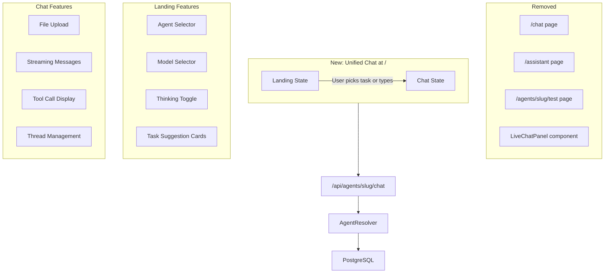
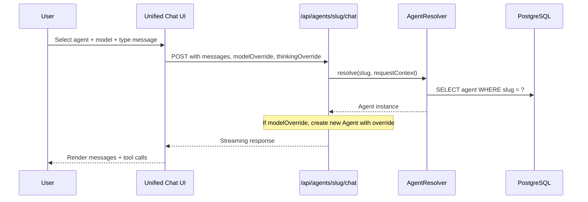

# Unified CoWork-Style Chat Experience

## Architecture Overview



## What Gets Removed

| File                                                                                                                       | Current Purpose                     |
| -------------------------------------------------------------------------------------------------------------------------- | ----------------------------------- |
| [apps/agent/src/app/chat/page.tsx](apps/agent/src/app/chat/page.tsx)                                                       | Hardcoded "assistant" chat          |
| [apps/agent/src/app/assistant/page.tsx](apps/agent/src/app/assistant/page.tsx)                                             | Workspace concierge                 |
| [apps/agent/src/app/agents/[agentSlug]/test/page.tsx](apps/agent/src/app/agents/[agentSlug]/test/page.tsx)                 | Agent test sandbox                  |
| [apps/agent/src/components/LiveChatPanel.tsx](apps/agent/src/components/LiveChatPanel.tsx)                                 | Floating chat panel                 |
| [apps/agent/src/app/api/chat/route.ts](apps/agent/src/app/api/chat/route.ts)                                               | Hardcoded /api/chat endpoint        |
| Manage/Live toggle in [apps/agent/src/app/agents/[agentSlug]/layout.tsx](apps/agent/src/app/agents/[agentSlug]/layout.tsx) | Mode switcher + LiveChatPanel mount |

The `/assistant` nav item and `/chat` route are removed. The 14-tab agent sidebar loses "Test" and gains a "Try it" button.

## What Gets Built

### 1. New Root Page: `/` (Unified Chat)

**File**: `apps/agent/src/app/page.tsx` (replace existing redirect)

This is the main entry point. It has two visual states:

**Landing State** (no messages yet):

- Top section: Agent selector dropdown + Model selector + Thinking toggle
- Center: "What do you want to get done?" heading
- Below: Dynamic task suggestion cards (4-6 cards based on connected integrations)
- Bottom: Full-width `PromptInput` with file upload enabled

**Chat State** (conversation active):

- Compact header: Agent name + model badge + thinking badge + "New conversation" button
- Messages area: Full conversation with tool calls, copy/regenerate actions
- Input area: `PromptInput` with file upload, agent/model selectors in a toolbar row

### 2. Agent Selector Component

Extracted from `LiveChatPanel`'s existing agent dropdown pattern:

- Fetches agents from `/api/agents`
- Shows agent name, description (truncated), active status, system badge
- `workspace-concierge` appears as a normal selectable agent (absorbs /assistant)
- Switching agent resets the thread
- URL query param `?agent=slug` allows deep-linking (for "Try it" button)

### 3. Model Selector Component

New component. Reads available models from the selected agent's provider:

- Groups by provider: "OpenAI" section, "Anthropic" section
- Shows model display names (e.g., "GPT-4o", "Claude Sonnet 4.5", "Claude Opus 4.6")
- Default: selected agent's configured model (from DB)
- Override: user selection persists for the session only
- Visual indicator when overriding (e.g., "(custom)" badge)

Available models (hardcoded initially):

- OpenAI: `gpt-4o`, `gpt-4o-mini`, `o3-mini`
- Anthropic: `claude-opus-4-6`, `claude-sonnet-4-5`, `claude-haiku-4-5`

### 4. Extended Thinking Toggle

New component, shown only when an Anthropic model is selected:

- Toggle switch labeled "Think deeper"
- When enabled: passes `thinking: { type: "enabled", budgetTokens: 10000 }` in the API request
- When disabled: omits thinking config
- Grayed out / hidden when an OpenAI model is selected

### 5. File Upload Support

Enable the existing `PromptInput` `accept` prop:

- `accept="image/*,.pdf,.txt,.csv,.md,.doc,.docx,.json"`
- `multiple={true}`
- Show thumbnail previews for images
- Show file name badges for documents
- On submit: images sent as base64 data URLs (already handled by PromptInput), documents sent as text content extracted client-side or passed to backend for processing

### 6. Dynamic Task Suggestion Cards

New component that generates suggestions based on platform state:

- Fetch connected integrations: `GET /api/integrations/connections`
- Fetch available agents: `GET /api/agents`
- Generate cards based on what's available:

| Connected Integration | Suggested Tasks                               |
| --------------------- | --------------------------------------------- |
| HubSpot               | "Review deal pipeline", "Find contacts"       |
| Jira                  | "Sprint progress summary", "Create an issue"  |
| Fathom                | "Summarize recent meetings"                   |
| Slack                 | "Search Slack messages"                       |
| Google Drive          | "Find a document"                             |
| GitHub                | "Check open PRs"                              |
| (always)              | "Help me draft something", "Research a topic" |

- Clicking a card: pre-fills the input with a prompt, auto-selects the best agent for that task
- Cards use the existing shadcn Card component with an icon and short description

### 7. API Enhancement: Model Override Support

**File**: [apps/agent/src/app/api/agents/[id]/chat/route.ts](apps/agent/src/app/api/agents/[id]/chat/route.ts)

Add optional `modelOverride` and `thinkingOverride` fields to the request body:

```typescript
const { messages, threadId, requestContext, modelOverride, thinkingOverride } = body;
```

Implementation approach -- after resolving the agent, create a new Agent instance with the overridden model if provided:

```typescript
if (modelOverride) {
    agent = new Agent({
        ...agent.config,
        model: `${modelOverride.provider}/${modelOverride.name}`,
        defaultOptions: {
            ...agent.config.defaultOptions,
            providerOptions: thinkingOverride
                ? {
                      anthropic: { thinking: thinkingOverride }
                  }
                : agent.config.defaultOptions?.providerOptions
        }
    });
}
```

Cost calculation and run recording must use the actual model used, not the agent's default.

### 8. Navigation Updates

**File**: [apps/agent/src/components/AgentHeader.tsx](apps/agent/src/components/AgentHeader.tsx)

- Remove `/assistant` from nav items
- Add `/` as "Chat" (or "CoWork") as the first nav item
- Keep `/agents`, `/workflows`, `/networks`, `/live`, `/triggers`, `/mcp`

### 9. Agent Detail Layout Updates

**File**: [apps/agent/src/app/agents/[agentSlug]/layout.tsx](apps/agent/src/app/agents/[agentSlug]/layout.tsx)

- Remove the Manage/Live mode toggle
- Remove the `LiveChatPanel` import and rendering
- Remove the `mr-[420px]` margin shift
- Replace the "Test" sidebar tab with a "Try it" button that navigates to `/?agent={slug}`

### 10. Remove Deprecated Routes

- Delete `apps/agent/src/app/chat/` directory
- Delete `apps/agent/src/app/assistant/` directory
- Delete `apps/agent/src/app/agents/[agentSlug]/test/` directory
- Delete `apps/agent/src/app/api/chat/` directory (the hardcoded endpoint)
- Delete `apps/agent/src/components/LiveChatPanel.tsx`

## Data Flow



## Component Structure

```
apps/agent/src/app/page.tsx (Unified Chat Page)
├── ChatHeader (agent name, model badge, thinking badge, new conversation)
├── AgentSelector (dropdown, fetches from /api/agents)
├── ModelSelector (dropdown, grouped by provider)
├── ThinkingToggle (switch, Anthropic-only)
├── TaskSuggestions (cards, dynamic based on integrations)
├── Conversation (message list, tool calls)
│   ├── ConversationContent
│   ├── ConversationEmptyState (task suggestions in landing mode)
│   └── ConversationScrollButton
├── PromptInput (with file upload enabled)
│   ├── PromptInputBody
│   ├── PromptInputTextarea
│   ├── PromptInputFooter (agent/model selectors inline during chat)
│   └── PromptInputSubmit
└── useChat hook (from @ai-sdk/react, via DefaultChatTransport)
```

## URL Query Parameters

The unified chat supports deep-linking:

- `/?agent=assistant` -- pre-selects the assistant agent
- `/?agent=research&prompt=Summarize+recent+meetings` -- pre-selects agent and pre-fills input
- Used by the "Try it" button in agent detail: navigates to `/?agent={agentSlug}`

## Migration Notes

- The `/api/agents/[id]/chat` route is the ONLY chat API going forward. The `/api/chat` route (hardcoded assistant) is removed.
- Thread IDs use format: `chat-{agentSlug}-{timestamp}` (unified format)
- The `workspace-concierge` agent becomes a normal selectable agent -- no special handling needed
- All existing `PromptInput` subcomponents are reused (no new UI primitives needed)
- The `PromptInput` already supports file upload, drag-and-drop, paste-to-attach, and attachment previews -- we just need to enable the `accept` prop
