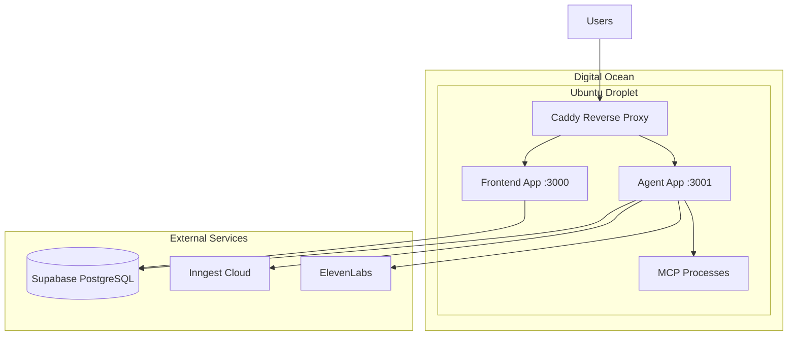

# Vercel to Digital Ocean Droplet Migration

## Architecture Overview



## What Changes

| Component    | Current (Vercel)     | Target (DO Droplet)                |
| ------------ | -------------------- | ---------------------------------- |
| Hosting      | Serverless functions | Persistent Node/Bun processes      |
| MCP Servers  | Broken (can't spawn) | Full stdio support                 |
| TLS/Proxy    | Vercel Edge          | Caddy with Let's Encrypt           |
| Process Mgmt | N/A                  | PM2 ecosystem                      |
| Database     | Supabase             | Supabase (no change)               |
| CI/CD        | Vercel Git Deploy    | GitHub Actions -> SSH deploy       |
| Inngest      | Vercel webhook       | Inngest Cloud (webhook to Droplet) |

---

## CRITICAL CODE FIXES (Before Deployment)

These issues were found during deep analysis and MUST be fixed before the migration will work.

### 1. Better Auth Database Provider Mismatch

**File:** `packages/auth/src/auth.ts:10`

**Problem:** Better Auth is configured with `provider: "mysql"` but Prisma schema uses `provider: "postgresql"`.

**Fix:**

```typescript
// BEFORE
database: prismaAdapter(prisma, { provider: "mysql" });

// AFTER
database: prismaAdapter(prisma, { provider: "postgresql" });
```

### 2. Hardcoded Domain References

Four files contain hardcoded `catalyst.localhost` checks that determine basePath and proxy behavior:

| File                                    | Line  | Issue                                                  |
| --------------------------------------- | ----- | ------------------------------------------------------ |
| `apps/agent/next.config.ts`             | 11-19 | basePath only set if URL includes `catalyst.localhost` |
| `apps/agent/src/proxy.ts`               | 10-14 | Standalone detection checks for `catalyst.localhost`   |
| `apps/agent/src/lib/utils.ts`           | 15    | basePath helper checks `catalyst.localhost`            |
| `apps/agent/src/lib/standalone-auth.ts` | 12    | Checks `process.env.VERCEL === "1"`                    |

**Fix:** Add environment variable `BEHIND_PROXY=true` and check that instead of hostname.

### 3. Hardcoded SSL Configuration

**File:** `packages/agentc2/src/orchestrator/store.ts:18`

**Problem:** SSL is only enabled if connection string contains "supabase":

```typescript
ssl: process.env.DATABASE_URL.includes("supabase") ? { rejectUnauthorized: false } : undefined;
```

**Fix:** Use environment variable `DATABASE_SSL=true` or detect based on `sslmode` in connection string.

### 4. Trusted Origins Hardcoded

**File:** `packages/auth/src/auth.ts:26-32`

**Problem:** Localhost URLs hardcoded in `trustedOrigins`:

```typescript
trustedOrigins: [
    appUrl,
    "http://localhost:3000",
    "http://localhost:3001",
    "https://catalyst.localhost"
];
```

**Fix:** Only include localhost URLs when `NODE_ENV !== "production"`.

### 5. Three Separate Connection Pools

**Files:**

- `packages/agentc2/src/storage.ts` - PostgresStore (no pool config)
- `packages/agentc2/src/vector.ts` - PgVector (no pool config)
- `packages/agentc2/src/orchestrator/store.ts` - pg Pool (no limit)

**Risk:** Connection exhaustion under load.

**Fix:** Add explicit pool limits and consider shared connection pool.

---

## Key Files to Create/Modify

### 1. Dockerfile (root)

Multi-stage build with Bun for reproducible deployments:

```dockerfile
FROM oven/bun:1.3.4-alpine AS base
WORKDIR /app

# Install dependencies for Playwright
RUN apk add --no-cache \
    chromium \
    nss \
    freetype \
    freetype-dev \
    harfbuzz \
    ca-certificates \
    ttf-freefont \
    nodejs \
    npm

# Install dependencies
FROM base AS deps
COPY package.json bun.lock turbo.json ./
COPY packages/ ./packages/
COPY apps/ ./apps/
RUN bun install --frozen-lockfile

# Build
FROM deps AS builder
RUN bun run db:generate
RUN bun run build

# Production
FROM base AS runner
ENV NODE_ENV=production
COPY --from=builder /app ./
CMD ["bun", "run", "start"]
```

### 2. PM2 Configuration (`ecosystem.config.js`)

```javascript
module.exports = {
    apps: [
        {
            name: "frontend",
            cwd: "./apps/frontend",
            script: "bun",
            args: "run start",
            env: {
                NODE_ENV: "production",
                PORT: 3000
            }
        },
        {
            name: "agent",
            cwd: "./apps/agent",
            script: "bun",
            args: "run start",
            env: {
                NODE_ENV: "production",
                PORT: 3001
            }
        }
    ]
};
```

### 3. Production Caddyfile

```caddyfile
yourdomain.com {
    # Long-running connection timeouts (5 min for agent executions)
    reverse_proxy /agent/* localhost:3001 {
        transport http {
            read_timeout 300s
            write_timeout 300s
        }
    }

    reverse_proxy /* localhost:3000 {
        transport http {
            read_timeout 60s
            write_timeout 60s
        }
    }

    # Security headers
    header {
        Strict-Transport-Security "max-age=31536000; includeSubDomains"
        X-Content-Type-Options "nosniff"
        X-Frame-Options "DENY"
    }
}
```

### 4. GitHub Actions Deploy (`.github/workflows/deploy-do.yml`)

```yaml
name: Deploy to Digital Ocean
on:
    push:
        branches: [main]

jobs:
    deploy:
        runs-on: ubuntu-latest
        steps:
            - uses: actions/checkout@v4

            - name: Deploy via SSH
              uses: appleboy/ssh-action@v1.0.0
              with:
                  host: ${{ secrets.DO_HOST }}
                  username: ${{ secrets.DO_USERNAME }}
                  key: ${{ secrets.DO_SSH_KEY }}
                  script: |
                      cd /var/www/agentc2
                      git pull origin main
                      bun install
                      bun run db:generate
                      bun run build
                      pm2 restart all
```

---

## External Service Configuration

### Inngest Cloud

The app uses **Inngest Cloud** (not self-hosted). Configuration needed:

1. Log into [Inngest Cloud Dashboard](https://app.inngest.com)
2. Create/select your app
3. Set the webhook URL: `https://yourdomain.com/api/inngest`
4. Copy `INNGEST_EVENT_KEY` and `INNGEST_SIGNING_KEY` to your `.env`

No code changes needed - just update the webhook URL in the dashboard after DNS migration.

### pgvector Extension

The app uses PostgreSQL with pgvector for semantic search. Supabase has this enabled by default.

If migrating to DO Managed PostgreSQL later, ensure pgvector is installed:

```sql
CREATE EXTENSION IF NOT EXISTS vector;
```

---

## Droplet Setup Requirements

**Recommended Specs:**

- 4GB RAM / 2 vCPU minimum (Playwright needs memory)
- Ubuntu 24.04 LTS
- 50GB SSD

**Software to Install:**

```bash
# Bun
curl -fsSL https://bun.sh/install | bash

# Node.js 20 (for npx/MCP servers)
curl -fsSL https://deb.nodesource.com/setup_20.x | sudo -E bash -
sudo apt install -y nodejs

# Caddy
sudo apt install -y debian-keyring debian-archive-keyring apt-transport-https
curl -1sLf 'https://dl.cloudsmith.io/public/caddy/stable/gpg.key' | sudo gpg --dearmor -o /usr/share/keyrings/caddy-stable-archive-keyring.gpg
curl -1sLf 'https://dl.cloudsmith.io/public/caddy/stable/debian.deb.txt' | sudo tee /etc/apt/sources.list.d/caddy-stable.list
sudo apt update && sudo apt install caddy

# PM2
npm install -g pm2

# Playwright dependencies
npx playwright install-deps chromium

# Git
sudo apt install -y git
```

---

## Environment Variables

All current env vars transfer directly. Changes needed:

```bash
# Digital Ocean specific
NODE_ENV=production
PORT=3000
AGENT_PORT=3001
BEHIND_PROXY=true          # NEW: replaces catalyst.localhost checks
DATABASE_SSL=true          # NEW: for non-Supabase PostgreSQL (if applicable)

# Update these to production domain
NEXT_PUBLIC_APP_URL=https://yourdomain.com
ELEVENLABS_MCP_WEBHOOK_URL=https://yourdomain.com/agent/api/demos/live-agent-mcp/tools

# Remove (Vercel-specific, no longer needed)
# VERCEL=1 is auto-set by Vercel, won't exist on DO
```

---

## Migration Steps Summary

### Phase 1: Code Fixes (Before Deployment)

1. Fix Better Auth database provider (`mysql` -> `postgresql`)
2. Replace hardcoded `catalyst.localhost` with `BEHIND_PROXY` env var
3. Fix SSL configuration to be environment-aware
4. Update trustedOrigins to be environment-aware
5. Add connection pool limits

### Phase 2: Infrastructure Setup

1. Provision Ubuntu Droplet
2. Install Bun, Node, Caddy, PM2, Playwright deps
3. Configure firewall (allow 80, 443, 22)
4. Clone repository to `/var/www/agentc2`
5. Create production `.env` file

### Phase 3: Deployment

1. Configure production Caddyfile
2. Create PM2 ecosystem config
3. Build and start apps with PM2
4. Update Inngest Cloud webhook URL
5. Configure DNS to point to Droplet

### Phase 4: Validation

1. Test auth flow (sign in/out)
2. Test MCP tool execution
3. Test SSE streaming endpoints
4. Test webhook endpoints (Slack, ElevenLabs)
5. Monitor Inngest function executions

---

## Rollback Plan

- Keep Vercel deployment active during migration
- Use a subdomain (e.g., `do.yourdomain.com`) for testing
- Only switch DNS after full validation
- Vercel project can be restored if needed

---

## Post-Migration Benefits

- MCP servers work reliably with persistent processes
- No cold start latency
- 10-minute ATLAS timeouts supported
- Playwright browser automation functional
- Predictable monthly cost (~$24-48/month for 4-8GB droplet)
- Full control over runtime environment
- Long-running SSE connections without timeout issues
