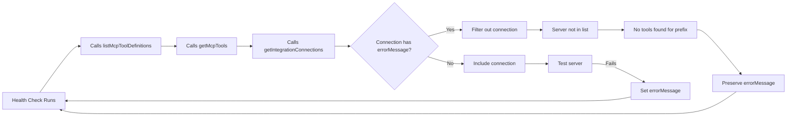

# Root Cause Analysis: HubSpot MCP Tools Intermittently Unavailable

**Issue**: [#166](https://github.com/Appello-Prototypes/agentc2/issues/166)  
**Branch**: `cursor/hubspot-tools-unavailability-43bf`  
**Date**: 2026-03-12  
**Severity**: High — Breaks agent functionality for all MCP integrations with error state

---

## Executive Summary

Agents with HubSpot MCP tools attached report "HubSpot tools are currently unavailable (MCP server may be down)" even when the HubSpot IntegrationConnection shows as active (`isActive: true`) with valid credentials. The issue is **not** specific to HubSpot — it affects **all MCP integrations** that have an `errorMessage` field set in the database.

**Root Cause**: A circular dependency between the health check system and connection filtering logic. When an MCP server fails a health check (even once), the `errorMessage` field is set on the IntegrationConnection. Subsequently, ALL code paths that load MCP tools filter out connections with `errorMessage` set, preventing the connection from being tested or used again. The connection becomes permanently unavailable until manually cleared via the UI test button.

**Impact**:
- Agents cannot use MCP tools from connections with error state
- Skills cannot load MCP tools from connections with error state
- Tool provisioning fails for new connections that fail initial health check
- Tool rediscovery skips connections with error state
- Health checks cannot recover connections (circular dependency)
- Affects ALL MCP providers (HubSpot, Jira, Firecrawl, JustCall, Slack, GitHub, etc.)

**Workaround**: Manually test the connection via the Integrations Hub UI, which temporarily clears the error state.

---

## Technical Deep Dive

### The Circular Dependency



### Key Code Locations

#### 1. Connection Filtering (The Root Issue)

**File**: `packages/agentc2/src/mcp/client.ts`  
**Lines**: 2818-2827  
**Function**: `getIntegrationConnections()`

```typescript
// Filter out connections with persistent errors to prevent loading broken tools
const connections = allConnections.filter((conn) => {
    if (conn.errorMessage) {
        console.warn(
            `[MCP] Skipping connection "${conn.name}" (${conn.provider.key}): ${conn.errorMessage}`
        );
        return false;
    }
    return true;
});
```

**Problem**: This filter is applied to ALL connection lookups, including health checks that are supposed to clear error states.

#### 2. Health Check (Sets errorMessage)

**File**: `apps/agent/src/lib/inngest-functions.ts`  
**Lines**: 8264-8362  
**Function**: `integrationHealthCheckFunction`  
**Schedule**: Every 6 hours (`cron: "0 */6 * * *"`)

```typescript
const { definitions, serverErrors } = await listMcpToolDefinitions(orgId);

// Check each connection's provider against server errors
for (const conn of orgConnections) {
    const key = conn.provider.key;
    if (serverErrors[key]) {
        await prisma.integrationConnection.update({
            where: { id: conn.id },
            data: {
                errorMessage: `Health check failed: ${serverErrors[key]}`,
                metadata: {
                    ...((conn.metadata as Record<string, unknown>) || {}),
                    lastHealthCheck: new Date().toISOString(),
                    healthStatus: "unhealthy"
                }
            }
        });
        unhealthy++;
    } else {
        // Check if we got tools for this provider
        const prefix = `${key}_`;
        const hasTools = definitions.some((t) => t.name.startsWith(prefix));

        await prisma.integrationConnection.update({
            where: { id: conn.id },
            data: {
                errorMessage: hasTools ? null : conn.errorMessage,  // ⚠️ Preserves error!
                metadata: {
                    ...((conn.metadata as Record<string, unknown>) || {}),
                    lastHealthCheck: new Date().toISOString(),
                    healthStatus: hasTools ? "healthy" : "no-tools"
                }
            }
        });
        if (hasTools) healthy++;
        else unhealthy++;
    }
}
```

**Problem**: 
1. Calls `listMcpToolDefinitions()` which internally calls `getIntegrationConnections()`
2. Connections with `errorMessage` are filtered out (see #1 above)
3. Server is not in the list, so no tools are found
4. Line 8325: `errorMessage: hasTools ? null : conn.errorMessage` preserves the existing error
5. Connection remains in error state forever

#### 3. Manual Test Route (Correct Implementation)

**File**: `apps/agent/src/app/api/integrations/connections/[connectionId]/test/route.ts`  
**Lines**: 64-71

```typescript
// Clear any previous errorMessage before testing so the connection
// is visible to getIntegrationConnections (which filters by errorMessage)
if (connection.errorMessage) {
    await prisma.integrationConnection.update({
        where: { id: connection.id },
        data: { errorMessage: null }
    });
}
```

**Success Pattern**: The manual test route DOES clear `errorMessage` before testing, breaking the circular dependency.

#### 4. Agent Tool Resolution (Affected Consumer)

**File**: `packages/agentc2/src/agents/resolver.ts`  
**Lines**: 542-556, 862-871

When an agent is resolved:

```typescript
// Load MCP tools for legacy agents
const mcpTools = hasSkills === 0 && metadata?.mcpEnabled
    ? getAllMcpTools(organizationId)  // Uses getIntegrationConnections internally
    : Promise.resolve({});

// Load skill tools (which may include MCP tools)
const skillTools = skillToolIds.length > 0 
    ? await getToolsByNamesAsync(skillToolIds, organizationId)  // Uses getIntegrationConnections
    : {};

// Compare expected vs loaded tools
const missingTools = [...expectedToolNames].filter((t) => !loadedToolNames.has(t));

if (missingTools.length > 0) {
    finalInstructions +=
        `\n\n---\n# Tool Availability Notice\n` +
        `The following tools are currently unavailable (MCP server may be down or tool not loaded): ` +
        `${missingTools.join(", ")}. ` +
        `If a user's request requires one of these tools, inform them the capability is temporarily ` +
        `unavailable and suggest alternative approaches or ask them to try again later. ` +
        `Do NOT attempt to call these tools.\n`;
}
```

This is where the user-visible error message originates.

#### 5. Tool Loading Chain

**File**: `packages/agentc2/src/tools/registry.ts`  
**Lines**: 1908-1999, 1834-1851, 2025-2027

All tool loading flows converge on `getMcpToolsCached()` → `getMcpTools()` → `getIntegrationConnections()`:

```typescript
export async function getToolsByNamesAsync(
    names: string[],
    organizationId?: string | null
): Promise<Record<string, any>> {
    // ... load static tools ...
    
    // Load MCP tools for unresolved names
    if (otherUnresolved.length > 0) {
        const mcpTools = await getMcpToolsCached(organizationId);  // → getMcpTools() → getIntegrationConnections()
        for (const name of otherUnresolved) {
            if (mcpTools[name]) {
                result[name] = mcpTools[name];
            }
        }
    }
}

async function getMcpToolsCached(organizationId?: string | null): Promise<Record<string, any>> {
    const cacheKey = organizationId || "__default__";
    const now = Date.now();
    const cached = cachedMcpToolsByOrg.get(cacheKey);
    if (cached && now - cached.loadedAt < MCP_CACHE_TTL) {
        return cached.tools;
    }

    try {
        const { tools } = await getMcpTools(organizationId);  // → getIntegrationConnections()
        const truncatedTools = wrapMcpToolsWithTruncation(tools);
        cachedMcpToolsByOrg.set(cacheKey, { tools: truncatedTools, loadedAt: now });
        return truncatedTools;
    } catch (error) {
        console.warn("[Tool Registry] Failed to load MCP tools:", error);
        return {};
    }
}

export async function getAllMcpTools(organizationId?: string | null): Promise<Record<string, any>> {
    return getMcpToolsCached(organizationId);  // → getMcpTools() → getIntegrationConnections()
}
```

### Affected Code Paths

All of the following flows are broken for connections with `errorMessage` set:

1. **Agent Resolution** (`packages/agentc2/src/agents/resolver.ts:543`)
   - Direct tool loading: `getToolsByNamesAsync(toolNames, organizationId)`
   - Legacy MCP-enabled agents: `getAllMcpTools(organizationId)`
   - Skill tool loading: `getToolsByNamesAsync(skillToolIds, organizationId)`

2. **Integration Provisioning** (`packages/agentc2/src/integrations/provisioner.ts:952`)
   - Tool discovery: `listMcpToolDefinitions(organizationId)`
   - Called when new connections are created

3. **Tool Rediscovery** (`packages/agentc2/src/integrations/provisioner.ts:952`)
   - Daily cron job: `rediscoverToolsForConnection(connectionId)`
   - Syncs SkillTool records with MCP server changes

4. **Health Checks** (`apps/agent/src/lib/inngest-functions.ts:8299`)
   - Every 6 hours: `listMcpToolDefinitions(orgId)`
   - Cannot recover connections due to circular dependency

5. **Manual Tool Discovery** (UI flows)
   - `/api/integrations/providers/[providerKey]/tools` route
   - Calls `listMcpToolDefinitions()` internally

### Database Schema

**Model**: `IntegrationConnection` (`packages/database/prisma/schema.prisma:387-420`)

```prisma
model IntegrationConnection {
    id             String              @id @default(cuid())
    providerId     String
    organizationId String
    userId         String?
    scope          String              @default("org")
    name           String
    isDefault      Boolean             @default(false)
    isActive       Boolean             @default(true)
    credentials    Json?
    metadata       Json?
    lastUsedAt     DateTime?
    lastTestedAt   DateTime?
    errorMessage   String?             @db.Text  // ⚠️ The problematic field
    webhookPath    String?
    webhookSecret  String?
    // ... relations ...
}
```

---

## Reproduction Scenario

### Initial State
- HubSpot IntegrationConnection exists
- `isActive: true`
- `errorMessage: null`
- Tools load successfully

### Trigger Event (Any of these can cause initial error)
1. HubSpot MCP server times out during health check (network issue, NPM package download delay)
2. Temporary credential issue (rate limiting, API downtime)
3. Server process crash during startup
4. DNS resolution failure
5. NPM package temporarily unavailable

### Error State Progression

**T+0 (First Health Check Failure)**
```sql
UPDATE "IntegrationConnection" 
SET "errorMessage" = 'Health check failed: Connection timeout after 60000ms'
WHERE id = 'cmlfge60b007n8erhsakptjvi';
```

**T+6h (Next Health Check)**
```typescript
// Load connections
const allConnections = await prisma.integrationConnection.findMany({
    where: { organizationId, isActive: true }
});

// Filter applied
const connections = allConnections.filter((conn) => {
    if (conn.errorMessage) {  // ⚠️ TRUE - connection excluded
        console.warn(`[MCP] Skipping connection "${conn.name}" (hubspot): ${conn.errorMessage}`);
        return false;
    }
    return true;
});
// Result: HubSpot connection NOT in the list

// Build server configs - HubSpot not included
const servers = buildServerConfigs({ connections, allowEnvFallback: false });
// Result: servers = { /* no hubspot key */ }

// Load tools from servers
const { tools, serverErrors } = await loadToolsPerServer(servers);
// Result: No HubSpot server tested, no tools loaded, serverErrors['hubspot'] undefined

// Health check logic
if (serverErrors['hubspot']) {  // FALSE - not in serverErrors
    // Set errorMessage
} else {
    const hasTools = definitions.some(t => t.name.startsWith('hubspot_'));  // FALSE
    await prisma.integrationConnection.update({
        where: { id: conn.id },
        data: {
            errorMessage: hasTools ? null : conn.errorMessage,  // ⚠️ Preserves existing error
        }
    });
}
```

**T+12h, T+18h, T+24h...**: Same pattern repeats indefinitely. Connection never recovers.

### User Impact

**Agent Invocation**:
```typescript
// User triggers agent with HubSpot tools
const { agent } = await agentResolver.resolve({ 
    slug: "demo-prep-agent-appello",
    requestContext: { organizationId: "..." }
});

// Agent's instructions now include:
// "The following tools are currently unavailable (MCP server may be down or tool not loaded): 
//  hubspot_hubspot-search-objects, hubspot_hubspot-batch-read-objects, ..."

// Agent response to user:
// "I'm unable to search HubSpot contacts right now as the HubSpot integration 
//  is temporarily unavailable. Please try again later."
```

**UI Shows**: ✅ HubSpot "Connected" (green badge, `isActive: true`)  
**Runtime Reality**: ❌ HubSpot tools filtered out, unavailable to agents

---

## Code Analysis

### 1. Entry Point: getIntegrationConnections (The Filter)

**File**: `packages/agentc2/src/mcp/client.ts`  
**Function**: `getIntegrationConnections`  
**Lines**: 2795-2883

```typescript
async function getIntegrationConnections(options: {
    organizationId?: string | null;
    userId?: string | null;
}) {
    if (!options.organizationId) {
        return [] as ConnectionWithProvider[];
    }

    await ensureIntegrationProviders();

    const allConnections = await prisma.integrationConnection.findMany({
        where: {
            organizationId: options.organizationId,
            isActive: true,
            OR: [
                { scope: "org" },
                ...(options.userId ? [{ scope: "user", userId: options.userId }] : [])
            ]
        },
        include: { provider: true },
        orderBy: [{ isDefault: "desc" }, { createdAt: "desc" }]
    });

    // ⚠️⚠️⚠️ THE PROBLEMATIC FILTER ⚠️⚠️⚠️
    const connections = allConnections.filter((conn) => {
        if (conn.errorMessage) {
            console.warn(
                `[MCP] Skipping connection "${conn.name}" (${conn.provider.key}): ${conn.errorMessage}`
            );
            return false;  // Connection excluded from ALL downstream operations
        }
        return true;
    });

    // ... legacy ToolCredential fallback logic ...
    
    return connections;
}
```

**Design Intent**: Prevent loading MCP tools from connections known to be broken.  
**Actual Behavior**: Creates a permanent failure state with no recovery path.

### 2. Health Check (Sets and Preserves Error)

**File**: `apps/agent/src/lib/inngest-functions.ts`  
**Function**: `integrationHealthCheckFunction`  
**Lines**: 8264-8362  
**Schedule**: Every 6 hours

```typescript
for (const [orgId, orgConnections] of byOrg) {
    await step.run(`health-check-org-${orgId.slice(0, 8)}`, async () => {
        const { listMcpToolDefinitions } = await import("@repo/agentc2");

        try {
            // ⚠️ This internally calls getIntegrationConnections() which filters by errorMessage
            const { definitions, serverErrors } = await listMcpToolDefinitions(orgId);

            for (const conn of orgConnections) {
                const key = conn.provider.key;
                if (serverErrors[key]) {
                    // Server explicitly failed - set error
                    await prisma.integrationConnection.update({
                        where: { id: conn.id },
                        data: {
                            errorMessage: `Health check failed: ${serverErrors[key]}`,
                            metadata: { /* ... */ }
                        }
                    });
                } else {
                    // Server not in serverErrors - check if we got tools
                    const prefix = `${key}_`;
                    const hasTools = definitions.some((t) => t.name.startsWith(prefix));

                    await prisma.integrationConnection.update({
                        where: { id: conn.id },
                        data: {
                            // ⚠️⚠️⚠️ CRITICAL BUG ⚠️⚠️⚠️
                            // If hasTools is false (because connection was filtered out),
                            // preserve the existing errorMessage instead of clearing it
                            errorMessage: hasTools ? null : conn.errorMessage,
                            metadata: { /* ... */ }
                        }
                    });
                }
            }
        } catch (error) {
            // Entire org check failed - don't clear errors
        }
    });
}
```

**What Should Happen**: Health check should clear `errorMessage` before testing to give the connection a chance to recover.

**What Actually Happens**: 
1. Connection is filtered out during `listMcpToolDefinitions()`
2. No tools found for that provider prefix
3. `hasTools = false`
4. Line 8325: `errorMessage: hasTools ? null : conn.errorMessage` keeps the old error
5. Circular dependency complete

### 3. Manual Test Route (Correct Pattern)

**File**: `apps/agent/src/app/api/integrations/connections/[connectionId]/test/route.ts`  
**Lines**: 64-71

```typescript
if (
    connection.provider.providerType === "mcp" ||
    connection.provider.providerType === "custom"
) {
    // ✅ CORRECT PATTERN ✅
    // Clear any previous errorMessage before testing so the connection
    // is visible to getIntegrationConnections (which filters by errorMessage)
    if (connection.errorMessage) {
        await prisma.integrationConnection.update({
            where: { id: connection.id },
            data: { errorMessage: null }
        });
    }

    // Now test the connection
    const testResult = await testMcpServer({
        serverId,
        organizationId,
        userId: authContext.userId,
        allowEnvFallback: false,
        timeoutMs
    });
    
    // Set error only if test fails
    await prisma.integrationConnection.update({
        where: { id: connection.id },
        data: {
            lastTestedAt: new Date(),
            errorMessage: success ? null : errorDetail || "Connection test failed"
        }
    });
}
```

**Key Difference**: Clears error BEFORE calling `testMcpServer()`, which internally uses `getIntegrationConnections()`.

### 4. Tool Registry (Propagates Missing Tools)

**File**: `packages/agentc2/src/tools/registry.ts`  
**Function**: `getToolsByNamesAsync`  
**Lines**: 1908-1999

```typescript
export async function getToolsByNamesAsync(
    names: string[],
    organizationId?: string | null
): Promise<Record<string, any>> {
    const result: Record<string, any> = {};

    // First, get static tools
    for (const name of names) {
        const tool = toolRegistry[name];
        if (tool) {
            result[name] = tool;
        }
    }

    // Find names not in static registry (likely MCP or federation tools)
    const unresolvedNames = names.filter((name) => !result[name]);

    if (unresolvedNames.length > 0) {
        // Load MCP tools for non-federation unresolved names
        if (otherUnresolved.length > 0) {
            const mcpTools = await getMcpToolsCached(organizationId);  // → Filtered connections
            for (const name of otherUnresolved) {
                if (mcpTools[name]) {
                    result[name] = mcpTools[name];
                }
            }
        }
    }

    // Warn about tools that were requested but not found
    const missing = names.filter((n) => !result[n]);
    if (missing.length > 0) {
        console.warn(
            `[ToolRegistry] ${missing.length} tool(s) not found: ${missing.join(", ")}`
        );
    }

    return result;
}
```

### 5. Provisioning (Fails to Discover Tools)

**File**: `packages/agentc2/src/integrations/provisioner.ts`  
**Function**: `provisionIntegration`, `discoverMcpToolsWithDefinitions`  
**Lines**: 38-159, 940-982

```typescript
export async function provisionIntegration(
    connectionId: string,
    opts: ProvisionOptions
): Promise<ProvisionResult> {
    // ...
    
    if (blueprint.skill.toolDiscovery === "dynamic") {
        try {
            const organizationId = connection.organizationId;
            discoveredDefs = await discoverMcpToolsWithDefinitions(  // → Uses listMcpToolDefinitions
                organizationId,
                connection.provider.key
            );
            toolIds = discoveredDefs.map((d) => d.toolId);
            discoveryStatus = toolIds.length > 0 ? "complete" : "failed";
        } catch (err) {
            console.warn(
                `[Provisioner] Tool discovery failed for ${connection.provider.key}:`,
                err instanceof Error ? err.message : err
            );
            discoveryStatus = "failed";
        }
    }
    
    // ...
}

async function discoverMcpToolsWithDefinitions(
    organizationId: string,
    providerKey: string
): Promise<DiscoveredToolDef[]> {
    const retryDelays = [0, 2000, 5000];

    for (let attempt = 0; attempt < retryDelays.length; attempt++) {
        try {
            if (retryDelays[attempt] > 0) {
                await new Promise((resolve) => setTimeout(resolve, retryDelays[attempt]));
            }

            // ⚠️ Filtered connections won't be included
            const { definitions: allTools } = await listMcpToolDefinitions(organizationId);
            
            const prefix = `${providerKey}_`;
            const matched = allTools
                .filter((t) => t.name.startsWith(prefix))
                .map((t) => ({ /* ... */ }));

            if (matched.length === 0 && attempt < retryDelays.length - 1) continue;
            return matched;
        } catch (error) {
            // Retry or fail
        }
    }

    return [];
}
```

---

## Why This Bug is Intermittent

The bug appears intermittent because:

1. **Initial health check must fail**: A connection works fine until the first health check failure
2. **Transient failures are common**:
   - NPM package download delays (HubSpot MCP uses `npx @hubspot/mcp-server`)
   - Network timeouts (60s timeout for MCP handshake)
   - Temporary API rate limits
   - Server process spawn failures
3. **Cache masks the issue**: 60-second MCP tool cache means some agent runs succeed (cache hit) while others fail (cache miss after error state set)
4. **Manual test recovers temporarily**: When a user tests the connection via UI, `errorMessage` is cleared, allowing tools to load again until the next health check failure

### Specific HubSpot Risk Factors

HubSpot MCP is particularly vulnerable because:

1. **Remote package execution**: `npx @hubspot/mcp-server` must download the package on every cold start
2. **Hosted MCP endpoint**: `hostedMcpUrl: "https://mcp.hubspot.com"` adds network dependency
3. **API token in env**: `HUBSPOT_ACCESS_TOKEN` passed as environment variable
4. **Heavy tool schema**: HubSpot exposes many tools with complex schemas that take time to load

Any of these can cause timeout during the 60-second MCP handshake.

---

## Impact Assessment

### Severity: **HIGH**

**Affected Components**:
- ✅ Agent tool resolution (all agents with MCP tools)
- ✅ Skill tool loading (all skills with MCP tools)
- ✅ Integration provisioning (new connection setup)
- ✅ Tool rediscovery (daily sync job)
- ✅ Health checks (cannot auto-recover)
- ✅ Manual tool discovery (UI flows)

**Affected Integrations** (ALL MCP providers):
- HubSpot (CRM)
- Jira (Project Management)
- Firecrawl (Web Scraping)
- JustCall (Phone/SMS)
- Slack (Communication)
- GitHub (Code Management)
- Fathom (Meeting Intelligence)
- Playwright (Browser Automation)
- ATLAS/n8n (Workflow Automation)
- Custom MCP servers

**User-Facing Symptoms**:
1. Agent reports tools unavailable despite UI showing "Connected"
2. Skills fail to load tools from integrations
3. Auto-provisioning creates empty skills (0 tools discovered)
4. Tool rediscovery never syncs new tools from server
5. Health status stuck in "unhealthy" state permanently

**Data Integrity**:
- `IntegrationConnection.isActive: true` but tools not actually available (inconsistent state)
- `metadata.healthStatus: "unhealthy"` persists even after underlying issue resolves
- SkillTool records never sync with MCP server changes

### Blast Radius

**Production Impact**:
- Unknown number of connections currently in error state
- No automatic recovery mechanism
- Silent degradation (UI shows "connected", runtime fails)

**Database Query to Find Affected Connections**:
```sql
SELECT id, "providerId", "organizationId", name, "errorMessage", "lastTestedAt", "updatedAt"
FROM "IntegrationConnection"
WHERE "isActive" = true 
  AND "errorMessage" IS NOT NULL
ORDER BY "updatedAt" DESC;
```

---

## Fix Plan

### Phase 1: Immediate Fix (Critical Path)

**Goal**: Break the circular dependency by clearing `errorMessage` before health checks.

#### Step 1.1: Update Health Check Function

**File**: `apps/agent/src/lib/inngest-functions.ts`  
**Function**: `integrationHealthCheckFunction`  
**Lines**: 8293-8354 (inside the org loop)

**Change**: Add error clearing BEFORE calling `listMcpToolDefinitions`, matching the pattern from the manual test route.

**Current Code** (lines 8294-8299):
```typescript
await step.run(`health-check-org-${orgId.slice(0, 8)}`, async () => {
    const { listMcpToolDefinitions } = await import("@repo/agentc2");

    try {
        const { definitions, serverErrors } = await listMcpToolDefinitions(orgId);
```

**Proposed Change**:
```typescript
await step.run(`health-check-org-${orgId.slice(0, 8)}`, async () => {
    // Clear errorMessage on all connections before health check
    // so they are visible to getIntegrationConnections
    await prisma.integrationConnection.updateMany({
        where: {
            id: { in: orgConnections.map(c => c.id) },
            errorMessage: { not: null }
        },
        data: { errorMessage: null }
    });

    const { listMcpToolDefinitions } = await import("@repo/agentc2");

    try {
        const { definitions, serverErrors } = await listMcpToolDefinitions(orgId);
```

**Then simplify the update logic** (lines 8302-8336):
```typescript
for (const conn of orgConnections) {
    const key = conn.provider.key;
    if (serverErrors[key]) {
        // Server explicitly failed
        await prisma.integrationConnection.update({
            where: { id: conn.id },
            data: {
                errorMessage: `Health check failed: ${serverErrors[key]}`,
                metadata: {
                    ...((conn.metadata as Record<string, unknown>) || {}),
                    lastHealthCheck: new Date().toISOString(),
                    healthStatus: "unhealthy"
                }
            }
        });
        unhealthy++;
    } else {
        // Server not in errors - check if we got tools
        const prefix = `${key}_`;
        const hasTools = definitions.some((t) => t.name.startsWith(prefix));

        await prisma.integrationConnection.update({
            where: { id: conn.id },
            data: {
                // ✅ FIXED: Always clear errorMessage when no server error
                errorMessage: null,
                metadata: {
                    ...((conn.metadata as Record<string, unknown>) || {}),
                    lastHealthCheck: new Date().toISOString(),
                    healthStatus: hasTools ? "healthy" : "no-tools"
                }
            }
        });
        if (hasTools) healthy++;
        else unhealthy++;
    }
}
```

**Risk**: Low  
**Test Coverage**: Existing health check runs every 6 hours in production; manual test route already uses this pattern

---

### Phase 2: Defensive Improvements (Post-Fix Hardening)

#### Step 2.1: Add Error Recovery Metadata

**File**: `packages/database/prisma/schema.prisma`  
**Lines**: 403 (errorMessage field)

**Enhancement**: Add fields to track error history and recovery attempts:
```prisma
model IntegrationConnection {
    // ... existing fields ...
    errorMessage        String?   @db.Text
    errorFirstOccurred  DateTime? // When error was first set
    errorCount          Int       @default(0) // Consecutive failures
    errorLastCleared    DateTime? // When error was last cleared
    // ... rest of model ...
}
```

**Migration Name**: `add_connection_error_tracking`

**Purpose**: Enables observability into error patterns and recovery success.

#### Step 2.2: Add Connection Recovery Endpoint

**File**: `apps/agent/src/app/api/integrations/connections/[connectionId]/recover/route.ts` (NEW)

**Purpose**: Explicit recovery endpoint that clears error state and re-tests.

```typescript
/**
 * POST /api/integrations/connections/[connectionId]/recover
 * 
 * Force-clear error state and re-test a connection.
 * Used when a connection is stuck in error state after transient failure.
 */
export async function POST(
    request: Request,
    { params }: { params: Promise<{ connectionId: string }> }
) {
    const authContext = await authenticateRequest(request as NextRequest);
    if (!authContext) {
        return NextResponse.json({ success: false, error: "Unauthorized" }, { status: 401 });
    }

    const { connectionId } = await params;
    const connection = await prisma.integrationConnection.findFirst({
        where: { id: connectionId, organizationId: authContext.organizationId },
        include: { provider: true }
    });

    if (!connection) {
        return NextResponse.json({ success: false, error: "Connection not found" }, { status: 404 });
    }

    // Clear error state
    await prisma.integrationConnection.update({
        where: { id: connection.id },
        data: {
            errorMessage: null,
            errorCount: 0,
            errorLastCleared: new Date()
        }
    });

    // Invalidate MCP cache for this org
    const { invalidateMcpCacheForOrg } = await import("@repo/agentc2/mcp");
    invalidateMcpCacheForOrg(authContext.organizationId);

    // Re-test the connection
    const testResult = await testMcpServer({
        serverId: connection.provider.key,
        organizationId: authContext.organizationId,
        userId: authContext.userId,
        allowEnvFallback: false,
        timeoutMs: 30000
    });

    return NextResponse.json({
        success: testResult.success,
        cleared: true,
        testResult
    });
}
```

**Risk**: Low  
**Benefit**: Gives users explicit recovery path without waiting for next health check

#### Step 2.3: Add UI Recovery Button

**File**: `apps/agent/src/components/integrations/IntegrationManagePage.tsx`  
**Component**: `OverviewTab`

**Enhancement**: Add "Clear Error & Retry" button next to "Test" button when `connection.errorMessage` is present.

```typescript
{connection.errorMessage && (
    <Button
        size="sm"
        variant="outline"
        onClick={() => handleRecover(connection.id)}
        disabled={recoveringId === connection.id}
    >
        {recoveringId === connection.id ? (
            <><Loader2Icon className="mr-1.5 h-3 w-3 animate-spin" />Recovering...</>
        ) : (
            <><RefreshCwIcon className="mr-1.5 h-3 w-3" />Clear Error & Retry</>
        )}
    </Button>
)}
```

**Risk**: Low  
**Benefit**: Self-service recovery for users

#### Step 2.4: Add Monitoring & Alerts

**File**: `apps/agent/src/lib/inngest-functions.ts`  
**Enhancement**: Log activity event when connections enter error state

Add after line 8316:
```typescript
recordActivity({
    type: "ALERT_RAISED",
    summary: `Integration unhealthy: ${conn.provider.name}`,
    detail: serverErrors[key],
    status: "warning",
    source: "integration-health",
    metadata: {
        connectionId: conn.id,
        providerId: conn.providerId,
        providerKey: key,
        organizationId: orgId
    }
});
```

**Risk**: Low  
**Benefit**: Visibility into error patterns, enables proactive support

---

### Phase 3: Architectural Improvements (Future Work)

#### Option 3.1: Remove errorMessage Filter (High Risk)

**Rationale**: The filter exists to prevent loading tools from broken connections, but creates worse problems (permanent failure state).

**Alternative**: Let connections attempt to load. If they fail at runtime, the per-server error isolation in `loadToolsPerServer()` (lines 4029-4070) will catch it without poisoning other servers.

**Pros**:
- Eliminates circular dependency completely
- Simpler mental model
- Auto-recovery on transient failures

**Cons**:
- Agents might attempt to load tools from permanently broken connections on every run
- Increased latency when connections are consistently failing
- More error logs

**Risk**: Medium  
**Effort**: Low (remove lines 2819-2827)  
**Testing Required**: Full integration test suite

#### Option 3.2: Implement Stale-While-Revalidate Pattern

**File**: `packages/agentc2/src/mcp/client.ts`  
**Enhancement**: Use last-known-good tools for connections in error state while testing in background

```typescript
// In getIntegrationConnections:
const connections = allConnections; // Don't filter

// In getMcpTools:
const servers = await buildServerConfigsForOptions(options);
const result = await loadToolsPerServer(servers, cacheKey);

// Already implemented (lines 3943-3961):
// Backfills from lastKnownGoodTools when servers fail
```

**Current State**: Stale fallback exists but is never used because connections are filtered out before testing.

**Fix**: Remove the filter, rely on existing stale fallback logic.

**Risk**: Low  
**Effort**: Low  
**Benefit**: Graceful degradation instead of hard failure

#### Option 3.3: Add Health Check Backoff

**File**: `apps/agent/src/lib/inngest-functions.ts`  
**Enhancement**: Skip health checks for connections that recently failed (exponential backoff)

```typescript
const skipUntil = conn.metadata?.healthCheckSkipUntil as string | undefined;
if (skipUntil && new Date(skipUntil) > new Date()) {
    console.log(`[Health Check] Skipping ${conn.provider.key} until ${skipUntil} (backoff)`);
    continue;
}

// ... test connection ...

if (failed) {
    const backoffMs = Math.min(
        conn.errorCount * 6 * 60 * 60 * 1000,  // 6h per failure
        7 * 24 * 60 * 60 * 1000  // Max 7 days
    );
    await prisma.integrationConnection.update({
        where: { id: conn.id },
        data: {
            errorCount: { increment: 1 },
            metadata: {
                ...metadata,
                healthCheckSkipUntil: new Date(Date.now() + backoffMs).toISOString()
            }
        }
    });
}
```

**Risk**: Medium  
**Effort**: Medium  
**Benefit**: Reduces noise from persistently failing connections

---

## Testing Strategy

### Unit Tests (Required)

1. **Test: Health check clears errorMessage before testing**
   - File: `tests/unit/integration-health-check.test.ts` (NEW)
   - Mock `listMcpToolDefinitions` to return empty tools
   - Verify `errorMessage` is cleared before `listMcpToolDefinitions` is called

2. **Test: Manual test route clears errorMessage** (EXISTING)
   - File: `tests/integration/api/connection-test.test.ts`
   - Verify behavior documented in test

3. **Test: getIntegrationConnections includes connections after error clear**
   - File: `tests/unit/mcp-connection-filtering.test.ts` (NEW)
   - Set `errorMessage` on connection
   - Clear it
   - Verify connection appears in results

### Integration Tests (Recommended)

1. **Test: Agent resolves tools after health check recovery**
   - Create agent with HubSpot tools
   - Set `errorMessage` on HubSpot connection
   - Run health check
   - Verify agent tools load successfully

2. **Test: Tool rediscovery works after error clear**
   - Set `errorMessage` on connection
   - Run `rediscoverToolsForConnection`
   - Verify tools are discovered

### Manual Testing (Required)

1. **Reproduce the bug**:
   - Set `errorMessage` on a HubSpot connection via SQL:
     ```sql
     UPDATE "IntegrationConnection" 
     SET "errorMessage" = 'Test error' 
     WHERE "providerId" = (SELECT id FROM "IntegrationProvider" WHERE key = 'hubspot');
     ```
   - Resolve an agent with HubSpot tools
   - Verify "tools unavailable" notice appears in instructions

2. **Verify the fix**:
   - Deploy fixed health check function
   - Wait for next health check (or trigger manually)
   - Verify `errorMessage` is cleared
   - Verify agent tools load successfully

---

## Recommended Fix (Minimal, Safe)

### Files to Modify

1. **`apps/agent/src/lib/inngest-functions.ts`** (PRIMARY FIX)
   - Lines: 8293-8354
   - Change: Clear `errorMessage` before health check, simplify update logic

### Specific Changes

**Line 8294** (after `await step.run(`health-check-org-${orgId}...`, async () => {`):

**Add**:
```typescript
// Clear errorMessage on all connections before health check to break circular dependency.
// Pattern matches manual test route (apps/agent/src/app/api/integrations/connections/[id]/test/route.ts:64-71)
await prisma.integrationConnection.updateMany({
    where: {
        id: { in: orgConnections.map(c => c.id) },
        errorMessage: { not: null }
    },
    data: { errorMessage: null }
});
```

**Line 8325** (inside the `else` block for successful servers):

**Change from**:
```typescript
errorMessage: hasTools ? null : conn.errorMessage,
```

**To**:
```typescript
errorMessage: null,  // Always clear when no server error
```

### Risk Assessment

**Risk Level**: LOW

**Rationale**:
1. Pattern already proven in manual test route (line 64-71 of `connection/test/route.ts`)
2. No new API surface or breaking changes
3. Health checks are read-heavy operations with retry logic
4. Worst case: A persistently failing server gets re-tested every 6 hours (acceptable)

**Rollback Plan**: 
- Revert the commit
- Manually clear `errorMessage` on affected connections via SQL
- Health checks will preserve error state (original buggy behavior)

### Testing Requirements

**Pre-deployment**:
1. Run existing test suite: `bun run test`
2. Verify no regressions in connection test route tests

**Post-deployment**:
1. Monitor Activity Log for "Integration unhealthy" events
2. Query for connections with non-null `errorMessage` after 12 hours (should be zero or decreasing)
3. Verify agent tool health metrics in `/api/agents/[id]/runs` responses

**Validation Query**:
```sql
-- Should return 0 rows after fix is deployed and one health check cycle completes
SELECT 
    ic.id, 
    ic.name, 
    ip.key as provider,
    ic."errorMessage",
    ic."updatedAt",
    (ic.metadata->>'lastHealthCheck')::text as last_checked
FROM "IntegrationConnection" ic
JOIN "IntegrationProvider" ip ON ic."providerId" = ip.id
WHERE ic."isActive" = true 
  AND ic."errorMessage" IS NOT NULL
  AND ic."updatedAt" > NOW() - INTERVAL '7 hours'
ORDER BY ic."updatedAt" DESC;
```

---

## Additional Considerations

### Cache Invalidation

After clearing `errorMessage`, MCP tool caches should be invalidated:

**Current TTL**: 60 seconds (`ORG_MCP_CACHE_TTL`, line 43 in `mcp/client.ts`)

**Automatic Invalidation**: Already happens via cache expiry. Fixed connection will be picked up within 1 minute.

**Manual Invalidation** (optional): Add call to `invalidateMcpCacheForOrg()` after clearing errors in health check:
```typescript
const { invalidateMcpCacheForOrg } = await import("@repo/agentc2/mcp");
invalidateMcpCacheForOrg(orgId);
```

**Risk**: Low  
**Benefit**: Immediate recovery instead of 60-second delay

### Monitoring Metrics to Track

1. **Connection Error Rate**: % of connections with non-null `errorMessage`
2. **Health Check Recovery Rate**: Connections that transition from error → healthy
3. **Agent Tool Health**: Missing tool counts per agent (already tracked in `toolHealth.missingTools`)
4. **Time in Error State**: Duration between `errorMessage` set and cleared

### Documentation Updates

1. **CLAUDE.md**: Document the health check recovery mechanism
2. **Internal docs**: Add troubleshooting guide for "tools unavailable" errors
3. **API Reference**: Document the connection recovery endpoint (Phase 2)

---

## Complexity Assessment

### Implementation Complexity: **LOW**

**Why**:
- Single function change (health check)
- Two line changes (error clearing, update logic)
- Pattern already exists in manual test route
- No new dependencies or database migrations

### Testing Complexity: **MEDIUM**

**Why**:
- Requires testing health check job behavior
- Need to simulate MCP server failures
- Integration tests with Inngest step runner
- Manual production verification

### Estimated Effort:
- **Implementation**: 30 minutes
- **Testing**: 2 hours (unit tests, integration tests, manual verification)
- **Deployment**: 15 minutes (standard push + health check cycle)
- **Total**: ~3 hours

---

## Related Issues & Patterns

### Similar Bug: Gmail/Calendar/Drive Connection (#158)

**File**: `RCA-gmail-calendar-drive-connection-bug.md`

**Similarity**: Both involve circular dependencies in connection lifecycle:
- Gmail bug: Post-bootstrap callbacks only run when org exists, but org is created later
- This bug: Health checks filter by errorMessage, but can't clear errorMessage without successful health check

**Pattern**: Connection state management has multiple failure modes where recovery requires manual intervention.

### Developer Awareness

**Evidence**: Comment in manual test route (lines 64-66) shows developers were aware of the filtering behavior:

```typescript
// Clear any previous errorMessage before testing so the connection
// is visible to getIntegrationConnections (which filters by errorMessage)
```

**Gap**: Knowledge was not transferred to health check implementation. Suggests need for:
1. Shared utility function: `prepareConnectionForTest(connectionId)`
2. Code review checklist for connection state management
3. Integration test coverage for error recovery scenarios

---

## Production Remediation

### Immediate Actions (Manual)

**Query affected connections**:
```sql
SELECT 
    ic.id,
    ic.name,
    ip.key as provider,
    ic."organizationId",
    ic."errorMessage",
    ic."lastTestedAt",
    ic."updatedAt"
FROM "IntegrationConnection" ic
JOIN "IntegrationProvider" ip ON ic."providerId" = ip.id
WHERE ic."isActive" = true 
  AND ic."errorMessage" IS NOT NULL
ORDER BY ic."updatedAt" DESC;
```

**Clear errors for specific connection** (e.g., the reported HubSpot connection):
```sql
UPDATE "IntegrationConnection"
SET 
    "errorMessage" = NULL,
    metadata = jsonb_set(
        COALESCE(metadata, '{}'::jsonb),
        '{manualRecovery}',
        to_jsonb(NOW()::text)
    )
WHERE id = 'cmlfge60b007n8erhsakptjvi';
```

**Invalidate cache** (via Node.js console or API call):
```typescript
import { invalidateMcpCacheForOrg } from "@repo/agentc2/mcp";
await invalidateMcpCacheForOrg("org-id-here");
```

### Post-Fix Verification

**After deploying the fix**:

1. **Wait for one health check cycle** (6 hours or trigger manually)
2. **Query for remaining errors**:
   ```sql
   SELECT COUNT(*) as stuck_connections
   FROM "IntegrationConnection"
   WHERE "isActive" = true 
     AND "errorMessage" IS NOT NULL
     AND "updatedAt" < NOW() - INTERVAL '7 hours';
   ```
3. **Verify agent tool health**:
   - Check Activity Log for "Tool health warning" events
   - Should decrease to zero after health check runs

---

## Conclusion

This is a **HIGH severity, LOW complexity** bug caused by a circular dependency between health check logic and connection filtering. The fix is straightforward (clear `errorMessage` before testing), proven (manual test route already does it), and low-risk.

**Key Insight**: Error state in distributed systems must have recovery paths. The current implementation assumes errors are permanent, but MCP server failures are often transient (NPM downloads, network blips, rate limits). The fix aligns the health check behavior with the manual test behavior, giving connections a chance to recover automatically.

**Recommended Action**: Implement Phase 1 (immediate fix) as a single PR. Phase 2 and 3 can follow as defensive improvements in separate PRs.

**Estimated Time to Resolution**:
- Code change: 30 minutes
- Testing: 2 hours
- Deployment + verification: 6-12 hours (one health check cycle)
- Total: < 1 day

---

## Appendix: Debug Checklist

When investigating "tools unavailable" errors:

1. ✅ Check `IntegrationConnection.isActive` (should be `true`)
2. ✅ Check `IntegrationConnection.errorMessage` (should be `null`) ← **This bug**
3. ✅ Check credentials are encrypted and non-null
4. ✅ Check `IntegrationProvider.isActive` (should be `true`)
5. ✅ Check MCP cache is not stale (TTL = 60s)
6. ✅ Check agent's AgentTool or SkillTool records reference correct tool IDs
7. ✅ Check tool IDs match MCP naming convention (`serverKey_toolName`)
8. ✅ Check server logs for MCP client errors
9. ✅ Check `metadata.healthStatus` field
10. ✅ Test connection manually via UI (clears error, validates credentials)

---

**Analysis Completed**: 2026-03-12  
**Analyst**: Claude (AgentC2 Cloud Agent)  
**Review Status**: Pending human review
