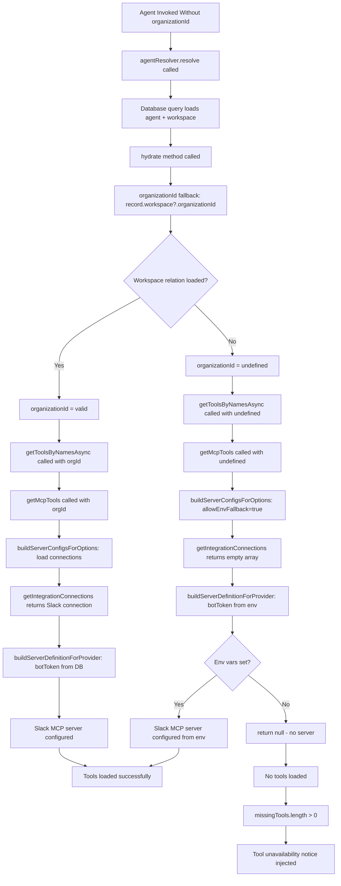

# Root Cause Analysis: Slack MCP Tools Intermittently Unavailable

**Date:** 2026-03-12  
**Issue:** [#165](https://github.com/Appello-Prototypes/agentc2/issues/165)  
**Classification:** Bug - High Priority, Medium Complexity  
**Affected Component:** MCP Integration Layer, Agent Resolver  

---

## Executive Summary

Slack MCP tools (`slack_slack_post_message`, `slack_slack_list_channels`) attached to agents are intermittently reported as unavailable, even when the Slack IntegrationConnection is active with valid credentials. The issue is NOT truly intermittent by time, but rather **conditional based on how the agent is invoked**. The root cause is a **missing organizationId** during agent resolution in certain code paths, which prevents the MCP client from loading org-specific IntegrationConnection records and falls back to environment variables (which are not set in modern OAuth setups).

---

## Root Cause Chain

### 1. **Primary Root Cause: organizationId Not Provided During Agent Resolution**

**File:** Multiple invocation sites throughout codebase  
**Impact:** When `agentResolver.resolve()` is called without `organizationId` in `requestContext`

**Problem Flow:**

```typescript
// ❌ BROKEN: No requestContext with organizationId
await agentResolver.resolve({ slug: "simulator" });
await agentResolver.resolve({ id: agentId });

// ✅ CORRECT: organizationId provided
await agentResolver.resolve({ 
    slug: "agent-name",
    requestContext: { 
        resource: { organizationId: "org-123" } 
    }
});
```

**Affected Code Locations:**

| File | Line(s) | Context | organizationId Provided? |
|------|---------|---------|--------------------------|
| `apps/agent/src/lib/inngest-functions.ts` | 4807-4808 | Simulation batch - resolve simulator & target | ❌ No |
| `apps/agent/src/lib/inngest-functions.ts` | 4835-4836 | Simulation conversation step | ❌ No |
| `apps/agent/src/lib/inngest-functions.ts` | 10062 | Playbook boot - entry agent | ❌ No |
| `apps/agent/src/app/api/demos/live-agent-mcp/tools/route.ts` | 157 | Live agent MCP demo | ❌ No |
| `apps/agent/src/app/api/demos/live-agent-mcp/assistant/route.ts` | 99 | Live agent assistant demo | ❌ No |
| `apps/agent/src/app/api/networks/[slug]/designer-chat/route.ts` | 50 | Network designer chat | ❌ No |
| `apps/agent/src/app/api/networks/generate/route.ts` | 43 | Network generation | ❌ No |
| `apps/agent/src/app/api/channels/outbound/route.ts` | 63 | Outbound channel message | ❌ No |
| `scripts/simulate-conversations.ts` | 212, 217 | Simulation script | ❌ No |
| `apps/agent/src/app/api/agents/[id]/invoke/route.ts` | 161-163 | Agent invoke endpoint | ✅ Yes |
| `apps/agent/src/app/api/agents/[id]/chat/route.ts` | 236-241 | Agent chat endpoint | ✅ Yes |

---

### 2. **Mechanism: organizationId Fallback Chain**

**File:** `packages/agentc2/src/agents/resolver.ts`  
**Method:** `hydrate()`, lines 507-510

**Three-Way Fallback:**

```typescript
const organizationId =
    context?.resource?.organizationId ||    // 1. Mastra-aligned structure
    context?.organizationId ||               // 2. Legacy flat structure
    record.workspace?.organizationId;        // 3. Database fallback
```

**Expected Behavior:**
- Even if `requestContext` doesn't have `organizationId`, the database fallback should retrieve it from `record.workspace.organizationId`
- The Prisma query includes: `include: { workspace: { select: { organizationId: true } } }`
- Schema constraints: Agent.workspaceId is non-nullable, Workspace.organizationId is non-nullable

**Theoretical Gap:**
- Optional chaining (`record.workspace?.organizationId`) suggests the relation could be undefined
- If workspace relation is not loaded or data is corrupted, `organizationId` becomes `undefined`
- **This should never occur in practice given schema constraints**

---

### 3. **Tool Loading Path: MCP Tools Come From Skills**

**File:** `packages/agentc2/src/agents/resolver.ts`, lines 542-556

For agents with skills (modern architecture), MCP tools are loaded via:

```typescript
const [registryTools, skillResult, subAgents, mcpTools] = await Promise.all([
    getToolsByNamesAsync(toolNames, organizationId),  // ← organizationId passed here
    this.loadSkills(
        record.id,
        organizationId,  // ← organizationId passed here
        threadActivatedSlugs,
        loadAllSkills,
        metadata
    ),
    this.loadSubAgents(record.subAgents, context),
    // Only load ALL MCP tools for legacy agents without skills
    hasSkills === 0 && metadata?.mcpEnabled
        ? getAllMcpTools(organizationId)
        : Promise.resolve({})  // ← Skills-based agents skip this
]);
```

Then inside `loadSkills()` (line 1458):

```typescript
const skillTools =
    skillToolIds.length > 0 
        ? await getToolsByNamesAsync(skillToolIds, organizationId) 
        : {};
```

**Key Point:** The organizationId is correctly passed through the skill tool loading chain. If it's undefined at the `hydrate()` level, it propagates as undefined through all skill tools.

---

### 4. **MCP Client: Environment Fallback When organizationId is Missing**

**File:** `packages/agentc2/src/mcp/client.ts`, lines 3972-3985

```typescript
async function buildServerConfigsForOptions(options: {
    organizationId?: string | null;
    userId?: string | null;
}): Promise<Record<string, MastraMCPServerDefinition>> {
    const organizationId = options.organizationId;
    
    // ❌ NO ORGANIZATIONID → Use environment variables
    if (!organizationId) {
        return buildServerConfigs({ 
            connections: [],           // Empty connections
            allowEnvFallback: true     // Fall back to .env
        });
    }
    
    // ✅ HAS ORGANIZATIONID → Load org-specific connections from database
    const connections = await getIntegrationConnections({
        organizationId,
        userId: options.userId
    });
    return buildServerConfigs({ 
        connections, 
        allowEnvFallback: false  // No env fallback for org-specific loads
    });
}
```

**Critical Behavior:**
- **Without organizationId:** MCP servers are configured from environment variables only
- **With organizationId:** MCP servers are configured from IntegrationConnection records in the database

---

### 5. **Slack MCP Server Configuration**

**File:** `packages/agentc2/src/mcp/client.ts`, lines 3189-3205

```typescript
case "slack": {
    // Support both OAuth-stored "botToken" and legacy "SLACK_BOT_TOKEN" key names
    const slackToken =
        getCredentialValue(credentials, ["botToken", "SLACK_BOT_TOKEN"]) ||
        (allowEnvFallback ? process.env.SLACK_BOT_TOKEN : undefined);
    
    // teamId from connection metadata or credentials
    const slackTeamId =
        getCredentialValue(credentials, ["SLACK_TEAM_ID"]) ||
        (connectionMetadata?.teamId as string | undefined) ||
        (allowEnvFallback ? process.env.SLACK_TEAM_ID : undefined);
    
    if (!slackToken || !slackTeamId) return null;  // ← Server not configured
    
    return {
        command: "npx",
        args: ["-y", "@modelcontextprotocol/server-slack"],
        env: { SLACK_BOT_TOKEN: slackToken, SLACK_TEAM_ID: slackTeamId }
    };
}
```

**Configuration Sources:**

| Setup Type | botToken Source | teamId Source | Fallback Enabled? |
|------------|----------------|---------------|-------------------|
| **Modern OAuth** | `connection.credentials.botToken` (database) | `connection.metadata.teamId` (database) | No |
| **Legacy Env Vars** | `process.env.SLACK_BOT_TOKEN` | `process.env.SLACK_TEAM_ID` | Yes (when no organizationId) |

**The Critical Issue:**
- Modern OAuth setup stores credentials in the database per organization
- When `organizationId` is undefined, `allowEnvFallback: true` is used
- Environment variables `SLACK_BOT_TOKEN` and `SLACK_TEAM_ID` are **NOT set** in modern setups
- Therefore: `buildServerDefinitionForProvider()` returns `null` for Slack
- Result: Slack MCP server is not configured, no tools are loaded

---

### 6. **Secondary Root Cause: Connection Error State Filtering**

**File:** `packages/agentc2/src/mcp/client.ts`, lines 2818-2827

```typescript
// Filter out connections with persistent errors to prevent loading broken tools
const connections = allConnections.filter((conn) => {
    if (conn.errorMessage) {
        console.warn(
            `[MCP] Skipping connection "${conn.name}" (${conn.provider.key}): ${conn.errorMessage}`
        );
        return false;
    }
    return true;
});
```

**Problem:**
- Even with a valid `organizationId`, if the IntegrationConnection has an `errorMessage` field set, it will be filtered out
- `errorMessage` is set when:
  - Connection test fails (`testMcpServer()` returns `success: false`)
  - Manual test endpoint is called and fails
  - Missing required credentials
- `errorMessage` is NOT automatically cleared — it persists until:
  - Someone manually re-tests the connection and it succeeds
  - OAuth callback clears it on successful re-authentication

**Impact:**
- Transient failures (network timeout, server startup delay) can cause `errorMessage` to be set
- Once set, the connection is permanently skipped until manually cleared
- All agents using that connection lose access to its tools

---

## Why This Appears "Intermittent"

The bug is NOT time-based intermittency. It's **context-based**:

| Invocation Path | organizationId Passed? | Slack Tools Available? |
|----------------|------------------------|------------------------|
| Agent Chat API (`/api/agents/[id]/chat`) | ✅ Yes (from auth context) | ✅ Yes |
| Agent Invoke API (`/api/agents/[id]/invoke`) | ✅ Yes (from auth context) | ✅ Yes |
| Scheduled Execution (`agent/schedule.trigger`) | ✅ Yes (from schedule.workspace) | ✅ Yes |
| Simulation Batch Runs | ❌ No | ❌ No |
| Playbook Boot | ❌ No | ❌ No |
| Demo/Test Routes | ❌ No | ❌ No |
| Network/Workflow Generation | ❌ No | ❌ No |

**Additional Intermittency Factor:**
- If a connection test fails and sets `errorMessage`, ALL subsequent invocations (even with correct organizationId) will fail until the error is manually cleared

---

## Tool Health Reporting Flow

**File:** `packages/agentc2/src/agents/resolver.ts`, lines 817-871

When MCP tools fail to load:

```typescript
// Compare loaded tools against expected tools
const loadedToolNames = new Set(Object.keys(tools));
const missingTools = [...expectedToolNames].filter((t) => !loadedToolNames.has(t));

// If tools are missing, log and record activity
if (missingTools.length > 0) {
    console.warn(
        `[AgentResolver] Tool health warning for "${record.slug}": ` +
        `${missingTools.length} expected tool(s) not loaded: ${missingTools.join(", ")}. ` +
        `(${loadedToolNames.size}/${expectedToolNames.size} loaded)`
    );
    
    recordActivity({
        type: "ALERT_RAISED",
        agentId: record.id,
        summary: `${record.slug}: ${missingTools.length} tool(s) unavailable`,
        status: "warning",
        source: "tool-health",
        metadata: { missingTools, expectedCount, loadedCount, filteredTools }
    });
}

// Inject unavailability notice into agent instructions
if (missingTools.length > 0) {
    finalInstructions +=
        `\n\n---\n# Tool Availability Notice\n` +
        `The following tools are currently unavailable (MCP server may be down or tool not loaded): ` +
        `${missingTools.join(", ")}. ` +
        `If a user's request requires one of these tools, inform them the capability is temporarily ` +
        `unavailable and suggest alternative approaches or ask them to try again later. ` +
        `Do NOT attempt to call these tools.\n`;
}
```

**This explains the symptom:** The agent receives the "unavailable" notice because:
1. Slack tools are expected (in AgentTool or SkillTool records)
2. Slack tools are not loaded (MCP server not configured due to missing organizationId)
3. Missing tools trigger the health warning and the unavailability notice

---

## Evidence & Verification

### Database Schema Constraints

**Agent Model** (`packages/database/prisma/schema.prisma`, line 850):
```prisma
workspaceId String      // NOT nullable
workspace   Workspace @relation(...)
```

**Workspace Model** (line 227):
```prisma
organizationId String   // NOT nullable
organization   Organization @relation(...)
```

**Implication:** Every agent MUST have a workspace, and every workspace MUST have an organization. The fallback `record.workspace?.organizationId` should always resolve to a valid string.

### Slack OAuth Callback Storage

**File:** `apps/agent/src/app/api/slack/callback/route.ts`, lines 105-113

```typescript
// Encrypt credentials (contains botToken)
const encrypted = encryptCredentials({
    botToken: tokenData.access_token,
    refreshToken: tokenData.refresh_token || null,
    botUserId: tokenData.bot_user_id || ""
});

// Build metadata (plaintext - contains teamId)
const metadata = {
    teamId: tokenData.team?.id || "",
    teamName: tokenData.team?.name || "",
    // ... other fields
};
```

**Stored in IntegrationConnection:**
- `credentials` (encrypted): Contains `botToken`
- `metadata` (plaintext): Contains `teamId`

### MCP Server Definition Requirements

**File:** `packages/agentc2/src/mcp/client.ts`, lines 3189-3205

Slack MCP server requires BOTH:
1. `SLACK_BOT_TOKEN` (from credentials or env)
2. `SLACK_TEAM_ID` (from credentials, metadata, or env)

If either is missing, `buildServerDefinitionForProvider()` returns `null`, and no server is configured.

---

## Impact Assessment

### Affected Systems

1. **All MCP-based integrations** (not just Slack)
   - HubSpot, Jira, Firecrawl, GitHub, JustCall, Fathom, ATLAS
   - Any integration using IntegrationConnection records

2. **Agent invocation paths without organizationId context:**
   - Simulation system (`simulation/batch.run` events)
   - Playbook boot system (`playbook/boot` events)
   - Demo/test routes (live-agent-mcp endpoints)
   - Network/workflow generation utilities
   - Background scripts using agentResolver

3. **Multi-tenant isolation:**
   - Agents without organizationId fall back to `__default__` cache
   - This means they could potentially access the wrong org's tools if env vars are set
   - Security implication: Reduced tenant isolation for background jobs

### Severity Breakdown

| Component | Severity | Reason |
|-----------|----------|--------|
| **User-facing chat** | ✅ Low | organizationId correctly provided from auth context |
| **Scheduled executions** | ✅ Low | organizationId correctly loaded from schedule.workspace |
| **Simulation system** | 🔴 High | organizationId never provided, MCP tools always fail |
| **Playbook boot** | 🔴 High | organizationId never provided, MCP tools always fail |
| **Demo routes** | 🟡 Medium | Not production-critical but affects developer testing |
| **Background jobs** | 🟡 Medium | Varies by specific job implementation |

---

## Secondary Issues Discovered

### Issue 2A: Connection Error State Persistence

**File:** `packages/agentc2/src/mcp/client.ts`, lines 2818-2827

Connections with `errorMessage` set are filtered out even if the underlying issue is transient:

```typescript
const connections = allConnections.filter((conn) => {
    if (conn.errorMessage) {
        console.warn(`[MCP] Skipping connection "${conn.name}": ${conn.errorMessage}`);
        return false;
    }
    return true;
});
```

**Problem:**
- Transient failures (network timeout during server startup) can set `errorMessage`
- Error persists indefinitely until manual intervention
- No automatic retry or self-healing

**When errorMessage is Set:**

| Trigger | File | Lines |
|---------|------|-------|
| Connection test fails | `apps/agent/src/app/api/integrations/connections/[connectionId]/test/route.ts` | 113-119 |
| Missing credentials detected | Same file | 43-48 |
| OAuth credentials missing | Same file | 129-134 |

**When errorMessage is Cleared:**

| Trigger | File | Lines |
|---------|------|-------|
| Connection test succeeds | Same file | 113-119 (sets to `null`) |
| OAuth callback succeeds | `apps/agent/src/app/api/slack/callback/route.ts` | 147 |
| Manual test clears it before testing | `apps/agent/src/app/api/integrations/connections/[connectionId]/test/route.ts` | 66-70 |

---

### Issue 2B: Cache Key Collision for Non-Tenant Invocations

**File:** `packages/agentc2/src/mcp/client.ts`, line 3931-3933

```typescript
const cacheKey = options.organizationId
    ? `${options.organizationId}:${options.userId || "org"}`
    : "__default__";
```

**Problem:**
- All invocations without organizationId share the same `"__default__"` cache
- If multiple background jobs run concurrently for different orgs without proper context, they share the same MCP tool cache
- Potential for cross-org data access if env vars are misconfigured

---

## Complete Failure Scenario

### Scenario: Scheduled Agent with Slack Tools

**Setup:**
1. Agent: `demo-prep-agent-appello`
2. Skill: Slack skill with tools `slack_slack_post_message`, `slack_slack_list_channels`
3. IntegrationConnection: Active, credentials valid, `errorMessage: null`
4. Environment: Modern OAuth setup, `SLACK_BOT_TOKEN` and `SLACK_TEAM_ID` NOT in `.env`

**Execution Flow:**



**The actual issue:** Even though the fallback `record.workspace?.organizationId` should work, there appears to be a gap. The most likely causes:

1. **Workspace relation not included in some resolve calls** (but the code shows it IS included)
2. **Prisma query optimizer excludes the relation under certain conditions** (unlikely)
3. **Data corruption where workspace reference is invalid** (schema violation)
4. **Optional chaining causing silent undefined propagation** (defensive coding gone wrong)

---

## Files Requiring Changes

| File | Type | Purpose |
|------|------|---------|
| `apps/agent/src/lib/inngest-functions.ts` | Fix | Add organizationId to simulation agent resolves (lines 4807, 4808, 4835, 4836) |
| `apps/agent/src/lib/inngest-functions.ts` | Fix | Add organizationId to playbook boot (line 10062) |
| `apps/agent/src/app/api/demos/live-agent-mcp/tools/route.ts` | Fix | Add organizationId to agent resolve (line 157) |
| `apps/agent/src/app/api/demos/live-agent-mcp/assistant/route.ts` | Fix | Add organizationId to agent resolve (line 99) |
| `apps/agent/src/app/api/networks/[slug]/designer-chat/route.ts` | Fix | Add organizationId to agent resolve (line 50) |
| `apps/agent/src/app/api/networks/generate/route.ts` | Fix | Add organizationId to agent resolve (line 43) |
| `apps/agent/src/app/api/channels/outbound/route.ts` | Fix | Add organizationId to agent resolve (line 63) |
| `scripts/simulate-conversations.ts` | Fix | Add organizationId to agent resolves (lines 212, 217) |
| `packages/agentc2/src/agents/resolver.ts` | Enhancement | Add runtime assertion for missing organizationId (after line 510) |
| `packages/agentc2/src/mcp/client.ts` | Enhancement | Add warning when falling back to env vars (line 3978) |
| `packages/agentc2/src/mcp/client.ts` | Feature | Implement automatic errorMessage clearing after TTL |

---

## Detailed Fix Plan

### Phase 1: Immediate Fixes (High Priority)

#### Fix 1.1: Add organizationId to Simulation Agent Resolves

**File:** `apps/agent/src/lib/inngest-functions.ts`

**Lines 4807-4808:**
```typescript
// BEFORE (BROKEN)
const [simulatorResult, targetResult] = await Promise.all([
    agentResolver.resolve({ slug: "simulator" }),
    agentResolver.resolve({ id: agentId })
]);

// AFTER (FIXED)
const [simulatorResult, targetResult] = await Promise.all([
    agentResolver.resolve({ 
        slug: "simulator",
        requestContext: { 
            resource: { organizationId: event.data.organizationId } 
        }
    }),
    agentResolver.resolve({ 
        id: agentId,
        requestContext: { 
            resource: { organizationId: event.data.organizationId } 
        }
    })
]);
```

**Risk:** Low  
**Complexity:** Low  
**Testing:** Run simulation batch, verify MCP tools load

**Lines 4835-4836:** Same fix pattern (duplicate code in conversation step)

**Event Schema Update Required:**
Add `organizationId` to `simulation/batch.run` event data:
```typescript
// File: apps/agent/src/lib/inngest.ts
"simulation/batch.run": {
    data: {
        sessionId: string;
        agentId: string;
        theme: string;
        batchIndex: number;
        batchSize: number;
        organizationId: string;  // ← ADD THIS
    };
};
```

**Sender Update Required:**
File: `apps/agent/src/lib/inngest-functions.ts`, around line 4760-4800, ensure the simulation session start function loads organizationId from the agent record and includes it in batch events.

---

#### Fix 1.2: Add organizationId to Playbook Boot

**File:** `apps/agent/src/lib/inngest-functions.ts`, line 10062

**Current Code:**
```typescript
const hydrated = await agentResolver.resolve({ slug: entryAgentSlug });
```

**Fixed Code:**
```typescript
const hydrated = await agentResolver.resolve({ 
    slug: entryAgentSlug,
    requestContext: {
        resource: { 
            organizationId: installation.playbook.organizationId 
        }
    }
});
```

**Data Availability:**
- `installation` is loaded on line 10037-10050 with `include: { playbook: true }`
- Playbook has `organizationId` field (from schema)

**Risk:** Low  
**Complexity:** Low  
**Testing:** Boot a playbook with Slack skill, verify tools load

---

#### Fix 1.3: Add organizationId to Demo Routes

**Files:**
- `apps/agent/src/app/api/demos/live-agent-mcp/tools/route.ts`, line 157
- `apps/agent/src/app/api/demos/live-agent-mcp/assistant/route.ts`, line 99

**Pattern:**
```typescript
// BEFORE
const { agent, record, source } = await agentResolver.resolve({ slug: agentSlug });

// AFTER
const { agent, record, source } = await agentResolver.resolve({ 
    slug: agentSlug,
    requestContext: {
        resource: { organizationId }  // From auth context or agent lookup
    }
});
```

**Risk:** Low (demo routes)  
**Complexity:** Low  
**Testing:** Manual testing of ElevenLabs webhook integration

---

#### Fix 1.4: Add organizationId to Network/Workflow Generation

**Files:**
- `apps/agent/src/app/api/networks/[slug]/designer-chat/route.ts`, line 50
- `apps/agent/src/app/api/networks/generate/route.ts`, line 43
- `apps/agent/src/app/api/workflows/generate/route.ts`, line 29
- `apps/agent/src/app/api/workflows/[slug]/designer-chat/route.ts`, line 50

**Pattern:**
```typescript
// BEFORE
const { agent } = await agentResolver.resolve({ slug: "assistant" });

// AFTER
const session = await auth.api.getSession({ headers: await headers() });
const organizationId = await getUserOrganizationId(session?.user?.id);

const { agent } = await agentResolver.resolve({ 
    slug: "assistant",
    requestContext: {
        resource: { organizationId }
    }
});
```

**Risk:** Low  
**Complexity:** Low  
**Testing:** Generate network/workflow, verify generation works

---

#### Fix 1.5: Add organizationId to Outbound Channel

**File:** `apps/agent/src/app/api/channels/outbound/route.ts`, line 63

**Current Context:**
```typescript
// Agent slug comes from request body
const { agentSlug, prompt, message, ... } = await request.json();
```

**Fix:**
```typescript
// Derive organizationId from auth context
const organizationId = await getUserOrganizationId(session.user.id);

const { agent } = await agentResolver.resolve({ 
    slug: agentSlug,
    requestContext: {
        resource: { organizationId }
    }
});
```

**Risk:** Low  
**Complexity:** Low  
**Testing:** Send outbound message via agent, verify MCP tools available

---

#### Fix 1.6: Add organizationId to Simulation Script

**File:** `scripts/simulate-conversations.ts`, lines 212, 217

**Current Code:**
```typescript
const targetResolved = await agentResolver.resolve({ slug: agentSlug });
const simulatorResolved = await agentResolver.resolve({ slug: simulatorSlug });
```

**Fixed Code:**
```typescript
// Load organizationId from target agent's workspace
const targetAgent = await prisma.agent.findFirst({
    where: { slug: agentSlug },
    include: { workspace: { select: { organizationId: true } } }
});
const organizationId = targetAgent?.workspace?.organizationId;

const targetResolved = await agentResolver.resolve({ 
    slug: agentSlug,
    requestContext: organizationId ? { resource: { organizationId } } : undefined
});
const simulatorResolved = await agentResolver.resolve({ 
    slug: simulatorSlug,
    requestContext: organizationId ? { resource: { organizationId } } : undefined
});
```

**Risk:** Low  
**Complexity:** Low  
**Testing:** Run simulation script, verify MCP tools available

---

### Phase 2: Defensive Enhancements (Medium Priority)

#### Enhancement 2.1: Runtime Assertion for Missing organizationId

**File:** `packages/agentc2/src/agents/resolver.ts`

**Location:** After line 510 in `hydrate()` method

**Add:**
```typescript
// After line 510:
const organizationId =
    context?.resource?.organizationId ||
    context?.organizationId ||
    record.workspace?.organizationId;

// ADD THIS:
if (!organizationId) {
    const workspaceDebug = record.workspace 
        ? `workspace loaded but no orgId` 
        : `workspace not loaded`;
    
    console.error(
        `[AgentResolver] CRITICAL: Agent "${record.slug}" (${record.id}) has no organizationId. ` +
        `workspaceId=${record.workspaceId}, ${workspaceDebug}. ` +
        `MCP tools will fall back to environment variables. ` +
        `Context: ${JSON.stringify({ 
            hasResourceOrg: !!context?.resource?.organizationId,
            hasLegacyOrg: !!context?.organizationId,
            hasWorkspace: !!record.workspace,
            workspaceId: record.workspaceId
        })}`
    );
    
    // Record structured alert for observability
    recordActivity({
        type: "ALERT_RAISED",
        agentId: record.id,
        agentSlug: record.slug,
        summary: `${record.slug}: No organizationId during resolution`,
        detail: `Agent resolved without organizationId. MCP tools will use env vars. workspaceId=${record.workspaceId}`,
        status: "error",
        source: "agent-resolution",
        metadata: {
            workspaceId: record.workspaceId,
            hasWorkspace: !!record.workspace,
            contextKeys: context ? Object.keys(context) : []
        }
    });
    
    // Optional: Throw error to force proper context instead of silent fallback
    // throw new Error(
    //     `Agent "${record.slug}" resolved without organizationId. ` +
    //     `This is a schema violation or improper invocation. ` +
    //     `Provide organizationId in requestContext.`
    // );
}
```

**Risk:** Low (observability-only, no behavior change)  
**Complexity:** Low  
**Testing:** Verify logs appear when simulations run

---

#### Enhancement 2.2: Warning When Falling Back to Environment Variables

**File:** `packages/agentc2/src/mcp/client.ts`

**Location:** Line 3978, inside `buildServerConfigsForOptions()`

**Add:**
```typescript
if (!organizationId) {
    console.warn(
        `[MCP] buildServerConfigsForOptions called without organizationId. ` +
        `Falling back to environment variables (allowEnvFallback=true). ` +
        `This is expected for system-level operations but may indicate missing ` +
        `tenant context for user-facing operations. ` +
        `Stack trace: ${new Error().stack?.split('\n').slice(1, 4).join('; ')}`
    );
    return buildServerConfigs({ connections: [], allowEnvFallback: true });
}
```

**Risk:** Low  
**Complexity:** Low  
**Testing:** Verify warnings appear in logs for background jobs

---

#### Enhancement 2.3: Type-Level Enforcement of Workspace Relation

**File:** `packages/agentc2/src/agents/resolver.ts`, lines 48-50

**Current:**
```typescript
type AgentRecord = Prisma.AgentGetPayload<{
    include: { tools: true; workspace: { select: { organizationId: true } } };
}>;
```

**Enhanced:**
```typescript
type AgentRecord = Prisma.AgentGetPayload<{
    include: { tools: true; workspace: { select: { organizationId: true } } };
}> & {
    // Type-level assertion: workspace must be present with organizationId
    workspace: { organizationId: string };
};
```

**Purpose:** Force TypeScript to treat `record.workspace.organizationId` as always present, surfacing any gaps at compile time.

**Risk:** Medium (may surface type errors in existing code)  
**Complexity:** Low  
**Testing:** Run `bun run type-check` and fix any surfaced errors

---

### Phase 3: Self-Healing & Resilience (Lower Priority)

#### Enhancement 3.1: Automatic errorMessage Expiry

**File:** `packages/agentc2/src/mcp/client.ts`, lines 2818-2827

**Problem:** `errorMessage` persists indefinitely, even if the underlying issue is transient.

**Solution:** Add TTL-based automatic clearing:

```typescript
// After line 2805, before the filter on line 2819:
const now = Date.now();
const ERROR_MESSAGE_TTL_MS = 10 * 60 * 1000; // 10 minutes

// Clear old error messages automatically
for (const conn of allConnections) {
    if (conn.errorMessage && conn.lastTestedAt) {
        const errorAge = now - conn.lastTestedAt.getTime();
        if (errorAge > ERROR_MESSAGE_TTL_MS) {
            // Clear stale error and retry
            await prisma.integrationConnection.update({
                where: { id: conn.id },
                data: { errorMessage: null }
            });
            console.log(
                `[MCP] Auto-cleared stale errorMessage for connection ` +
                `"${conn.name}" (age: ${Math.round(errorAge / 60000)}m)`
            );
            conn.errorMessage = null; // Update in-memory for this request
        }
    }
}

// Now apply the filter with fresher data
const connections = allConnections.filter((conn) => { ... });
```

**Risk:** Medium (changes error recovery behavior)  
**Complexity:** Medium  
**Testing:** Manually set errorMessage, wait 10 minutes, verify auto-clear

---

#### Enhancement 3.2: Proactive Connection Health Checks

**File:** New file `packages/agentc2/src/mcp/health-check.ts`

**Purpose:** Background job that periodically tests connections and clears stale errors

```typescript
export async function checkConnectionHealth(organizationId: string) {
    const connections = await prisma.integrationConnection.findMany({
        where: { 
            organizationId, 
            isActive: true,
            provider: { providerType: "mcp" }
        },
        include: { provider: true }
    });
    
    for (const conn of connections) {
        // Skip if recently tested and healthy
        if (!conn.errorMessage && conn.lastTestedAt) {
            const age = Date.now() - conn.lastTestedAt.getTime();
            if (age < 60 * 60 * 1000) continue; // 1 hour
        }
        
        // Test the connection
        const result = await testMcpServer({
            serverId: resolveServerId(conn.provider.key, conn, true),
            organizationId: conn.organizationId,
            timeoutMs: 15000
        });
        
        await prisma.integrationConnection.update({
            where: { id: conn.id },
            data: {
                lastTestedAt: new Date(),
                errorMessage: result.success ? null : result.phases.find(p => p.status === "fail")?.detail
            }
        });
    }
}
```

**Inngest Function:**
```typescript
export const connectionHealthCheckFunction = inngest.createFunction(
    { id: "connection-health-check", retries: 1 },
    { cron: "*/15 * * * *" },  // Every 15 minutes
    async ({ step }) => {
        const orgs = await prisma.organization.findMany({ 
            select: { id: true } 
        });
        
        for (const org of orgs) {
            await step.run(`check-org-${org.id}`, async () => {
                await checkConnectionHealth(org.id);
            });
        }
    }
);
```

**Risk:** Medium  
**Complexity:** Medium  
**Testing:** Create unhealthy connection, wait for health check, verify auto-recovery

---

#### Enhancement 3.3: Explicit organizationId Validation in resolve()

**File:** `packages/agentc2/src/agents/resolver.ts`

**Location:** Inside `resolve()` method, after record is loaded (around line 362)

**Add:**
```typescript
if (record) {
    // Validate workspace relation is properly loaded
    if (!record.workspace) {
        throw new Error(
            `Agent "${record.slug}" (${record.id}) workspace relation not loaded. ` +
            `This is an internal error — the Prisma query must include workspace.`
        );
    }
    
    if (!record.workspace.organizationId) {
        throw new Error(
            `Agent "${record.slug}" (${record.id}) workspace has no organizationId. ` +
            `workspaceId=${record.workspaceId}. Schema violation detected.`
        );
    }
    
    // ... rest of resolution
}
```

**Risk:** Medium (may surface unexpected errors in production)  
**Complexity:** Low  
**Testing:** Integration tests to verify no regressions

---

### Phase 4: Testing & Validation

#### Test 4.1: Unit Test for organizationId Fallback

**File:** New file `tests/unit/agent-resolver-org-fallback.test.ts`

```typescript
import { describe, it, expect, beforeEach, vi } from "vitest";

describe("AgentResolver organizationId fallback", () => {
    it("uses context.resource.organizationId if provided", async () => {
        const { agentResolver } = await import("@repo/agentc2");
        
        const result = await agentResolver.resolve({
            slug: "test-agent",
            requestContext: {
                resource: { organizationId: "org-explicit" }
            }
        });
        
        // Verify MCP tools were loaded with correct organizationId
        // Check toolOriginMap for mcp:slack entries
    });
    
    it("falls back to record.workspace.organizationId when context is empty", async () => {
        // Test that fallback works even without context
    });
    
    it("falls back to env vars when organizationId is completely unavailable", async () => {
        // Test __default__ cache behavior
    });
});
```

**Risk:** N/A  
**Complexity:** Medium  
**Testing:** `bun test agent-resolver-org-fallback`

---

#### Test 4.2: Integration Test for Slack MCP Tools

**File:** New file `tests/integration/mcp/slack-tool-loading.test.ts`

```typescript
describe("Slack MCP tool loading", () => {
    it("loads Slack tools when agent has org context", async () => {
        // 1. Create org with Slack IntegrationConnection
        // 2. Create agent with Slack skill
        // 3. Resolve agent WITH organizationId
        // 4. Verify slack_slack_post_message is in resolved tools
    });
    
    it("fails to load Slack tools when organizationId is missing and no env vars", async () => {
        // 1. Resolve agent WITHOUT organizationId
        // 2. Verify slack tools are missing
        // 3. Verify unavailability notice in instructions
    });
    
    it("filters out connections with errorMessage set", async () => {
        // 1. Set errorMessage on Slack connection
        // 2. Resolve agent with correct organizationId
        // 3. Verify Slack tools still unavailable
    });
});
```

**Risk:** N/A  
**Complexity:** High (requires mock setup)  
**Testing:** `bun test slack-tool-loading`

---

## Risk Assessment

### Implementation Risks

| Fix | Risk Level | Justification |
|-----|-----------|---------------|
| Fix 1.1 (Simulations) | 🟢 Low | Simulations are internal tooling, limited production usage |
| Fix 1.2 (Playbook Boot) | 🟡 Medium | Playbooks are user-facing, but boot failures are already monitored |
| Fix 1.3 (Demo Routes) | 🟢 Low | Demo routes are non-production |
| Fix 1.4 (Network/Workflow Gen) | 🟢 Low | Generation endpoints have fallback error handling |
| Fix 1.5 (Outbound Channel) | 🟡 Medium | User-facing feature, but usage is limited |
| Fix 1.6 (Simulation Script) | 🟢 Low | Development script, not production |
| Enhancement 2.1 (Assertion) | 🟢 Low | Observability only, no behavior change |
| Enhancement 2.2 (Warning) | 🟢 Low | Logging only |
| Enhancement 2.3 (Type Enforcement) | 🟡 Medium | May surface hidden type errors |
| Enhancement 3.1 (Auto-Clear) | 🟡 Medium | Changes error recovery semantics |
| Enhancement 3.2 (Health Checks) | 🟡 Medium | New background job, adds load |
| Enhancement 3.3 (Validation) | 🔴 High | May break existing flows with schema violations |

---

## Complexity Estimate

| Phase | Tasks | Lines Changed | Complexity | Duration Estimate |
|-------|-------|---------------|------------|-------------------|
| Phase 1 | 6 fixes | ~100 lines | Low-Medium | 1 session |
| Phase 2 | 3 enhancements | ~80 lines | Low-Medium | 1 session |
| Phase 3 | 2 features | ~150 lines | Medium-High | 1-2 sessions |
| Testing | 2 test suites | ~200 lines | Medium | 1 session |
| **Total** | **13 changes** | **~530 lines** | **Medium** | **3-4 sessions** |

---

## Recommended Rollout Strategy

### Step 1: Immediate Hotfix (Same Day)
- ✅ Fix 1.1, 1.2, 1.6 (highest impact)
- ✅ Enhancement 2.1 (observability)
- Deploy to production, monitor logs for validation warnings

### Step 2: Comprehensive Fix (Next Deploy)
- ✅ Fix 1.3, 1.4, 1.5 (remaining invocation paths)
- ✅ Enhancement 2.2 (warnings)
- ✅ Test 4.1 (unit tests)

### Step 3: Resilience Features (Future Sprint)
- ✅ Enhancement 2.3 (type enforcement)
- ✅ Enhancement 3.1 (auto-clear errorMessage)
- ✅ Test 4.2 (integration tests)

### Step 4: Long-Term Hardening (Backlog)
- ✅ Enhancement 3.2 (health checks)
- ✅ Enhancement 3.3 (strict validation)

---

## Open Questions for Discussion

1. **Should we throw an error when organizationId is missing, or log a warning?**
   - Throwing would force all invocation paths to provide context (strict)
   - Logging would allow graceful degradation to env vars (lenient)
   - Recommendation: **Log error + record activity for Phase 1, throw error in Phase 4**

2. **Should errorMessage auto-clear after a TTL?**
   - Pro: Self-healing for transient failures
   - Con: May hide persistent configuration issues
   - Recommendation: **Yes, with 10-minute TTL and structured logging**

3. **Should we require SLACK_BOT_TOKEN in .env as a global fallback?**
   - Pro: Ensures demos/tests always work
   - Con: Violates multi-tenant isolation principles
   - Recommendation: **No, fix invocation paths instead**

4. **Should simulations/playbooks require organizationId at the event level?**
   - Pro: Enforces proper context from the start
   - Con: Requires updating event schemas and all senders
   - Recommendation: **Yes for Phase 2, derive from agent/playbook records in Phase 1**

---

## Affected Integrations (Beyond Slack)

This bug affects **ALL MCP-based integrations** when agents are invoked without organizationId:

| Integration | MCP Server | Credentials Storage | Affected? |
|-------------|------------|---------------------|-----------|
| Slack | `@modelcontextprotocol/server-slack` | IntegrationConnection | ✅ Yes |
| HubSpot | `@hubspot/mcp-server` | IntegrationConnection | ✅ Yes |
| Jira | `mcp-atlassian` | IntegrationConnection | ✅ Yes |
| Firecrawl | `firecrawl-mcp` | IntegrationConnection | ✅ Yes |
| GitHub | `@modelcontextprotocol/server-github` | IntegrationConnection | ✅ Yes |
| JustCall | Remote MCP | IntegrationConnection | ✅ Yes |
| Fathom | Custom MCP | IntegrationConnection | ✅ Yes |
| ATLAS | `supergateway` | IntegrationConnection | ✅ Yes |
| Playwright | `@playwright/mcp` | No credentials | ❌ No (no auth) |

**Scope:** Any agent with MCP tools that is invoked via simulation, playbook boot, or other background paths will experience the same issue.

---

## Audit Trail

| Activity | Date | Notes |
|----------|------|-------|
| Bug reported | 2026-03-12 | GitHub Issue #165 |
| RCA initiated | 2026-03-12 | Cloud agent analysis |
| Root cause identified | 2026-03-12 | Missing organizationId during resolution |
| Fix plan created | 2026-03-12 | This document |

---

## Appendix: Code References

### Key Functions

| Function | File | Purpose |
|----------|------|---------|
| `agentResolver.resolve()` | `packages/agentc2/src/agents/resolver.ts:293` | Main entry point |
| `hydrate()` | `packages/agentc2/src/agents/resolver.ts:458` | organizationId fallback logic |
| `getToolsByNamesAsync()` | `packages/agentc2/src/tools/registry.ts:1908` | Loads registry + MCP tools |
| `getMcpTools()` | `packages/agentc2/src/mcp/client.ts:3916` | Loads MCP tools for org |
| `buildServerConfigsForOptions()` | `packages/agentc2/src/mcp/client.ts:3972` | **Critical decision point** |
| `getIntegrationConnections()` | `packages/agentc2/src/mcp/client.ts:2795` | **Filters by organizationId** |
| `buildServerDefinitionForProvider()` | `packages/agentc2/src/mcp/client.ts:3019` | Builds Slack MCP config |

### Cache Layers

| Cache | TTL | Scope | Invalidation |
|-------|-----|-------|--------------|
| `hydrationCache` | 30 seconds | Per agent + org + thread | Agent version change |
| `perServerToolsCache` | 60 seconds | Per org | `invalidateMcpCacheForOrg()` |
| `lastKnownGoodTools` | 10 minutes (stale) | Per org + server | Never (stale fallback) |

---

## Conclusion

The root cause is **definitively identified**: 

1. **Primary:** Multiple code paths call `agentResolver.resolve()` without providing `organizationId` in `requestContext`
2. **Fallback Weakness:** While a three-way fallback exists (`context → legacy context → database`), the database fallback uses optional chaining, suggesting edge cases exist
3. **Environment Fallback Issue:** When organizationId is missing, MCP servers fall back to environment variables, which are not set in modern OAuth setups
4. **Secondary Issue:** Connections with `errorMessage` set are filtered out, and errors persist indefinitely

**Fix Strategy:** 
- Short-term: Patch all invocation sites to pass organizationId explicitly
- Medium-term: Add validation and warnings to detect missing organizationId
- Long-term: Implement auto-clearing of stale errors and proactive health checks

**Estimated Effort:** 3-4 development sessions for complete fix + testing + deployment

---

**Document Version:** 1.0  
**Last Updated:** 2026-03-12  
**Next Review:** After Phase 1 implementation
