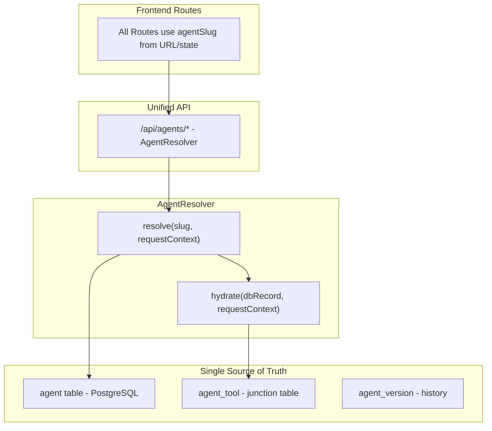

# Agent Migration - Target State

## Overview

The target architecture unifies both agent systems into a **single database-driven solution** following Mastra.ai best practices.

Key improvements:

- Single source of truth (database)
- `RequestContext` for runtime context injection
- Dynamic instructions via templating
- Granular memory configuration
- Per-agent scorers
- Agent versioning and audit trail
- Backwards-compatible migration path

---

## Architecture Diagram



---

## Database Schema

### Agent Model

```prisma
model Agent {
    id          String  @id @default(cuid())
    slug        String  @unique // URL-safe identifier (e.g., "assistant", "research")
    name        String
    description String?

    // Instructions - static or templated
    instructions         String  @db.Text // Final instructions (may be static)
    instructionsTemplate String? @db.Text // Template with {{userId}}, {{userName}}, etc.

    // Model configuration
    modelProvider String // "openai", "anthropic", "google"
    modelName     String // "gpt-4o", "claude-sonnet-4-20250514"
    temperature   Float? @default(0.7)
    maxTokens     Int?
    modelConfig   Json? // Provider-specific: {reasoning: {type: "enabled"}, toolChoice: "auto"}

    // Tool configuration
    tools AgentTool[]

    // Memory configuration (Mastra Memory pattern)
    memoryEnabled Boolean @default(false)
    memoryConfig  Json? // {
    //   lastMessages: 10,
    //   semanticRecall: {topK: 5, messageRange: 50},
    //   workingMemory: {enabled: true, template: "..."}
    // }

    // Multi-step workflows
    maxSteps Int? @default(5) // For agent.generate() iterations

    // Evaluation configuration
    scorers String[] @default([]) // ["relevancy", "helpfulness", "toxicity"]

    // Permissions/tenancy
    type     AgentType @default(USER) // SYSTEM | USER
    ownerId  String? // userId for USER agents, null for SYSTEM
    owner    User?     @relation(fields: [ownerId], references: [id])
    isPublic Boolean   @default(false)

    // Metadata
    metadata Json?
    isActive Boolean @default(true)
    version  Int     @default(1)

    // Audit
    createdAt DateTime @default(now())
    updatedAt DateTime @updatedAt
    createdBy String?

    // Versioning
    versions AgentVersion[]

    @@index([slug])
    @@index([ownerId])
    @@index([type])
    @@map("agent")
}

enum AgentType {
    SYSTEM // Seeded from code, protected from deletion
    USER // User-created, fully editable
}
```

### AgentTool Model (Junction Table)

```prisma
model AgentTool {
    id      String @id @default(cuid())
    agentId String
    agent   Agent  @relation(fields: [agentId], references: [id], onDelete: Cascade)
    toolId  String // Tool registry key (e.g., "calculator", "web-fetch")
    config  Json? // Tool-specific: {inputSchema, outputSchema, description override}

    @@unique([agentId, toolId])
    @@map("agent_tool")
}
```

### AgentVersion Model (History)

```prisma
model AgentVersion {
    id            String   @id @default(cuid())
    agentId       String
    agent         Agent    @relation(fields: [agentId], references: [id], onDelete: Cascade)
    version       Int
    instructions  String   @db.Text
    modelProvider String
    modelName     String
    snapshot      Json // Full agent config at this version
    createdAt     DateTime @default(now())
    createdBy     String?

    @@unique([agentId, version])
    @@map("agent_version")
}
```

---

## Key Interfaces

### RequestContext

Runtime context injected per-request for dynamic behavior.

```typescript
interface RequestContext {
    userId?: string;
    userName?: string;
    tenantId?: string;
    sessionId?: string;
    metadata?: Record<string, unknown>;
}
```

### AgentResolver

The primary interface for resolving agents.

```typescript
interface ResolveOptions {
    slug?: string;
    id?: string;
    requestContext?: RequestContext;
    fallbackToSystem?: boolean;
}

interface HydratedAgent {
    agent: Agent; // Mastra Agent instance
    record: AgentRecord; // Database record
    source: "database" | "fallback";
}

class AgentResolver {
    // Primary resolution method
    async resolve(options: ResolveOptions): Promise<HydratedAgent>;

    // List agents for a user (includes SYSTEM + their own)
    async listForUser(userId: string): Promise<AgentRecord[]>;

    // Get all SYSTEM agents
    async listSystem(): Promise<AgentRecord[]>;

    // Check if agent exists
    async exists(slug: string): Promise<boolean>;
}
```

### StoredAgentConfig (Enhanced)

```typescript
interface StoredAgentConfig {
    id: string;
    slug: string;
    name: string;
    description?: string | null;
    instructions: string;
    instructionsTemplate?: string | null;
    modelProvider: string;
    modelName: string;
    temperature?: number | null;
    maxTokens?: number | null;
    modelConfig?: {
        reasoning?: { type: "enabled" | "disabled" };
        toolChoice?: "auto" | "required" | "none" | { type: "tool"; toolName: string };
    } | null;
    tools: string[];
    memoryEnabled: boolean;
    memoryConfig?: {
        lastMessages?: number;
        semanticRecall?:
            | {
                  topK?: number;
                  messageRange?: number;
              }
            | false;
        workingMemory?: {
            enabled: boolean;
            template?: string;
        };
    } | null;
    maxSteps?: number | null;
    scorers: string[];
    type: "SYSTEM" | "USER";
    ownerId?: string | null;
    isPublic: boolean;
    metadata?: Record<string, unknown> | null;
    isActive: boolean;
    version: number;
    createdAt: Date;
    updatedAt: Date;
}
```

---

## Dynamic Instructions

### Template Syntax

Instructions can include placeholders that are replaced at runtime:

```typescript
// Database stores:
instructionsTemplate: `You are helping {{userName}} (ID: {{userId}}).

Current tenant: {{tenantId}}
Session: {{sessionId}}

Be personalized and remember this user's preferences.`;

// At runtime with RequestContext:
const context = {
    userId: "user_123",
    userName: "Alice",
    tenantId: "acme-corp",
    sessionId: "sess_abc"
};

// Result:
`You are helping Alice (ID: user_123).

Current tenant: acme-corp
Session: sess_abc

Be personalized and remember this user's preferences.`;
```

### Implementation

```typescript
function interpolateInstructions(template: string, context: RequestContext): string {
    return template.replace(/\{\{(\w+)\}\}/g, (match, key) => {
        if (key in context) {
            return String(context[key as keyof RequestContext]);
        }
        if (context.metadata && key in context.metadata) {
            return String(context.metadata[key]);
        }
        return match; // Keep placeholder if not found
    });
}
```

---

## Memory Configuration

### Granular Options

Instead of a simple `memory: true/false`, the new schema supports:

```typescript
interface MemoryConfig {
    // Number of recent messages to include
    lastMessages?: number; // default: 10

    // Semantic search for relevant past messages
    semanticRecall?:
        | {
              topK?: number; // Number of results to return (default: 5)
              messageRange?: number; // How far back to search (default: 50)
          }
        | false;

    // Working memory for persistent user data
    workingMemory?: {
        enabled: boolean;
        template?: string; // Custom template for working memory
    };
}
```

### Example Configurations

```json
// Full memory (like assistant agent)
{
  "lastMessages": 20,
  "semanticRecall": { "topK": 10, "messageRange": 100 },
  "workingMemory": { "enabled": true }
}

// Recent messages only
{
  "lastMessages": 5,
  "semanticRecall": false
}

// Semantic search focus
{
  "lastMessages": 3,
  "semanticRecall": { "topK": 15 }
}
```

---

## Scorer Configuration

### Available Scorers

| Scorer ID      | Description                               |
| -------------- | ----------------------------------------- |
| `relevancy`    | How relevant the response is to the input |
| `helpfulness`  | How helpful the response is               |
| `toxicity`     | Checks for toxic or harmful content       |
| `completeness` | How complete the response is              |
| `tone`         | Evaluates tone consistency                |

### Configuration

```typescript
// Database stores:
scorers: ["relevancy", "toxicity", "completeness"]

// At runtime, maps to:
scorers: {
  relevancy: {
    scorer: relevancyScorer,
    sampling: { type: "ratio", rate: 1.0 }
  },
  toxicity: {
    scorer: toxicityScorer,
    sampling: { type: "ratio", rate: 1.0 }
  },
  completeness: {
    scorer: completenessScorer,
    sampling: { type: "ratio", rate: 1.0 }
  }
}
```

---

## Agent Factory (Updated)

```typescript
// packages/agentc2/src/agents/factory.ts

export function createAgentFromConfig(
    config: StoredAgentConfig,
    requestContext?: RequestContext
): Agent {
    // 1. Interpolate instructions if template exists
    const instructions = config.instructionsTemplate
        ? interpolateInstructions(config.instructionsTemplate, requestContext || {})
        : config.instructions;

    // 2. Build memory with granular config
    const memory = config.memoryEnabled ? buildMemory(config.memoryConfig) : undefined;

    // 3. Resolve tools from registry
    const tools = getToolsByNames(config.tools);

    // 4. Build scorers from names
    const scorers = buildScorers(config.scorers || []);

    // 5. Build model with provider-specific options
    const model = buildModel(config.modelProvider, config.modelName, config.modelConfig);

    return new Agent({
        id: config.id,
        name: config.name,
        instructions,
        model,
        tools: Object.keys(tools).length > 0 ? tools : undefined,
        memory,
        scorers: Object.keys(scorers).length > 0 ? scorers : undefined,
        maxSteps: config.maxSteps || 5
    });
}

function buildMemory(config?: MemoryConfig | null): Memory {
    return new Memory({
        storage,
        options: {
            lastMessages: config?.lastMessages ?? 10,
            semanticRecall: config?.semanticRecall ?? false,
            workingMemory: config?.workingMemory ?? undefined
        }
    });
}

function buildModel(provider: string, name: string, config?: ModelConfig | null): string {
    const modelString = `${provider}/${name}`;

    // Note: Provider-specific options like reasoning are applied
    // at the model level, not string level. This may require
    // returning a model instance instead of string in future.

    return modelString;
}

function buildScorers(names: string[]): Record<string, ScorerConfig> {
    const scorerRegistry: Record<string, Scorer> = {
        relevancy: relevancyScorer,
        toxicity: toxicityScorer,
        completeness: completenessScorer,
        tone: toneScorer,
        helpfulness: helpfulnessScorer
    };

    const result: Record<string, ScorerConfig> = {};
    for (const name of names) {
        if (scorerRegistry[name]) {
            result[name] = {
                scorer: scorerRegistry[name],
                sampling: { type: "ratio", rate: 1.0 }
            };
        }
    }
    return result;
}
```

---

## API Endpoints (Target)

### Unified Agent API

| Endpoint                                | Method | Description                           |
| --------------------------------------- | ------ | ------------------------------------- |
| `/api/agents`                           | GET    | List all agents (SYSTEM + user's own) |
| `/api/agents`                           | POST   | Create a new agent                    |
| `/api/agents/[slug]`                    | GET    | Get agent by slug                     |
| `/api/agents/[slug]`                    | PUT    | Update agent (USER type only)         |
| `/api/agents/[slug]`                    | DELETE | Delete agent (USER type only)         |
| `/api/agents/[slug]/test`               | POST   | Test agent with prompt                |
| `/api/agents/[slug]/versions`           | GET    | Get agent version history             |
| `/api/agents/[slug]/versions/[version]` | GET    | Get specific version                  |
| `/api/agents/resolve`                   | POST   | Resolve agent with RequestContext     |
| `/api/agents/tools`                     | GET    | List available tools                  |
| `/api/agents/models`                    | GET    | List available models                 |
| `/api/agents/scorers`                   | GET    | List available scorers                |

### Migration of Existing Endpoints

| Old Endpoint                    | New Endpoint                                |
| ------------------------------- | ------------------------------------------- |
| `/api/chat`                     | `/api/chat` (uses AgentResolver internally) |
| `/api/demos/agents/list`        | `/api/agents`                               |
| `/api/demos/agents/[id]/config` | `/api/agents/[slug]`                        |
| `/api/demos/agents/research`    | `/api/agents/research/generate`             |
| `/api/demos/agents/structured`  | `/api/agents/structured/generate`           |
| `/api/demos/agents/vision`      | `/api/agents/vision/generate`               |

---

## SYSTEM Agents (Seeded)

The 8 existing code-defined agents become SYSTEM agents:

| Slug               | Name                    | Type   | Deletable |
| ------------------ | ----------------------- | ------ | --------- |
| `assistant`        | AI Assistant            | SYSTEM | No        |
| `structured`       | Structured Output Agent | SYSTEM | No        |
| `vision`           | Vision Analyst          | SYSTEM | No        |
| `research`         | Research Assistant      | SYSTEM | No        |
| `evaluated`        | Fully Evaluated Agent   | SYSTEM | No        |
| `openai-voice`     | OpenAI Voice Agent      | SYSTEM | No        |
| `elevenlabs-voice` | ElevenLabs Voice Agent  | SYSTEM | No        |
| `hybrid-voice`     | Hybrid Voice Agent      | SYSTEM | No        |

---

## Benefits

### 1. Single Source of Truth

- All agents defined in database
- No code changes needed to modify agents
- Consistent access pattern

### 2. Runtime Customization

- Dynamic instructions with `RequestContext`
- Per-user, per-tenant customization
- Session-aware behavior

### 3. Full Configuration

- Granular memory settings
- Per-agent scorers
- Provider-specific model options
- `maxSteps` for workflows

### 4. Audit & Versioning

- Complete history of changes
- Rollback capability
- Created/updated timestamps

### 5. Permissions

- SYSTEM vs USER agent types
- Owner-based access control
- Public/private visibility

### 6. Backwards Compatibility

- Fallback to code-defined agents during migration
- Existing URLs preserved
- Feature flags for gradual rollout
