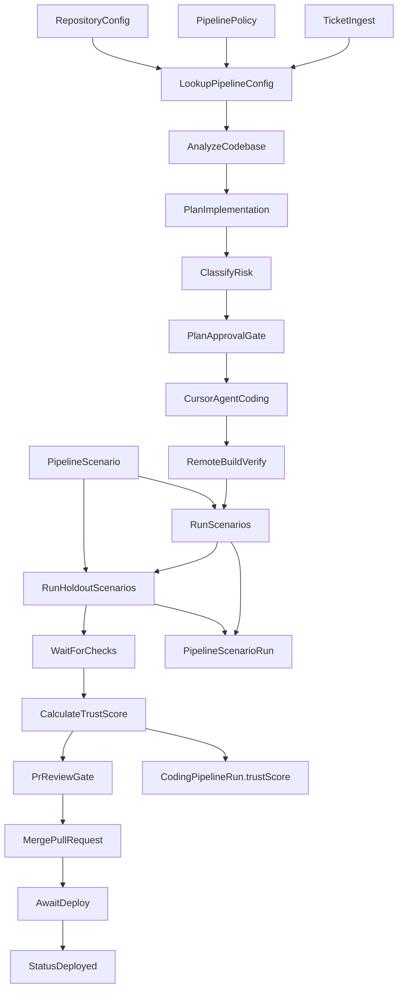

# Dark Factory Documentation

## Overview

Dark Factory is AgentC2's autonomous coding pipeline system for taking work items from ticket intake through code generation, verification, governance, merge, and deployment with risk-aware control gates.

It is built as a **database-driven workflow and agent system**, not a hard-coded one-off flow. Runtime behavior adapts by organization and repository using:

- `PipelinePolicy` for autonomy thresholds and risk controls
- `RepositoryConfig` for per-repo build/install/test commands and coding standards
- `PipelineScenario` + `PipelineScenarioRun` for behavioral validation and holdout checks

### Autonomy Levels (Practical Mapping)

- **Level 0**: Manual implementation and review
- **Level 1**: Agent-assisted planning/coding with human gates
- **Level 2**: Risk-gated automatic plan approvals
- **Level 3**: Scenario-based behavioral validation
- **Level 4**: Trust-score-guided PR merge decisions
- **Level 5**: Dark Factory (high-confidence autonomous flow with monitoring)

## Architecture



### Core Data Models

- `PipelinePolicy`
    - `enabled`
    - `autoApprovePlanBelow`
    - `autoApprovePrBelow`
    - `allowedRepos`
- `RepositoryConfig`
    - `repositoryUrl`
    - `baseBranch`
    - `installCommand`
    - `buildCommand`
    - `testCommand`
    - `codingStandards`
    - `codingAgentSlug`
- `PipelineScenario`
    - `prompt`
    - `expectedOutcome`
    - `isHoldout`
    - `isActive`
- `PipelineScenarioRun`
    - `pipelineRunId`
    - `passed`
    - `durationMs`
    - `output`
- `CodingPipelineRun`
    - includes `riskLevel`, `status`, and `trustScore`

## Getting Started

### 1) Seed the Dark Factory workflow and defaults

From repository root:

```bash
bun run scripts/seed-coding-pipeline.ts
```

This seeds:

- `coding-pipeline` workflow
- `coding-pipeline-internal` workflow
- `agentc2-developer` agent
- Appello policy/repository defaults when org exists

### 2) Configure Pipeline Policy

Use:

- `GET /api/coding-pipeline/policy`
- `PUT /api/coding-pipeline/policy`

Example update:

```json
{
    "enabled": true,
    "autoApprovePlanBelow": "medium",
    "autoApprovePrBelow": "low",
    "allowedRepos": ["https://github.com/acme/agentc2"]
}
```

### 3) Configure Repository Settings

Use:

- `GET /api/coding-pipeline/repos`
- `POST /api/coding-pipeline/repos`
- `GET /api/coding-pipeline/repos/[id]`
- `PUT /api/coding-pipeline/repos/[id]`
- `DELETE /api/coding-pipeline/repos/[id]`

Example create payload:

```json
{
    "repositoryUrl": "https://github.com/acme/agentc2",
    "name": "agentc2",
    "baseBranch": "main",
    "installCommand": "bun install",
    "buildCommand": "bun run type-check && bun run lint && bun run build",
    "testCommand": null,
    "codingStandards": "Follow CLAUDE.md standards",
    "codingAgentSlug": "agentc2-developer"
}
```

### 4) Add Behavioral Scenarios

Use:

- `GET /api/coding-pipeline/scenarios`
- `POST /api/coding-pipeline/scenarios`
- `GET /api/coding-pipeline/scenarios/[id]`
- `PUT /api/coding-pipeline/scenarios/[id]`
- `DELETE /api/coding-pipeline/scenarios/[id]`

Example create payload:

```json
{
    "repositoryConfigId": "repo_config_id",
    "name": "BuildCompletes",
    "description": "Repository builds cleanly after generated fix",
    "prompt": "CMD:bun run build",
    "expectedOutcome": "Done",
    "isHoldout": false
}
```

## API Reference

### Pipeline Policy

- `GET /api/coding-pipeline/policy`
    - Returns org policy or default fallback
- `PUT /api/coding-pipeline/policy`
    - Upserts org policy
    - Validates risk levels: `trivial | low | medium | high | critical`

### Repository Config

- `GET /api/coding-pipeline/repos`
    - List org repository configs
- `POST /api/coding-pipeline/repos`
    - Create repo config for org
- `GET /api/coding-pipeline/repos/[id]`
    - Get a specific repo config
- `PUT /api/coding-pipeline/repos/[id]`
    - Update repo config fields
- `DELETE /api/coding-pipeline/repos/[id]`
    - Delete repo config

### Pipeline Scenarios

- `GET /api/coding-pipeline/scenarios?repositoryConfigId=...`
    - List scenarios, optionally filtered by repo config
- `POST /api/coding-pipeline/scenarios`
    - Create scenario
- `GET /api/coding-pipeline/scenarios/[id]`
    - Get scenario with recent runs
- `PUT /api/coding-pipeline/scenarios/[id]`
    - Update scenario (`isHoldout`, `isActive`, etc.)
- `DELETE /api/coding-pipeline/scenarios/[id]`
    - Delete scenario

## Workflow Steps (High-Level)

The Dark Factory workflow definition includes:

1. Ingest ticket
2. Lookup org policy + repo config
3. Analyze codebase
4. Plan implementation
5. Classify risk
6. Plan approval gate (auto vs human by policy/risk)
7. Dispatch Cursor coding agent
8. Poll for completion
9. Provision remote build environment
10. Clone/install/build using **dynamic repository commands**
11. Run scenarios (non-holdout)
12. Run holdout scenarios
13. Teardown remote build env
14. Wait for CI checks
15. Calculate trust score
16. PR review gate (auto vs human by policy/risk)
17. Merge PR
18. Await deployment
19. Mark deployed

## Tools Reference

### `lookup-pipeline-config`

Loads `PipelinePolicy` and `RepositoryConfig` for `(organizationId, repositoryUrl)`.

### `merge-pull-request`

Merges a PR through GitHub REST API using org-scoped integration credentials when available, otherwise environment fallback.

### `await-deploy`

Polls GitHub Actions workflow runs on target branch until completion or timeout.

### `run-scenarios`

Executes active scenarios for a repo, records `PipelineScenarioRun`, returns pass/fail aggregates.

### `calculate-trust-score`

Calculates and persists `CodingPipelineRun.trustScore` from scenario/holdout/CI/build outcomes.

### `riskBelow()` helper

Workflow runtime helper for risk-order comparisons:

- Ordered severity: `trivial < low < medium < high < critical`
- Used in branch conditions for automated approval gates

## Dashboard Usage

Path: `/coding-pipeline/dark-factory`

The dashboard provides:

- Policy controls (enable mode + threshold tuning)
- Readiness level indicator (Level 0 to Level 5)
- Repository configuration summary
- Recent run status, risk levels, and trust scores
- Basic autonomy metrics (total runs, deployed, autonomy rate, average trust)

## Multi-Tenant Usage Patterns

### Internal AgentC2 Operations

- Use `coding-pipeline-internal`
- Use `agentc2-developer`
- Strict standards aligned to platform conventions
- Typical policy: more permissive auto-approval thresholds once trust is stable

### External Organization Operations

- Use `coding-pipeline`
- Org-provided credentials via `IntegrationConnection`
- Org-specific repository commands (`npm`, `pnpm`, `bun`, etc.)
- Conservative thresholds recommended at initial rollout

## Inngest Background Jobs

### `pipelineStatsRollupFunction`

- Schedule: daily cron
- Aggregates prior-day pipeline runs
- Upserts per-org `PipelineDailyStats`
- Feeds long-term autonomy analytics and readiness tracking

## Troubleshooting

### Pipeline remains in human gate states

- Check `PipelinePolicy.enabled`
- Verify `autoApprovePlanBelow` and `autoApprovePrBelow`
- Confirm risk classifier is returning expected level

### Dynamic build fails in remote environment

- Validate `RepositoryConfig.installCommand` and `buildCommand`
- Ensure toolchain is available in provisioned compute image
- Re-run command manually in debug droplet

### Scenarios not running

- Confirm scenarios exist for target `RepositoryConfig`
- Check `isActive = true`
- Verify `includeHoldout` behavior vs `isHoldout` flags

### Merge/deploy step fails

- Verify GitHub integration token scope for organization
- Confirm repository/branch values resolve correctly
- Validate deployment workflow name/branch expectations

### Trust score unexpectedly low

- Inspect scenario run outputs and holdout failures
- Check CI/build status inputs to trust calculator
- Review scoring weights in `calculate-trust-score`

## Operational Recommendations

- Start conservative:
    - `autoApprovePlanBelow = low`
    - `autoApprovePrBelow = trivial`
- Enable holdouts before expanding autonomy thresholds
- Monitor trust score trend before increasing automation
- Keep repository commands explicit and version-aware
- Use daily stats to evaluate readiness by organization, not globally
