# Google SSO Architecture Diagrams

**Related:** [Full Design](./google-sso-design.md) | [Summary](./google-sso-summary.md)

---

## Current State Architecture

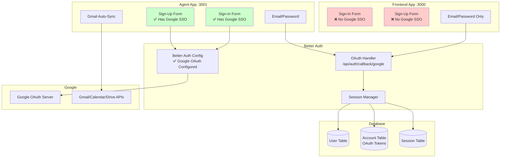

**Legend:**
- 🔴 Red: Missing Google SSO
- 🟢 Green: Has Google SSO
- ✅ Configured correctly
- ❌ Not implemented

---

## Google OAuth Flow (Agent App - Current)

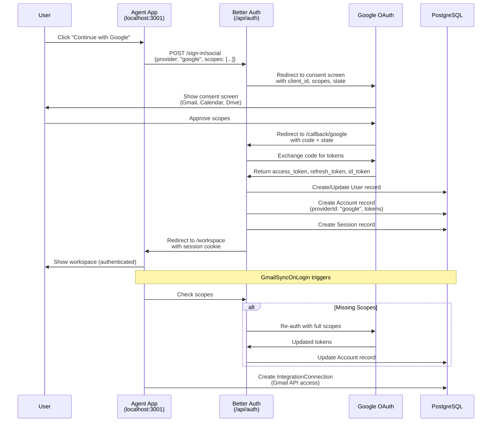

---

## Proposed Architecture (After Phase 1)

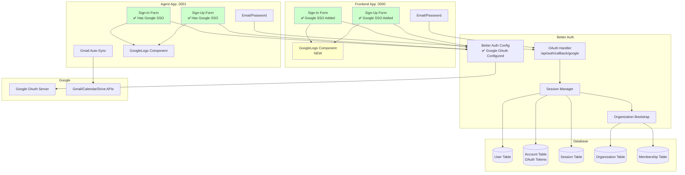

**Changes:**
- 🟢 Frontend forms now have Google SSO
- 🟡 New GoogleLogo component created
- ✅ Backend unchanged (already working)

---

## Component Hierarchy

```
Frontend App Authentication
│
├── pages/
│   ├── / (home)
│   │   └── HeroSection
│   │       └── SignInForm  ← Needs Google SSO
│   │
│   └── /signup
│       └── SignUpForm  ← Needs Google SSO
│
└── components/auth/
    ├── GoogleLogo.tsx  ← NEW COMPONENT
    ├── sign-in-form.tsx  ← MODIFY (add Google button)
    └── sign-up-form.tsx  ← MODIFY (add Google button)
```

---

## OAuth Flow Diagram

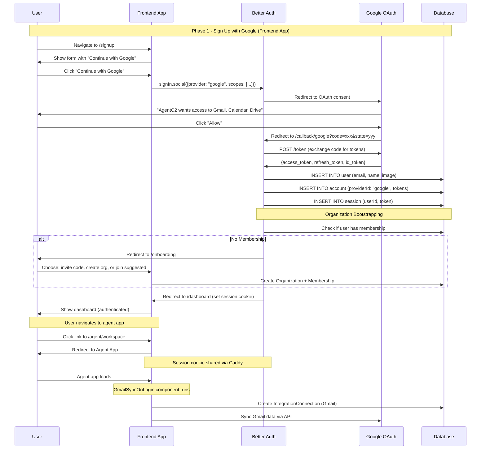

---

## Session Cookie Sharing (Caddy)

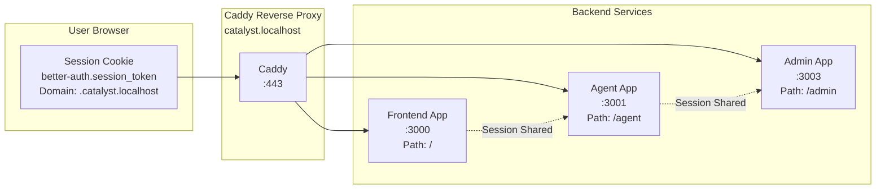

**Key Points:**
- Single domain ensures cookie sharing
- Cookie set by Better Auth with domain `.catalyst.localhost` (dev) or `.agentc2.ai` (prod)
- All apps read same session cookie
- No cross-origin issues

---

## Database Schema (No Changes Required)

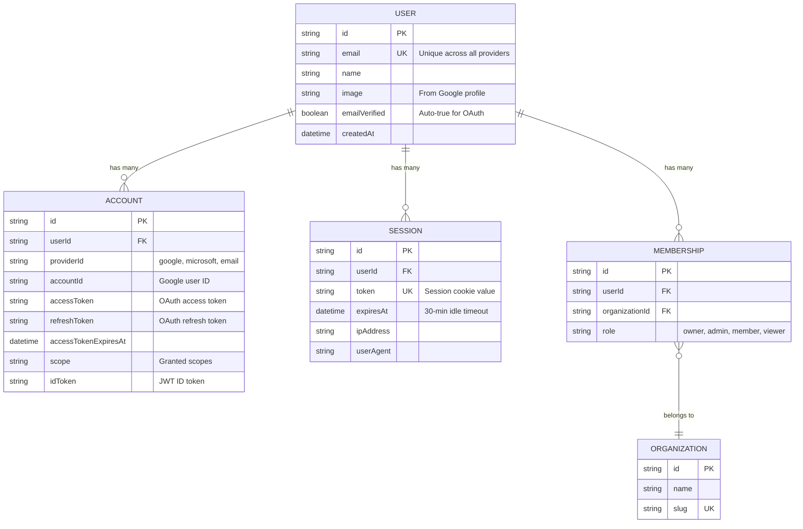

**OAuth Data Flow:**
1. Google OAuth callback creates/updates User
2. Account record stores OAuth tokens with `providerId: "google"`
3. Session record created with unique token (stored in cookie)
4. Bootstrap process creates Organization + Membership

---

## Google Cloud Console Configuration

```mermaid
graph TD
    A[Google Cloud Console] --> B[Create Project<br/>"AgentC2"]
    B --> C[Enable APIs]
    C --> C1[Gmail API]
    C --> C2[Calendar API]
    C --> C3[Drive API]
    
    B --> D[Create OAuth 2.0 Client]
    D --> D1[Application Type:<br/>Web Application]
    D1 --> D2[Authorized Redirect URIs]
    D2 --> D2a[Dev: localhost:3001/api/auth/callback/google]
    D2 --> D2b[Prod: agentc2.ai/api/auth/callback/google]
    D1 --> D3[Copy Client ID + Secret<br/>to .env]
    
    B --> E[Configure OAuth Consent Screen]
    E --> E1[App Name: AgentC2]
    E --> E2[Add Scopes]
    E2 --> E2a[gmail.modify]
    E2 --> E2b[calendar.events]
    E2 --> E2c[drive.readonly]
    E2 --> E2d[drive.file]
    
    E --> F{Publishing Status}
    F -->|Testing| F1[Max 100 Test Users<br/>No Verification Needed]
    F -->|In Production| F2[Unlimited Users<br/>Verification Required]
    
    F2 --> G[Submit for Verification]
    G --> G1[Privacy Policy URL]
    G --> G2[Terms of Service URL]
    G --> G3[Demo Video]
    G --> G4[Scope Justification]
    G --> H[Wait 4-6 Weeks]
    
    style F1 fill:#ccffcc
    style F2 fill:#ffffcc
    style H fill:#ffcccc
```

---

## Sign-In Flow Comparison

### Before (Frontend App)

```
┌─────────────────────────────────┐
│         Sign In                 │
├─────────────────────────────────┤
│                                 │
│  Email: [_________________]     │
│                                 │
│  Password: [_____________]      │
│                                 │
│  [Sign In]                      │
│                                 │
│  Don't have an account? Sign up │
└─────────────────────────────────┘
```

### After (Frontend App - Matches Agent App)

```
┌─────────────────────────────────┐
│         Sign In                 │
├─────────────────────────────────┤
│                                 │
│  [G] Continue with Google       │  ← NEW
│                                 │
│  ─── or continue with email ─── │  ← NEW
│                                 │
│  Email: [_________________]     │
│                                 │
│  Password: [_____________]      │
│                                 │
│  [Sign In]                      │
│                                 │
│  Don't have an account? Sign up │
└─────────────────────────────────┘
```

---

## Error Handling Flow

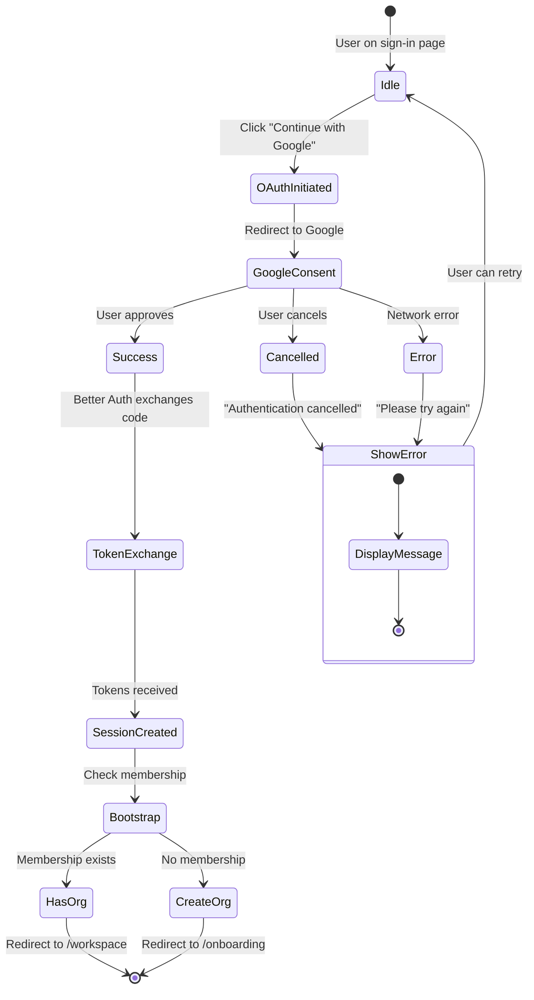

---

## Multi-Tenant Organization Bootstrap

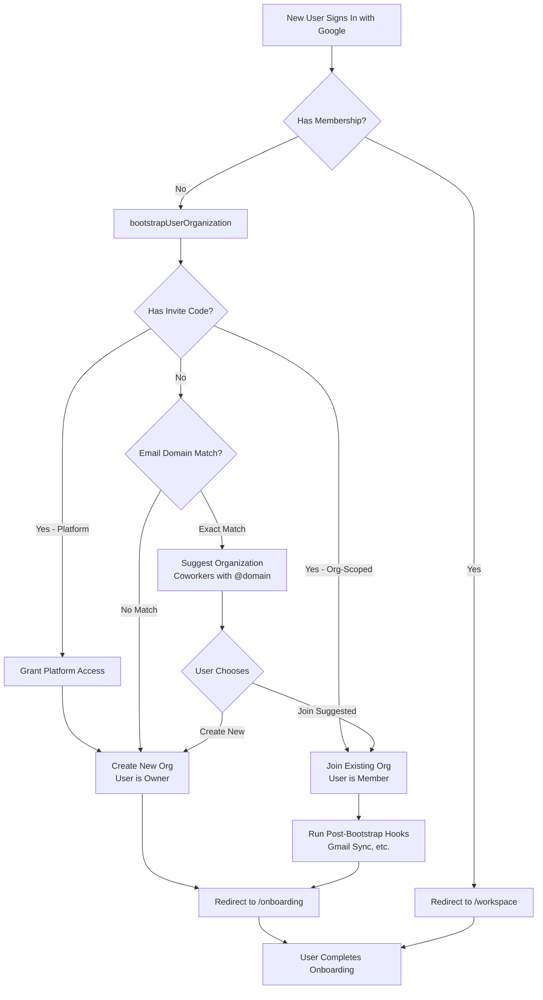

**Important Notes:**
- `deferOrgCreation: true` means user is prompted to choose org creation strategy
- Post-bootstrap hooks only run when org is actually created/joined (not deferred)
- Frontend app needs to handle onboarding flow for org selection

---

## Account Linking Flow (Phase 3)

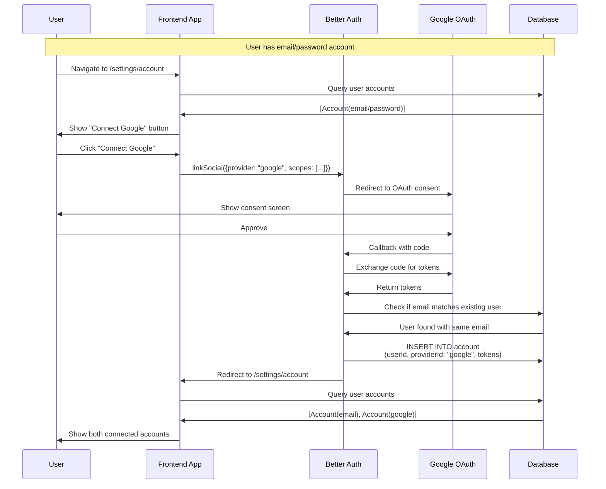

---

## Rate Limiting Architecture

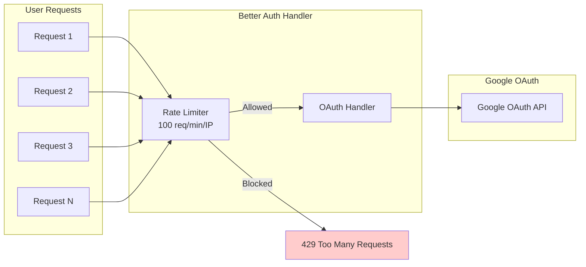

**Current State:**
- ✅ Agent app has rate limiting
- ❌ Frontend app does NOT have rate limiting

**Recommendation:** Add rate limiting to frontend app in Phase 2.

---

## Security Layers

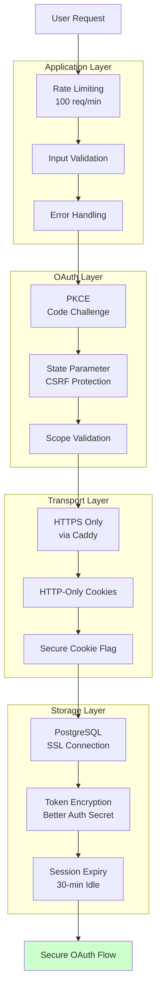

**All Layers:**
- ✅ Better Auth implements all OAuth security best practices
- ✅ PKCE prevents authorization code interception
- ✅ State parameter prevents CSRF attacks
- ✅ HTTPS prevents man-in-the-middle attacks
- ✅ HttpOnly cookies prevent XSS token theft
- ✅ Session expiry limits unauthorized access window

---

## Deployment Architecture

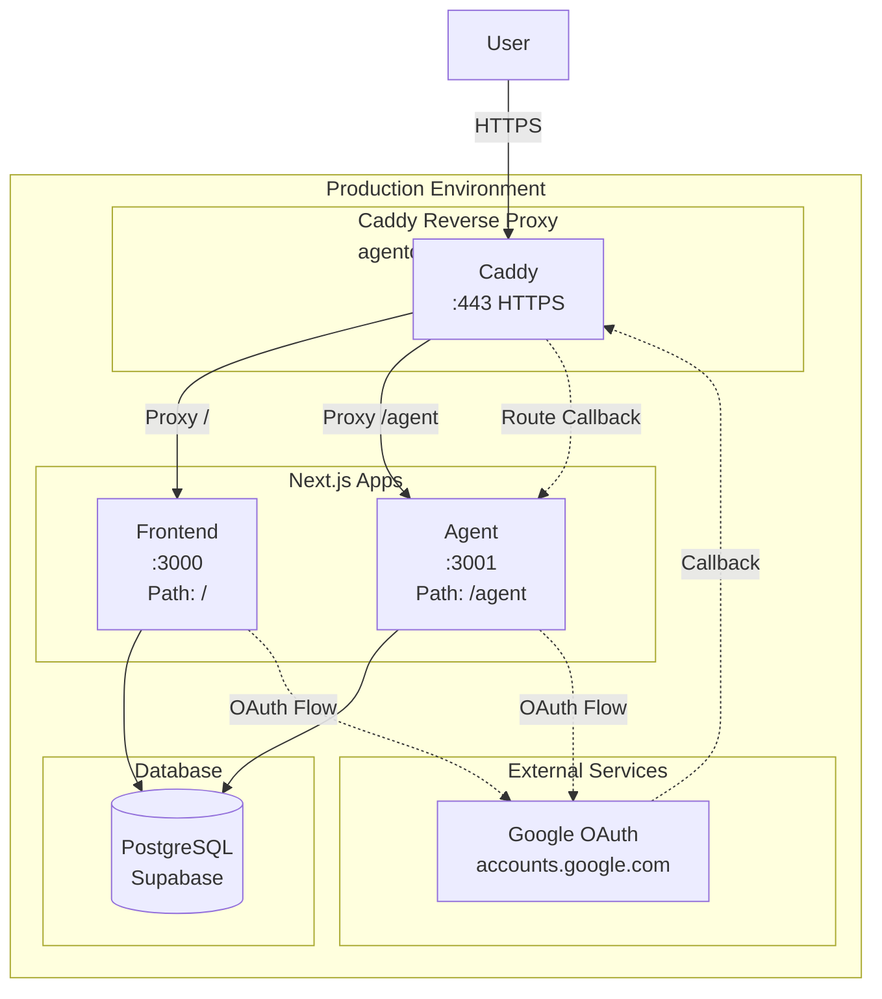

**OAuth Callback Routing:**
- Callback URL: `https://agentc2.ai/api/auth/callback/google`
- Caddy proxies to agent app: `http://localhost:3001/api/auth/callback/google`
- Better Auth handles callback in agent app
- Session cookie set with domain `.agentc2.ai`
- Frontend app automatically has access to session

---

## Comparison: Email vs OAuth User Journey

### Email/Password Sign-Up

```
1. User lands on /signup
2. Fill in: Name, Email, Password
3. Submit form
4. Email verification sent (production)
5. Click verification link
6. Redirected to /onboarding
7. Choose organization (invite or create)
8. Complete onboarding
9. Access workspace

Total Steps: 9
Time: ~5-10 minutes
Drop-off: High (email verification, password creation)
```

### Google OAuth Sign-Up

```
1. User lands on /signup
2. Click "Continue with Google"
3. Approve scopes on Google consent screen
4. Redirected to /onboarding
5. Choose organization (invite or create)
6. Complete onboarding
7. Access workspace

Total Steps: 7
Time: ~2-3 minutes
Drop-off: Low (no email verification, no password)
```

**Improvement:**
- ✅ 22% fewer steps
- ✅ 50-60% faster
- ✅ Higher conversion rate (no email verification needed)
- ✅ Better security (Google MFA, device trust)

---

## Rollback Strategy

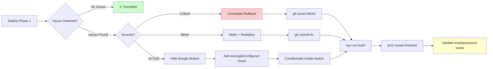

**Rollback Time:** < 5 minutes (frontend-only changes, no database migrations)

---

## Monitoring Dashboard (Proposed)

```
┌─────────────────────────────────────────────────────────────┐
│  Google OAuth Dashboard                                     │
├─────────────────────────────────────────────────────────────┤
│                                                             │
│  Success Rate (Last 24h)                                    │
│  ███████████████████████████████████ 97.3%                  │
│                                                             │
│  Sign-Ups by Method                                         │
│  ┌─────────┬─────────┬─────────┐                            │
│  │ Google  │ Email   │ Other   │                            │
│  │  45%    │  50%    │   5%    │                            │
│  └─────────┴─────────┴─────────┘                            │
│                                                             │
│  Recent Errors                                              │
│  ┌────────────┬─────────────────────────┬────────┐          │
│  │ Timestamp  │ Error                   │ Count  │          │
│  ├────────────┼─────────────────────────┼────────┤          │
│  │ 10:30 AM   │ user_cancelled          │   3    │          │
│  │ 10:15 AM   │ redirect_uri_mismatch   │   1    │          │
│  │ 09:45 AM   │ invalid_scope           │   1    │          │
│  └────────────┴─────────────────────────┴────────┘          │
│                                                             │
│  Token Refresh Status                                       │
│  Last 1000 refreshes: 998 success, 2 failed (99.8%)        │
│                                                             │
└─────────────────────────────────────────────────────────────┘
```

---

## Phase 1 vs Phase 3 Comparison

### Phase 1: Basic Google SSO

**What User Sees:**
```
Sign In Page:
- "Continue with Google" button
- Or email/password form

After Google Sign-In:
- Redirected to workspace
- Authenticated on both apps
```

**Limitations:**
- Can't link Google to existing email/password account via UI
- Can't see which accounts are connected
- Can't unlink Google account

---

### Phase 3: Account Management

**What User Sees:**
```
Settings > Account:
┌────────────────────────────────────┐
│  Connected Accounts                │
├────────────────────────────────────┤
│  ✅ Email/Password                 │
│     you@example.com                │
│     [Change Password]              │
│                                    │
│  ✅ Google                         │
│     you@example.com                │
│     [Disconnect]                   │
│                                    │
│  ❌ Microsoft                      │
│     [Connect Microsoft]            │
└────────────────────────────────────┘
```

**Benefits:**
- User can link OAuth providers post-signup
- Clear visibility of connected accounts
- Can disconnect providers (with safeguards)
- Can re-auth if scopes missing

---

## Code Diff Preview

### sign-in-form.tsx (Frontend App)

**Before:**
```typescript
export function SignInForm() {
    const [email, setEmail] = useState("");
    const [password, setPassword] = useState("");
    const [loading, setLoading] = useState(false);
    
    return (
        <form onSubmit={handleSubmit}>
            <Input type="email" value={email} />
            <Input type="password" value={password} />
            <Button type="submit">Sign In</Button>
        </form>
    );
}
```

**After:**
```typescript
import { GOOGLE_OAUTH_SCOPES } from "@repo/auth/google-scopes";
import { GoogleLogo } from "./GoogleLogo";

export function SignInForm() {
    const [email, setEmail] = useState("");
    const [password, setPassword] = useState("");
    const [loading, setLoading] = useState(false);
    const [socialLoading, setSocialLoading] = useState(false);  // NEW
    
    const handleSocialSignIn = async (provider: "google") => {  // NEW
        setSocialLoading(true);
        await signIn.social({
            provider,
            callbackURL: callbackUrl,
            scopes: [...GOOGLE_OAUTH_SCOPES]
        });
    };
    
    return (
        <div>
            {/* NEW: Google SSO Button */}
            <Button onClick={() => handleSocialSignIn("google")}>
                <GoogleLogo />
                Continue with Google
            </Button>
            
            {/* NEW: Divider */}
            <div>or continue with email</div>
            
            {/* EXISTING: Email Form */}
            <form onSubmit={handleSubmit}>
                <Input type="email" value={email} />
                <Input type="password" value={password} />
                <Button type="submit" disabled={socialLoading}>Sign In</Button>
            </form>
        </div>
    );
}
```

**Changes:**
- ➕ Import `GOOGLE_OAUTH_SCOPES` and `GoogleLogo`
- ➕ Add `socialLoading` state
- ➕ Add `handleSocialSignIn` function
- ➕ Add Google SSO button with logo
- ➕ Add divider
- 🔄 Update disabled states

**Lines Changed:** ~50 lines added

---

## Related Documentation

**Main Design:** [google-sso-design.md](./google-sso-design.md) - Complete technical design (100+ pages)

**Quick Summary:** [google-sso-summary.md](./google-sso-summary.md) - Executive summary

**Code References:**
- [Better Auth Config](../../../packages/auth/src/auth.ts)
- [Google Scopes](../../../packages/auth/src/google-scopes.ts)
- [Agent App Sign-In](../../../apps/agent/src/components/auth/sign-in-form.tsx) - Reference implementation
- [Agent App Sign-Up](../../../apps/agent/src/components/auth/sign-up-form.tsx) - Reference implementation

**External Docs:**
- [Better Auth Documentation](https://www.better-auth.com/)
- [Google OAuth 2.0 Documentation](https://developers.google.com/identity/protocols/oauth2)
- [Google OAuth Verification Process](https://support.google.com/cloud/answer/9110914)

---

**Last Updated:** 2026-03-08  
**Version:** 1.0  
**Status:** Ready for Implementation