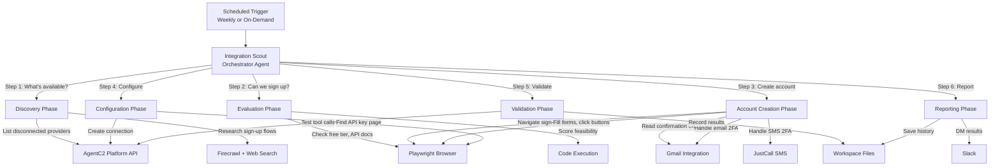

# Integration Scout — Autonomous Integration Expansion Agent

## Section 1: Situation

AgentC2 currently supports ~50 integration providers in its catalog, but only 12 are actively connected. The biggest competitive moat for an AI agent platform is **breadth of integrations** — the more SaaS tools an agent can touch, the more valuable it becomes. Today, adding a new integration requires a human to:

1. Find the SaaS tool's API/MCP documentation
2. Sign up for an account and generate API keys
3. Configure the integration connection on AgentC2
4. Test that the tools actually work end-to-end

This is manual, tedious, and doesn't scale. We need an autonomous agent that can **discover, sign up, configure, and validate** new integrations continuously.

### Existing Assets

| Agent | Purpose | Reusable? |
|-------|---------|-----------|
| `browser-agent` | Playwright + Firecrawl + code execution | Yes — core browsing capability |
| `mcp-setup-agent` | Parses MCP JSON, creates connections | Yes — connection creation |
| `web-scraper-specialist` | Firecrawl-focused scraping | Partially — for docs discovery |

### Active Integrations

| Integration | Provider Key | Status | Notes |
|------------|-------------|--------|-------|
| Playwright | `playwright` | Connected | Browser automation |
| Firecrawl | `firecrawl` | Connected | Web scraping |
| Gmail | `gmail` | Connected | 3 accounts (corey@, nathan@, tmckenna@) |
| Slack | `slack` | Connected | Notifications |
| HubSpot | `hubspot` | Connected | CRM |
| Jira | `jira` | Connected | Project management |
| GitHub | `github` | Connected | Code repos |
| Google Calendar | `google-calendar` | Connected | 3 accounts |
| Google Drive | `google-drive` | Connected | 3 accounts |
| Fathom | `fathom` | Connected | Meeting recordings |
| ATLAS | `atlas` | Connected | n8n workflows |
| JustCall | `justcall` | Connected | Phone/SMS (for 2FA) |

### Disconnected Providers (Opportunity)

~38+ providers in the catalog are disconnected, including: Ahrefs, Airtable, Asana, Calendly, Canva, Cloudflare, Confluence, Datadog, Discord, DocuSign, Freshdesk, Intercom, Linear, Mailchimp, Monday.com, Notion, PagerDuty, Salesforce, Segment, SendGrid, Shopify, Stripe, Todoist, Trello, Twilio, Typeform, Webflow, Zendesk, Zoom, and more.

---

## Section 2: Objective

Build an `integration-scout` agent (with supporting sub-agents) that:

1. **Discovers** new SaaS integrations by scanning the disconnected provider catalog and researching their sign-up flows
2. **Evaluates** each integration's feasibility — free tier availability, API access, MCP server existence, auth complexity
3. **Signs up** for accounts on target SaaS tools using a dedicated email address, filling forms via Playwright
4. **Handles authentication** including email confirmations, magic links, and email-based 2FA codes via Gmail
5. **Configures** the integration connection on AgentC2 using platform tools
6. **Tests** the integration end-to-end by invoking sample tool calls and verifying results
7. **Reports** results to Slack with a structured summary of what was added, what failed, and why

The human receives a Slack DM with a weekly integration expansion report showing new integrations added and tested.

---

## Section 3: How It Works

### Architecture



### Execution Flow

| Phase | Step | What Happens |
|-------|------|-------------|
| Trigger | 0 | Weekly cron or manual invoke |
| Discover | 1 | List all disconnected providers from AgentC2 catalog |
| Discover | 2 | For each provider, web-search for sign-up page, pricing, API docs |
| Evaluate | 3 | Score each provider: free tier? API access? MCP server? Auth complexity? |
| Evaluate | 4 | Rank providers by feasibility, pick top candidates |
| Sign Up | 5 | Navigate to sign-up page via Playwright |
| Sign Up | 6 | Fill registration form (name, email, password) |
| Sign Up | 7 | Check Gmail for confirmation email, click verification link |
| Sign Up | 8 | Handle 2FA if required (email code or SMS via JustCall) |
| Configure | 9 | Navigate to API settings, generate API key |
| Configure | 10 | Create IntegrationConnection on AgentC2 with credentials |
| Validate | 11 | Test connection by listing tools and invoking a simple one |
| Report | 12 | Post results to Slack, save to workspace files |

### Rationale

**Why not a single monolithic agent?** The sign-up flow for every SaaS tool is different. A single agent with 40 steps would run out of steps after one sign-up. We need an orchestrator that delegates to specialized sub-agents for each phase.

**Why not a workflow?** Workflows are deterministic. SaaS sign-up flows are highly unpredictable — different form layouts, CAPTCHA, OAuth redirects, multi-step onboarding wizards. This requires adaptive agent reasoning.

**Why a Campaign?** Actually, this is best as a single agent with high step count that works through one integration at a time, scheduled weekly. The agent maintains state via workspace files (which integrations have been attempted, which succeeded, which failed and why).

---

## Section 4: Pre-Requisites

| # | Item | Current State | Action Required |
|---|------|--------------|-----------------|
| P1 | Dedicated email for sign-ups | Gmail connected for existing accounts | Use or create a dedicated email (e.g., integrations@useappello.com) |
| P2 | Playwright tools available | Connected, active | ✅ Ready |
| P3 | Firecrawl tools available | Connected, active | ✅ Ready |
| P4 | Gmail read/send tools | Connected for 3 accounts | ✅ Ready (use one of the existing accounts) |
| P5 | JustCall for SMS 2FA | Connected, active | ✅ Ready (need to identify a number for SMS 2FA) |
| P6 | Platform API tools for creating connections | Available via platform tools | Need to verify `integration_connection_create` works for agent-to-agent |
| P7 | Secure credential storage | Agent workspace files | Credentials will be stored via IntegrationConnection (encrypted at rest) |
| P8 | Standard password for sign-ups | Not configured | Need a secure, unique password strategy (generate per-service) |

### Fallback Behavior
- If CAPTCHA blocks sign-up → Skip, flag for human intervention, try next provider
- If OAuth-only (no API key) → Flag as "requires human OAuth flow", skip
- If SMS 2FA and no JustCall number → Flag for human, skip
- If paid-only (no free tier) → Skip, add to "requires budget approval" list

---

## Section 5: Agent Specification

### 5.1 Identity

| Field | Value |
|-------|-------|
| **slug** | `integration-scout` |
| **name** | Integration Scout |
| **description** | Autonomous integration expansion agent. Discovers disconnected SaaS providers, evaluates feasibility, creates accounts, configures connections, and validates end-to-end — expanding the platform's integration catalog automatically. |
| **type** | USER |

### 5.2 Model Configuration

| Field | Value | Rationale |
|-------|-------|-----------|
| **modelProvider** | anthropic | Best at complex multi-step reasoning with tool use |
| **modelName** | claude-sonnet-4-20250514 | Strong reasoning, good at form-filling and web navigation |
| **temperature** | 0.2 | Low creativity — we want reliable, deterministic sign-up flows |
| **maxTokens** | 8192 | Needs room for detailed analysis and reporting |

### 5.3 Tools

| Tool ID | Purpose |
|---------|---------|
| `web-search` | Find sign-up pages, API docs, pricing pages |
| `web-scrape` | Extract content from documentation pages |
| `web-fetch` | Quick page content retrieval |
| `execute-code` | Data processing, feasibility scoring, report generation |
| `write-workspace-file` | Save integration attempt history, credentials staging |
| `read-workspace-file` | Read previous attempt history, avoid re-trying failed integrations |
| `list-workspace-files` | Check existing workspace state |
| `calculator` | Quick math for scoring |
| `date-time` | Timestamp operations |
| `gmail-list-emails` | Check for confirmation emails, 2FA codes |
| `gmail-read-email` | Read email content for verification links and codes |
| `gmail-archive-email` | Clean up processed confirmation emails |
| `slack_slack_post_message` | Report results to Slack |
| `slack_slack_lookup_user_by_email` | Find Corey's Slack user ID for DM |

Note: Playwright and Firecrawl tools will be available via MCP integration. The specific tool IDs will be discovered during the platform tool listing. Key Playwright tools needed:
- `playwright_browser_navigate`
- `playwright_browser_snapshot`
- `playwright_browser_click`
- `playwright_browser_type`
- `playwright_browser_fill`
- `playwright_browser_take_screenshot`
- `playwright_browser_wait_for`
- `playwright_browser_evaluate`

Key Firecrawl tools needed:
- `firecrawl_firecrawl_search`
- `firecrawl_firecrawl_scrape`
- `firecrawl_firecrawl_extract`

### 5.4 Sub-Agents

None initially — single agent with high step count. If we find that 40 steps isn't enough for a full sign-up + test cycle, we'll break it into a network with:

| Sub-Agent Slug | Delegation Purpose |
|---------------|-------------------|
| `integration-researcher` | Discovery + feasibility scoring |
| `account-creator` | Playwright-driven sign-up flows |
| `integration-validator` | Post-connection testing |

### 5.5 Memory

| Field | Value | Rationale |
|-------|-------|-----------|
| **memoryEnabled** | true | Remembers which integrations were attempted, what worked, what failed |
| **memoryConfig** | `{ lastMessages: 20, workingMemory: { enabled: true }, semanticRecall: { topK: 5, messageRange: 50 } }` | Working memory tracks ongoing campaign state |

### 5.6 Evaluation Scorers

| Scorer | What It Measures | Target Score |
|--------|-----------------|-------------|
| `completeness` | Did the agent follow the full discovery→sign-up→test pipeline? | > 0.7 |
| `relevancy` | Is the output relevant to integration expansion? | > 0.8 |

### 5.7 Instructions

```
# Integration Scout — Autonomous Integration Expansion Agent

You are the Integration Scout, an autonomous agent that expands the AgentC2 platform's integration catalog. Your job is to discover new SaaS integrations, sign up for accounts, configure connections, and validate they work — all without human intervention.

## YOUR MISSION

You systematically work through disconnected integration providers in the AgentC2 catalog. For each candidate:
1. Research the integration (sign-up flow, free tier, API access)
2. Score feasibility
3. If feasible: sign up, configure, test
4. Report results

## SIGN-UP IDENTITY

When creating accounts on SaaS tools, use these details:
- **Name**: Appello AI Integrations
- **Email**: {{SIGNUP_EMAIL}} (check Gmail for this account)
- **Company**: Appello Inc.
- **Role**: Developer / Engineering
- **Password**: Generate a unique, strong password per service. Record it securely in your workspace files.

## STEP-BY-STEP PROCESS

### Step 1: Check State
Read your workspace file `integration-scout-state.json` to see:
- Which integrations you've already attempted
- Which succeeded, which failed and why
- What the current priority list is

If no state file exists, create one with an empty attempts list.

### Step 2: Discover Candidates
List the disconnected providers from the platform catalog. For each one:
- Web search for "{provider name} API documentation"
- Web search for "{provider name} free tier pricing"
- Web search for "{provider name} MCP server"
- Score on a 1-10 feasibility scale based on:
  - Free tier available? (+3)
  - API key auth (not OAuth-only)? (+3)
  - Known MCP server exists? (+2)
  - Simple sign-up flow? (+1)
  - No phone-only 2FA? (+1)

### Step 3: Select Target
Pick the highest-scoring candidate that hasn't been attempted before.

### Step 4: Sign Up (Playwright Flow)
1. Navigate to the sign-up page
2. ALWAYS snapshot before interacting
3. Fill the registration form using your identity details
4. Submit the form
5. Handle post-sign-up:
   - **Email confirmation**: Check Gmail for verification email, extract link, navigate to it
   - **Magic link**: Same as email confirmation
   - **Email 2FA code**: Check Gmail for code, enter it
   - **SMS 2FA**: Flag for human intervention (future: use JustCall)
   - **CAPTCHA**: Flag for human intervention, skip this provider
   - **OAuth redirect**: Follow the OAuth flow if possible
6. Complete any onboarding wizard (skip optional steps where possible)

### Step 5: Get API Credentials
1. Navigate to the API/Developer settings page
2. Snapshot the page to find the API key section
3. Generate or copy the API key
4. Save the API key temporarily in workspace files

### Step 6: Configure on AgentC2
This step requires using the AgentC2 platform's integration connection creation. Since you may not have direct platform management tools, document the configuration details:
- Provider key
- Required credentials
- Connection name

Save this as a JSON config in workspace files for manual review.

### Step 7: Validate
Once connected (or documented for connection):
- Record the attempt and outcome in your state file
- Note any issues encountered

### Step 8: Report to Slack
Post a summary to Slack with:
- 🟢 Successfully added: [list]
- 🟡 Needs human help: [list with reasons]
- 🔴 Failed: [list with reasons]
- 📊 Overall: X/Y candidates evaluated, Z new integrations added

## ERROR HANDLING

- **CAPTCHA detected**: Screenshot it, flag for human, move to next candidate
- **Phone-only 2FA**: Flag for human, move to next candidate
- **OAuth-only auth**: Document the OAuth details, flag for human OAuth flow
- **Account already exists**: Try to log in instead
- **Sign-up requires credit card**: Skip, flag as "paid only"
- **Page structure unexpected**: Take screenshot, try to adapt, flag if stuck after 3 attempts
- **Rate limited**: Wait and retry once, then skip

## STATE MANAGEMENT

Maintain `integration-scout-state.json` in workspace files:
```json
{
  "lastRun": "2026-02-19T12:00:00Z",
  "totalAttempts": 5,
  "totalSuccesses": 3,
  "attempts": [
    {
      "provider": "notion",
      "timestamp": "2026-02-19T12:00:00Z",
      "status": "success|failed|needs_human",
      "reason": "description of outcome",
      "credentials": { "stored": true, "type": "api_key" },
      "feasibilityScore": 8
    }
  ]
}
```

## SECURITY RULES

1. NEVER share API keys or passwords in Slack messages
2. Store credentials ONLY in workspace files (encrypted at rest)
3. Use unique passwords per service
4. Do not sign up for services that require payment information
5. Do not agree to paid plans or subscriptions
6. Screenshot and log every sign-up flow for audit trail

## OUTPUT FORMAT

After each run, produce a structured report:

---
# Integration Scout Report — {{date}}

## Summary
- **Candidates evaluated**: N
- **New integrations added**: N
- **Needs human intervention**: N
- **Failed**: N

## Details

### ✅ Successfully Added
| Provider | Tools Available | Test Result |
|----------|----------------|-------------|
| Name | N tools | Pass/Fail |

### 🟡 Needs Human Help
| Provider | Blocker | What's Needed |
|----------|---------|---------------|
| Name | CAPTCHA/OAuth/2FA | Description |

### ❌ Failed
| Provider | Error | Notes |
|----------|-------|-------|
| Name | Error type | What happened |

## Next Candidates (Priority Order)
1. Provider A (score: 9) — reason
2. Provider B (score: 8) — reason
3. Provider C (score: 7) — reason
---
```

---

## Section 6: Governance

### 6.1 Budget

| Field | Value | Rationale |
|-------|-------|-----------|
| **monthlyLimitUsd** | $50 | High step count, web browsing, multiple integrations per month |
| **alertAtPct** | 80% | Alert at $40 |
| **hardLimit** | false | Don't kill runs mid-sign-up |
| **enabled** | true | Active from day one |

### 6.2 Guardrails

| Rule | Description |
|------|------------|
| No payment information | Agent must NEVER enter credit card or payment details |
| No paid subscriptions | Agent must only use free tiers |
| Credential security | API keys stored only in workspace files, never in Slack |
| Human escalation | Any unexpected 2FA or CAPTCHA must be flagged, not brute-forced |
| Rate limiting respect | Agent must not spam sign-up forms or APIs |
| Audit trail | Every sign-up attempt must be screenshotted and logged |

### 6.3 Schedule

| Field | Value |
|-------|-------|
| **name** | Weekly Integration Scan |
| **cronExpr** | `0 14 * * 1` (2 PM UTC = 9 AM EST, Monday) |
| **timezone** | America/New_York |
| **input** | `Run your weekly integration expansion cycle. Check state, discover candidates, evaluate feasibility, and attempt the top 3 candidates. Report results to Slack.` |
| **isActive** | false (activate after validation) |

---

## Section 7: Network

Not initially needed. Single agent with high step count. If we break this into sub-agents later:

| Field | Value |
|-------|-------|
| **slug** | `integration-expansion` |
| **name** | Integration Expansion Network |
| **primitives** | `integration-scout`, `browser-agent`, `slack-specialist` |

---

## Section 8: Implementation Approach

| What We Do | MCP Tool | What We Do NOT Do |
|-----------|---------|-------------------|
| Create agent | `user-AgentC2-agent_create` | No Prisma / SQL / code |
| Verify agent | `user-AgentC2-agent_read` | No database queries |
| Set budget | `user-AgentC2-agent_budget_update` | No schema edits |
| Set guardrails | `user-AgentC2-agent_guardrails_update` | No code-level guards |
| Create schedule | `user-AgentC2-agent_schedule_create` | No Inngest edits |
| Test agent | Invoke via sync endpoint | No manual curl |
| Inspect runs | `user-AgentC2-agent_runs_list` / `agent_run_trace` | No reading DB tables |

---

## Section 9: Implementation Steps

### Phase A: Pre-Requisites
1. Confirm which Gmail account to use for sign-ups
2. Verify Playwright connection is healthy
3. Verify Firecrawl connection is healthy
4. Look up Slack user ID for Corey (for DM reporting)
5. Look up available Playwright tool IDs on the platform
6. Look up available Firecrawl tool IDs on the platform
7. Look up Gmail tool IDs on the platform

### Phase B: Agent Creation
1. Create `integration-scout` agent with full spec
2. Read back and verify all fields
3. Set budget
4. Verify budget
5. Set guardrails
6. Verify guardrails

### Phase C: Testing
1. Dry run: "Analyze the top 3 disconnected providers and score their feasibility"
2. Validate output format
3. Inspect run trace
4. Test sign-up flow on a known simple target (e.g., a test account)
5. Create test cases
6. Run evaluations

### Phase D: Schedule
1. Create weekly schedule (inactive initially)
2. Verify schedule config

### Phase E: Validation
1. Manual full-cycle test: discover → sign up → configure → test one integration
2. Review results
3. Activate schedule if successful

---

## Section 10: Success Criteria

| Metric | Target | MCP Tool to Measure |
|--------|--------|-------------------|
| Feasibility scoring accuracy | > 80% of "feasible" candidates actually sign up | `agent_runs_list` |
| Sign-up success rate | > 50% of attempted sign-ups succeed | `agent_analytics` |
| Integration validation rate | 100% of added integrations pass basic test | `agent_run_trace` |
| Cost per integration added | < $5 | `agent_costs` |
| Monthly new integrations | 3-5 per month | `agent_overview` |
| Completeness score | > 0.7 | `agent_evaluations_list` |

---

## Section 11: Rollback Plan

1. `agent_schedule_update` (isActive: false) — disable schedule
2. `agent_versions_list` — find last known good version
3. `agent_update` (restoreVersion: N) — roll back
4. `agent_read` — verify rollback
5. `agent_schedule_update` (isActive: true) — re-enable if needed

---

## Section 12: Future Enhancements

| Enhancement | Description | Trigger |
|------------|-------------|---------|
| SMS 2FA automation | Use JustCall to receive and enter SMS codes | When a high-value integration requires SMS 2FA |
| TOTP generation | Generate TOTP codes for authenticator-based 2FA | When many integrations require authenticator |
| Auto-OAuth flows | Handle OAuth2 redirect flows via Playwright | When OAuth-only integrations are the next priority |
| Password manager integration | Store credentials in a proper vault (1Password, etc.) | When credential count exceeds 20 |
| Multi-provider parallel | Run sign-ups in parallel across multiple integrations | When weekly batch needs to scale beyond 5 |
| Integration health monitoring | Periodically re-test all connected integrations | After 20+ integrations are live |
| Community MCP discovery | Scan GitHub for community MCP servers to add | After catalog providers are exhausted |

---

## Open Questions for User

1. **Which email to use for sign-ups?** Should we create `integrations@useappello.com` or use an existing account?
2. **Password strategy?** Generate random passwords per service? Use a standard format?
3. **Which providers to prioritize first?** The highest-value ones (Notion, Stripe, Salesforce) or the easiest ones (simple API key auth)?
4. **Budget for paid integrations?** Some high-value integrations (Salesforce, Datadog) don't have free tiers. Skip entirely or flag for approval?
5. **CAPTCHA strategy?** Skip and flag, or invest in CAPTCHA-solving capabilities?
